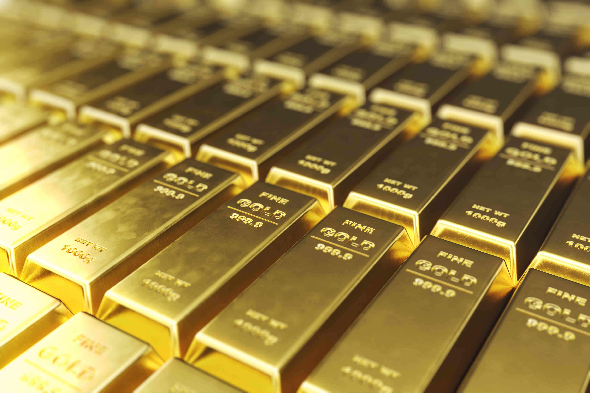

The Dubai Gold and Commodities Exchange (DGCX) is a premier commodities exchange in the Middle East, renowned for its innovative approach and the diverse range of products it offers in futures and options trading. Established in 2005 and headquartered in Dubai, the DGCX is a wholly owned subsidiary of the Dubai Multi Commodities Centre (DMCC), an entity conceived to elevate Dubai's status as a prominent global financial hub. The creation of DGCX marked a strategic move to enhance the region's financial market infrastructure by providing a comprehensive platform that supports futures trading across multiple asset classes. 

Since its inception, DGCX has consistently broadened its offerings, which now encompass an extensive suite of trading products. These include futures in precious metals like gold and silver, an expansive range of currency contracts, energy commodities, and more. This diverse array of products positions DGCX uniquely in the global financial landscape, catering to varied trading and hedging needs of local and international market participants.

This article provides a detailed exploration of commodities trading on the DGCX. Furthermore, it investigates into the rising prominence of algorithmic trading within this dynamic exchange. Through cutting-edge technology and strategic innovation, DGCX has significantly influenced the trading paradigm in the Middle East, bridging regional markets with global financial centers and establishing a robust platform for future growth and development.

## Table of Contents

## History and Evolution of DGCX

The Dubai Gold and Commodities Exchange (DGCX) was launched in November 2005, marking a significant milestone as the first commodities exchange in the Gulf region. This establishment was aimed at strengthening Dubai's position as a leading financial hub on a global scale. Initially, DGCX was a joint venture, which saw a collaborative ownership structure; however, it gained full autonomy under the ownership of the Dubai Multi Commodities Centre (DMCC) after Financial Technologies offloaded its stake in the exchange. This transition allowed DMCC to further align the strategic objectives of DGCX with the broader vision of positioning Dubai as a center of trade and finance.

Since its inception, the DGCX has continually evolved, significantly broadening the scope of its product offerings. Originally focusing on commodities, the exchange expanded over time into the domain of equity futures, providing additional opportunities for diversification to its members. Similarly, the inclusion of energy commodities has opened avenues for traders interested in the hydrocarbons market, further solidifying DGCX's role in the exchange ecosystem.

A noteworthy milestone in the evolution of DGCX was the introduction of the first Shari'ah-compliant spot gold contract. This initiative underscored DGCX's commitment to catering to the diverse needs of global investors, while also respecting the cultural and financial principles of the region. The launch of this contract not only affirmed DGCX's ability to innovate but also highlighted its responsiveness to Islamic finance's growing demands.

Moreover, strategic partnerships with renowned international exchanges have been pivotal in enhancing DGCX's global standing. These alliances have facilitated knowledge transfer, technological exchanges, and have expanded DGCX’s access to new markets and participants. Such collaborations underscore the exchange’s commitment to integrating with global markets, thereby offering its participants comprehensive global exposure.

In summary, the history and development of DGCX reflect a trajectory of innovation, strategic expansion of offerings, and a commitment to building robust international partnerships. These elements have collectively contributed to establishing DGCX as a key player in the global commodities exchange landscape.

## Key Offerings of DGCX

The Dubai Gold and Commodities Exchange (DGCX) features a diverse range of products across various asset classes designed to meet the trading demands of a global clientele. At the forefront of these offerings are precious metals such as gold and silver, which traditionally serve as important instruments for both investment and risk management. In addition, the exchange facilitates trading in numerous currency pairs, serving the needs of those seeking to hedge or speculate in foreign exchange markets. Prominent among these is the Indian Rupee futures contract, which is highly popular due to significant economic ties and trading volumes between India and the UAE.

DGCX also includes hydrocarbon products, notably the Mini WTI Crude Oil futures. This contract allows participants to engage in the energy markets with lower capital requirements compared to standard futures contracts. By doing so, DGCX enables businesses and investors to effectively manage their exposure to price fluctuations in global [crude oil](/wiki/crude-oil) markets.

Furthermore, the exchange provides equity indices, such as the Sensex Index futures, allowing investors to gain exposure to major stock market indices with ease. This is particularly beneficial for those seeking to diversify their portfolio or hedge against market [volatility](/wiki/volatility-trading-strategies) in specific regions. 

Overall, the extensive portfolio offered by DGCX supports the risk management and hedging needs of producers, manufacturers, and international financial players, ensuring a versatile platform for a variety of trading strategies. This diversity in offerings not only reinforces the exchange's reputation as a leading commodities trading hub in the Middle East but also enhances its attractiveness to a global market audience.

## Regulatory Framework

The Dubai Gold and Commodities Exchange (DGCX) is subject to regulation by the Emirates Securities and Commodities Authority (ESCA), ensuring a robust, secure, and compliant environment for trading activities. ESCA, as the principal regulatory body in the United Arab Emirates (UAE) for securities and commodities, provides a comprehensive framework that governs and monitors the exchange's operations, fortifying the integrity and transparency of trading on DGCX.

The Emirates Securities and Commodities Authority operates with the significant standing of being a member of the International Organisation of Securities Commissions (IOSCO). IOSCO membership denotes adherence to globally recognized standards for securities regulation, enhancing the credibility and reliability of the oversight provided by ESCA. This membership positions DGCX within an international context, aligning its regulatory practices with those deemed best practice across the world.

Furthermore, DGCX aims to foster stronger relationships and increase regulatory ties within international markets. This is exemplified by strategic partnerships, notably the memorandum of understanding with the China Futures Association. Such partnerships are indicative of DGCX's proactive approach in bolstering its regulatory networks and fostering collaborative growth with Asian markets. These alliances serve not only to extend the exchange's reach but also to amplify its operational standards by incorporating a global perspective and facilitating cross-border trading opportunities.

Through ESCA's stringent regulatory oversight and its strategic international collaborations, the DGCX demonstrates a commitment to maintaining a high standard of operational excellence, aligning with both regional mandates and international best practices. This regulatory framework ensures DGCX remains a reliable and attractive venue for both regional and international traders.

## Algorithmic Trading on DGCX

Algorithmic trading at the Dubai Gold and Commodities Exchange (DGCX) has emerged as a significant facet of its trading environment, reflecting a broader trend in global financial markets where technology-driven strategies are increasingly prevalent. This form of trading employs complex algorithms to execute trades at high speed and [volume](/wiki/volume-trading-strategy), based on pre-determined criteria, thereby maximizing efficiency and reducing human error.

One of the cornerstones of DGCX's technological infrastructure is the EOS Trader Platform, developed in collaboration with Cinnober, a reputed provider of exchange technology. This platform supports sophisticated trading strategies by offering users a robust and reliable interface that can handle large volumes of trades efficiently. The architecture of the EOS Trader Platform is tailored to accommodate the needs of algorithmic traders, offering enhanced processing speed and seamless execution of trades.

Additionally, DGCX provides a proximity hosting facility, which is particularly advantageous for High Frequency Trading ([HFT](/wiki/high-frequency-trading-strategies)) and algorithmic traders. Proximity hosting minimizes latency by allowing traders' servers to be physically located near the exchange's matching engine, thus ensuring rapid data transmission and execution speed. This capability is crucial in [algorithmic trading](/wiki/algorithmic-trading), where nanoseconds can determine the success of trade execution.

Independent Software Vendors (ISVs) can leverage the financial exchange's Application Programming Interface (API), specifically the Financial Information eXchange (FIX) protocol, to develop customized trading algorithms. The FIX API ensures seamless integration with the DGCX trading environment, offering flexibility to design and implement trading strategies that can automatically react to market changes.

The integration of algorithmic trading has bolstered DGCX's offerings, enabling traders to capitalize on market opportunities with precision and speed. As the technological landscape continues to evolve, DGCX is positioned to remain at the forefront of algorithmic trading innovations, catering to both regional and international markets.

## Market Impact and Trends

The Dubai Gold and Commodities Exchange (DGCX) serves as a vital connection between the Middle East commodity markets and global financial centers, bolstering regional economic stability. This strategic positioning is underscored by its robust trading volumes, which have demonstrated substantial growth over recent years. The increase in trading volumes at DGCX is a testament to its enhanced market engagement and the broadening appeal of its diverse product offerings. This trend aligns with the growing regional and international interest in accessing Middle Eastern markets, which are increasingly seen as integral to global trading strategies.

One of the significant trends shaping the future of DGCX is the anticipated expansion of its product offerings. This expansion aims to meet the evolving demands of market participants who seek varied financial instruments for diverse trading strategies. As more products are introduced, DGCX is likely to further solidify its position as a comprehensive trading venue that addresses the needs of a wide range of stakeholders, from hedgers and speculators to institutional investors.

Concurrent with the expansion of product offerings, algorithmic trading activities are expected to increase significantly. This rise is propelled by continuous advancements in trading technologies, which enhance the speed and efficiency of trade executions. Algorithmic trading, which relies on complex algorithms to make trading decisions and execute orders at high speeds, is becoming increasingly prominent at DGCX. The exchange's investments in state-of-the-art technology infrastructure, such as the EOS Trader Platform and advanced hosting facilities, cater to this growing demand by providing the necessary environment for high-frequency and algorithmic traders.

In summary, DGCX's strategic efforts to link the Middle East with global financial centers, coupled with its expanding product range, are key to its role in fostering regional economic stability. The increased adoption of algorithmic trading, supported by technological advancements, further strengthens DGCX's market impact and positions it for continued growth in the rapidly evolving landscape of global commodities trading.

## Conclusion

The Dubai Gold and Commodities Exchange (DGCX) stands as a key influencer in the international commodities trading sector, providing a versatile platform for diverse trading strategies, prominently featuring the growing sector of algorithmic trading. As the exchange evolves, it has maintained a trajectory of innovation and growth, thereby playing a critical role in enhancing the financial market landscape of the Middle East. By continually expanding its offerings and technological capabilities, DGCX contributes significantly to the region's economic stability and connectivity to global financial hubs.

For traders and investors, DGCX offers an unparalleled opportunity to explore a broad spectrum of products, from precious metals to energy futures, and to utilize advanced trading technology. The availability of state-of-the-art trading infrastructure—such as the EOS Trader Platform and proximity hosting facilities—enables market participants to adopt high-frequency and algo-trading strategies effectively. This positions DGCX as an attractive venue for both traditional commodity markets participants and those pioneering in technological trading advancements. As such, DGCX not only sustains its current market influence but also primes itself as a leader in the innovation of trading practices, both regionally and globally.

## References & Further Reading

[1]: ["The Handbook of Commodity Investing"](https://archive.org/details/handbookofcommod0000fabo) by Frank J. Fabozzi and Roland Fuss

[2]: ["Commodities and Commodity Derivatives: Modeling and Pricing for Agriculturals, Metals and Energy"](https://www.amazon.com/Commodities-Commodity-Derivatives-Modelling-Agriculturals/dp/0470012188) by Helyette Geman

[3]: Dubai Gold and Commodities Exchange: [Official Website](https://www.dgcx.ae/) 

[4]: Emirates Securities and Commodities Authority: [Official Website](https://www.sca.gov.ae/en/home.aspx)

[5]: IOSCO Principles for Financial Market Infrastructures: [IOSCO Website](https://www.iosco.org/library/pubdocs/pdf/IOSCOPD377-PFMI.pdf)