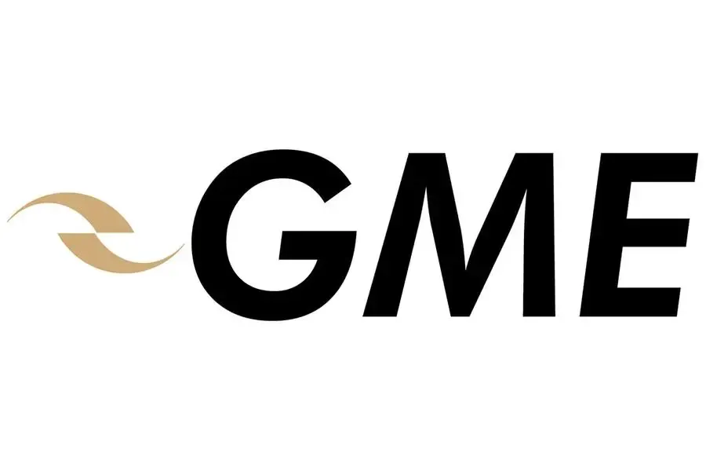

## Table of Contents

## What is the Dubai Mercantile Exchange (DME)?

The Dubai Mercantile Exchange (DME) is a commodities exchange located in Dubai, United Arab Emirates. It was established in 2007 to provide a trading platform for energy products, particularly focusing on the Middle East and Asia markets. The DME is known for its flagship contract, the Oman Crude Oil Futures Contract, which is used as a benchmark for pricing Middle Eastern crude oil.

The DME plays an important role in the global energy market by offering a transparent and regulated marketplace for trading commodities. It helps in setting prices that are fair and reflective of the market conditions. The exchange is a joint venture between Dubai Holding, Oman Investment Authority, and CME Group, which brings together local expertise and global trading experience. This collaboration helps the DME to serve its clients effectively and contribute to the stability of the energy market.

## When was the Dubai Mercantile Exchange established?

The Dubai Mercantile Exchange, or DME, was set up in 2007. It is located in Dubai, in the United Arab Emirates. The main goal of the DME is to give people a place to trade energy products, especially in the Middle East and Asia.

The DME is best known for its Oman Crude Oil Futures Contract. This contract helps set the price for oil from the Middle East. The exchange was created by Dubai Holding, Oman Investment Authority, and CME Group working together. This partnership helps the DME work well and helps keep the energy market stable.

## What types of commodities are traded on the DME?

The Dubai Mercantile Exchange, or DME, mainly deals with energy products. The most important thing they trade is the Oman Crude Oil Futures Contract. This contract helps set the price for oil coming from the Middle East. It's a big deal because it gives everyone a clear and fair way to know how much oil costs.

Besides oil, the DME also trades other energy products. This includes things like fuel oil and natural gas. By trading these, the DME helps make sure that the prices for these energy products are set in a way that is open and honest. This is important for people and businesses that need to buy or sell these commodities.

## How does the DME contribute to the global energy market?

The Dubai Mercantile Exchange, or DME, helps the global energy market by giving people a place to trade energy products like oil, fuel oil, and natural gas. The DME is important because it helps set fair prices for these products. The main thing they trade is the Oman Crude Oil Futures Contract. This contract helps everyone know how much Middle Eastern oil costs. When people can see these prices clearly, it makes trading easier and fairer for everyone.

The DME also works with big companies like Dubai Holding, Oman Investment Authority, and CME Group. This teamwork brings together local knowledge and global trading skills. This makes the DME a strong player in the energy market. By making sure prices are set in a clear and honest way, the DME helps keep the energy market stable. This is good for both buyers and sellers because they can trust the prices they see on the DME.

## What is the flagship contract of the DME?

The flagship contract of the Dubai Mercantile Exchange, or DME, is the Oman Crude Oil Futures Contract. This contract is very important because it helps set the price for oil that comes from the Middle East. It's like a guide that tells everyone how much they should pay for this oil.

When people trade the Oman Crude Oil Futures Contract on the DME, they can see the prices clearly. This makes trading fair and open for everyone. It's a big help to the global energy market because it gives buyers and sellers a way to trust the prices they see.

## How does the DME ensure transparency and fairness in trading?

The Dubai Mercantile Exchange, or DME, makes sure trading is fair and open by using clear rules and systems. They have strict rules that everyone has to follow when they trade. This means that all the trades are done in a way that everyone can see and understand. The DME also uses technology to make sure the trading happens quickly and correctly. This helps keep the prices honest and stops people from doing anything sneaky.

Another way the DME keeps things fair is by having people watch over the trading. These people make sure that no one is cheating or doing anything wrong. If someone breaks the rules, the DME can take action to fix it. This helps everyone trust that the prices they see on the DME are real and fair. By doing all these things, the DME helps make the energy market stable and trustworthy for everyone who uses it.

## What are the trading hours of the DME?

The Dubai Mercantile Exchange, or DME, has trading hours that let people from different parts of the world trade. The main trading time is from 10:00 AM to 4:00 PM, Dubai time, from Monday to Friday. This time works well for people in the Middle East and Asia because it fits with their work hours.

There is also a special time for trading called the pre-open session. This happens from 9:45 AM to 10:00 AM, Dubai time. During this time, people can get ready for the main trading session. By having these hours, the DME makes it easy for people to trade when it's convenient for them.

## Who are the major stakeholders of the DME?

The Dubai Mercantile Exchange, or DME, has three main stakeholders. These are Dubai Holding, Oman Investment Authority, and CME Group. Dubai Holding is a big company in Dubai that owns many businesses. Oman Investment Authority is a group that invests money for the government of Oman. CME Group is a big company in the United States that runs other exchanges where people trade things like futures and options.

These stakeholders work together to make the DME a good place for trading energy products. Dubai Holding and Oman Investment Authority bring local knowledge and support from the Middle East. CME Group helps with its experience in running exchanges and making trading smooth. Together, they help the DME set fair prices for oil and other energy products, which is important for the global energy market.

## What role does the DME play in the economic development of the Middle East?

The Dubai Mercantile Exchange, or DME, helps the Middle East grow economically by giving people a place to trade energy products like oil. The DME's main contract, the Oman Crude Oil Futures Contract, sets the price for Middle Eastern oil. This helps everyone know how much oil costs, which is important for businesses and countries in the region. When prices are clear and fair, it makes trading easier and helps the economy grow because people can plan better and invest more.

The DME also brings money into the region by working with big companies like Dubai Holding, Oman Investment Authority, and CME Group. These partnerships bring in expertise and investment from around the world. This helps create jobs and supports other businesses in the Middle East. By making the energy market stable and trustworthy, the DME helps the whole region's economy to be stronger and more successful.

## How does the DME integrate with other global exchanges?

The Dubai Mercantile Exchange, or DME, works together with other big exchanges around the world to make trading easier. One of the ways it does this is by partnering with the CME Group, which is a big company that runs exchanges in the United States. This partnership helps the DME use the same technology and rules as other global exchanges. This makes it easier for people to trade on the DME because they are used to similar systems.

By working with other exchanges, the DME also helps set prices that are trusted everywhere. For example, the Oman Crude Oil Futures Contract, which is the DME's main product, is used as a benchmark for Middle Eastern oil prices. This means that when people in other countries see these prices, they can trust them and use them for their own trading. This helps the global energy market stay stable and fair, which is good for everyone who trades energy products.

## What technological advancements has the DME adopted to enhance trading?

The Dubai Mercantile Exchange, or DME, uses new technology to make trading easier and faster. One big thing they use is electronic trading systems. These systems let people trade from anywhere in the world using their computers. This means that traders don't have to be in Dubai to trade on the DME. The technology also helps make sure that trades happen quickly and correctly, which is important for keeping prices fair and honest.

Another way the DME uses technology is through its partnership with the CME Group. This partnership lets the DME use the same technology that other big exchanges use. This makes it easier for traders who are used to trading on other exchanges to start trading on the DME. The DME also uses technology to watch over trading and make sure no one is cheating. This helps keep the market safe and trustworthy for everyone who uses it.

## What are the future expansion plans of the DME?

The Dubai Mercantile Exchange, or DME, is planning to grow and add new things to trade in the future. They want to include more types of energy products like different kinds of oil and maybe even renewable energy products. This will help them serve more people and businesses in the Middle East and Asia. By adding these new products, the DME hopes to become an even bigger player in the global energy market.

Another part of their plan is to use new technology to make trading even easier and faster. They want to keep improving their electronic trading systems so that more people can trade from anywhere in the world. The DME also wants to work with more exchanges around the world to make trading smoother and more connected. This will help them stay competitive and keep growing in the future.

## References & Further Reading

[1]: Dubai Mercantile Exchange. ["About DME"](https://en.wikipedia.org/wiki/Dubai_Mercantile_Exchange). Dubai Mercantile Exchange.

[2]: CME Group. ["Clearing"](https://www.cmegroup.com/solutions/clearing.html). CME Group.

[3]: Pardo, R. (2011). ["The Evaluation and Optimization of Trading Strategies"](https://onlinelibrary.wiley.com/doi/book/10.1002/9781119196969). Wiley.

[4]: Jensen, M. (2020). ["Algorithmic Trading and DMA: An introduction to direct access trading strategies"](https://www.semanticscholar.org/paper/Algorithmic-trading-%26-DMA-%3A-an-introduction-to-Johnson/aa5de1ab883d5e23b6651faa7c1807586d688e4b). 4Myeloma Press.

[5]: UAE Government Portal. ["Dubai International Financial Centre (DIFC)"](https://www.difc.ae/). UAE Government.

[6]: Johnson, B. (2010). ["Algorithmic Trading & DMA: An introduction to direct access trading strategies"](https://archive.org/details/algorithmictradi0000john). 4Myeloma Press.

[7]: Patterson, S. (2012). ["Dark Pools: The Rise of the Machine Traders and the Rigging of the U.S. Stock Market"](https://www.amazon.com/Dark-Pools-Machine-Traders-Rigging/dp/0307887189). Crown Business.

[8]: Lopez de Prado, M. (2018). ["Advances in Financial Machine Learning"](https://www.amazon.com/Advances-Financial-Machine-Learning-Marcos/dp/1119482089). Wiley.