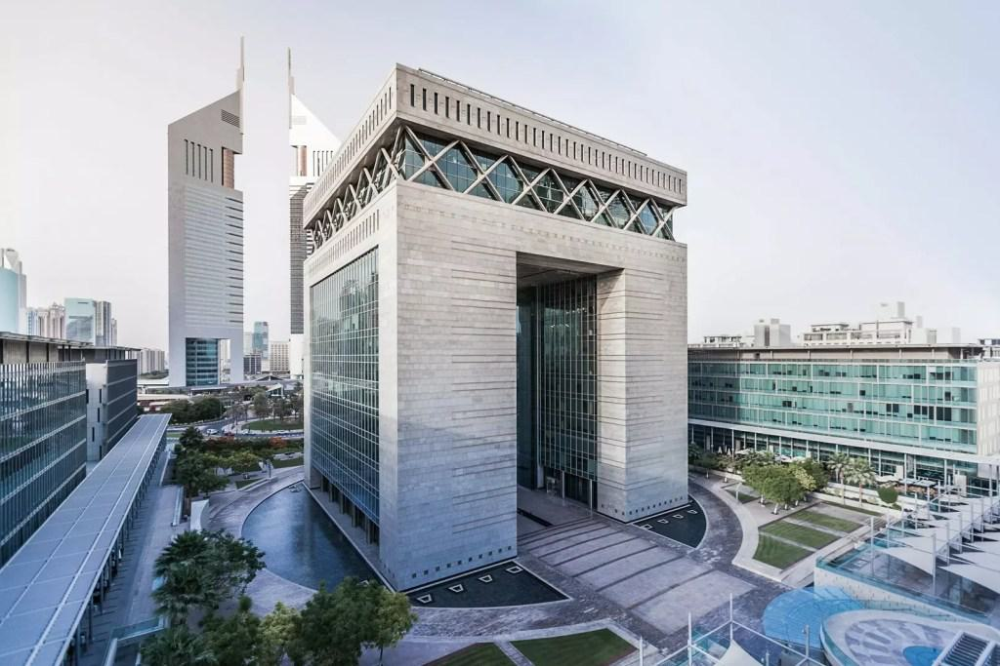

The Dubai Mercantile Exchange (DME), established in 2007, stands as a pivotal institution for energy futures trading in the Middle East, focusing primarily on the Oman Crude Oil Futures contract. As an essential conduit for energy commodities, DME facilitates price discovery and transparency, cementing Dubai's role as a strategic financial hub globally. This marketplace is uniquely positioned, benefiting from Dubai's robust infrastructure, strategic location, and favorable regulatory environment, which together foster a reliable trading platform for global investors and stakeholders.

Algorithmic trading, a modern approach to trading commodities and energy futures, involves the use of computer programs to execute trading orders at high speeds, leveraging mathematical and statistical models to determine trade decisions. This technique has reshaped the landscape of financial markets by enhancing efficiency, liquidity, and price accuracy. The application of algorithmic trading in energy futures, such as those managed by DME, allows for improved handling of trading volumes and market volatility.

The purpose of this article is to elucidate the critical role DME plays in the global energy futures market and explore the transformative impact of algorithmic trading within this sphere. By examining DME's contributions to market transparency and their strategic initiatives, the article will shed light on how DME facilitates the seamless exchange of energy futures, thereby strengthening Dubai's stature as a financial hub on the world stage. Through this exploration, readers will gain insights into the integration of technological advancements in trading, which underpin the efficiency and dynamic nature of contemporary financial markets.

## Table of Contents

## History and Evolution of Dubai Mercantile Exchange

The Dubai Mercantile Exchange (DME) was founded in 2007, with its official launch on June 1st of that year. It was established with the intention of creating a pricing benchmark for crude oil originating from the Middle East. The founding partners were the Government of Dubai, Oman Investment Fund, and CME Group, one of the most prominent derivatives marketplaces globally. This collaboration aimed to enhance regional oil price transparency and provide a platform that catered to the increasingly sophisticated needs of energy market participants.

The key stakeholders brought unique strengths to the partnership: The Government of Dubai provided strategic support by leveraging Dubai's position as a global financial hub. The State of Oman contributed by backing the exchange's flagship product, the Oman Crude Oil Futures Contract, which became the first physically delivered futures contract for Middle Eastern crude that traded exclusively on the DME. Meanwhile, CME Group played a crucial role in providing the technological infrastructure and clearing services, enabling DME to operate with high efficiency and transparency.

Since its inception, the DME has undergone significant transformations and achieved several growth milestones. Initially focusing on the Oman Crude Oil Futures Contract, the exchange gradually expanded its product offerings and transitioned into a more diversified international trading hub. This diversification enabled it to cater to a broader range of energy commodities, including gas oil, kerosene, and fuel oil futures, attracting a wider array of participants from around the world.

One notable milestone in the DME's evolution was its transition to an all-electronic trading platform. By fully leveraging CME Group's technological capabilities, the exchange enhanced its operational efficiency and broadened its market reach. Additionally, the DME's integration with CME Clearing provided a robust framework for risk management and ensured compliance with global standards for clearing and settlement practices.

These transformations have cemented DME's role as a pivotal player in the global energy futures market, helping to integrate Middle Eastern crude pricing more effectively into the global oil supply chain.

## Products and Offerings

The Dubai Mercantile Exchange (DME) is a pivotal entity in the global commodities market, primarily known for its Oman Crude Oil Futures Contract. Launched in 2007, this contract has become the benchmark for Middle Eastern sour [crude oil](/wiki/crude-oil) pricing, establishing DME as a central player in the energy futures market. The Oman Crude Oil Futures Contract serves as the most transparent price discovery mechanism for oil destined for the Asian market, with its prices often referenced by traders and companies alike.

Beyond the Oman Crude Oil Futures, DME has diversified its offerings to include a variety of energy futures contracts, such as gas oil, kerosene, and fuel oil. This expansion caters to the growing and diverse needs of traders and stakeholders in the energy market. Gas oil futures allow traders to hedge against price fluctuations in refined products, while kerosene and fuel oil contracts offer specific short-term and long-term trading opportunities, aligning with varying market dynamics and consumption patterns.

DME employs an advanced electronic trading platform that ensures seamless trading experiences, significantly contributing to the [liquidity](/wiki/liquidity-risk-premium) and efficiency of the market. This platform, which is accessible globally, allows for the real-time execution of trades, comprehensive market data analytics, and sophisticated order types catering to both speculative and hedging activities. A critical component of the trading experience is the clearing and settlement process, managed by CME Clearing, a globally recognized clearinghouse. This partnership ensures that all trades are secured and settled in a manner that mitigates counterparty risk, thus offering an additional layer of security to market participants.

In summary, DME's product offerings are designed to meet the dynamic needs of the energy trading market. Through its flagship Oman Crude Oil Futures Contract and an array of other energy futures, supported by a robust electronic trading and clearing framework, DME continues to strengthen its role as a key hub for energy futures trading.

## Regulation and Oversight

The Dubai Financial Services Authority (DFSA) plays a critical role in regulating the Dubai Mercantile Exchange (DME). As the financial regulator for the Dubai International Financial Centre (DIFC), the DFSA ensures that DME operations comply with rigorous standards of legality, integrity, and transparency. The DFSA's regulatory framework is based on global best practices, reflecting international standards to safeguard market participants and to promote confidence in the financial system. This framework encompasses supervision of trading activities, enforcing disclosure requirements, and overseeing the financial health of the exchange.

Compliance with international standards is paramount for the DFSA, particularly concerning market transparency and integrity. DME is required to adhere to guidelines set by international bodies like the International Organization of Securities Commissions (IOSCO), which emphasizes transparency, efficiency, and financial stability in markets. Such compliance ensures that DME attracts a broad range of global participants by offering a fair and open trading environment.

Clearing and settlement processes at DME are conducted through a collaboration with CME Clearing, a division of CME Group, which is one of the largest and most diverse derivatives marketplaces in the world. CME Clearing provides comprehensive risk management and multilateral netting of trades, which minimizes counterparty risk, a critical [factor](/wiki/factor-investing) in maintaining market integrity. The clearinghouse uses sophisticated algorithms and risk assessment models to ensure that trades are cleared efficiently and safely, aligning with the regulatory requirements set by DFSA.

In these processes, every transaction on DME is matched and cleared, meaning that buyers and sellers are effectively screened to ensure they meet financial commitments. This system supports liquidity and stability, essential in mitigating the risk of default in volatile energy futures markets. The integration of CME Clearing into DME's operations thereby positions it competitively among global exchanges by enabling efficient post-trade activities.

These regulatory and operational frameworks underscore DME's commitment to maintaining high standards in its trading practices. By aligning with both regional and international regulations, DME supports a resilient and transparent trading environment, essential for its role as a crucial node in global energy futures.

## Impact of Algorithmic Trading in Energy Futures

Algorithmic trading, often referred to as algo trading, is a method of executing orders using automated and pre-programmed trading instructions. These instructions account for variables such as timing, price, and [volume](/wiki/volume-trading-strategy). In the context of energy commodities like crude oil, natural gas, and refined products, [algorithmic trading](/wiki/algorithmic-trading) has significantly influenced market dynamics.

### Explanation of Algorithmic Trading in Energy Commodities

Algorithmic trading in energy commodities involves the use of complex algorithms to manage the trading of energy futures contracts. By utilizing historical price data, market trends, and sophisticated mathematical models, traders can automate buying and selling processes that were traditionally handled manually. This automation can encompass a range of strategies, from [market making](/wiki/market-making) and [arbitrage](/wiki/arbitrage) to [trend following](/wiki/trend-following) and [statistical arbitrage](/wiki/statistical-arbitrage).

For instance, a basic algorithm could be programmed to execute a trade when a particular asset's moving average crosses above or below a certain threshold. In a more sophisticated approach, [machine learning](/wiki/machine-learning) models might predict price movements based on a variety of inputs like economic indicators and geopolitical events.

### Benefits of Algorithmic Trading

1. **Efficiency**: Algorithms can process a large volume of data much faster than human traders. This capability allows for the rapid identification of trading opportunities and execution of orders within milliseconds.

2. **Speed**: With the advancement of high-frequency trading (HFT), algorithms can execute thousands of trades in a fraction of a second. This speed is crucial in markets where prices can change rapidly based on new information.

3. **Volume Handling**: Algorithmic systems can manage large trading volumes without causing significant market impact. This is particularly important in energy markets, where liquidity can vary greatly during different times and under different market conditions.

### Challenges and Risks

Despite its advantages, algorithmic trading also presents several challenges and risks, particularly in volatile markets such as energy commodities:

1. **Volatility Risk**: Energy markets are inherently volatile due to factors like geopolitical tensions, weather conditions, and changes in energy policy. Algorithms must be carefully designed to adapt to such volatility to prevent substantial losses.

2. **Flash Crashes**: The speed at which algorithmic trades are executed can sometimes lead to "flash crashes," where trading algorithms reactively trigger one another to sell off, causing rapid and significant declines in market prices.

3. **Complexity and Overfitting**: As algorithms grow more complex, so does the risk of errors in their coding or logic, which can lead to unintended market behavior. Additionally, models that perform well on historical data might not generalize to future market conditions, a phenomenon known as overfitting.

4. **Regulatory Pressure**: The increasing use of algorithmic trading has attracted regulatory scrutiny. Regulators aim to ensure that these technologies do not facilitate market manipulation or systemic risk. Compliance with these regulations can be challenging and costly, especially in jurisdictions with stringent oversight.

In conclusion, while algorithmic trading in energy futures offers compelling advantages in terms of efficiency, speed, and volume management, it is not without its drawbacks. Market participants must navigate the risks of [volatility](/wiki/volatility-trading-strategies), overfitting, and regulatory compliance to harness the full potential of this transformative technology.

## DME's Role in Global Commodity Trading

The Dubai Mercantile Exchange (DME) is recognized as a pivotal player in the global energy futures market. Established in 2007, the DME has been instrumental in providing a reliable platform for trading energy commodities, particularly Middle Eastern crude oil. The exchange’s flagship product, the Oman Crude Oil Futures Contract, plays a critical role in enhancing pricing transparency across the region. This contract serves as a benchmark for the trading of sour crude oil, providing a clear and standardized price reference for market participants involved in the buying and selling of oil emanating from the Middle East.

The DME’s contribution to pricing transparency stems from its robust trading mechanisms that ensure fair pricing and reduce information asymmetry in the market. The Oman Crude Oil Futures Contract, traded on the DME, captures a wide array of market data, including spot prices and forward contracts. This transparency fosters trust among global traders and investors, encouraging active participation and liquidity in the exchange. By offering real-time data and analytics, the DME facilitates informed decision-making, which is crucial for strategic planning and risk management in energy trading.

Moreover, the strategic partnerships and agreements that the DME has forged play a significant role in enhancing market integration. Collaborations with major financial and commodity exchanges, such as the CME Group, underscore the DME's commitment to integrating regional and global markets. These partnerships enable the DME to leverage cutting-edge technology and clearing processes, ensuring efficiency and security in trading operations. The exchange’s association with the government of Dubai and the Sultanate of Oman further strengthens its position by aligning with regional energy policies and trade objectives.

Through these strategic alliances, the DME has expanded its market reach and integrated into the global commodity trading ecosystem. By aligning its operations with international standards and adopting best practices, the exchange not only consolidates its role as a key trading hub for energy futures but also contributes to stabilizing and democratizing energy markets worldwide.

## DME's Recent Developments and Future Prospects

The Dubai Mercantile Exchange (DME) has made significant strides in adapting to the rapidly evolving global commodities market, underscoring its role as a central player in energy futures. A recent development is the introduction of new trading platforms and products aimed at enhancing trading efficiency and expanding market offerings. One such initiative is the Advanced Commodities Exchange (ACE) platform, designed to provide seamless trading experiences with improved technological interfaces that cater to both high-frequency traders and traditional investors. This platform symbolizes DME's commitment to embracing technological innovations to maintain competitiveness in a dynamic environment.

Strategic investments also play a crucial role in positioning DME as a leading global exchange. Notably, the Saudi Tadawul Group, a prominent entity in the Middle Eastern financial market, has acquired a significant stake in DME. This investment represents a strategic partnership that not only strengthens ties across the region but also enhances DME’s capabilities to integrate more comprehensively with international markets. This acquisition is expected to drive mutual growth and facilitate the exchange of technological and operational expertise.

Looking towards the future, DME is set to undergo expansions focusing on developing new products and leveraging advancements in trading technology. With ongoing discussions around integrating blockchain technology for improved transparency and security, the exchange aims to attract a broader range of participants by ensuring efficient, reliable, and secure transaction processes. Furthermore, emerging technologies such as machine learning and [artificial intelligence](/wiki/ai-artificial-intelligence) hold promise for refining trading strategies and improving market analytics.

In summary, the recent developments at DME illustrate a forward-thinking approach that aligns with global trading trends. By forging strategic partnerships and investing in cutting-edge technology, DME is well-positioned to elevate its status in the international energy futures market, with prospects of continued innovation and expansion shaping its future trajectory.

## Conclusion

The Dubai Mercantile Exchange (DME) holds a significant position in the regional and global energy trading landscape, serving as a pivotal platform for the pricing and trading of Middle Eastern crude oil. By providing a transparent and efficient marketplace for the Oman Crude Oil Futures Contract and other energy derivatives, DME facilitates better price discovery and hedging opportunities for traders worldwide. Its strategic location in Dubai, a burgeoning financial hub, reinforces its critical role in bridging energy markets between the West and Asia.

DME's integration of algorithmic trading has revolutionized the trading process by introducing high-speed, data-driven strategies that enhance market efficiency. This technological evolution allows for greater volumes of trades to be processed swiftly, thus improving liquidity and price stability. However, the adoption of algorithmic trading also necessitates robust risk management systems to mitigate potential market volatility inherent in automated trading environments.

Looking ahead, DME continues to anticipate the demands of an increasingly dynamic global economy. The exchange is investing in new trading platforms and exploring product expansions that will cater to a broader range of commodities. Strategic partnerships and technological advancements will likely play a pivotal role in DME's future, enabling it to maintain its status as a key player in global commodity trading. As the energy trading landscape evolves, DME remains well-positioned to adapt and thrive, contributing to enhanced market integration and price transparency on a global scale.

## References & Further Reading

[1]: Dubai Mercantile Exchange. ["About DME"](https://en.wikipedia.org/wiki/Dubai_Mercantile_Exchange). Dubai Mercantile Exchange.

[2]: CME Group. ["Clearing"](https://www.cmegroup.com/solutions/clearing.html). CME Group.

[3]: Pardo, R. (2011). ["The Evaluation and Optimization of Trading Strategies"](https://onlinelibrary.wiley.com/doi/book/10.1002/9781119196969). Wiley.

[4]: Jensen, M. (2020). ["Algorithmic Trading and DMA: An introduction to direct access trading strategies"](https://www.semanticscholar.org/paper/Algorithmic-trading-%26-DMA-%3A-an-introduction-to-Johnson/aa5de1ab883d5e23b6651faa7c1807586d688e4b). 4Myeloma Press.

[5]: UAE Government Portal. ["Dubai International Financial Centre (DIFC)"](https://www.difc.ae/). UAE Government.

[6]: Johnson, B. (2010). ["Algorithmic Trading & DMA: An introduction to direct access trading strategies"](https://archive.org/details/algorithmictradi0000john). 4Myeloma Press.

[7]: Patterson, S. (2012). ["Dark Pools: The Rise of the Machine Traders and the Rigging of the U.S. Stock Market"](https://www.amazon.com/Dark-Pools-Machine-Traders-Rigging/dp/0307887189). Crown Business.

[8]: Lopez de Prado, M. (2018). ["Advances in Financial Machine Learning"](https://www.amazon.com/Advances-Financial-Machine-Learning-Marcos/dp/1119482089). Wiley.