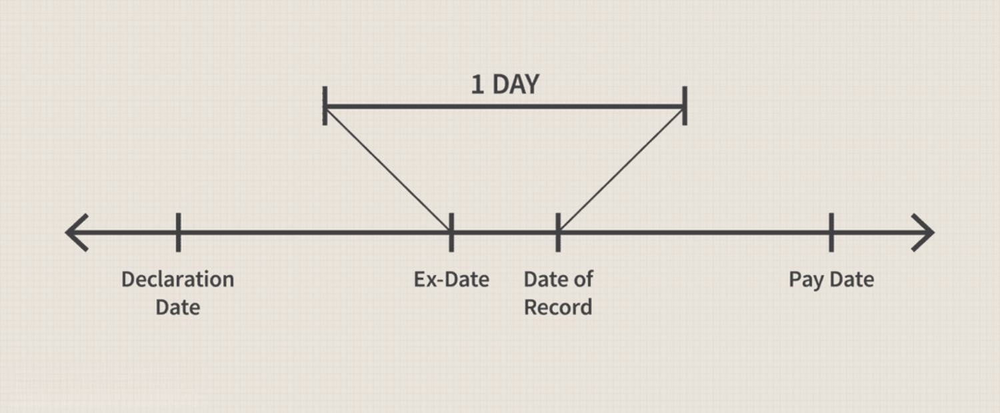

In the world of investing, gaining a firm grasp of fundamental concepts such as due bills, dividend stocks, and algorithmic trading is essential for both maximizing profits and minimizing risks. These elements play a pivotal role in shaping successful investment strategies and ensuring that investors can navigate the complexities of modern financial markets effectively.

Due bills are an important aspect of the trading process, acting as a mechanism to ensure that dividend payments are allocated to the correct stockholders during a specific trading period. This system becomes particularly crucial around the ex-dividend date, safeguarding the rights of investors who trade shares before the record date, thereby upholding equitable transaction practices in dividend distributions.



Dividend stocks, on the other hand, are foundational investments for many due to their dual potential for providing a steady income stream and offering opportunities for capital appreciation. By holding shares in companies that distribute a portion of their earnings at regular intervals, investors can enjoy consistent returns while potentially benefiting from stock price increases. However, understanding the dividend payment timeline and the implications for taxation is vital for constructing a well-rounded investment portfolio.

Algorithmic trading introduces a technological edge to stock trading, utilizing computer algorithms to automate and optimize trading decisions. Such systems can execute trades at speeds unattainable by human traders, reducing errors and enhancing the efficiency of trading strategies. The integration of algorithmic trading into investment practices can be particularly beneficial, offering increased accuracy and effectiveness in managing investments in dividend-paying stocks.

Whether you are a seasoned investor refining your strategies or a newcomer to the financial markets, this exploration aims to equip you with a deeper understanding of these critical tools and techniques. By embracing both traditional and modern approaches, investors can better manage their portfolios, enhancing their potential for generating income and minimizing exposure to market risks.

## Table of Contents

## Understanding Due Bills in Stock Trading

A due bill is a significant financial mechanism in the arena of stock trading, functioning to ensure the accurate transfer of dividend payments to the rightful stock owner during trading periods. This system becomes particularly relevant around the ex-dividend date, a critical point in the dividend distribution timeline. Understanding the role and mechanics of due bills is essential for those engaging in dividend stock transactions, as they help in maintaining transactional fairness.

When a company declares a dividend, it sets a declaration date, record date, and payment date. The record date is when the company reviews its records to determine its shareholders eligible to receive the dividend. However, due to the T+2 settlement process used in the United States, where trades settle two business days after the trade date, there arises a distinction for dividend entitlement. The ex-dividend date, set one business day before the record date, determines who is eligible for the dividend. Stocks purchased on or after the ex-dividend date do not qualify for the upcoming dividend.

Due bills emerge as a solution when stocks are sold between the ex-dividend date and the record date. During this window, the buyer, who technically does not receive the dividend as per record date rules, is the rightful recipient due to the timing of the purchase. In such cases, a due bill ensures the dividend payment is redirected from the original shareholder on record to the new buyer.

Mathematically, consider an investor A who sells shares to investor B after the ex-dividend date but before the record date. The formula for the distribution of the dividend can be visualized as:

$$
\text{Dividend}\_{B} = \text{Dividend}\_{original} - \text{Dividend}\_{due\_bill}
$$

Here, $\text{Dividend}\_{B}$ represents the dividend eventually received by investor B, while $\text{Dividend}\_{original}$ is initially allotted to investor A. The $\text{Dividend}\_{due\_bill}$ [factor](/wiki/factor-investing) represents the adjustment ensuring B receives the rightful amount.

In practical terms, brokerage firms handle these transactions automatically, which alleviates any cumbersome processes for individual investors. The use of due bills thus safeguards the financial interests of both traders and ensures equitable dividend distribution without manual intervention.

Due bills play a crucial role in maintaining the integrity of dividend-related transactions, ensuring fair treatment of all parties involved in stock trading across dividend-sensitive periods. They effectively bridge the gap caused by procedural timelines and physical transfer of stock ownership, thereby preserving the intended recipient's entitlement to declared dividends.

## Dividend Stocks: A Reliable Income Stream

Dividend stocks represent ownership in companies that allocate a portion of their earnings as dividends to shareholders at consistent intervals, typically quarterly. This practice allows investors to benefit from a steady income stream, making dividend stocks an attractive option for individuals seeking both regular payouts and potential capital appreciation.

Investors often seek dividend-paying stocks as a reliable source of income, especially in low-interest-rate environments where traditional fixed-income products, such as bonds, may offer insufficient yields. Moreover, dividend stocks are associated with established companies that demonstrate stable earnings, which can lead to price appreciation of the stock itself. This characteristic provides a dual benefit to shareholders: regular income through dividends and the opportunity for long-term gains as the stock's value increases.

Understanding the dividend timeline is crucial for investors. Key dates include the declaration date, record date, ex-dividend date, and payment date. The declaration date is when a company announces its intention to pay a dividend. The record date determines which shareholders are eligible to receive the dividend, while the ex-dividend date typically falls one business day before the record date. Investors who purchase the stock on or after the ex-dividend date are not entitled to the declared dividend.

Taxation implications are an important consideration in dividend investing. In many jurisdictions, dividends are subject to taxes, either at the ordinary income tax rate or at a reduced rate for qualified dividends. This distinction can significantly impact an investor's after-tax returns and influence portfolio decisions. For instance, higher tax rates on ordinary dividends could lead investors to prefer qualified dividends or consider holding dividend-paying stocks in tax-advantaged accounts like IRAs or 401(k)s to mitigate tax liabilities.

In summary, dividend stocks offer investors a dependable source of income while also providing opportunities for capital growth. To fully benefit from these investments, it's crucial for investors to comprehend the dividend schedule and the tax implications associated with dividend income. This knowledge aids in developing a well-rounded investment strategy that maximizes returns and minimizes tax burdens.

## Algorithmic Trading: The Future of Stock Trading

Algorithmic trading leverages advanced computer algorithms to automate trading decisions and processes in financial markets. This technological advancement has significantly transformed traditional trading paradigms by introducing enhanced precision and speed. Algorithms can process vast amounts of data in milliseconds, execute trades at optimal prices, and reduce the latency associated with human decision-making.

One of the primary benefits of [algorithmic trading](/wiki/algorithmic-trading) is its ability to minimize human errors and biases. By relying on pre-set rules and models, traders can avoid emotional and impulsive decisions that often affect manual trading. Algorithmic systems can continuously monitor market conditions and execute trades based on predetermined criteria like price movements or market trends, ensuring consistency and discipline in trading strategies.

The speed of execution is another compelling advantage. Algorithmic trading allows for high-frequency trading, where numerous trades occur in fractions of a second. This level of speed enables traders to capitalize on short-lived market opportunities that would be impossible to exploit through manual trading practices. For instance, algorithms can automatically trigger buy or sell orders when specific thresholds are met, ensuring optimal timing.

Furthermore, algorithms can handle complex strategies such as [arbitrage](/wiki/arbitrage), where they exploit price differences across markets to generate profits, or execute trades in large volumes with minimal market impact. They optimize the order execution process by breaking down large orders into smaller, more manageable parts, thus reducing the chance of significant price shifts.

Despite these benefits, algorithmic trading is not without risks. Technical failures, such as hardware malfunctions or software bugs, can lead to substantial financial losses. Additionally, algorithms must adapt to ever-changing market conditions, requiring continuous updates and improvements to maintain their effectiveness.

Integrating algorithmic trading with dividend stock strategies can also offer substantial benefits. Algorithms can be programmed to identify and exploit opportunities around dividend announcements, ex-dividend dates, and other related events. They can adjust portfolio compositions dynamically to align with anticipated market shifts, enhancing income streams from dividend-paying stocks.

In conclusion, while algorithmic trading presents an array of opportunities for optimizing trading operations and decision-making processes, careful consideration of the associated risks is essential. Incorporating this technology with traditional investment approaches, such as dividend stock trading, can lead to more efficient and profitable investment strategies. As technology continues to advance, staying informed and adaptive will be crucial for investors seeking to benefit from the innovations in algorithmic trading systems.

## Integrating Due Bills, Dividend Stocks, and Algo Trading

Integrating due bills, dividend stocks, and algorithmic trading offers a strategic advantage in stock market investments. Due bills play a critical role in ensuring that dividend payments are made to the correct owner during a trading period. By utilizing automated systems, the management of due bills can be streamlined, thus eliminating errors often associated with manual processing. This automation ensures that dividend payments are timely and accurate, which is essential for maintaining investor confidence and satisfaction.

The integration of algorithmic trading with dividend stocks allows investors to optimize their portfolio in several ways. Algorithms can be programmed to identify dividend-paying stocks with optimal payout ratios and predict changes in dividend policies, further refining stock selection processes. These algorithms can also facilitate automatic adjustment of positions based on the dividend calendar, ensuring that investments remain aligned with financial goals.

Algorithmic trading systems can also manage due bills efficiently by automatically tracking dividend declarations and ex-dividend dates. This process can be facilitated through Python scripts that constantly monitor stock data. Below is an example of a simple Python function using a library like `pandas` to track dividends and due bills:

```python
import pandas as pd

def track_dividends(stock_data):
    """
    Function to track dividends and identify due bills.

    Parameters:
    stock_data (DataFrame): DataFrame containing stock information including 
                            'ex-dividend date', 'record date', and 'payment date'.

    Returns:
    DataFrame: Updated DataFrame with 'due bill' status.
    """
    stock_data['due_bill'] = stock_data.apply(lambda row: row['ex-dividend date'] <= pd.Timestamp.now() <= row['payment date'], axis=1)
    return stock_data

# Example usage with mock data
stock_data = pd.DataFrame({
    'symbol': ['AAPL', 'MSFT'],
    'ex-dividend date': [pd.Timestamp('2023-09-05'), pd.Timestamp('2023-09-15')],
    'record date': [pd.Timestamp('2023-09-07'), pd.Timestamp('2023-09-17')],
    'payment date': [pd.Timestamp('2023-10-05'), pd.Timestamp('2023-10-15')]
})

updated_data = track_dividends(stock_data)
```

Through the code snippet above, investors can determine if a stock's due bill status is active, allowing them to maintain precise control over their dividend strategy.

Leveraging algorithmic trading for dividend stocks can also enhance the relationship between risk management and return. By [backtesting](/wiki/backtesting) strategies using historical data and simulating future performance, investors can balance risk and expected return. Moreover, strategies can be adjusted dynamically based on market conditions, which algorithmic systems can do more effectively than manual analyses.

In conclusion, merging due bills, dividend stocks, and algorithmic trading into a cohesive strategy allows investors to maximize returns while reducing risks associated with manual processes and human error. Employing automation for tracking and managing dividends fortifies the foundations of a robust investment portfolio.

## Conclusion

In the continuously evolving financial markets, a strategic blend of modern innovations, such as algorithmic trading (algos), combined with a firm understanding of conventional tools like due bills, is essential for achieving investment success. Algorithmic trading provides precision and speed, allowing investors to execute trades with minimal human error and enhance decision-making processes. This advancement, when applied to dividend stocks, offers the potential to optimize income streams and manage risks effectively.

Effective management of dividend stocks through algos facilitates not only timely purchasing and selling decisions but also the automatic handling of due bills. This integration ensures that dividends are paid to the rightful owner, maintaining the integrity and accuracy of financial transactions. By embracing these technologies, investors can streamline their portfolio management processes, thereby achieving more consistent financial returns over time.

To capitalize on these opportunities, investors must remain informed and agile, consistently adapting their strategies to the dynamic landscape of the financial markets. The convergence of traditional financial instruments and innovative trading technologies offers a promising pathway to maximizing returns and mitigating potential risks. Maintaining an adaptable approach allows investors to harness emerging trends and enhance their investment strategies for sustainable growth.

## References & Further Reading

[1]: ["Advances in Financial Machine Learning"](https://www.amazon.com/Advances-Financial-Machine-Learning-Marcos/dp/1119482089) by Marcos Lopez de Prado

[2]: ["Evidence-Based Technical Analysis: Applying the Scientific Method and Statistical Inference to Trading Signals"](https://www.amazon.com/Evidence-Based-Technical-Analysis-Scientific-Statistical/dp/0470008741) by David Aronson

[3]: ["Machine Learning for Algorithmic Trading"](https://github.com/PacktPublishing/Machine-Learning-for-Algorithmic-Trading-Second-Edition) by Stefan Jansen

[4]: ["Quantitative Trading: How to Build Your Own Algorithmic Trading Business"](https://books.google.com/books/about/Quantitative_Trading.html?id=j70yEAAAQBAJ) by Ernest P. Chan

[5]: ["Algorithmic Trading: Winning Strategies and Their Rationale"](https://www.wiley.com/en-us/Algorithmic+Trading%3A+Winning+Strategies+and+Their+Rationale-p-9781118460146) by Ernest P. Chan