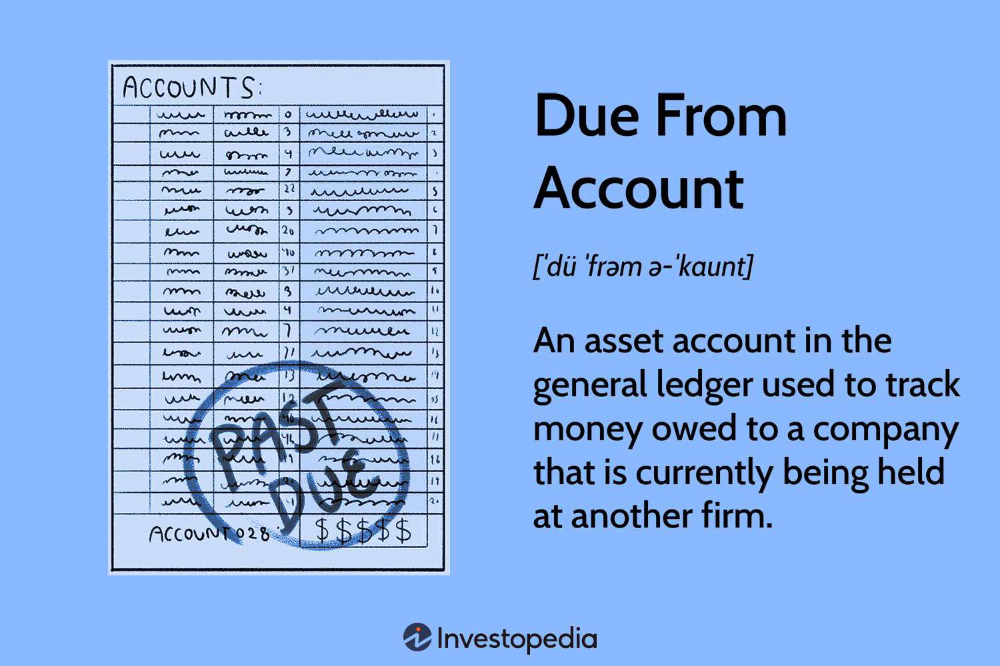

In the complex world of accounting and finance, understanding key components such as due from accounts and due to accounts is crucial. These account types are foundational in the management of financial transactions and are particularly significant in areas like intercompany transactions and algorithmic trading. The financial ecosystem relies heavily on the precise classification and management of these accounts to ensure transparent and compliant financial practices.

Due from accounts, often categorized under asset accounts, are utilized to monitor money owed to a company that is currently held at another entity. This system of tracking receivables plays a critical role in maintaining liquidity, especially in banking and intercompany transactions. Conversely, due to accounts are classified as liability accounts, used for keeping track of obligations that a firm owes to creditors or vendors. This differentiation helps businesses manage their finances meticulously, preventing any potential discrepancies or negative balances that could disrupt financial statements.

In algorithmic trading, the accurate and timely management of due from and due to accounts becomes even more essential. Algorithmic trading, which involves the use of computer programs to execute trades at lightning speed, demands real-time precision in tracking financial transactions and liabilities. Any lapse in the management of these accounts can lead to significant financial risks, highlighting their importance in the backdrop of modern trading strategies.

This article aims to explore the functionalities and strategic advantages of due from and due to accounts in both traditional finance and contemporary trading environments. By examining their roles and implications, both financial professionals and trading enthusiasts can gain valuable insights into their integration within the broader financial ecosystem. By the end, readers will have a comprehensive understanding of these terms, equipping them to navigate the complexities of modern corporate finance and trading environments with greater confidence.

## Table of Contents

## What Is a Due From Account?

A due from account is an asset account within a company's general ledger, which serves the primary purpose of monitoring funds that are owed to the company but are currently held by another entity. This account is pivotal in accounting practices as it represents deposits or amounts that are anticipated to be received and are thus considered receivables by the company owning the account.

Due from accounts are particularly significant in the banking sector, as they often embody interbank transactions and are integral for managing liquidity. These transactions demand meticulous tracking and recording, which is where due from accounts demonstrate their utility. They provide a structured way to represent assets spread across different institutions, allowing organizations to maintain a clear overview of their financial standing.

In many financial operations, due from accounts are used in conjunction with due to accounts, which represent the liabilities or amounts a company owes. This pairing is particularly beneficial in intercompany dealings, where it helps segregate incoming assets from outgoing liabilities, ensuring that each transaction is accurately accounted for and that the respective organizations maintain clarity over their financial dealings.

The core characteristics of due from accounts include their role in establishing an interbank relationship and their utility in asset management. Interbank transactions can be complex, involving multiple steps and agreements, and due from accounts help streamline this process by keeping a clear record of what is owed and by whom. This contributes to a robust [liquidity](/wiki/liquidity-risk-premium) strategy, wherein companies can better predict and manage cash flows, ultimately aiding in overall financial strategy and risk management.

This methodology is especially beneficial for firms looking to optimize their balance sheets and improve the accuracy of their financial reporting. By accurately managing due from accounts, companies can avoid liquidity shortfalls and ensure that they have a comprehensive understanding of their financial obligations and assets.

## Understanding Due To Accounts

Due to accounts serve as crucial elements in the financial landscape, primarily representing liabilities. They track amounts a company owes to creditors or vendors, distinguishing them from due from accounts, which focus on receivables. This differentiation underlines their function as records of payables or obligations that a firm is required to fulfill.

In the context of [algorithmic trading](/wiki/algorithmic-trading), precision and speed are paramount. Accurate maintenance of due to accounts supports these demands by ensuring effective bookkeeping, risk management, and regulatory compliance. They facilitate the streamlined processing of financial transactions, characteristic of successful algorithmic trading strategies. To achieve this, firms engage in meticulous reconciliation processes, aligning recorded liabilities with actual financial events to maintain accurate financial statements.

The management of due to accounts also involves a comprehensive approach to risk assessment. Firms assess their liabilities to predict cash flows and potential financial exposures, thereby supporting informed decision-making processes. Adherence to compliance standards forms a critical component of managing these accounts, ensuring that all financial activities conform to established regulations and legal obligations.

Thorough management of due to accounts involves the implementation of various strategies and tools. For example, financial software platforms can automate the reconciliation of accounts and the identification of discrepancies. These systems enhance transactional accuracy and enable real-time updates on a firm's liabilities, supporting both effective risk management and compliance.

Overall, the effective management of due to accounts not only facilitates smooth financial operations but also supports a firm's strategic objectives by promoting financial transparency, accuracy, and alignment with regulatory frameworks. These factors are essential for maintaining the integrity and efficiency of modern financial and trading operations.

## Due From Account vs. Due To Account

While both due from accounts and due to accounts pertain to financial obligations, each serves distinct roles within a company's financial management system. The fundamental difference lies in their core functions and financial implications.

**Due from accounts** are concentrated on receivables—assets owed to a company. This type of account records funds that are expected to be received, underscoring its role in tracking incoming finances. The effective management of due from accounts is crucial for ensuring that the company has a streamlined process for monitoring these expected inflows. This not only aids in liquidity management but also ensures that the company can anticipate and plan for future cash availability. The role of these accounts is particularly important in scenarios involving intercompany transactions, where it is necessary to track the movement of funds across different legal entities within a parent company.

On the contrary, **due to accounts** deal with payables and liabilities, capturing the essence of obligations or amounts that the company owes to external parties. These accounts focus on the company’s outflow commitments, providing a clear mechanism to handle current liabilities. Effective management of due to accounts ensures that the company remains aware of its financial responsibilities, thereby avoiding missed payments or potential default on obligations. This clarity in tracking is essential for maintaining healthy business relationships and ensuring compliance with financial agreements.

The ability to manage these accounts accurately is paramount. It prevents negative balances, which could indicate weaknesses in financial controls or discrepancies in bookkeeping. For example, incorrect entries in these accounts can lead to substantial financial discrepancies, affecting both internal audits and external reviews. Thus, an understanding of the dynamics and interplay between due from and due to accounts is essential for robust financial management. It not only supports the accuracy and integrity of financial reports but also aids in comprehensive auditing processes, helping to identify and correct potential issues before they escalate.

In conclusion, while due from and due to accounts may seem like mirror images in terms of financial responsibilities, their roles and impacts are distinctly different. Clear insights into these differences facilitate effective financial oversight and strategic planning, ultimately supporting the organization's overall financial health and operational efficiency.

## Advantages of Managing Due From and Due To Accounts

Managing due from and due to accounts offers numerous benefits for organizations, particularly in enhancing liquidity management and financial organization. The meticulous handling of these accounts fosters a clear separation of funds, crucial for audits and accountability in financial reporting. By distinguishing between incoming and outgoing transactions, companies can ensure that their financial statements accurately reflect their cash flow status, thereby promoting transparency and trust.

In the fast-paced world of algorithmic trading, maintaining well-organized due from and due to accounts is vital for rapid execution and settlement of trades. These accounts enable the efficient processing of large volumes of transactions, thereby enhancing operational efficiency. Their management ensures that funds are available for the immediate settlement of trades, which is essential in preventing delays that could affect trading strategies.

Furthermore, diligent management of these accounts is integral to strategic planning and maintaining compliance with regulatory frameworks. A structured approach allows companies to predict future cash flows more accurately, aiding in strategic decisions such as investments and resource allocations. It also ensures compliance with financial regulations, essential for avoiding penalties and sustaining a firm’s reputation in the financial markets.

In summary, the effective management of due from and due to accounts not only supports operational efficiency but also aligns with broader financial strategies and regulatory requirements. This dual role underscores their importance in both everyday financial operations and long-term planning.

## The Role of Due To and Due From Accounts in Algo Trading

In algorithmic trading, maintaining robust due to and due from accounts is paramount for ensuring precise recording of transactions and managing financial liabilities. These accounts provide real-time visibility into the financial status of trading activities, thus playing a pivotal role in risk management and compliance with financial regulations.

An accurate tracking system is essential for algorithmic trading, where trades occur at high frequencies and volumes. Due to accounts, which record the liabilities or payables, and due from accounts, which track assets or receivables, must be meticulously monitored to reflect the correct financial position of a trading entity. This accurate representation helps mitigate risks by preventing unexpected deficits or surpluses that could lead to financial discrepancies or non-compliance with regulatory requirements.

Advanced reconciliation algorithms are employed to ensure the integrity of these accounts. These algorithms, often built upon [machine learning](/wiki/machine-learning) techniques, are designed to match trades efficiently, identify discrepancies, and prompt necessary adjustments. By automatically cross-verifying transactions against account records, they reduce the risk of human error and provide confidence in the accuracy of financial reporting.

Moreover, sophisticated risk assessment algorithms leverage the data from due to and due from accounts to forecast and manage potential financial risks. These algorithms analyze historical and real-time data to predict market trends and assess the impact of various trading strategies under diverse market conditions.

The utilization of these accounts aligns trading activities with regulatory standards and financial best practices. Ensuring that transactions are accurately recorded and liabilities precisely tracked supports compliance with laws and regulations governing financial markets. Furthermore, it enhances the operational efficiency of trading systems by streamlining processes and facilitating rapid execution and settlement of trades.

In summary, due to and due from accounts are indispensable for the successful management of algorithmic trading environments, offering comprehensive oversight over financial transactions and liabilities. The integration of advanced technologies in managing these accounts is crucial for maintaining agility, compliance, and strategic advantage in today’s fast-paced financial landscape.

## Conclusion

Due from and due to accounts are essential components in financial accounting and algorithmic trading. Their effective management underpins financial health by promoting transparency and ensuring adherence to regulatory standards. These practices are crucial for accurately reflecting an organization's financial position and facilitating seamless trading operations. 

As the financial landscape continues to evolve, technological advancements such as [artificial intelligence](/wiki/ai-artificial-intelligence), machine learning, and blockchain are poised to significantly transform how these accounts are managed. For instance, AI and machine learning algorithms can automate the reconciliation process, reducing errors and improving efficiency. These technologies can also enhance risk management by providing real-time insights and predictive analytics, thereby enabling preemptive corrective actions.

Blockchain technology promises to further revolutionize account management by providing a decentralized and immutable ledger, which improves security and transparency in financial dealings. This would enable instant verification and settlement of intercompany transactions, reducing dependency on traditional reconciliation methods.

In an era of rapid technological progress and shifting financial paradigms, staying informed about due from and due to accounts is imperative for financial professionals and traders. Mastery of these concepts allows individuals to adeptly navigate the intricacies of contemporary corporate finance and trading environments, ensuring that they remain competitive and compliant in a dynamic market.

## References & Further Reading

[1]: ["Financial Accounting: An International Introduction"](https://archive.org/details/financialaccount0000alex_05ed) by David Alexander and Christopher Nobes

[2]: ["Accountants' Handbook, Financial Accounting and General Topics"](https://www.wiley.com/en-us/Accountants%27+Handbook%2C+Volume+1%3A+Financial+Accounting+and+General+Topics%2C+11th+Edition-p-9780471790389) by D. R. Carmichael, O. Ray Whittington, and Lynford Graham

[3]: Gibson, C. H. (2012). ["Financial Reporting & Analysis: Using Financial Accounting Information."](https://archive.org/details/financialreporti00) Cengage Learning.

[4]: ["Accounting for Derivatives: Advanced Hedging under IFRS"](https://archive.org/details/accountingforder0000rami) by Juan Ramirez

[5]: Elder, G. D. (2012). ["Algorithmic Trading: Winning Strategies and Their Rationale."](https://www.wiley.com/en-us/Algorithmic+Trading%3A+Winning+Strategies+and+Their+Rationale-p-9781118746912) Wiley Trading.