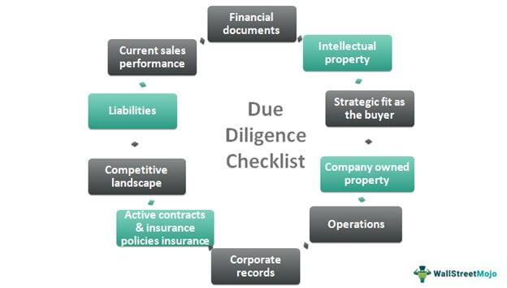

The convergence of judicial processes and algorithmic trading represents a unique and evolving intersection of law and technology, reflecting a broader trend of digital transformation across various sectors. The rise of algorithmic trading—a method that uses computer programs to execute financial transactions at speeds and frequencies that are beyond human capability—poses novel challenges to traditional legal frameworks. This article explores the implications of due process within both legal and financial domains, highlighting how legal standards are adapting and being challenged in an increasingly digital age.

Due process is a cornerstone of legal systems worldwide, ensuring fairness and justice in legal proceedings whether civil or criminal. It encompasses essential principles such as the right to fair notice, an impartial hearing, and a tribunal free from biases. However, as processes across industries become embedded with high-speed automated technologies, such as those found in algorithmic trading, the application and preservation of due process become more complex. In algorithmic trading, decisions made in fractions of a second by algorithms can have significant financial and legal ramifications, necessitating new approaches to oversight and accountability.

In this context, understanding how due process principles integrate with contemporary digital systems is crucial. It requires a re-examination of traditional legal frameworks to ensure they are robust enough to address the challenges and opportunities presented by technology. This involves not only maintaining the integrity of legal standards but also facilitating technological advancements that benefit society.

This article aims to shed light on how legal standards are evolving, facing challenges, and being redefined amid rapid technological developments. By examining these intersections, it seeks to provide insights into the ways both judicial processes and financial markets are grappling with maintaining fairness and justice in an era where algorithmic and automated decisions are becoming increasingly common.

## Table of Contents

## Legal Frameworks and Due Process

Due process, a cornerstone of modern legal systems, has origins tracing back to the Magna Carta of 1215. This seminal document introduced the idea that no individual should be deprived of rights or freedoms without due legal proceedings, marking a significant shift towards accountability and fairness in governance. Over time, this principle evolved, finding a crucial place in the U.S. Constitution through the Fifth and Fourteenth Amendments, which explicitly guarantee that no person shall be "deprived of life, liberty, or property without due process of law." These amendments have been instrumental in shaping American jurisprudence by ensuring procedural and substantive fairness.

Fundamental to due process are its components: fair notice, the right to a fair hearing, and the requirement of an unbiased tribunal. Fair notice enables individuals to know of legal actions against them and the charges or claims they face, ensuring transparency and the opportunity to prepare a defense. The right to a fair hearing is integral, providing individuals with a chance to present their case, challenge evidence, and seek redress. An unbiased tribunal ensures that decisions are made impartially, safeguarding justice against arbitrary or prejudiced outcomes.

These components function collectively to maintain legal accountability and protect individuals from arbitrary state action. By mandating that governmental power is exercised within a structured and fair framework, due process mitigates the risk of misuse and fosters trust in legal institutions. For example, procedural due process requires lawful processes be followed, while substantive due process assesses whether laws themselves are fair and just.

In recent years, legal precedents have increasingly tested the boundaries of due process amid digital advancements and the rise of algorithm-driven decisions. Courts have been called upon to balance tradition and innovation, particularly in cases involving algorithms that influence legal outcomes. These algorithms, often complex and opaque, challenge existing notions of transparency and accountability. In certain cases, courts have had to evaluate whether algorithmic determinations meet due process standards, particularly concerning the clarity of decision-making processes and the protection of individuals' rights.

Courts strive to uphold due process by integrating traditional legal principles with new technological frameworks. For instance, they may require greater algorithmic transparency or mandate regular audits to ensure fairness and lack of bias. Judicial scrutiny in these contexts emphasizes the necessity of adapting legal standards to meet contemporary challenges without compromising the fundamental tenets of justice.

Overall, the interplay between traditional legal frameworks and modern technological developments necessitates continuous evaluation and adaptation. By doing so, legal systems can uphold due process while embracing innovation, ensuring that legal norms remain robust and relevant in an increasingly automated world.

## Algorithmic Trading and Legal Procedures

Algorithmic trading, the use of computer algorithms to automate financial trading decisions, has become a cornerstone of modern financial markets. This technique allows traders to execute orders at speeds and volumes unattainable by human traders, making it an essential tool for high-frequency trading and institutional investors. Speed and efficiency are significantly enhanced, enabling traders to capitalize on small price discrepancies across markets. However, this complexity also introduces new challenges and risks that must be addressed within existing regulatory frameworks to ensure due process.

One of the key legal challenges posed by [algorithmic trading](/wiki/algorithmic-trading) is its potential to outpace regulatory and legal standards. Traditional trading regulations were not designed for the rapid execution speeds and [volume](/wiki/volume-trading-strategy) driven by algorithms, often leading to gaps in regulatory oversight. Ensuring due process in this context involves careful monitoring to prevent unfair trading practices and protect market integrity. Regulatory bodies, such as the U.S. Securities and Exchange Commission (SEC) and the Commodity Futures Trading Commission (CFTC), have been tasked with adapting existing regulations to account for these new operational paradigms. This includes assessing the fairness, transparency, and ethical considerations implicated by algorithmic trading practices.

Algorithmic manipulation poses a significant difficulty in maintaining fair market practices. Algorithms can be designed to exploit loopholes or engage in unfair practices, such as spoofing—where a trader places fake orders with the intent to cancel before execution to manipulate prices—or front-running, where a trading algorithm predicts and acts on orders before they are executed in the market. These manipulative strategies undermine market integrity and can lead to significant financial harm both to individual investors and the market as a whole.

In response to these challenges, regulatory agencies have developed comprehensive guidelines and regulations aimed at enhancing transparency and ensuring fair competition. Measures such as circuit breakers are in place to halt trading in extreme [volatility](/wiki/volatility-trading-strategies) scenarios, preventing algorithms from exacerbating price swings. Additionally, requirements for algorithmic trading firms to register and disclose their trading algorithms have been implemented to facilitate oversight and accountability. The implementation of stringent audit and compliance checks ensures that algorithmic trading activities adhere to established legal standards.

Several case studies illustrate regulatory intervention in algorithmic trading abuses. For example, in 2010, the "Flash Crash" prompted regulatory bodies to examine the algorithms that contributed to the market's precipitous 1000-point drop within minutes, leading to improved risk management standards for high-frequency trading firms. Similarly, the enforcement action against the trader known as the "Hound of Hounslow" in 2015 highlighted the potential for individual manipulation of algorithms to disrupt markets. These interventions underscore the importance of robust regulatory frameworks to mitigate the risks associated with algorithmic trading.

In summary, while algorithmic trading offers significant benefits in terms of speed and efficiency, it also presents complex legal and ethical challenges. Ensuring due process within this rapidly evolving technological ecosystem requires continual adaptation of regulatory standards, vigilant oversight, and effective enforcement actions to maintain market integrity and protect investor interests.

## Judicial Processes in the Digital Age

The digital transformation is profoundly impacting judicial processes, enhancing efficiency and accessibility while introducing new challenges. The integration of digital justice systems is facilitating a shift from traditional court operations to more technologically advanced alternatives.

Judicial automation, driven by [artificial intelligence](/wiki/ai-artificial-intelligence) (AI) and algorithm-driven decision-making, offers considerable promise but also presents limitations. AI can streamline case management, predict case outcomes based on historical data, and facilitate document analysis, thus improving efficiency. However, the prospect of fully automating judicial decisions is fraught with challenges. The complexity and variability inherent in legal judgments raise concerns about an over-reliance on algorithms which may not fully understand nuanced legal reasoning or contextual subtleties.

One of the significant issues is the potential for bias. Algorithms are trained on historical data which may contain embedded biases, leading to outcomes that perpetuate or exacerbate inequities in the judicial process. Ensuring transparency in AI decision-making is critical, as opaque processes can hamper accountability and erode public trust. The need for explainable AI—systems where the decision-making process can be clearly articulated and understood—is paramount in maintaining fairness.

Online dispute resolution (ODR) systems represent a prominent innovation, often used for resolving low-value disputes and enhancing access to justice. These platforms can reduce court backlogs by offering faster resolutions and are generally more cost-effective than traditional court proceedings. However, there are concerns regarding the digital divide, as not all participants may have equal access to the necessary technology.

The concept of 'judicial robots'—fully autonomous judicial systems—is an area of active discussion. While theoretically, these systems could handle routine and straightforward cases, the implementation would require robust regulatory frameworks to ensure decisions adhere to legal standards and ethical norms. Key considerations include maintaining human oversight to ensure accountability and addressing any malfunction or unintended consequences of AI judgments.

As digital tools continue to evolve, regulatory frameworks need to adapt to ensure that AI's role in legal adjudication complements traditional judicial processes rather than undermines them. Crafting these frameworks will require collaboration among technologists, legal professionals, and policymakers to align technological potential with judicial integrity.

## Ensuring Due Process in an Automated World

In an increasingly automated world, safeguarding due process becomes a multifaceted challenge, requiring both legal and technical acumen. The automation of decisions, whether in judicial systems or financial markets, can potentially compromise the principles of fairness, transparency, and accountability central to due process. Algorithmic decisions, lacking oversight, may inadvertently or deliberately introduce biases, leading to unfair outcomes.

Algorithmic audits play a critical role in addressing these concerns. They involve systematically examining algorithms to ensure compliance with ethical standards and legal requirements. An effective algorithmic audit evaluates algorithms for bias, accuracy, and fairness. It assesses whether the algorithm’s decisions align with the intended legal and ethical standards. These audits act as a transparency mechanism, providing insights into how algorithms operate and make decisions, thus ensuring accountability.

Governance frameworks are essential to uphold due process in automated systems. Such frameworks establish guidelines and policies governing the design, deployment, and monitoring of algorithms. They ensure that algorithms adhere to legal requirements and ethical standards. Key components of governance frameworks include the establishment of protocols for data management, transparency requirements, and mechanisms for accountability and redress.

To integrate due process considerations into algorithm design and implementation, several strategies can be employed. Developers should incorporate fairness criteria directly into algorithmic models, using techniques that mitigate bias and enhance fairness. For example, fairness-aware [machine learning](/wiki/machine-learning) algorithms can be employed to minimize disparate impacts across different demographic groups. Furthermore, stakeholder input should be sought during the algorithm design phase to ensure diverse perspectives inform the development process.

Continuous monitoring of algorithms is crucial for maintaining legal standards over time. This involves regularly reviewing algorithmic decisions to identify unexpected outcomes or biases and adjusting the algorithms as necessary. Such monitoring ensures that algorithms evolve in response to new data and changing legal contexts. Legal frameworks must adapt in parallel with technological advancements, ensuring regulations are flexible enough to address new challenges posed by automation.

Collaboration between various stakeholders, including legal professionals, technologists, and policymakers, is vital. This interdisciplinary approach facilitates a comprehensive understanding of both the technical intricacies and legal implications of automated systems. Joint efforts enable the development of robust frameworks for oversight and accountability, ensuring that the automation of decisions upholds the principles of fairness and justice. This collaboration is essential for navigating the complexities of due process in a rapidly evolving digital landscape, ensuring that technological progress enhances rather than erodes fundamental legal protections.

## Conclusion

The convergence of due process and algorithmic systems within both judicial procedures and algorithmic trading introduces significant challenges and opportunities. The integration of these systems necessitates a careful balance between the speed and efficiency offered by technological advancements and the fundamental principles of fairness and justice. Ensuring that legal procedures are not undermined by automated processes is paramount.

Current interactions between law and technology reveal a complex landscape where the rapid pace of technological evolution often outstrips existing regulatory frameworks. This mismatch presents challenges, such as potential biases in algorithmic decision-making and the risk of compromising transparent legal standards. However, it also offers the opportunity to innovate legal processes, making them more accessible and efficient. 

Regulatory vigilance and innovation are critical to navigate these challenges. Continuous adaptation of legal frameworks is necessary to cope with advancements in technology. This includes implementing governance frameworks that ensure algorithms adhere to ethical and legal standards. The establishment of algorithmic audits can promote transparency and hold automated systems accountable, thus reinforcing the principles of due process.

Promoting interdisciplinary dialogue and research is essential to further address the complexities introduced by automation and advanced algorithms. Collaboration across legal, technological, and financial sectors will facilitate the development of robust systems that uphold fairness and justice.

Despite these technological transformations, the commitment to justice and fairness remains constant and central to both judicial and financial systems. Ensuring these principles endure alongside technological growth emphasizes an unwavering dedication to sustaining legal integrity in the digital age.

## References & Further Reading

[1]: Lavi, D., & Rachev, S. T. (2009). ["Algorithmic Trading and the Common Law."](https://pmc.ncbi.nlm.nih.gov/articles/PMC8318400/) Journal of Law and Economics.

[2]: Black, J., & Walker, G. (2011). ["Regulation of Financial Markets."](http://ijhssnet.com/journals/Vol_1_No_16_November_2011/18.pdf) In The Oxford Handbook of Regulation.

[3]: Bathaee, Y. (2018). ["The Artificial Intelligence Black Box and the Failure of Intent and Causation."](https://jolt.law.harvard.edu/assets/articlePDFs/v31/The-Artificial-Intelligence-Black-Box-and-the-Failure-of-Intent-and-Causation-Yavar-Bathaee.pdf) Harvard Journal of Law & Technology.

[4]: Hildebrandt, M. (2015). ["Smart Technologies and the End(s) of Law: Novel Entanglements of Law and Technology."](https://www.jstor.org/stable/26322678) Edward Elgar Publishing.

[5]: Deeks, A. (2019). ["The Judicial Demand for Explainable Artificial Intelligence."](https://papers.ssrn.com/sol3/papers.cfm?abstract_id=3440723) Columbia Law Review.