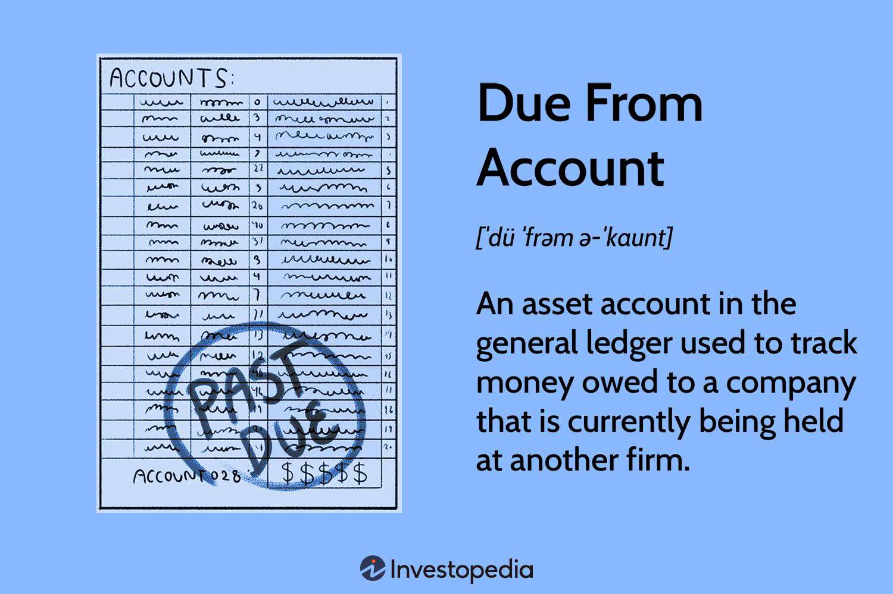

In the rapidly evolving world of finance, understanding the intersection of accounting terms and algorithmic trading is crucial for success. Algorithmic trading, a cornerstone of modern financial markets, demands precision and speed—qualities that can be significantly enhanced by the efficient use of accounting information. Fundamental accounting terms, particularly those related to liabilities, directly impact trading strategies and financial management.

The concept of "due to accounts" is a key example, representing the amounts a company owes to another party. These accounts are essential in financial management as they record liabilities that must be managed effectively to maintain liquidity and meet fiscal responsibilities. Integrating such accounting data into algorithmic trading platforms allows traders and financial professionals to optimize their strategies by making informed decisions based on accurate financial data. Algorithmic trading systems, which use complex algorithms to execute trades at high speeds, can benefit from this integration by improving the accuracy and reliability of their market operations.



By examining these connections, investors and financial professionals can gain important insights into optimizing their trading strategies and financial health. The article will focus on the crucial role of due to accounts and financial terms, as well as their integration with algorithmic trading platforms, to demonstrate how mastering these areas can enhance financial performance and market strategy. Understanding these intersections not only augments trading efficiencies but also ensures robust financial management, contributing to overall financial stability and market compliance.

## Table of Contents

## Understanding Key Accounting Terms

A 'due to account' is classified as a liability account on a company's balance sheet, representing amounts that are owed to another party. These accounts are pivotal in financial record-keeping and management, facilitating accurate tracking of financial obligations, which is integral for managing a company's cash flow effectively. For instance, when a company receives a service or goods without immediate payment, a liability is recorded in the 'due to account', acknowledging the obligation to pay in the future.

In the broader scope of financial management, 'due to accounts' also encompass 'accounts payable', which specifically track obligations to suppliers or creditors. Maintaining precise and current records in these accounts is essential. Accurate record-keeping ensures that organizations can manage their financial health efficiently, providing insights into their short-term financial status and liquidity.

The timeliness of managing these accounts bears significant implications for businesses. Any delay or inaccuracy in these records can lead to cash flow mismatches, resulting in potential financial distress or inability to fulfill obligations. These discrepancies may affect a firm’s creditworthiness and its ability to secure financing. Consequently, businesses often employ robust accounting systems and internal controls to monitor these accounts, ensuring that all liabilities are reported and addressed promptly.

The implications of these accounting terms extend into strategic financial management. Effective management of 'due to accounts' and 'accounts payable' allows companies to optimize their working capital. By carefully scheduling payments and managing existing credits, firms can sustain [liquidity](/wiki/liquidity-risk-premium) and invest in opportunities that enhance growth prospects. Overall, these accounting terms are foundational in managing liabilities and ensuring the fiscal health and operational capability of a business.

## Algorithmic Trading: An Overview

Algorithmic trading, often referred to as algo trading, is a method of executing orders using automated and pre-programmed trading instructions to account for variables such as time, price, and [volume](/wiki/volume-trading-strategy). This practice leverages the computational power of computers to perform transactions at speeds and frequencies that are impossible for a human trader. In the modern financial landscape, [algorithmic trading](/wiki/algorithmic-trading) has become a dominant strategy, profoundly affecting markets across the globe by increasing efficiency and liquidity.

One of the key features of algorithmic trading is its precision. Algorithms can be crafted to execute trades optimally, minimizing market impact and maximizing returns based on predefined criteria. Speed is another crucial aspect, with algorithms capable of processing complex calculations and executing trades in fractions of a second. This high-frequency approach allows traders to capitalize on brief price fluctuations, operating on time scales as short as milliseconds.

Systematic strategies are at the heart of algorithmic trading, incorporating quantitative models that analyze historical data to forecast market trends and make informed trading decisions. Some common strategies include statistical [arbitrage](/wiki/arbitrage), [market making](/wiki/market-making), mean reversion, and [trend following](/wiki/trend-following). These methodologies rely heavily on mathematical models and are designed to exploit market inefficiencies, ensuring consistent profitability.

Algorithms significantly enhance decision-making processes in trading by minimizing human errors, which are often caused by emotions, fatigue, or cognitive biases. Automated systems maintain discipline, adhering strictly to the predefined strategies and parameters without deviation or delay. This objectivity ensures that trades are executed as intended, without the erratic influence of human intervention.

The rise of algorithmic trading is closely linked to advancements in technology. The development of sophisticated hardware, faster internet connectivity, and more reliable data feeds has enabled the seamless integration and deployment of complex trading algorithms. As a result, algorithmic trading has grown in importance, with a significant portion of global trading volumes being executed algorithmically. In stock exchanges such as NASDAQ and NYSE, it has been estimated that algorithmic trading accounts for over 70% of all equity trades.

With continued technological innovation, the role of algorithmic trading is expected to expand further. Improvements in [artificial intelligence](/wiki/ai-artificial-intelligence) and [machine learning](/wiki/machine-learning) are likely to enhance algorithmic capabilities, providing more adaptive and predictive models that refine trading decisions continuously. As these technologies progress, the reliance on algorithmic trading is set to broaden, potentially reshaping the financial markets and introducing new opportunities and challenges for market participants.

## The Role of Accounting in Algorithmic Trading

Accounting principles play a foundational role in the efficient operation of algorithmic trading systems. 'Due to accounts' and other accounting elements provide essential data that influences trading decisions and risk management strategies.

**Integration of Financial Data with Trading Algorithms**

Algorithmic trading systems rely heavily on accurate and timely financial data to function effectively. The integration of accounting data, such as outstanding liabilities and due to accounts, with trading algorithms can optimize trading performance. These accounts reflect the funds a firm owes, providing insight into cash flow and financial status. Algorithms can dynamically adjust trading strategies based on this data, such as altering risk exposure in light of outstanding liabilities.

To illustrate, consider a scenario where a firm uses a Python-based algorithm that reacts to liability changes. Here is a simplified example of how this integration might appear:

```python
def adjust_trading_strategy(liabilities, cash_flow):
    if liabilities > cash_flow:
        return "Reduce risk exposure"
    else:
        return "Maintain current strategy"

# Example usage
current_liabilities = 50000  # Example amount
current_cash_flow = 60000    # Example amount

strategy_decision = adjust_trading_strategy(current_liabilities, current_cash_flow)
```

**Impact of Accounting Accuracy on Algorithmic Trading**

The precision of accounting records directly affects the reliability of algorithmic trading strategies. Inaccurate financial data can lead to erroneous algorithmic decisions, potentially resulting in significant financial losses. For example, if liabilities are underreported, an algorithm might engage in trades assuming more available capital than reality, increasing risk exposure. Therefore, maintaining accurate accounting records ensures that algorithms operate based on current and correct financial conditions, optimizing risk management and trading outcomes.

**Examples of Accounting Practices in Algorithmic Trading Models**

Many trading firms employ sophisticated accounting systems to enhance their algorithmic trading operations. For instance, firms might implement automated reconciliation processes to ensure 'due to accounts' and other liabilities are regularly updated and reconciled. This practice aids in minimizing discrepancies that could compromise algorithmic decisions.

Case studies suggest that companies which integrate advanced accounting software with trading platforms report improvements in performance and compliance. These systems enable real-time tracking and management of financial resources, supporting algorithms to execute trades more effectively and in line with financial health metrics.

In conclusion, accurate accounting serves as a vital component in supporting algorithmic trading operations, impacting the precision and success of trading strategies. The integration of this financial data with trading algorithms is a testament to its significance, enabling firms to capitalize on market opportunities while mitigating risks.

## Due to Accounts in Algo Trading

The integration of "due to accounts" in algorithmic trading underscores the necessity for effective liability management to facilitate seamless trade execution. "Due to accounts" are liability accounts that document obligations to repay borrowed funds or settle outstanding debts. In the context of algorithmic trading, they play a pivotal role in ensuring that financial obligations are timely met, thereby supporting the smooth operation of trading algorithms.

Liability management, when combined with algorithmic trading, involves precise handling of financial commitments to avoid potential liquidity issues that could disrupt trading activities. This relationship is critical, as any discrepancies or delays in updating "due to accounts" can inadvertently affect the trade execution process. Accurate record-keeping in these accounts ensures that liabilities, such as loans or payables, do not exceed the firm’s liquidity capacity, thus preventing forced liquidation of assets at inopportune times.

Maintaining accuracy in "due to accounts" serves not only to manage risk but also to ensure compliance with market regulations. Financial regulators require detailed reporting of liabilities to assess the risk profiles of trading entities. Anomalies or errors might lead to compliance breaches, resulting in penalties or trading suspensions. Therefore, firms engaged in algorithmic trading must employ robust accounting frameworks to accurately reflect their financial positions, integrating these seamlessly with their algorithmic systems.

Case studies in the industry have demonstrated how effective management of "due to accounts" can benefit automated trading systems. One notable example is a financial firm that implemented real-time accounting software integrated with its trading platform. This integration allowed the firm to automatically update its "due to accounts" whenever trades were executed or settled. By maintaining real-time records of liabilities, the firm was able to optimize its trading strategies, minimize risk, and achieve higher compliance rates.

Additionally, a large trading firm reported that by utilizing machine learning algorithms combined with real-time data from its accounting systems, it could predict and mitigate potential liquidity shortages. This proactive approach enabled the firm to adjust its trading activities dynamically, thereby maintaining a stable and compliant operational state. Integrating accounting data with trading algorithms is thus not merely an operational necessity but a strategic advantage that enhances the overall efficacy of algorithmic trading operations.

## Financial Terms and Algo Trading Software

Financial software plays a pivotal role in integrating accounting data with algorithmic trading processes, enhancing the precision and efficiency of trade execution. This integration facilitates the effective management of financial resources, ensuring that trading decisions are well-informed and aligned with an entity's financial standing.

Modern algorithmic trading platforms are equipped with features that help traders and financial managers effectively handle their accounts and investments. Key features of these platforms include:

1. **Real-time Data Processing**: The ability to process and analyze market data and accounting information in real-time is crucial for making rapid trading decisions. This capability allows for quick responses to market changes, thereby maximizing potential profits and minimizing risks.

2. **Risk Management Tools**: Tools that assess and mitigate financial risks are integral. These tools often use accounting data to provide metrics on liquidity, leverage, and exposure, enabling traders to adjust their strategies accordingly.

3. **Portfolio Management**: Many platforms offer comprehensive portfolio management features that incorporate financial terms such as assets and liabilities. This allows users to track their investment performance against their financial obligations, ensuring that they maintain financial health while pursuing growth.

4. **Compliance and Reporting**: Algorithmic platforms help ensure compliance with regulatory standards by providing thorough audit trails and customizable reporting capabilities, which are particularly useful for accounting purposes.

The integration of financial terms, including liabilities and assets, into trading algorithms allows for more informed decision-making. For instance, understanding current liabilities from 'due to accounts' can influence a trading strategy by affecting the amount of risk a firm is willing to take on. Similarly, recognizing available assets helps in deciding on leverage and potential investment avenues.

Technology bridges the gap between accounting data and trading execution by employing advanced computational techniques and software architectures. Through APIs, financial data can be seamlessly fed into trading systems, enabling algorithms to access live data streams and execute trades based on predefined financial criteria. This technological framework minimizes human intervention, reducing errors and increasing speed and efficiency in trade execution.

For example, using Python, one can connect to a trading platform's API to automate the process of adjusting trading strategies based on accounting data:

```python
import requests

def get_financial_data(api_url):
    response = requests.get(api_url)
    if response.status_code == 200:
        return response.json()
    else:
        raise Exception("Failed to fetch data")

def adjust_trading_strategy(financial_data):
    assets = financial_data['assets']
    liabilities = financial_data['liabilities']
    if liabilities > assets:
        print("Increase cash holdings, lower risk exposure.")
    else:
        print("Pursue aggressive trading strategy.")

api_url = "https://api.example.com/financial_data"
financial_data = get_financial_data(api_url)
adjust_trading_strategy(financial_data)
```

This script exemplifies how financial data can be integrated into algorithmic decision-making processes, ensuring that the trading strategies are aligned with the financial status of the firm.

As technological advancements continue, the integration of accounting data with trading operations is expected to grow more sophisticated, further enhancing the efficacy and compliance of trading strategies.

## Future Directions and Innovations

Predictions indicate that the role of accounting in algorithmic trading is poised for significant evolution. As the financial markets grow increasingly complex, integrating advanced accounting techniques with algorithmic trading methodologies will become essential for maintaining competitive advantage and operational efficiency. 

Potential technological advancements will likely center around the seamless integration of financial accounting systems with algorithmic trading platforms. Enhanced data processing capabilities will enable more sophisticated analysis of financial statements, improving the detection of market trends and investment opportunities. These advancements could also lead to more dynamic adjustments in trading algorithms based on real-time financial data, allowing traders to respond quickly to any changes in financial health indicators such as liquidity, solvency, and profitability.

Artificial intelligence (AI) and machine learning are expected to play pivotal roles in boosting both accuracy and compliance within financial and trading systems. By leveraging machine learning algorithms, firms can analyze vast datasets to uncover patterns that humans might miss, thus refining trading strategies and achieving more precise trade executions. AI technologies can enhance compliance by automating the monitoring of financial transactions and flagging discrepancies or unusual patterns that might indicate errors or fraudulent activities.

Blockchain technology promises to redefine the management of due to accounts and trading platforms by introducing unparalleled transparency and security. Blockchain's immutable ledger can provide an accurate, time-stamped record of all transactions, enhancing the reliability of financial data used in algorithmic trading. This transparency reduces the risk of discrepancies between trading positions and owed liabilities. Additionally, smart contracts built on blockchain could automate the settlement of trades based on predefined conditions, reducing manual intervention and potential errors.

In conclusion, the synergistic integration of accounting principles with advanced trading technologies heralds a future where financial stability and market efficiency are enhanced, paving the way for more informed and agile trading environments.

## Conclusion

Integrating accounting with algorithmic trading is essential for modern financial practices, as it ensures both precision and efficacy in trading operations. Accounting principles such as the accurate management of 'due to accounts' and liabilities are fundamental in supporting the strategies and operations employed in algorithmic trading. These integrations not only facilitate the automation and efficiency of trade execution but also enhance risk management and compliance with regulatory requirements.

As the financial landscape continues to evolve, businesses that embrace these practices are likely to realize significant advantages. The integration of comprehensive financial data into trading algorithms presents opportunities for enhanced decision-making processes and improved trading performance. Firms equipped with such integrated systems are better positioned to adapt to market changes and capitalize on trading opportunities with reduced human error and increased financial accuracy.

Financial professionals are encouraged to remain informed about the ongoing developments in finance and technology. The continual advancement of technologies such as artificial intelligence and blockchain holds the potential to further transform the ways financial data and trading strategies are integrated. As these innovations develop, they offer an expanded capacity for real-time data analysis, improved accuracy in financial reporting, and heightened efficiency in trading activities.

The seamless integration of accounting and algorithmic trading contributes not only to the financial stability of individual firms but also supports broader market efficiency. By ensuring accurate financial data management combined with the speed and precision of algorithmic trading, these practices foster a more reliable and resilient financial system. As technology continues to advance, the impact of these integrations is set to grow even more profound, offering promising future prospects for businesses willing to adapt and innovate.

## References & Further Reading

[1]: Bergstra, J., Bardenet, R., Bengio, Y., & Kégl, B. (2011). ["Algorithms for Hyper-Parameter Optimization."](https://dl.acm.org/doi/10.5555/2986459.2986743) Advances in Neural Information Processing Systems 24.

[2]: ["Advances in Financial Machine Learning"](https://www.amazon.com/Advances-Financial-Machine-Learning-Marcos/dp/1119482089) by Marcos Lopez de Prado

[3]: ["Evidence-Based Technical Analysis: Applying the Scientific Method and Statistical Inference to Trading Signals"](https://www.amazon.com/Evidence-Based-Technical-Analysis-Scientific-Statistical/dp/0470008741) by David Aronson

[4]: ["Machine Learning for Algorithmic Trading"](https://github.com/stefan-jansen/machine-learning-for-trading) by Stefan Jansen

[5]: ["Quantitative Trading: How to Build Your Own Algorithmic Trading Business"](https://www.amazon.com/Quantitative-Trading-Build-Algorithmic-Business/dp/1119800064) by Ernest P. Chan