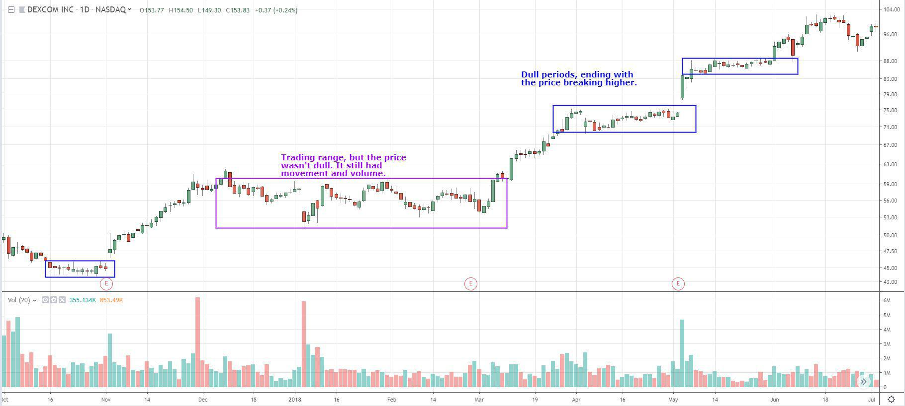

In the rapidly evolving world of finance, understanding market dynamics is crucial for investors to make informed decisions. Financial markets are complex systems characterized by fluctuating trends, varying levels of activity, and diverse trader interactions. Investors must discern these changing patterns to effectively strategize and optimize their portfolios. Two significant components in this landscape are dull markets and algorithmic trading, each playing a pivotal role in shaping financial market analysis.

Dull markets, characterized by low trading volumes and minimal price changes, often signal periods of consolidation or uncertainty where market activity wanes. These conditions can obscure directional trends, making it challenging for traditional trading strategies to identify promising opportunities. Investors need to recognize the subtle implications of such environments to anticipate potential shifts and capitalize on future trends.



Algorithmic trading, on the other hand, represents a technological advancement that leverages algorithms to execute trades based on pre-defined criteria at high speed and precision. This approach has gained prominence as it allows for the analysis of vast datasets, rapid decision-making, and the deployment of sophisticated strategies that are difficult to implement manually. Algorithms can be designed to function effectively even in dull markets, offering traders the potential to exploit small price movements and maintain profitability despite low activity levels.

Understanding how these algorithms operate in the context of dull markets reveals the symbiotic relationship between technology and market analysis. By utilizing algo trading strategies, traders can inject liquidity into stagnant markets, unearth hidden patterns, and potentially gain a competitive edge. The integration of algorithmic solutions in dull markets not only aids in navigating low volatility periods but also underscores the transformative power of technology in modern finance.

In this article, we explore the interplay between dull markets and algorithmic trading, examining how investors can harness algorithms to identify opportunities and optimize their strategies in periods of reduced market activity. The insights provided will illuminate the potential advantages of algorithmic trading in navigating the intricate landscape of contemporary financial markets.

## Table of Contents

## Understanding Dull Markets

Dull markets are often characterized by low trading volumes and minimal price movements, presenting a unique set of conditions that can influence investment strategies. Such markets, also sometimes referred to as sideways or range-bound markets, lack significant volatility, which is generally a primary driver of trading activity. The subdued price fluctuations in dull markets can result from several factors, including economic stability, market saturation, or investor uncertainty, leading to a lack of decisive action within the financial community.

One of the key characteristics of a dull market is the low trading [volume](/wiki/volume-trading-strategy). Trading volume is a critical metric indicating the number of shares or contracts traded in a security or market during a given period. In dull markets, the reduced volume reflects diminished trading enthusiasm or investor interest. This condition can lead to fewer opportunities for short-term trading strategies that rely heavily on [volatility](/wiki/volatility-trading-strategies) to generate profits.

Minimal price movement, another hallmark of dull markets, indicates a lack of significant changes in the prices of securities. This stagnancy might be attributed to a balance between buying and selling pressures or a market waiting for substantial news or events to drive future movements. With limited price changes, dull markets often experience decreased market volatility, which can affect options pricing and the attractiveness of hedging strategies.

For investors, the implications of dull markets can vary. Some view these periods as holding phases where the risk of dramatic losses is low, whereas others see them as opportunities for accumulating positions in anticipation of future volatility. One potential advantage of engaging in such markets is the reduction in risk associated with price swings and the opportunity cost of waiting for more dynamic periods.

Despite their static nature, dull markets can [carry](/wiki/carry-trading) signals about future market movements. They may precede significant upward or downward trends, acting as a consolidation phase before a [breakout](/wiki/breakout-trading). Technical analysts often seek patterns like triangles, flags, or pennants, which may form during these low-activity periods, suggesting potential future price directions when broken.

Analyzing past data of dull markets may reveal patterns or trends that can inform future trading strategies. For example, empirical studies might involve investigating the average duration of dull markets, identifying recurring catalysts for volatility changes, or examining the frequency and characteristics of market breakouts post-dull phases. By modeling market data using statistical tools, historical patterns can be analyzed for recurring signals.

Here is a simple Python snippet to compute moving averages, which can help identify the transition from a dull to a more active market:

```python
import pandas as pd

def moving_average(data, window_size):
    return data.rolling(window=window_size).mean()

# Example usage
prices = pd.Series([100, 102, 101, 104, 106, 108, 110])
short_ma = moving_average(prices, window_size=3)
long_ma = moving_average(prices, window_size=5)

print("Short-term moving average:")
print(short_ma)

print("\nLong-term moving average:")
print(long_ma)
```

Using moving averages, investors can identify periods where a market is likely to break from a dull phase into a more volatile one, aiding in the adjustment of trading strategies to align with changing market conditions. By understanding the patterns and signals inherent in dull markets, investors can be better prepared to capitalize on emerging opportunities.

## Algorithmic Trading: An Overview

Algorithmic trading, often known as algo trading, refers to the use of computer programs to automate trading decisions in financial markets. This method leverages algorithms to process complex data and execute trades with precision and speed, vastly differing from traditional manual trading. The rise of [algorithmic trading](/wiki/algorithmic-trading) has been significant in the past few decades, driven by advancements in technology and access to vast datasets. This transformation has allowed market participants to capitalize on minute market fluctuations that would be imperceptible to the human eye.

Algorithms are designed to process large volumes of data, analyzing financial indicators, market conditions, and historical data to identify trading opportunities. These programs execute transactions based on pre-defined criteria, which may include timing, price, or market conditions, ensuring that trades are conducted at the optimal moment without the delay inherent in human decision-making. The ability to quickly process and react to information is crucial, particularly in fast-paced market environments.

Several strategies are commonly employed in algorithmic trading, exploiting different aspects of the market. Trend-following strategies are among the most popular. They operate on the assumption that asset prices tend to move in persistent directions over time, enabling traders to profit from predictable patterns. These algorithms typically use moving averages, channel breakouts, and related indicators to determine buy or sell signals.

Mean reversion strategies assume that asset prices may deviate temporarily from their long-term average or historical levels but will revert over time. Algorithms utilizing such strategies monitor deviations from statistical trends, executing trades when assets are deemed overbought or oversold. For instance, this can be represented mathematically as:

$$
z = \frac{x - \mu}{\sigma}
$$

where $z$ is the z-score of the asset price $x$, $\mu$ is the mean price, and $\sigma$ is the standard deviation. Trades are executed when the z-score exceeds certain thresholds, signaling possible reversion.

Statistical [arbitrage](/wiki/arbitrage) involves taking advantage of price inefficiencies between related financial instruments. These strategies deploy algorithms to detect and exploit slight discrepancies in prices, typically over short time frames. The approach often relies on mathematical models and statistical analysis to determine the probability of convergence between prices.

In conclusion, algorithmic trading has revolutionized financial markets by introducing efficiency and precision unattainable through manual trading. By employing diverse strategies like trend-following, mean reversion, and [statistical arbitrage](/wiki/statistical-arbitrage), algorithmic trading enables market participants to exploit opportunities in various market conditions efficiently. As technology continues to advance, so will the capabilities and sophistication of algorithmic trading, reshaping the landscape of financial markets globally.

## Impact of Algo Trading in Dull Markets

Algorithmic trading, characterized by its use of automated software to execute trades, offers several benefits even in dull market conditions. Dull markets, defined by low trading volumes and minimal price fluctuations, may pose challenges for conventional trading strategies but provide a unique landscape where algorithms can operate effectively.

One of the primary ways algorithmic trading can function efficiently in such markets is by utilizing high-frequency trading ([HFT](/wiki/high-frequency-trading-strategies)) techniques. These techniques enable the exploitation of minute price discrepancies that would be difficult to detect manually due to their transient nature. By executing trades at high speeds, algorithms can capitalize on fleeting opportunities that may arise even in low-volume environments. 

Moreover, algorithms can employ strategies such as statistical arbitrage, which leverages statistical models to identify predictable price patterns and discrepancies between related financial instruments. This method is particularly effective in dull markets where traditional trading activities are limited, but statistical relationships continue to hold.

To maintain profitability in such conditions, traders can also adopt mean reversion strategies. This approach is based on the assumption that prices will eventually revert to their historical mean or average level. By analyzing historical data and identifying deviations from this mean, algorithms can execute trades that bet on the price returning to its average, thereby generating profits.

Another strategy involves the use of [liquidity](/wiki/liquidity-risk-premium)-seeking algorithms, designed to efficiently execute trades by breaking down large orders into smaller pieces to minimize market impact. In dull markets, where liquidity is sparse, these algorithms can help traders find the best available prices without significantly affecting the overall market dynamics.

Algorithms also play a crucial role in revitalizing dull markets by injecting liquidity. This increased liquidity not only facilitates smoother trading operations but also attracts other market participants, thereby contributing to a more active trading environment. Additionally, pattern detection capabilities inherent in algorithmic systems can aid traders in identifying potential opportunities that may go unnoticed in manual analysis.

In summary, algorithmic trading offers several strategic advantages in dull markets. By employing sophisticated techniques such as high-frequency trading, statistical arbitrage, and mean reversion, algorithms enable traders to navigate low-volume environments effectively. Furthermore, their ability to enhance market liquidity and aid in pattern detection underscores their potential to transform the dynamics of dull markets.

## Pros and Cons of Algo Trading in Dull Markets

Algorithmic trading, or algo trading, offers a range of advantages, especially in dull markets characterized by low trading volumes and minimal price movements. One of the primary benefits of algorithmic trading is its ability to execute trades with remarkable speed and precision. Algorithms can analyze vast datasets in real time, assessing market conditions faster than human traders. This speed not only facilitates quick order execution but also ensures that trades are made at optimal price points, maximizing potential returns.

Another significant advantage of algorithmic trading is its emotion-free nature. Unlike human traders, algorithms operate based on predefined rules and logic, eliminating emotional biases such as fear or greed that can influence decision-making during trading. This detachment allows algorithms to execute trades based purely on data-driven insights, maintaining consistency even in volatile or slow-moving markets.

Despite these advantages, there are several potential downsides to algorithmic trading in dull markets. One major concern is the over-reliance on historical data. Algorithms are typically designed using historical market data to identify trends and patterns that inform trading strategies. However, past performance is not always indicative of future results, and algorithms may fail to adapt to unforeseen market changes, leading to suboptimal trading decisions.

Furthermore, in dull markets, the low trading volume and minimal price movement can exacerbate the challenges of market liquidity, potentially causing slippage—the difference between expected and actual trade execution prices. Low liquidity can hinder the effectiveness of certain algorithmic strategies, as fewer market participants may limit the ability to execute large trades without affecting market prices.

To mitigate the risks associated with algorithmic trading in low activity markets, traders can adopt several strategies. Developing flexible algorithms capable of adapting to changing market conditions is essential. These adaptive algorithms can adjust their parameters or switch between different trading strategies based on real-time market data analysis. Additionally, incorporating risk management protocols, such as setting stop-loss orders or adjusting position sizes, can help manage potential losses.

Traders can also diversify their trading strategies and incorporate [machine learning](/wiki/machine-learning) techniques to improve market predictions and decision-making processes. Machine learning models can identify complex patterns and anomalies that traditional algorithms might miss, enhancing the robustness of trading strategies in varying market conditions.

Moreover, [backtesting](/wiki/backtesting) algorithms extensively with a variety of data scenarios, including both high and low market activity, can enhance their effectiveness. By simulating different market conditions, traders can refine their algorithms to ensure they perform optimally, regardless of market activity levels.

## Case Studies

During periods of dull markets, characterized by low trading volumes and minimal price movements, algorithmic trading has demonstrated both notable successes and failures. An analysis of these real-world examples offers valuable insights into the effectiveness of algo trading strategies under such conditions.

One notable success story is the case of Renaissance Technologies LLC, a pioneering firm in the field of algorithmic trading. Known for its Medallion Fund, Renaissance Technologies has consistently delivered impressive returns, even during periods of stagnant market activity. The firm's success is largely attributed to its sophisticated statistical models and algorithms that identify subtle market inefficiencies, allowing it to exploit profit opportunities that human traders might overlook. Their algorithms leverage high-frequency trading and arbitrage strategies that capitalize on small price differentials, thus thriving even in low-volatility environments.

Another example of successful algo trading in dull markets is demonstrated by Two Sigma Investments. This quantitative [hedge fund](/wiki/hedge-fund-trading-strategies) uses machine learning and [artificial intelligence](/wiki/ai-artificial-intelligence) to process vast datasets and refine predictive models that function regardless of market activity levels. During sluggish market periods, Two Sigma's models have effectively adapted to changing conditions, ensuring a steady stream of profitable trades. The firm's approach underscores the potential of AI-driven strategies to maintain trading efficacy across various market environments.

However, not all ventures into algorithmic trading during dull markets have been successful. A notable failure occurred with the hedge fund Long-Term Capital Management (LTCM). Although not purely an algorithmic trading firm, LTCM employed mathematical models to predict market movements. During a period of unforeseen market stasis, their models failed to account for changing correlations across assets, leading to substantial losses. This example highlights the importance of adaptability and the potential risks associated with over-reliance on historical data without adequate adjustment for current market conditions.

In summary, algorithmic trading during dull markets can yield significant successes, as demonstrated by firms like Renaissance Technologies and Two Sigma. However, it also presents challenges, illustrated by the experience of LTCM. These case studies emphasize the importance of robust models capable of adapting to dynamic market conditions and the risk inherent in relying too heavily on historical trends without considering the nuances of current market dynamics.

## Future Trends in Market Analysis and Algo Trading

Advancements in artificial intelligence (AI) and machine learning are poised to revolutionize algorithmic trading, forecasting significant changes in financial markets. As these technologies integrate more deeply into trading systems, they promise to enhance both market analysis and trading efficacy. AI algorithms are increasingly capable of processing vast data sets to identify patterns and predict market movements. Machine learning models, such as neural networks and [reinforcement learning](/wiki/reinforcement-learning), enable traders to adapt to changing market conditions by dynamically adjusting their strategies.

One notable trend is the rise of predictive analytics, where machine learning algorithms analyze historical data and external factors, such as economic indicators and news sentiment, to forecast future price movements. This capability can help traders identify opportunities in dull markets that are typically characterized by low trading volumes and minimal price fluctuations. By utilizing AI, traders can unveil subtle patterns undetectable through traditional analysis.

Moreover, AI and machine learning can significantly shift market behavior. As these technologies proliferate, they could lead to increased market efficiency by reducing latency and executing trades with greater precision. However, this might also introduce challenges, such as increased market volatility due to algorithmic interplay and the rapid dissemination of information. Therefore, understanding these shifts is critical for maintaining a competitive edge.

Enhanced trading technologies offer novel solutions to future dull market scenarios. For instance, algorithmic strategies can be designed to capitalize on micro-movements by leveraging high-frequency trading techniques that execute trades at speeds inaccessible to human traders. These strategies can provide liquidity and narrow spreads, reinvigorating markets that would otherwise experience stagnation.

Furthermore, AI-driven sentiment analysis is a burgeoning area with the potential to transform trading strategies. By assessing public sentiment from social media and news sources, algorithms can predict market mood shifts that often precede significant price changes. This foresight is especially valuable in dull markets where traditional indicators may fall short.

In conclusion, the future of financial markets, enhanced by AI and machine learning in algorithmic trading, promises profound advancements in efficiency and strategy execution. As technology evolves, traders equipped with adaptive and sophisticated tools will be well-positioned to navigate the complexities of dull markets and beyond. Continued innovation in these areas is vital for unlocking new frontiers in market analysis and ensuring sustainable trading practices in the years to come.

## Conclusion

In exploring dull markets and algorithmic trading, several pivotal insights emerge. Dull markets, characterized by low trading volumes and minimal price movements, present unique challenges and opportunities for investors. These market conditions often necessitate innovative strategies to navigate and potentially capitalize on the subdued activity levels. Algorithmic trading becomes particularly relevant in such scenarios due to its ability to process extensive data sets and execute trades with speed and precision. By leveraging algorithms, traders can identify subtle patterns and trends that might be imperceptible in more dynamic markets.

Algorithmic trading's strategic importance cannot be overstated, especially as financial markets grow increasingly complex and data-driven. Its capacity for emotion-free, precise trading offers a distinct advantage over traditional methods, reducing human error and allowing for consistent execution across diverse market conditions. Moreover, algorithms can enhance market liquidity and stability during dull periods, providing a mechanism for price discovery and efficient capital allocation. However, over-reliance on historical data and the potential for market disruption remain concerns that traders must navigate carefully.

For future market participants, understanding the intricacies of both dull markets and algorithmic trading is crucial. This knowledge facilitates more informed decision-making and strategic planning, enabling investors to adapt to and anticipate market shifts. As financial markets and technologies continue to evolve, ongoing education and awareness of emerging trends will be vital. Empowered with this understanding, market players can better equip themselves to succeed in an ever-changing financial landscape.

## References & Further Reading

[1]: ["Algorithms for Hyper-Parameter Optimization"](https://dl.acm.org/doi/10.5555/2986459.2986743) by Bergstra, J., Bardenet, R., Bengio, Y., & Kégl, B. (2011), Advances in Neural Information Processing Systems 24.

[2]: ["Advances in Financial Machine Learning"](https://www.amazon.com/Advances-Financial-Machine-Learning-Marcos/dp/1119482089) by Marcos Lopez de Prado

[3]: ["Evidence-Based Technical Analysis: Applying the Scientific Method and Statistical Inference to Trading Signals"](https://www.amazon.com/Evidence-Based-Technical-Analysis-Scientific-Statistical/dp/0470008741) by David Aronson

[4]: ["Machine Learning for Algorithmic Trading"](https://github.com/stefan-jansen/machine-learning-for-trading) by Stefan Jansen

[5]: ["Quantitative Trading: How to Build Your Own Algorithmic Trading Business"](https://www.amazon.com/Quantitative-Trading-Build-Algorithmic-Business/dp/1119800064) by Ernest P. Chan