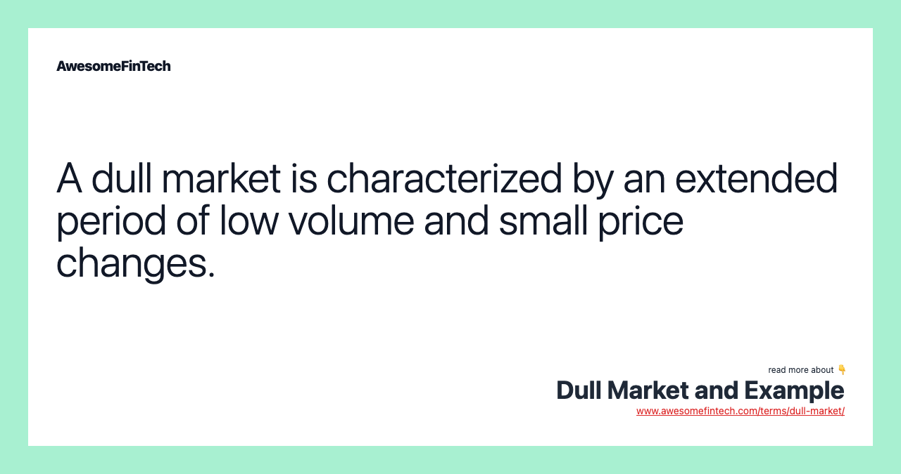

## Table of Contents

## What is a dull market?

A dull market is when there isn't much happening in the stock market. Prices don't change much, and there isn't a lot of buying or selling going on. It's like a quiet day where nothing exciting happens.

During a dull market, investors might feel bored because they can't make big profits quickly. They might decide to wait for a better time to buy or sell stocks. It's a time when the market is calm and steady, without big ups or downs.

## How can you identify a dull market?

You can spot a dull market by looking at how much the prices of stocks are moving. If the prices aren't going up or down a lot, and they stay pretty much the same for a while, that's a sign of a dull market. It's like watching a calm sea with no big waves.

Another way to tell is by checking the trading volume. If not many people are buying or selling stocks, the market can feel quiet and dull. It's like being in a store where hardly anyone is shopping. When you see both small price changes and low trading activity, you know you're in a dull market.

## What are the common characteristics of a dull market?

A dull market is when the stock market is not very exciting. The prices of stocks don't change much. They stay pretty much the same day after day. It's like watching a movie where nothing interesting happens. Investors might feel bored because they can't make big profits quickly. They might decide to wait for a better time to buy or sell stocks.

Another sign of a dull market is that not many people are buying or selling stocks. The trading volume is low. It's like being in a store where hardly anyone is shopping. When you see both small price changes and low trading activity, you know you're in a dull market. It's a time when the market is calm and steady, without big ups or downs.

## How does a dull market affect investors?

A dull market can make investors feel bored because there aren't big changes in stock prices. They might not see their investments grow much during this time. It can be frustrating for those who like to see quick profits. Some investors might decide to wait and not buy or sell stocks until the market gets more exciting.

On the other hand, a dull market can be good for some investors. It's a time when the market is calm and steady. This can be less stressful for people who don't like big ups and downs. They might feel safer keeping their money in the market during a dull period. It gives them a chance to plan their next moves without worrying about sudden changes.

## What are some historical examples of dull markets?

One historical example of a dull market happened in the early 2000s. After the dot-com bubble burst in 2000, the stock market went through a period where not much was happening. From 2002 to 2003, stock prices didn't move a lot. People were not buying or selling stocks as much as before. It was a time when investors felt bored and unsure about what to do next.

Another example was in the late 1960s and early 1970s. After a big boom in the stock market in the 1960s, things slowed down. From around 1969 to 1972, the market didn't see big changes in stock prices. Trading slowed down, and many investors felt like they were waiting for something to happen. It was a quiet time in the stock market, where not much excitement was going on.

## How do dull markets differ from bull and bear markets?

A dull market is very different from a bull market or a bear market. In a bull market, stock prices go up a lot, and people are happy and buying stocks. It's like a party where everyone is excited because they're making money. On the other hand, a bear market is when stock prices go down a lot, and people feel sad or worried. It's like a rainy day where everyone is trying to protect their money. A dull market is not like either of these. It's a time when stock prices don't move much at all, and not many people are buying or selling. It's like a quiet day where nothing special is happening.

In a dull market, investors might feel bored because they can't make big profits quickly. They might decide to wait for a better time to buy or sell stocks. It's a calm and steady time in the market, without the big ups and downs you see in bull and bear markets. In a bull market, everyone is excited to buy, and in a bear market, everyone is trying to sell or hold on tight. But in a dull market, it's like the market is taking a nap, and investors are just waiting for it to wake up again.

## What strategies can investors use during a dull market?

During a dull market, investors can use a strategy called "dollar-cost averaging." This means they put a little bit of money into the market at regular times, like every month. This way, they don't have to worry about buying at the perfect time. They just keep adding money slowly, and over time, they might buy stocks at different prices. This can help them feel more comfortable investing even when the market is not exciting.

Another strategy is to look for good companies to invest in, even if the market is dull. Investors can use this time to research and find strong businesses that might do well in the future. They can buy these stocks at a good price and hold onto them. When the market gets more exciting again, these good companies might grow and make the investors more money. It's like planting seeds during a quiet time, so they can grow when things get busy again.

Some investors might also choose to wait and save their money during a dull market. They can keep their cash safe and wait for a better time to buy stocks. When the market starts moving more, they can jump in and buy when prices are changing. This way, they don't feel bored or frustrated by the lack of action in a dull market. They can be ready to act when things get more interesting.

## How do dull markets impact different sectors of the economy?

During a dull market, different parts of the economy can feel the effects in different ways. Some sectors, like technology or finance, might see less excitement because people are not buying or selling as much. This can slow down growth in these areas. Companies in these sectors might have to wait longer to see their stock prices go up. They might also have a harder time raising money because investors are not as eager to put money into the market.

On the other hand, some sectors might not feel as much impact from a dull market. For example, businesses that provide essential services, like utilities or healthcare, might keep going as usual. People still need electricity and medical care, no matter what the stock market is doing. These sectors can be more stable during dull times because they are less affected by the ups and downs of the market. They might not see big changes in their business, even when the market is quiet.

## What role do economic indicators play in identifying a dull market?

Economic indicators help us see if the market is dull by showing us how the economy is doing. Things like the unemployment rate, consumer spending, and the Gross Domestic Product (GDP) can tell us if people are feeling good or bad about the economy. If these numbers are not changing much and stay steady, it might mean the market is dull. People are not spending more or less, and businesses are not growing or shrinking a lot. This steady state can make the market feel quiet and boring.

Another important indicator is the trading volume in the stock market. If the number of stocks being bought and sold is low, it's a sign that the market might be dull. When people are not excited about buying or selling, it means they are not expecting big changes in stock prices. Economic indicators like these help investors understand that the market is in a calm period, where not much is happening. By looking at these signs, investors can see if it's a good time to wait or if they should keep their money safe until things get more exciting.

## How can technical analysis be used to navigate a dull market?

Technical analysis can help investors find their way through a dull market by looking at charts and patterns of stock prices. Even when the market is not moving a lot, there can still be small changes in stock prices. Investors can use tools like moving averages to see if a stock is slowly going up or down. If a stock's price stays above its moving average, it might mean the stock is doing a bit better than the market. This can help investors decide if it's a good time to buy or sell, even when the market is quiet.

Another way technical analysis helps in a dull market is by spotting trends that might not be easy to see. For example, investors can use support and resistance levels to understand where a stock's price might stop going down or up. If a stock's price keeps bouncing off the same support level, it might be a sign that the stock is stable. This can give investors confidence to hold onto the stock or even buy more. By using these technical tools, investors can make smart choices and stay calm during a dull market, waiting for better times to come.

## What are the psychological impacts on investors in a dull market?

In a dull market, investors might feel bored and frustrated. They like to see their investments grow, but when the market is not moving much, it can feel like nothing is happening. This can make them impatient and unsure about what to do next. They might think about selling their stocks or moving their money to another place where they can see more action. It's like waiting for a bus that never comes, and it can be hard to stay calm and patient.

On the other hand, some investors might feel relieved during a dull market. They don't like big ups and downs, so a calm and steady market can make them feel safer. They can take this time to think about their next moves without the stress of sudden changes. It's like enjoying a quiet day at home instead of being out in a storm. These investors might use the dull period to plan and wait for better opportunities to come along.

## How do global economic conditions contribute to the formation of a dull market?

Global economic conditions can make the stock market dull. When the world economy is not growing fast or slowing down, people might feel unsure about investing. They might decide to wait and see what happens instead of buying or selling stocks. This can lead to less trading and smaller changes in stock prices. Countries that trade a lot with each other can affect each other's markets. If one big country's economy is not doing well, it can make other countries' markets slow down too. This can create a dull market where not much is happening.

Sometimes, global events like political problems or natural disasters can make the market dull. If people are worried about these events, they might not want to take risks with their money. They might keep their money safe instead of putting it into the stock market. This can lower the trading volume and keep stock prices from moving a lot. When the whole world is feeling cautious, it can lead to a quiet time in the market where investors are waiting for things to get better.

## What is Algorithmic Trading: An Overview?

Algorithmic trading, often known as algo trading, refers to the use of computer programs to automate trading decisions in financial markets. This method leverages algorithms to process complex data and execute trades with precision and speed, vastly differing from traditional manual trading. The rise of [algorithmic trading](/wiki/algorithmic-trading) has been significant in the past few decades, driven by advancements in technology and access to vast datasets. This transformation has allowed market participants to capitalize on minute market fluctuations that would be imperceptible to the human eye.

Algorithms are designed to process large volumes of data, analyzing financial indicators, market conditions, and historical data to identify trading opportunities. These programs execute transactions based on pre-defined criteria, which may include timing, price, or market conditions, ensuring that trades are conducted at the optimal moment without the delay inherent in human decision-making. The ability to quickly process and react to information is crucial, particularly in fast-paced market environments.

Several strategies are commonly employed in algorithmic trading, exploiting different aspects of the market. Trend-following strategies are among the most popular. They operate on the assumption that asset prices tend to move in persistent directions over time, enabling traders to profit from predictable patterns. These algorithms typically use moving averages, channel breakouts, and related indicators to determine buy or sell signals.

Mean reversion strategies assume that asset prices may deviate temporarily from their long-term average or historical levels but will revert over time. Algorithms utilizing such strategies monitor deviations from statistical trends, executing trades when assets are deemed overbought or oversold. For instance, this can be represented mathematically as:

$$
z = \frac{x - \mu}{\sigma}
$$

where $z$ is the z-score of the asset price $x$, $\mu$ is the mean price, and $\sigma$ is the standard deviation. Trades are executed when the z-score exceeds certain thresholds, signaling possible reversion.

Statistical [arbitrage](/wiki/arbitrage) involves taking advantage of price inefficiencies between related financial instruments. These strategies deploy algorithms to detect and exploit slight discrepancies in prices, typically over short time frames. The approach often relies on mathematical models and statistical analysis to determine the probability of convergence between prices.

In conclusion, algorithmic trading has revolutionized financial markets by introducing efficiency and precision unattainable through manual trading. By employing diverse strategies like trend-following, mean reversion, and [statistical arbitrage](/wiki/statistical-arbitrage), algorithmic trading enables market participants to exploit opportunities in various market conditions efficiently. As technology continues to advance, so will the capabilities and sophistication of algorithmic trading, reshaping the landscape of financial markets globally.

## References & Further Reading

[1]: ["Algorithms for Hyper-Parameter Optimization"](https://dl.acm.org/doi/10.5555/2986459.2986743) by Bergstra, J., Bardenet, R., Bengio, Y., & Kégl, B. (2011), Advances in Neural Information Processing Systems 24.

[2]: ["Advances in Financial Machine Learning"](https://www.amazon.com/Advances-Financial-Machine-Learning-Marcos/dp/1119482089) by Marcos Lopez de Prado

[3]: ["Evidence-Based Technical Analysis: Applying the Scientific Method and Statistical Inference to Trading Signals"](https://www.amazon.com/Evidence-Based-Technical-Analysis-Scientific-Statistical/dp/0470008741) by David Aronson

[4]: ["Machine Learning for Algorithmic Trading"](https://github.com/stefan-jansen/machine-learning-for-trading) by Stefan Jansen

[5]: ["Quantitative Trading: How to Build Your Own Algorithmic Trading Business"](https://www.amazon.com/Quantitative-Trading-Build-Algorithmic-Business/dp/1119800064) by Ernest P. Chan