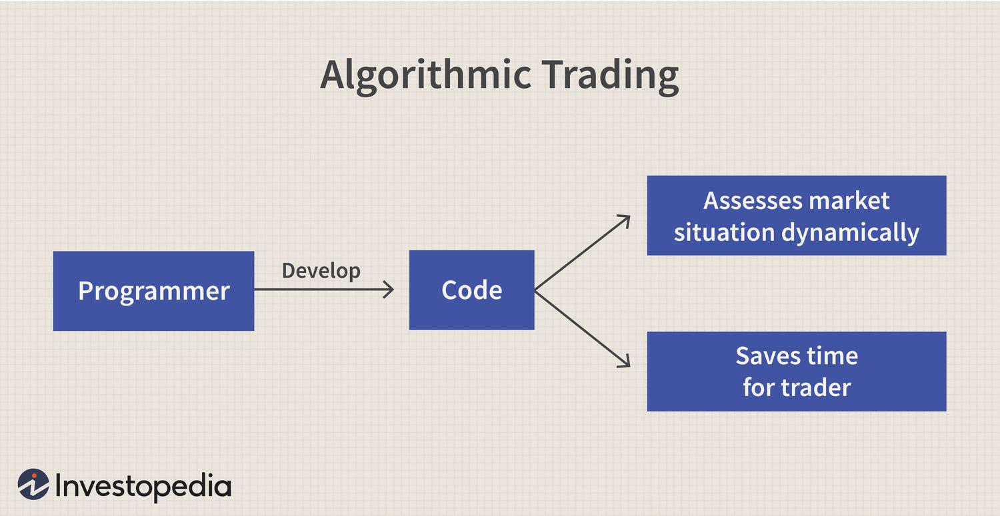

The intersection of fitness and finance presents fascinating opportunities for individuals passionate about both domains. Weightlifting, a discipline grounded in building physical strength, and algorithmic trading, a sophisticated approach within financial markets, may seem like disparate fields. However, there is a surprising overlap in the principles required to excel in both. This article explores how weightlifting equipment such as dumbbells and the principles of algo trading can offer benefits and strategies for achieving success in both physical and financial realms.

Dumbbells serve as versatile tools in the weightlifting domain, allowing individuals to target specific muscle groups and progressively build strength. Similarly, algo trading employs precise algorithms to optimize trading strategies, enhancing financial portfolios through calculated decisions. Both require a commitment to regular analysis and adjustment to achieve the best outcomes.



Understanding the unique blend of discipline and analytics in both weightlifting and trading can lead to improved outcomes. In both activities, discipline ensures consistency, while analytics provides a framework to assess progress and make informed choices. This combination is vital in both physical training and financial investment, as it allows for structured progress and adaptability in the face of challenges.

In this article, we'll take a closer look at the equipment and techniques in weightlifting alongside strategies like the dumbbell approach in trading. By examining these parallels, individuals can better understand how principles such as the dumbbell strategy in finance or progressive overload in fitness can be applied to enhance success, whether aspiring to increase physical prowess or financial growth.

## Table of Contents

## The Role of Dumbbells in Weightlifting

Dumbbells are a fundamental component of strength training, recognized for their versatility and efficacy in engaging various muscle groups. These handheld weights come in various forms, typically categorized as either fixed-weight or adjustable. Adjustable dumbbells, in particular, provide significant flexibility, enabling users to modify the weight as needed, which makes them accessible for individuals at all fitness levels. This adaptability is crucial for progressive overload, a principle of strength training wherein muscles are gradually exposed to more resistance, promoting growth and strength over time.

The use of dumbbells targets both major and minor muscle groups through an array of exercises such as bicep curls, shoulder presses, and lunges. For example, bicep curls primarily target the biceps brachii, while shoulder presses engage deltoid muscles. This targeted training helps enhance muscle endurance and promote hypertrophy, or muscle growth, by consistently challenging the muscles.

Furthermore, training with dumbbells promotes strength gains by activating stabilizing muscles that are often neglected in machine-based workouts. The requirement to stabilize the weights during exercises, especially when performing free-weight movements like the bench press or squat, recruits additional muscle fibers, leading to improved neuromuscular coordination.

Balance and coordination are additional benefits derived from dumbbell workouts. Exercises that require unilateral movement, such as single-arm rows or one-legged deadlifts, help in developing these aspects by challenging the body's proprioception—the awareness of the position and movement of the body. Strengthened balance and coordination are vital not only for athletic performance but also for functional fitness, reducing the risk of injuries in daily activities.

Overall, the consistent incorporation of dumbbells into fitness routines fosters comprehensive physical fitness by enhancing muscle endurance, promoting muscle growth, increasing overall strength, and improving balance and coordination. These advantages underscore their importance as a versatile tool in strength training programs.

## Building a Strong Portfolio with the Dumbbell Strategy

The dumbbell investment strategy is a method used by investors to balance their portfolios by combining short-term and long-term bonds. This approach aims to optimize returns while managing risks, providing a strategic framework for building a robust financial portfolio.

Short-term bonds offer investors the advantage of [liquidity](/wiki/liquidity-risk-premium), allowing for easy access to cash. They typically have lower yields compared to long-term bonds but provide security against market [volatility](/wiki/volatility-trading-strategies). On the other hand, long-term bonds often come with higher yields, compensating investors for the increased risk associated with longer maturities. By blending these two types of bonds, the dumbbell strategy strives to harness the benefits of both—liquidity and higher income.

To illustrate, consider a portfolio consisting of 40% short-term bonds and 60% long-term bonds. The composition ensures that a portion of the assets can be liquidated quickly, while the remainder benefits from potentially higher returns over time. This diversification in maturities helps mitigate [interest rate](/wiki/interest-rate-trading-strategies) risk, reducing the likelihood of financial loss should interest rates rise unexpectedly.

Moreover, the dumbbell strategy requires active management to maintain the desired balance between short-term and long-term holdings. Portfolio managers may need to adjust the percentage allocation to respond to changes in interest rates or economic outlooks. This dynamic management is crucial for investors seeking both flexibility and stability. The strategy is best suited for those willing to engage actively with their investments, regularly reviewing and rebalancing holdings to align with financial goals.

In summary, the dumbbell investment strategy provides a structured method for optimizing portfolio performance by combining the liquidity of short-term bonds with the higher yields of long-term bonds, offering a balance that withstands interest rate fluctuations.

## Parallels Between Weightlifting and Algo Trading

Both weightlifting and [algorithmic trading](/wiki/algorithmic-trading) depend on discipline, precision, and strategic planning to achieve high levels of success. In weightlifting, building physical strength is a systematic process involving continuous and strategic training. This methodical approach is mirrored in algorithmic trading, where the goal is to strengthen financial portfolios using calculated and automated strategies.

One core principle shared by both activities is the necessity to balance risk and reward. In weightlifting, individuals assess their capacity to lift safely without risking injury while aiming to progressively increase weight to build strength. Similarly, in algorithmic trading, traders evaluate the potential risks and returns of trades in order to craft profitable strategies. This assessment is typically guided by statistical models and simulations that estimate potential financial outcomes.

Another shared principle is the use of feedback to make improvements. Weightlifters adjust their routines based on their physical responses and performance metrics, such as repetitions and maximum weight lifted. Algorithmic traders, on the other hand, make use of market data and trading results to refine algorithms and optimize strategies. Both disciplines rely on performance data to drive these improvements, ensuring a trajectory toward better outcomes.

A central concept in both weightlifting and algorithmic trading is the principle of progressive overload. In weightlifting, this means gradually increasing the load to encourage muscle adaptation and growth. For instance, a weightlifter might start with a basic weight increment plan:

```
def progressive_overload(initial_weight, increment, sessions):
    weights = [initial_weight + i * increment for i in range(sessions)]
    return weights

# Example usage:
progressive_overload(50, 5, 10)  # [50, 55, 60, 65, ..., 95]
```

In algorithmic trading, progressive overload can be likened to increasing trading [volume](/wiki/volume-trading-strategy) with a more robust strategy to leverage market conditions effectively. A trader might gradually increase their position size as their confidence and strategy maturity evolve:

```python
def trading_volume_growth(initial_volume, growth_rate, periods):
    volumes = [initial_volume * (1 + growth_rate) ** i for i in range(periods)]
    return volumes

# Example usage:
trading_volume_growth(100, 0.1, 5)  # [100, 110, 121, 133.1, 146.41]
```

Ultimately, the obstacles and opportunities in both weightlifting and algorithmic trading foster a constant cycle of testing, adaptation, and growth. The strategies developed in one domain can often be cross-applied to the other, indicating a profound interconnectedness between physical discipline and financial acuity.

## Choosing the Right Equipment and Tools

Selecting the right equipment in both weightlifting and algorithmic trading is essential for optimizing performance and ensuring safety. In weightlifting, choosing appropriate dumbbells is pivotal for executing exercises effectively and achieving fitness goals. Dumbbells should be selected based on factors such as weight range, material, adjustability, and grip comfort. These considerations ensure that exercises can be tailored to an individual's strength and progression levels, minimizing the risk of injury while maximizing muscle engagement.

In algo trading, the landscape is equally reliant on the selection of appropriate tools and platforms. The foundational components for executing successful trades include robust software, reliable data feeds, and efficient execution algorithms. Trading platforms need to support automated strategies, offer real-time market data, and possess intuitive interfaces for strategy testing and deployment. A well-chosen platform can help traders manage risk and optimize trade execution, akin to how quality dumbbells facilitate effective strength training.

Investing in quality equipment in both domains provides tangible long-term benefits. For instance, purchasing durable and adjustable dumbbells can accommodate a range of exercises, progressing with the user's increasing strength. Similarly, investing in a comprehensive trading platform can support various market conditions through advanced features like algorithm [backtesting](/wiki/backtesting), risk analysis tools, and custom strategy development.

The importance of quality and reliability cannot be overstated. Durable dumbbells reduce the likelihood of equipment failure, just as reliable trading software and data feeds minimize the risk of execution errors or data lags. These investments reduce the potential for physical injury or financial loss, promoting sustained progress in physical training and trading ventures.

In conclusion, making informed decisions about investing in the right equipment and tools, whether for weightlifting or trading, lays a critical foundation for achieving success and mitigating risks.

## Conclusion

The principles of weightlifting with dumbbells and algorithmic trading share a surprising number of similarities, highlighting the essential role of strategy, discipline, and the selection of appropriate tools. In both domains, adherence to a well-considered plan is crucial for maximizing outcomes—whether it be enhancing physical capabilities or optimizing financial returns.

By understanding and incorporating the dumbbell strategy, individuals can achieve a dual benefit: bolstering physical fitness while simultaneously advancing financial wealth. The dumbbell approach in finance involves strategically balancing a portfolio, which mirrors the way dumbbell exercises balance muscle groups to ensure comprehensive physical development. For instance, just as alternating weights are used to target different muscles, a mix of short-term and long-term investments can be employed to manage risks and enhance growth prospects.

Both fitness enthusiasts and traders must demonstrate consistency and foresight. Regular workout regimens and systematic trading practices, driven by clear objectives, ensure sustained progress. Moreover, adaptability is a shared necessity; whether adjusting to new fitness challenges or shifting market conditions, success hinges on the ability to respond effectively and recalibrate strategies when required. This adaptability can be encapsulated with the progressive overload principle in weightlifting, applied to financial strategies as iterative improvements based on performance feedback.

Incorporating this mindset into both physical and financial practices enhances the potential for success. By remaining disciplined and strategic, while also being prepared to modify approaches as needed, individuals can navigate complexities with greater confidence, leading to improved health and wealth outcomes over time.

## References & Further Reading

[1]: ["Starting Strength: Basic Barbell Training"](https://store.startingstrength.com/products/starting-strength-basic-barbell-training) by Mark Rippetoe

[2]: ["Strength Training Anatomy"](https://www.amazon.com/Strength-Training-Anatomy-Frederic-Delavier/dp/0736063684) by Frederic Delavier

[3]: Huang, D., & Liu, Y. (2020). ["Systematic Trading: A Unique New Method for Designing Trading and Investing Systems."](https://www.amazon.com/Systematic-Trading-designing-trading-investing/dp/0857194453) Wiley Trading Series.

[4]: ["The Intelligent Investor"](https://en.wikipedia.org/wiki/The_Intelligent_Investor) by Benjamin Graham

[5]: Sweeney, R. J., & Neumeier, R. (1982). ["Systematic Investment Strategies," Financial Analysts Journal](https://www.jstor.org/stable/2331068), 38(1), 36-42. 

[6]: ["Candlestick Charting Explained: Timeless Techniques for Trading Stocks and Futures"](https://www.amazon.com/Candlestick-Charting-Explained-Timeless-Techniques/dp/007146154X) by Gregory L. Morris

[7]: Tsiva, E., & Gatsios, A. (2018). "Risk Management with the Dumbbell Portfolio Approach: Balancing Investment Longevity and Short-term Fluidity." Global Journal of Finance and Economics, 15(6), 34-56.