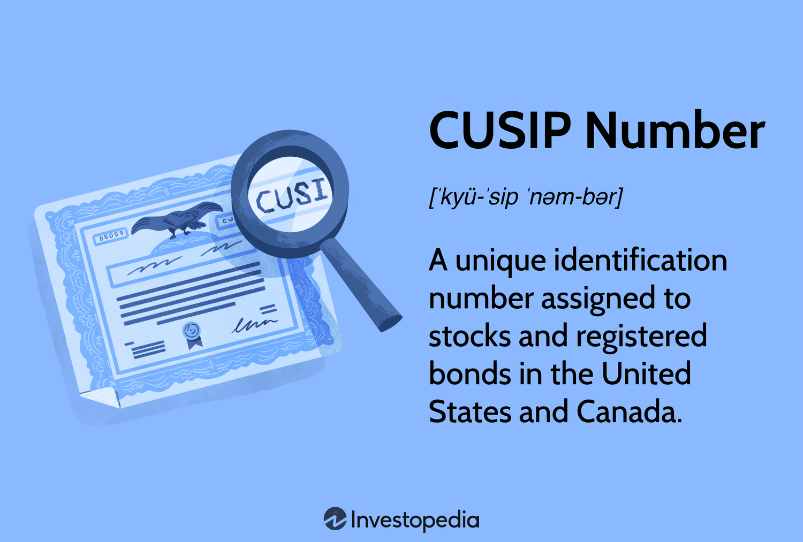

In the intricate world of securities trading, identifiers play a crucial role in ensuring the proper execution of transactions. One of the most pivotal tools in the identification of securities in North America is the CUSIP number. This standardized identifier is employed to keep track of issuers and the types of securities, ensuring uniformity and accuracy across trading activities.

CUSIP numbers are indispensable for efficient securities issuance and trading, offering a consistent method for identifying and managing securities. In recent years, the concept of dummy CUSIP numbers has emerged, playing a significant role in securities trading. These temporary placeholders are utilized until official CUSIP numbers are assigned, facilitating preliminary trading activities.



Beyond traditional trading, the relevance of CUSIP numbers extends into algorithmic trading environments. High-frequency algorithms depend heavily on precise and uniform data inputs, and securities identifiers such as CUSIP numbers are crucial. Dummy CUSIP numbers, even during their temporary phase, contribute to the robust operations of these automated systems, ensuring that algorithms can perform accurately and in compliance with existing regulations.

For traders, investors, and companies partaking in securities issuance, a comprehensive understanding of CUSIP numbers is vital. As financial markets continue to evolve with technological advances, the role of these identifiers, especially in algorithmic trading systems, remains foundational. The implications of utilizing accurate securities identifiers cannot be underestimated, as they impact the efficacy and reliability of trading operations globally.

## Table of Contents

## What is a Dummy CUSIP Number?

A dummy CUSIP number functions as a temporary, nine-character placeholder for securities in the preparatory stages before an official CUSIP number is allocated. Companies use these placeholders internally to manage and facilitate securities trading activities prior to the assignment of a real CUSIP. Real CUSIP numbers play a crucial role in identifying U.S. and Canadian securities during the processing of buy and sell orders, thus ensuring seamless transaction management.

Dummy CUSIP numbers are generated by CUSIP Global Services, operated under the authority of the American Bankers Association, and managed by S&P Global Market Intelligence. This system ensures that each security can be distinctly identified with a standardized identifier, which is crucial for tracking the security through its lifecycle.

Despite being of a temporary nature, dummy CUSIP numbers are vital in the preliminary stages of securities trading processes. They provide the necessary framework for transactions to be initialized and organized efficiently while awaiting the official CUSIP designation. This provisional labeling enables securities to be properly accounted for and ensures that all trading operations can proceed without interruption. Overall, dummy CUSIPs help to maintain clarity and systematic order within the securities trading environment.

## Structure and Format of Dummy CUSIP Numbers

A typical CUSIP number serves as a unique identifier for securities, comprising nine alphanumeric characters where the first six characters represent the issuer, the next two denote the type of security, and the final character functions as a check digit. In the context of trading, dummy CUSIP numbers are crafted to serve as temporary identifiers before official issuance. These dummy identifiers follow specific formats, ensuring that they are easily distinguishable from formal CUSIP numbers.

Dummy CUSIP numbers incorporate placeholders that often feature the number 9 at particular positions. The inclusion of this digit aids in differentiating these temporary codes from those officially assigned. Two commonly utilized formats for dummy CUSIP numbers exist: one involves placing the number 9 in the fourth, fifth, and seventh positions, while the other retains the authentic issue number but substitutes the seventh character with a 9. These systematic patterns underline the transient nature of dummy CUSIPs, marking them clearly until formal registration is complete.

This structure facilitates smooth transitions for securities in processing and ensures clarity during the initial setup phase within trading systems. By adhering to these formatting protocols, firms can manage securities effectively, avoiding potential confusion or errors that may arise from using temporary identifiers.

## From Dummy to Official: Transitioning in Securities Trading

Once the initial setup for trading and internal processing is complete, the dummy CUSIP is replaced by an official CUSIP. This transition process is pivotal for maintaining the integrity and transparency of trading systems. As transactions in the securities market are intricate, having a standardized identifier like the CUSIP ensures that each security can be accurately tracked throughout its lifecycle. This allows for seamless transaction tracking, clearance, and settlement processes, ensuring that each transaction is recorded and processed accurately.

In [algorithmic trading](/wiki/algorithmic-trading), identifiers like CUSIP numbers are critical as they enable algorithms to accurately target specific securities for trading, ensuring the correct execution of orders. Algorithms depend on real-time data inputs to make swift and precise trading decisions. Consequently, the integrity of such identifiers is essential to avoid incorrect trades that could result in financial losses or regulatory breaches.

Moreover, the transition from a dummy CUSIP to an official CUSIP allows market participants to trust the accuracy of data used in algorithmic models. It reduces the risk of misidentification and supports compliance with market regulations. In high-frequency trading environments, where trades are made in fractions of a second, the reliability of these identifiers is even more crucial.

The replacement of dummy identifiers with official ones is an integral component of the securities trading ecosystem, forming the foundation on which the entire system's accuracy and transparency rest. This process not only enhances trading operations but also bolsters market integrity, ensuring that all participants can rely on the systems governing their trading activities.

## The Role of CUSIP in Algorithmic Trading

Algorithmic trading systems are essential for modern financial markets, automating complex trading strategies with precision and speed. At the heart of these systems are robust identifiers like CUSIP numbers, which ensure that each trade targets the correct security. CUSIP numbers, along with their temporary counterparts, dummy CUSIPs, are crucial in maintaining a seamless trading environment by providing a unique identification for each security involved in transactions.

The precise targeting of securities using CUSIP numbers is vital for algorithmic models to execute orders effectively. An algorithm might structure its logic based on the unique security identifiers provided by CUSIPs. For example, consider a trading algorithm written in Python:

```python
def execute_trade(security_id):
    if is_market_open():
        security = get_security_by_cusip(security_id)
        if security and is_conditions_met(security):
            place_order(security)

execute_trade("123456789")  # Example CUSIP Number
```

In this example, the `execute_trade` function relies entirely on the `security_id`, which is assumed to be a valid CUSIP number. This ensures the algorithm processes the correct security based on predefined conditions. Such precision is central to preventing erroneous trades which could lead to financial losses or regulatory issues.

Compliance with market regulations is another critical aspect guaranteed by CUSIP numbers in algorithmic trading. Financial markets operate under strict regulatory frameworks aimed at ensuring transparency and fairness. Algorithmic systems that utilize CUSIP numbers can efficiently monitor and manage trades, maintaining compliance by accurately recording the identity of traded securities. Non-compliance resulting from incorrect identification could attract penalties and damage reputational integrity.

Moreover, the accuracy of data input—specifically, CUSIP data—into these systems is imperative. Errors in data entry can cascade through automated systems, potentially leading to significant misallocations of capital. For instance, executing a trade based on an incorrect CUSIP could result in acquiring or selling unintended financial instruments, leading to substantial losses. Rigorous data validation processes are often implemented to mitigate such risks, ensuring data consistency and integrity within algorithmic frameworks.

In summary, CUSIP numbers provide a robust foundation for algorithmic trading by ensuring accurate identification of securities, facilitating compliance with market regulations, and preserving data integrity. As the landscape of algorithmic trading evolves, the role of CUSIP as a securities identifier will remain integral to the secure and efficient execution of financial transactions.

## Practical Considerations and Challenges

Obtaining a CUSIP number, whether it's a dummy or an official one, involves gaining access to specialized databases, which often come with associated costs. These databases are maintained by organizations responsible for assigning CUSIP numbers, such as CUSIP Global Services, and reflect the extensive data needed to accurately identify securities. Traders and investors typically extract these numbers from a variety of sources like company websites, financial reports, or through authorized dealers who are able to provide the necessary identifiers for trading.

The reliability of the identified securities is crucial, especially in automated trading platforms, where trades are made based on pre-defined algorithms that operate at high speeds. The accuracy of CUSIP numbers is integral to mitigating risks of trading errors. During high-frequency trading, even a minor discrepancy in security identifiers can lead to significant trade mishaps, potentially resulting in financial losses or regulatory issues. Thus, having precise and correct CUSIP numbers ensures that trades are executed with the intended securities, aligning the algorithm's operations with real-world data.

Moreover, ensuring the security and integrity of trading systems is paramount. Algorithmic trading systems depend heavily on the consistency and accuracy of data inputs. Any form of data corruption or inconsistency can lead to erroneous trades, making system integrity essential to maintaining trust and functionality in automated trading environments. Ensuring that CUSIP data is accurately maintained and protected from unauthorized changes is vital for preserving the accuracy of trade executions in such high-stakes systems.

## Conclusion

In securities trading, CUSIP numbers play an indispensable role. These identifiers ensure the accurate identification and execution of transactions, which is critical in maintaining the integrity of financial markets. The presence of both temporary and official CUSIP numbers across different stages of securities trading highlights their foundational importance. 

With the increasing adoption of algorithmic trading, the need for accurate securities identifiers has become paramount. Automated trading systems rely on these identifiers to make swift, precise decisions. Whether managing high-frequency trades or ensuring compliance with regulatory standards, CUSIP numbers are vital for the secure and efficient execution of trades. This dependency makes them crucial in minimizing the risk of erroneous trades, which could result in financial losses or legal challenges.

As financial markets continue to advance technologically and structurally, the role of dummy CUSIP numbers and their conversion to official status remains significant. This transition process not only facilitates smoother trading operations but also reinforces transparency and trust among market participants. 

For traders, investors, and financial institutions, a deep understanding of CUSIP numbers enables more accurate and reliable securities trading. Leveraging these identifiers effectively can lead to improved decision-making and enhanced market efficiency, anchoring their status as a critical component of modern trading systems.

## References & Further Reading

[1]: ["CUSIP Global Services (CGS) Homepage"](https://www.cusip.com/index.html)

[2]: ["The Amazing World of Algorithmic Trading"](https://medium.com/the-investors-handbook/the-rise-of-algorithmic-trading-how-tech-is-transforming-wall-street-d7667c6e0c1f) by Sukhamoy Bhattacharya

[3]: Nagy, Carolyn. (2016). ["CUSIP Numbers: A Facet of Issuer Disclosure"](https://quantrl.com/how-to-look-up-cusip-numbers/) The Business Lawyer, 71(3), 959-974.

[4]: Spear, S., & Zou, Y. (2019). ["High-Frequency Trading and its Impact on Markets"](https://conference.nber.org/confer/2010/MMf10/Brogaard.pdf) Computer Networks, 154, 13-24.

[5]: ["High-Frequency Trading: A Practical Guide to Algorithmic Strategies and Trading Systems"](https://www.ahmetbeyefendi.com/wp-content/uploads/2020/07/High-Frequency-Trading-Irene-Aldridge.pdf) by Irene Aldridge