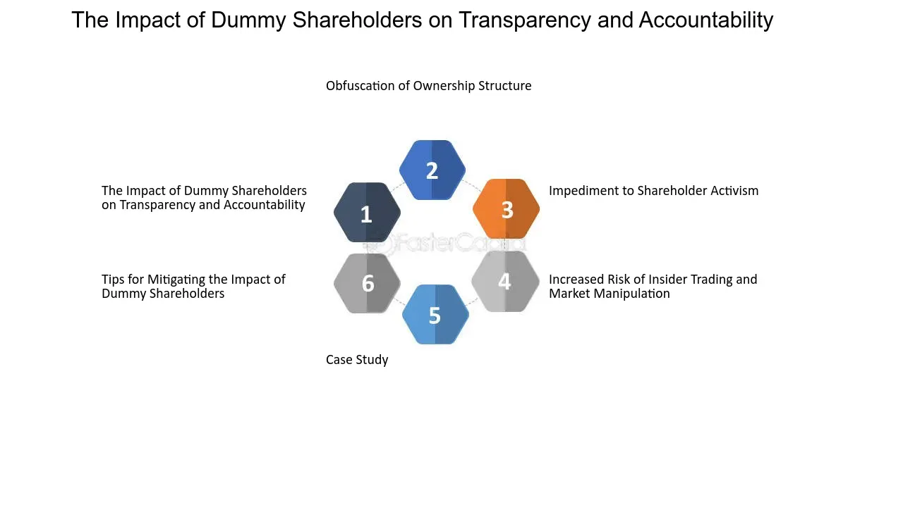

## Table of Contents

## What is a dummy shareholder?

A dummy shareholder is a person who holds shares in a company on behalf of someone else. This is often done to hide the true owner of the shares or to keep the ownership secret. The dummy shareholder doesn't have any real control over the company. They just hold the shares and follow the instructions of the real owner.

Using dummy shareholders can be risky. In some places, it is illegal because it can be used to hide illegal activities or to avoid taxes. Companies and people should be careful and make sure they follow the laws of their country when using dummy shareholders.

## Why would a company use a dummy shareholder?

A company might use a dummy shareholder to keep the real owner's identity a secret. This can be useful if the real owner wants to stay out of the public eye or if they want to keep their business activities private. For example, if a famous person owns a company, they might use a dummy shareholder to avoid drawing attention to their business.

Another reason a company might use a dummy shareholder is to follow the rules of the country where the company is based. Some countries have laws that limit how much of a company one person can own. By using a dummy shareholder, the real owner can still control the company without breaking these rules. However, it's important to make sure that using a dummy shareholder is legal and doesn't cause problems later on.

## How is a dummy shareholder different from a regular shareholder?

A dummy shareholder is different from a regular shareholder because a dummy shareholder holds shares for someone else, but doesn't really own them. They follow the instructions of the real owner and don't have any real control over the company. A regular shareholder, on the other hand, owns their shares and has the right to vote on important company decisions and receive dividends if the company makes a profit.

The main reason companies use dummy shareholders is to keep the real owner's identity a secret. This can be helpful if the real owner wants to stay private or if they need to follow certain laws about how much of a company they can own. Regular shareholders, however, are usually public and their ownership is known to everyone. Using a dummy shareholder can be risky because it might be illegal in some places, so it's important to make sure it's done correctly and follows the law.

## What are the legal implications of using a dummy shareholder?

Using a dummy shareholder can lead to legal problems if not done right. In many countries, it's against the law to hide who really owns a company. If someone uses a dummy shareholder to hide the real owner, they could get in trouble with the law. This is because hiding the real owner can be used for bad things like tax evasion or illegal activities. So, it's important to check the laws in your country before using a dummy shareholder.

Also, using a dummy shareholder can make it hard to follow rules about how much of a company one person can own. Some countries have laws that say one person can't own too much of a company. If someone uses a dummy shareholder to get around these rules, they could be breaking the law. It's always a good idea to talk to a lawyer to make sure using a dummy shareholder is okay and won't cause problems later on.

## Can a dummy shareholder vote at shareholder meetings?

A dummy shareholder usually can vote at shareholder meetings because they are listed as the owner of the shares on paper. However, they don't really decide how to vote. The real owner tells the dummy shareholder how to vote, and the dummy shareholder just follows those instructions.

This arrangement can be tricky because it might not be clear who is really in charge. If the company or the dummy shareholder doesn't follow the rules, they could get in trouble with the law. It's important for everyone involved to make sure they are doing things the right way and not breaking any laws.

## What are the potential risks associated with using a dummy shareholders?

Using a dummy shareholder can be risky because it might be against the law in some places. If the real owner tries to hide their identity, they could get in trouble for things like tax evasion or illegal activities. The laws about who can own a company and how much they can own are strict in many countries. If a dummy shareholder is used to get around these rules, the real owner could face big problems. It's always a good idea to talk to a lawyer to make sure everything is done the right way.

Another risk is that using a dummy shareholder can make it hard to know who is really in charge of the company. If something goes wrong, it might be confusing to figure out who should be responsible. This can lead to disagreements and legal battles. Plus, if the dummy shareholder doesn't follow the real owner's instructions correctly, it could cause even more trouble. It's important for everyone involved to be clear about their roles and to make sure they are following the law.

## How do companies disclose the use of dummy shareholders in their financial statements?

Companies usually don't say outright in their financial statements that they use dummy shareholders. Instead, they might talk about "beneficial owners" or "nominee shareholders" in the notes to their financial statements. This is where they explain who really owns the shares and who gets to make decisions about them. If a company is honest, they will make sure this information is clear so people can understand who is really in control.

However, some companies might try to hide the use of dummy shareholders. They might not mention it at all in their financial statements or might use confusing language to make it hard to understand. This can be a problem because it's important for investors and others to know who really owns the company. If a company is not clear about this, it could be breaking the law and might face serious consequences.

## What are the ethical considerations of using dummy shareholders?

Using dummy shareholders raises some big ethical questions. One main issue is honesty. When a company uses a dummy shareholder, it's not being clear about who really owns it. This can be a problem because people who invest in the company or do business with it should know who is really in charge. If the real owner is hidden, it can make people feel like they can't trust the company. This can hurt the company's reputation and make it hard to do business.

Another ethical concern is fairness. Some laws are there to make sure that no one person can control too much of a company. If someone uses a dummy shareholder to get around these rules, it's not fair to others who follow the laws. It can also lead to problems like tax evasion or hiding illegal activities. Companies should think about whether using a dummy shareholder is the right thing to do, even if it's not against the law. It's important to be honest and fair in business to keep trust and avoid causing harm.

## In what jurisdictions are dummy shareholders most commonly used?

Dummy shareholders are often used in places where it's easy to set up companies without revealing who really owns them. Countries like the British Virgin Islands, Panama, and some other offshore financial centers are popular for this. These places have laws that let people keep their ownership a secret, which can be useful for people who want to stay private or avoid certain taxes.

In some countries, dummy shareholders are used because of strict rules about who can own a company. For example, in China, there are limits on how much of a company a foreigner can own. So, some foreign investors use dummy shareholders to get around these rules and still control the company. This can be risky because it might be against the law, so it's important to be careful and make sure everything is done the right way.

## How can the use of dummy shareholders impact corporate governance?

Using dummy shareholders can make corporate governance harder. When a company uses dummy shareholders, it's not clear who really owns the company. This can make it tough for the board of directors and other leaders to know who they are supposed to be working for. If the real owners are hidden, it can lead to bad decisions and problems with how the company is run. It's important for everyone to know who the real owners are so they can make good choices for the company.

Also, using dummy shareholders can hurt trust in the company. If people find out that the company is hiding who really owns it, they might not trust the company anymore. This can make it hard for the company to do business and can cause problems with investors and other important people. Good corporate governance means being honest and clear about who owns the company, so using dummy shareholders can make things worse instead of better.

## What case studies illustrate the use of dummy shareholders in major corporations?

One famous case is about the company Odebrecht, a big construction company from Brazil. They used dummy shareholders to hide who really owned the company and to do illegal things. They paid bribes to people in many countries to get contracts for their business. When people found out about the dummy shareholders, Odebrecht got in big trouble. They had to pay a lot of money in fines, and some of their leaders went to jail. This case shows how using dummy shareholders can lead to big problems if it's used to do bad things.

Another case is about the company Yukos, which was a big oil company in Russia. The real owner, Mikhail Khodorkovsky, used dummy shareholders to hide how much of the company he owned. This was against Russian laws that say one person can't own too much of a company. When the government found out, they took away the company from Khodorkovsky and put him in jail. This case shows that using dummy shareholders to break the law can cause the real owner to lose everything and even go to jail.

## How have regulations regarding dummy shareholders evolved over the past decade?

Over the past decade, many countries have started to change their rules about dummy shareholders. They want to make sure that people can't use dummy shareholders to hide who really owns a company. This is because hiding the real owner can be used for bad things like tax evasion or illegal activities. So, governments are making new laws to make it harder to use dummy shareholders. For example, some countries now say that companies have to tell who the real owners are, even if they use dummy shareholders. This is called "beneficial ownership" and it's becoming more common around the world.

These changes are making it harder for people to use dummy shareholders to do bad things. But it's also making it harder for people who just want to keep their ownership private for good reasons. Companies and people have to be very careful to follow the new rules. If they don't, they could get in big trouble. Talking to a lawyer can help make sure that using a dummy shareholder is done the right way and doesn't break any laws.

## References & Further Reading

[1]: Bebchuk, L. A., & Weisbach, M. S. (2010). ["The State of Corporate Governance Research."](https://www.nber.org/papers/w15537) The Review of Financial Studies, 23(3), 939-961.

[2]: ["Opaque Corporate Governance: Lifting the Veil on the Purchase of Corporate Control Rights"](https://restthecase.com/knowledge-bank/lifting-of-corporate-veil) by Bebchuk, L.A., Cohen, A., and Ferrell, A. (2007). National Bureau of Economic Research.

[3]: Kumar, A., & Seppi, D. J. (2020). ["Algorithmic Trading."](https://www.cambridge.org/core/journals/journal-of-financial-and-quantitative-analysis/article/abs/shorting-in-broad-daylight-short-sales-and-venue-choice/4DEB3DF2E405769D593215C58357D856) Annual Review of Financial Economics, 12(1), 313-346.

[4]: Davies, H., & Green, D. (2008). ["Global Financial Regulation: The Essential Guide."](https://archive.org/details/globalfinancialr0000davi) Polity Press.

[5]: ["Nominee & Trustee Accounts: The Pitfalls."](https://grcpc.com/a-nominee-trust-isnt-a-typical-trust/) The Modern Law Review, 43(4), 442-448.

[6]: Zingales, L. (1998). ["Corporate Governance."](https://www.scirp.org/reference/ReferencesPapers?ReferenceID=1792701) In The New Palgrave Dictionary of Economics and the Law, Vol. 1, ed. P. Newman, Palgrave Macmillan.