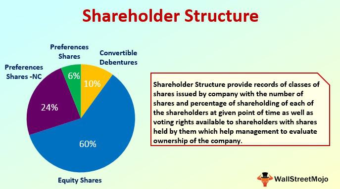

Corporate governance plays a critical role in shaping how a company is directed and controlled. It establishes the framework within which organizations operate, making sure that companies are accountable to their shareholders and other stakeholders. At its core, corporate governance seeks to ensure that businesses are managed in a way that is fair, transparent, and aligned with the interests of those who invest in them. Shareholders, often considered the cornerstone of this framework, provide the necessary capital and hold the voting power that influences decision-making processes at the management level.

However, the landscape of corporate governance is not without its complexities. Innovations and unconventional practices can complicate traditional governance mechanisms. Among these, the introduction of dummy shareholders and the rise of algorithmic trading have emerged as factors with significant implications for corporate governance.

Dummy shareholders, individuals or entities that hold shares on behalf of the actual owners, can obscure the true ownership of a company, raising issues of transparency and accountability. This practice can result in the manipulation of corporate control structures, thereby impacting the integrity of governance.

Similarly, algorithmic trading, which uses computer algorithms to execute trades at high speeds and volumes, poses its unique set of challenges. This method impacts market dynamics and can alter the traditional roles and influence of shareholders, prompting a need to revisit and potentially revise shareholder engagement strategies.

This article examines these complex elements within corporate governance. It aims to shed light on how dummy shareholders and algorithmic trading reshape corporate governance practices and outlines the legal, ethical, and regulatory concerns they raise. By understanding these factors, stakeholders can better navigate the evolving corporate governance landscape, ensuring fairness and accountability in business operations.

## Table of Contents

## Understanding Corporate Governance

Corporate governance refers to the framework of processes and principles through which corporations are directed and controlled. This framework is essential for aligning corporate actions with the broader interests of stakeholders, which include shareholders, management, customers, suppliers, financiers, government, and the community. Integral to corporate governance is the establishment of policies that cultivate accountability, fairness, and transparency within the organization.

Accountability within corporate governance ensures that those in managerial and supervisory positions are answerable for their actions and decisions. This implies that executives and board members must justify their performance and decision-making processes to stakeholders, predominantly the shareholders. Mechanisms such as internal audits, corporate disclosures, and board meetings are integral in maintaining this accountability.

Fairness involves the equitable treatment of all stakeholders. It mandates that all parties, particularly shareholders, are treated impartially, and that their rights are preserved and respected. This includes the equitable distribution of power and the fair division of financial benefits derived from the corporation's activities, such as dividends.

Transparency in corporate governance revolves around the clear, accurate, and timely dissemination of material information to stakeholders. This transparency mitigates information asymmetry, wherein one party possesses more or superior knowledge compared to another. Transparent practices involve comprehensive reporting standards and clear communication policies, ensuring stakeholders have a true view of the corporation's financial standing and future directions.

Effective governance further implies balancing various stakeholder interests. This requires weighing the demands and needs of different parties while also aligning them with corporate goals and objectives. Stakeholder interests may include profitability, regulatory compliance, sustainability, ethical practice, and innovation. An optimal balance is achieved by setting frameworks for decision-making that incorporate stakeholder feedback while strategically steering the company towards its long-term objectives. These decision-making processes often involve risk management, strategic oversight, performance evaluation, and direction setting, which are critical in navigating complex market environments.

Overall, corporate governance serves as the guide for ethical conduct in business operations, fostering trust and building relationships with its stakeholders. It not only impacts the company's internal management but also determines the firm's external reputation and ultimate success in the market.

## The Role of Shareholders in Corporate Governance

Shareholders play an integral role in corporate governance by influencing key decisions that shape the future of a company. Their influence stems primarily from their voting rights, which allow them to participate in decisions such as the election of board members and the approval of significant corporate policies. This voting power is a fundamental mechanism through which shareholders can guide a company's strategic direction.

Moreover, shareholders are tasked with oversight responsibilities. They monitor the actions of the board and management to ensure that decisions align with shareholder interests and the overall mission and values of the corporation. This monitoring function is critical for maintaining accountability and transparency within corporate structures.

In addition to voting and oversight, shareholders have the power to propose shareholder resolutions. These resolutions can address a range of issues, from corporate governance practices to social and environmental concerns. By advocating for changes through resolutions, shareholders can push management to address topics that may not have been on the board's agenda otherwise.

Their active engagement is crucial in shaping the governance landscape. Shareholders' ability to influence corporate governance is further bolstered by their right to access certain company information, which enables them to make informed decisions during voting and engagement activities.

In summary, shareholders are not merely passive investors but active participants in corporate governance. Their influence through voting, oversight, and the proposal of resolutions ensures that companies are managed in a way that aligns with shareholder interests, thereby contributing to the overall health and sustainability of the corporate entity.

## Exploring the Concept of Dummy Shareholders

A dummy shareholder, frequently known as a nominee shareholder, is an individual or entity that holds shares on behalf of the actual owner, effectively concealing the true identity of the shareholder. This arrangement is often utilized in various legal contexts, where maintaining privacy regarding the ownership of shares is desired or required. For instance, nominee shareholders are commonly employed when a company's beneficial owner wishes to remain anonymous for reasons ranging from personal privacy to strategic business considerations. However, this very obscuration of ownership can give rise to significant concerns regarding corporate control and liability.

Dummy shareholders can be leveraged to manipulate corporate control by effectively circumventing shareholder voting processes designed to ensure that corporate decisions reflect the true interests of the beneficial owners. When actual ownership is hidden, it becomes challenging for regulators and other shareholders to ensure that control of the company remains with those genuinely invested in its success. This is particularly problematic in scenarios where dummy shareholders are used strategically to accumulate a controlling interest in a company covertly, thus hijacking corporate governance processes.

Additionally, the presence of dummy shareholders in a corporate structure can be problematic from a liability standpoint. Because the true owner's identity is masked, legal accountability becomes obscured. In cases of fraud or malpractice, the complexity of revealing the true beneficial owner complicates litigation and the enforcement of legal obligations.

The opacity introduced by dummy shareholders raises substantial concerns about transparency and accountability in corporate governance. Transparency, which is paramount for monitoring corporate health and decision-making, is undermined when shareholder identities are concealed. This lack of clarity can lead to misaligned incentives, where decisions that render apparent shareholder benefits might serve undisclosed agendas that do not align with the company’s long-term viability or other shareholders' interests.

In response to these challenges, regulatory frameworks in various jurisdictions strive to enhance transparency by imposing obligations on companies to declare their beneficial ownership. Such measures are aimed at preventing the misuse of dummy shareholder arrangements for nefarious purposes, ensuring that all shareholders act within a transparent and accountable framework. Thus, while the role of dummy shareholders can serve legitimate privacy needs, their potential to disrupt corporate governance highlights the necessity for robust regulatory oversight to safeguard against misuse.

## Algorithmic Trading and Its Influence on Shareholder Roles

Algorithmic trading, often referred to as algo trading, leverages automated systems to execute financial trades at high speeds and large volumes. This approach utilizes algorithms, or complex mathematical models, which can process vast amounts of data faster than human traders. The adoption of [algorithmic trading](/wiki/algorithmic-trading) has profoundly influenced market dynamics, directly impacting shareholder roles and their influence within corporate governance structures.

One of the primary influences of algorithmic trading on market dynamics is the enhancement of market [liquidity](/wiki/liquidity-risk-premium). By allowing for rapid buying and selling of securities, algorithmic trading increases the [volume](/wiki/volume-trading-strategy) of transactions, thereby improving liquidity. This can benefit shareholders by narrowing bid-ask spreads and providing more efficient price discovery. However, it also introduces new challenges, such as increased [volatility](/wiki/volatility-trading-strategies) due to the potential for rapid and large-scale order execution.

Algorithmic trading has catalyzed shifts in shareholder engagement strategies. Traditional shareholder engagement, characterized by long-term investment strategies and active participation in corporate decision-making, is being reevaluated as algo trading emphasizes speed and transactional benefits. Institutional investors, who significantly influence shareholder roles, increasingly rely on algorithmic strategies to optimize portfolio management. This shift has reduced the emphasis on long-term governance involvement, prompting companies to adopt new strategies to maintain shareholder interest and participation.

Moreover, the computer-driven nature of algorithmic trading raises concerns related to market fairness and stability. Algorithmic strategies like high-frequency trading ([HFT](/wiki/high-frequency-trading-strategies)) can create disparities between different types of market participants. Sophisticated algorithmic traders can capitalize on minute inefficiencies in the market, sometimes disadvantaging traditional investors who lack access to similar technological resources.

To address these concerns, regulatory bodies continue to scrutinize algorithmic trading practices, emphasizing the need for transparent and equitable trading environments. Regulations are being developed to ensure that the benefits of advanced trading technologies do not compromise market integrity or render shareholder engagement obsolete.

Overall, the rise of algorithmic trading necessitates a rethinking of shareholder engagement strategies and corporate governance practices. As markets continue to evolve with technological advancements, shareholders and corporate entities must adapt to these changes to sustain meaningful and equitable participation in the corporate governance landscape.

## Legal and Ethical Implications of Dummy Shareholders and Algo Trading

The use of dummy shareholders presents significant legal and ethical challenges within corporate governance frameworks. Dummy shareholders, often used to conceal the identity of beneficial owners, can facilitate the evasion of legal responsibilities. This practice can obscure the true ownership of shares, leading to potential breaches in compliance with corporate laws. For instance, regulations that require the disclosure of ultimate ownership can be circumvented, making it challenging to enforce legal accountability. Ethically, the use of dummy shareholders undermines transparency, a core principle of good corporate governance, thereby eroding stakeholder trust.

Algorithmic trading, characterized by the use of automated systems to execute high-speed and high-volume trades, poses different legal and ethical concerns. From a legal standpoint, these systems can engage in practices that lead to market manipulation, such as spoofing—where large orders are placed and then canceled to create misleading perceptions of demand or supply. Such activities not only disrupt market integrity but also challenge existing legal frameworks designed to prevent unfair trading practices. 

Ethically, algorithmic trading can introduce substantial market volatility, affecting the stability of financial markets and potentially disadvantaging retail investors. These automated strategies can react to market movements and news at speeds beyond human capabilities, raising concerns about the fairness of trading environments. The ethical implications also extend to whether algorithmic strategies align with broader societal values, such as equitable market access and investor protection.

Regulatory bodies around the world are becoming increasingly vigilant in scrutinizing dummy shareholders and algorithmic trading. Efforts to enhance transparency include mandates for revealing beneficial ownership and implementing tighter controls on algorithmic trading practices. For instance, the implementation of advanced monitoring technologies and the setting of circuit breakers aim to curtail excessive volatility and ensure orderly markets. These regulatory measures seek to uphold the principles of fair and transparent markets, mitigating the adverse impacts posed by both dummy shareholders and algorithmic trading. 

In light of these challenges, ongoing vigilance, adaptability, and innovation in regulatory frameworks are crucial to maintaining the integrity and ethical standards of corporate governance.

## Case Studies of Dummy Shareholders in Corporate Governance

The use of dummy shareholders has long been a topic of scrutiny in corporate governance, as they can significantly impact the transparency and accountability of corporate structures. Historical case studies offer valuable insights into how these entities have been employed to obscure true ownership and manipulate corporate control.

A prominent example highlighting the challenges posed by dummy shareholders is the Panama Papers, a massive data leak that occurred in 2016. The Panama Papers revealed the extensive use of shell companies and dummy shareholders to hide the identities of real owners and facilitate activities such as tax evasion and money laundering. This exposé involved over 214,000 offshore entities and implicated numerous high-profile individuals and corporations across the globe. The presence of dummy shareholders in these entities allowed the true owners to remain anonymous, effectively bypassing legal and regulatory frameworks designed to ensure transparency and accountability in corporate governance.

The ramifications of the Panama Papers were far-reaching. They prompted a global discussion on the need for more stringent governance practices and increased scrutiny of offshore financial systems. Governments and regulatory bodies worldwide responded with measures aimed at curbing the misuse of dummy shareholders. Initiatives included enhancing the transparency of beneficial ownership and implementing stricter due diligence processes for financial institutions. These reforms aim to prevent the recurrence of similar abuses and ensure that corporations operate with greater accountability and integrity.

The lessons drawn from the Panama Papers underline the critical importance of transparency in corporate governance. By mandating clearer disclosure of ownership structures and reinforcing the oversight of corporate practices, these case studies serve as a catalyst for regulatory changes and the adoption of best practices. As a result, the understanding of dummy shareholders' roles in undermining effective governance continues to evolve, guiding reformative efforts to safeguard shareholder interests and promote ethical corporate environments.

## Regulatory Measures to Address Challenges

Regulators worldwide are increasingly implementing measures to enhance transparency and accountability in shareholding practices to address the complexities introduced by dummy shareholders and algorithmic trading. A key regulatory approach is mandating the disclosure of beneficial ownership. Beneficial ownership disclosure requires that the actual individuals who ultimately own, control, or benefit from ownership of corporate shares are identified and reported to relevant authorities. This measure is instrumental in combating issues related to dummy shareholders, as it prevents the concealment of the true identities behind corporate holdings, thereby enhancing transparency and reducing opportunities for evasion of legal obligations and liability.

In addition to beneficial ownership disclosure, regulators are imposing stricter controls on algorithmic trading. This form of trading, characterized by high-speed and high-volume transactions executed by automated systems, can introduce significant market volatility and present risks of market manipulation. To mitigate these risks, regulatory bodies are incorporating enhanced supervision and risk management requirements. For instance, measures such as circuit breakers, which temporarily halt trading on an exchange to curb panic-selling, and requirements for algorithmic trading firms to register their trading algorithms with regulators, are being put in place. These controls aim to ensure that algorithmic trading contributes to efficient market operations without compromising ethical standards or market integrity.

Together, these regulatory efforts are essential in addressing the adverse impacts associated with dummy shareholders and unchecked algorithmic trading. By ensuring that corporate ownership structures are transparent and trading practices are fair and ethical, regulators aim to maintain confidence in financial markets and corporate governance mechanisms globally. These measures, fostering greater transparency and accountability, are crucial steps towards mitigating potential abuses and preserving the integrity and stability of the market environment.

## The Future of Corporate Governance with Emerging Practices

The landscape of corporate governance is undergoing significant transformation driven by technological advancements and evolving shareholder strategies. This evolution demands a thorough understanding of elements such as dummy shareholders and algorithmic trading, which are pivotal in shaping future governance models.

Dummy shareholders, often used to obscure the true ownership of shares, pose unique challenges to transparency and accountability. As corporate governance frameworks strive for more openness, identifying and addressing the use of dummy shareholders becomes critical. This requires robust systems to validate the authenticity of shareholders and ensure compliance with disclosure norms. Regulatory bodies are increasingly focusing on mandating the disclosure of beneficial ownership to strengthen governance structures and mitigate risks associated with anonymous ownership.

Algorithmic trading, characterized by the use of automated systems for executing trades at high speeds and volumes, also significantly impacts corporate governance. This trading style can dilute the traditional influence of shareholders by altering market dynamics and enabling rapid shifts in shareholder composition. As algorithmic trading mechanisms continue to evolve, they necessitate a reevaluation of traditional shareholder engagement models. Policymakers and corporate leaders must adapt to these changes by implementing strategies that address the fast-paced nature of modern trading environments and its implications for shareholder roles.

Emerging governance practices must also account for the potential ethical and legal challenges posed by these elements. The rapid pace of technological change calls for agile regulatory frameworks that can respond to the complexities introduced by algorithmic trading and dummy shareholders. These frameworks aim to uphold fair and transparent markets while supporting innovation.

Corporate leaders and policymakers must shape strategies that integrate these transformative practices while maintaining effective and ethical governance frameworks. This involves fostering continuous dialogue among stakeholders, leveraging technological advancements responsibly, and instituting adaptive policies that reflect the ongoing shifts in corporate governance. Emphasizing education and awareness across organizations will also enable stakeholders to better navigate these emerging dynamics, thereby strengthening the integrity and resilience of future governance structures.

## Conclusion

In conclusion, dummy shareholders and algorithmic trading introduce complexities to corporate governance but simultaneously offer avenues for enhancement. Embracing regulatory changes such as increased transparency and stricter oversight can reinforce the integrity of corporate governance structures. As these mechanisms become more integrated into the corporate environment, stakeholders—from investors to regulatory bodies—must remain vigilant and proactive. Staying informed about evolving practices will be essential to maintaining a governance model that balances innovation with ethical responsibility and transparency. This vigilance will ensure that the opportunities afforded by new technologies and shareholder strategies do not undermine the foundational principles of accountability and fairness in corporate governance.

## References & Further Reading

[1]: Bebchuk, L. A., & Weisbach, M. S. (2010). ["The State of Corporate Governance Research."](https://www.nber.org/papers/w15537) The Review of Financial Studies, 23(3), 939-961.

[2]: ["Opaque Corporate Governance: Lifting the Veil on the Purchase of Corporate Control Rights"](https://restthecase.com/knowledge-bank/lifting-of-corporate-veil) by Bebchuk, L.A., Cohen, A., and Ferrell, A. (2007). National Bureau of Economic Research.

[3]: Kumar, A., & Seppi, D. J. (2020). ["Algorithmic Trading."](https://www.cambridge.org/core/journals/journal-of-financial-and-quantitative-analysis/article/abs/shorting-in-broad-daylight-short-sales-and-venue-choice/4DEB3DF2E405769D593215C58357D856) Annual Review of Financial Economics, 12(1), 313-346.

[4]: Davies, H., & Green, D. (2008). ["Global Financial Regulation: The Essential Guide."](https://archive.org/details/globalfinancialr0000davi) Polity Press.

[5]: ["Nominee & Trustee Accounts: The Pitfalls."](https://grcpc.com/a-nominee-trust-isnt-a-typical-trust/) The Modern Law Review, 43(4), 442-448.

[6]: Zingales, L. (1998). ["Corporate Governance."](https://www.scirp.org/reference/ReferencesPapers?ReferenceID=1792701) In The New Palgrave Dictionary of Economics and the Law, Vol. 1, ed. P. Newman, Palgrave Macmillan.