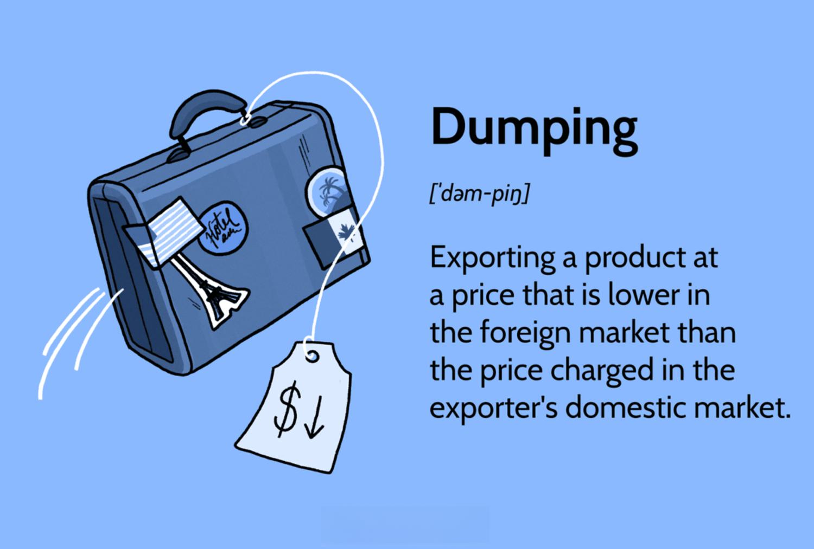

International trade is a complex web of transactions and exchanges that connects countries globally, involving the flow of goods, services, and capital. At the heart of this global exchange lies two contentious practices: price discrimination and dumping. Price discrimination occurs when a seller charges different prices for the same product in different markets without corresponding cost differences. This practice can lead to increased market penetration and consumer exploitation, depending on its implementation. Alternatively, dumping refers to exporting goods at prices lower than the home market or even below production costs, often to gain market share in foreign markets and undermine local industries. Both practices have profound implications for global markets and industries, influencing competitive dynamics and economic structures.

In recent years, algorithmic trading has emerged as a significant force in shaping international trade patterns. By leveraging advanced computational algorithms, traders can identify opportunities for price disparities and execute strategies that maximize profit potentials. Algorithmic trading has transformed how markets operate, offering increased efficiency and liquidity but also introducing challenges such as market volatility and ethical considerations.

The economic implications of price discrimination and dumping are multifaceted. On the one hand, these practices can foster competitive advantages, enabling companies to enter new markets and cater to diverse consumer bases. On the other hand, they can disrupt local industries, prompt trade disputes, and lead to protectionist policies. Strategically, companies may engage in price discrimination or dumping to establish dominance, deter rivals, or react to policy changes. These tactics often necessitate careful navigation of international trade laws and regulatory environments.

Understanding the dynamics of price discrimination and dumping, alongside algorithmic trading's impact, is crucial for grasping the intricacies of contemporary global trade. As market participants continue to innovate, the interplay between regulatory frameworks and market strategies will determine the future landscape of international trade. Balancing these elements requires ongoing research and policy adjustments to foster a fair, competitive, and dynamic global market.

## Table of Contents

## Understanding Price Discrimination in International Trade

Price discrimination refers to the strategy where a seller charges different prices for the same product or service to different consumers. This practice exploits the variations in consumers' willingness to pay and can maximize the seller's revenue. In international markets, price discrimination manifests through heterogenous pricing strategies that take into account the diverse economic conditions, exchange rates, consumer preferences, and competitive landscapes across countries.

### Application of Price Discrimination in International Markets

In international trade, firms might employ third-degree price discrimination, a common form wherein prices are tailored according to customer segments based on identifiable characteristics. For instance, pharmaceutical companies often set higher prices in high-income countries compared to low-income ones, reflecting differences in purchasing power and regulatory environments.

### Cross-Border Pricing Strategies

Multinational companies frequently use differentiated pricing strategies to gain competitive advantages. These strategies might include:

1. **Geographical Pricing**: Companies adjust prices based on geographic location to capture consumer surplus from markets with different price sensitivities. For example, software companies adjust subscription fees in accordance with the economic status of each region.

2. **Exchange Rate Fluctuations**: Firms might alter prices in response to exchange rate movements to maintain their competitive position and profit margins. A strong home currency might prompt exporters to increase foreign prices.

3. **Market Segmentation**: Companies often categorize international markets and adjust pricing based on localized demand elasticities. Luxury brands, for example, leverage brand perception variances to charge premium prices in specific markets.

### Legal and Ethical Considerations

While price discrimination can enhance profitability and economic efficiency, it raises significant legal and ethical issues. Under certain jurisdictions, discriminatory pricing can contravene competition laws designed to prevent unfair market practices. The Robinson-Patman Act in the United States, for instance, prohibits certain forms of price discrimination to protect small businesses from anticompetitive practices.

Ethically, price discrimination can lead to debates regarding fairness, especially when essential goods become unaffordable to more vulnerable segments of the population. Ensuring transparent criteria for price differentiation can mitigate some of these concerns.

### Examples in Various Sectors

1. **Airlines and Travel**: The airline industry is a classic example, employing dynamic pricing algorithms that adjust ticket prices based on demand, booking time, and seat class. This allows airlines to maximize occupancy rates and revenue.

2. **Publishing and Software**: Textbook publishers often sell the same content at varied prices depending on the region due to differences in consumer purchasing power and regional content agreements. Similarly, software firms like Adobe offer products at adjusted rates reflecting local market conditions.

3. **Automobiles**: Car manufacturers may customize prices and features offered in different countries, adjusting to local consumer preferences, import tariffs, and tax structures.

Price discrimination plays an instrumental role in shaping international trade dynamics, offering businesses the ability to optimize revenue streams across diverse markets. However, it necessitates careful consideration of legal frameworks and ethical standards to avoid potential negative repercussions on consumers and competition.

## What is Dumping in International Trade?

Dumping in international trade refers to a situation where a country or company exports a product at a price lower than the price it normally charges in its home market or at a price below its costs of production. The primary economic rationale behind dumping is to gain a competitive advantage in the importing country's market, often with the intention of establishing market dominance or driving out local businesses. This practice can be used strategically to achieve long-term economic benefits, such as capturing a significant share of the market and creating barriers for new entrants.

One notable instance of dumping significantly impacting local markets is the case of Chinese steel exports in the early 2000s. Facing an oversupply domestically, China exported large quantities of steel at artificially low prices. This led to a considerable disruption of regional markets, particularly in the United States and Europe, where local producers struggled to compete with the cheaper imports. The result was a series of anti-dumping investigations and measures initiated by affected countries to protect their domestic industries.

Companies may engage in dumping for several strategic reasons. Firstly, it allows companies to penetrate new markets and build a consumer base quickly by offering competitive prices. This strategy can be particularly effective in industries where brand loyalty is low, and price sensitivity is high. Secondly, dumping can be employed as a defensive tactic to counteract foreign competition in the exporter's home market. By subsidizing their exports, companies can maintain higher prices domestically while still retaining overall profitability. Furthermore, governments might support dumping to stimulate domestic industry by maintaining high production levels and reducing unemployment.

Real-world examples of dumping include the Japanese automotive industry's export practices in the 1980s. Japanese car manufacturers sold vehicles in the United States at prices that were deemed significantly below production costs in some cases. This practice, combined with high efficiency and low production costs in Japan, allowed them to capture a substantial share of the American market. The U.S. enforced various regulatory measures in response, which included voluntary export restraints negotiated in 1981 to limit the number of Japanese cars imported annually.

In conclusion, while dumping can provide short-term benefits for exporters by widening their market outreach, it poses significant challenges to international trade fairness. The practices of dumping often lead to retaliatory trade measures and contribute to economic tensions between countries, necessitating constant vigilance and responsive policy frameworks to ensure balanced and fair trade dynamics.

## Algorithmic Trading and its Impact on International Trade

Algorithmic trading refers to the use of computer algorithms to automatically execute trading orders with minimal human intervention. These algorithms are designed to analyze market data, identify trading opportunities, and execute trades at optimal prices and times, all of which occur at speeds much faster than human capabilities. In modern trade practices, [algorithmic trading](/wiki/algorithmic-trading) enhances market efficiency, increases [liquidity](/wiki/liquidity-risk-premium), and reduces costs for traders by minimizing manual errors and exploiting pricing inefficiencies.

Algorithms play a significant role in identifying opportunities for price discrimination and dumping by analyzing vast amounts of market data from different geographical regions. Price discrimination involves charging different prices to different consumers for the same product, and algorithms can identify these variations by assessing factors such as demand elasticity, consumer preferences, and competitive pricing. For instance, an algorithm might detect a region where consumers are willing to pay higher prices due to limited competition, thus enabling companies to implement differentiated pricing strategies.

Dumping, defined as the practice of exporting a product at a price lower than its normal value, can also be detected and exploited using algorithms. By continuously monitoring international market prices and cost structures, algorithms can identify opportunities for dumping products in foreign markets either to gain market share or to offload excess inventory, which could be strategically beneficial for the exporting company.

The benefits of algorithmic trading in global markets are considerable. It increases market efficiency by reducing transaction costs and providing liquidity, thus narrowing bid-ask spreads. Furthermore, algorithmic trading can enhance price discovery by quickly absorbing and reacting to new information, thus assisting in the creation of more accurate and fair market prices.

However, there are associated risks. Algorithmic trading can lead to market [volatility](/wiki/volatility-trading-strategies), as the high speed and [volume](/wiki/volume-trading-strategy) of trades can exacerbate price movements. This is particularly apparent during market stress or technical glitches, as seen in the "Flash Crash" of May 6, 2010, where major U.S. stock indices temporarily plummeted due to algorithm-induced trading patterns.

Case studies highlight the profound impact of algorithmic strategies on international trade. For instance, the use of sophisticated algorithms by hedge funds has been instrumental in executing large trades in foreign exchange markets with minimal market impact, thereby influencing currency prices globally. Another example is the use of alpha-generating strategies that exploit statistical [arbitrage](/wiki/arbitrage) opportunities across global stock markets, which often include detecting under- or over-valued securities and executing trades to capture the value difference.

In conclusion, while algorithmic trading offers efficiency and strategic advantages in global markets, careful management is essential to mitigate its potential adverse effects. As algorithms continue to evolve, their impact on international trade will likely grow, necessitating continuous oversight and potentially new regulatory frameworks to ensure market stability and fairness.

## Advantages and Disadvantages of Dumping

Dumping is a trade practice where a country or company exports a product at a price lower than the price it normally charges in its domestic market. This strategy can be economically beneficial for both exporters and consumers. For exporters, dumping can help gain entry into new markets by offering competitive pricing that undercuts local producers. This approach often increases market share and can lead to economies of scale, resulting in reduced average costs and potentially higher profits in the long run. Additionally, consumers in the importing country benefit from lower prices, which can increase consumer surplus and purchasing power.

However, dumping also has significant drawbacks, particularly for domestic industries in the importing country. By selling products at a lower cost than local goods, dumping can severely undermine local industries, leading to losses in revenue and market share. Over time, this can result in job losses, weakened economic stability, and potential disincentives for domestic investment and innovation. The practice can create a dependency on cheap imports, ultimately damaging the competitive landscape within the country.

Subsidies play a crucial role in sustaining dumping practices. Governments may provide financial support to their domestic industries in the form of subsidies, enabling exporters to sell products at lower prices internationally. This is often done to protect and promote key industries or to achieve broader economic objectives. However, such practices may distort free trade and lead to international disputes. Regulatory measures, such as anti-dumping duties, are tools used by countries to counteract and mitigate the effects of dumping. These duties are tariffs imposed on foreign imports believed to be dumped and are intended to level the playing field for domestic producers.

The long-term implications of dumping on global trade relations can be profound. Persistent dumping can lead to trade tensions and disputes among nations, often culminating in the imposition of retaliatory tariffs and trade barriers, which can escalate into trade wars. These conflicts can disrupt international trade flows, increase the cost of goods, and strain diplomatic relationships. Moreover, reliance on dumping as a strategy may hinder a country's efforts to diversify its export portfolio and increase its vulnerability to changes in global demand.

In conclusion, while dumping can provide short-term benefits to exporters and consumers, its adverse effects on domestic industries and broader economic stability cannot be overlooked. The practice challenges the principles of fair trade, and the use of subsidies and regulatory countermeasures further complicates international trade dynamics. Policymakers must carefully consider the long-term impacts of dumping on trade relations and work towards developing fair and equitable trade practices to maintain global economic stability.

## International Regulations and Protective Measures

The regulation of dumping and price discrimination in international trade is a critical focus for the World Trade Organization (WTO). The WTO aims to promote fair competition and has established frameworks to curb these practices, primarily through the Agreement on Anti-Dumping (ADA). The ADA defines dumping as the sale of goods in a foreign market at a price below their normal value, often resulting in significant harm to the importing country’s domestic industry. It provides a legal basis for countries to impose anti-dumping duties when dumped imports cause or threaten material injury.

Countries adopt various countermeasures such as tariffs and quotas to protect domestic industries from the adverse effects of dumping. Tariffs, which are taxes levied on imported goods, elevate the price of these goods and help level the playing field for domestic producers. Quotas, on the other hand, restrict the quantity of a product that can be imported, ensuring that domestic markets are not saturated with foreign goods. For instance, a country might impose a tariff of 20% on imported steel beams determined to be dumped, or it might allow only 10,000 tons of such beams into the country annually.

Legal frameworks and trade agreements often entail provisions that address unfair practices. Bilateral and multilateral trade agreements frequently include clauses intended to prevent and rectify dumping and unfair price discrimination. Such agreements may encourage or require parties to adopt domestic legislation consistent with WTO rules. For example, the North American Free Trade Agreement (NAFTA) and its successor, the United States-Mexico-Canada Agreement (USMCA), contain specific sections dealing with anti-dumping measures and dispute resolution mechanisms.

The enforcement of anti-dumping measures presents a complex challenge. While these measures are theoretically straightforward, their effectiveness relies significantly on the ability of domestic agencies to investigate and prove dumping cases. Additionally, there is a concern about potential misuse of anti-dumping measures as protectionist tools rather than genuine responses to unfair trade practices. Some countries have faced criticism for imposing anti-dumping duties excessively, which may provoke retaliatory measures and escalate trade tensions. Balancing the protection of domestic industries with the promotion of free trade and maintaining healthy international relationships is a persistent challenge for policymakers.

Overall, the WTO’s regulations and the protective measures employed by countries reflect a concerted effort to foster equitable trading conditions. However, ongoing assessment and adaptation of these measures are essential to address the dynamic and evolving nature of international trade.

## Strategic Implications for Global Trade

Price discrimination and dumping significantly influence competitive markets in international trade by altering the traditional dynamics of supply and demand, ultimately affecting global economic stability and competition. Price discrimination allows companies to charge different prices for the same product in different markets or segments, thereby maximizing profits and gaining competitive advantages. This practice can create uneven competitive landscapes, where companies efficiently segment markets and tap into consumer surplus. The ability to accurately assess willingness to pay across different markets enables firms to leverage price discrimination for strategic market penetration and increased global market share. Moreover, this strategy could potentially lead to monopolistic or oligopolistic power, where dominant players exert significant influence over market prices and restrict smaller competitors' entry.

Dumping, on the other hand, occurs when a company exports a product at a price lower than the market value in its own country. This practice can temporarily undermine local industries by flooding markets with cheap goods, causing domestic companies to suffer from reduced sales and profitability. While consumers might benefit in the short term from lower prices, the long-term consequences often include market distortions and decreased competition. Dumping can be used strategically to weaken competitors and establish market dominance, especially in sectors where economies of scale are significant.

Geopolitically, dumping practices can escalate tensions between trading nations. Countries affected by dumping may resort to protective measures such as imposing anti-dumping duties, tariffs, or initiating trade disputes within platforms like the World Trade Organization (WTO). These actions can exacerbate trade relationships, leading to retaliatory measures and trade wars that disrupt global supply chains and economic diplomacy. Trade wars, characterized by tariff hikes and import/export restrictions, challenge the principles of free trade and create volatility in international markets, impacting global growth prospects. Economic diplomacy plays a crucial role in addressing these tensions by pursuing negotiations and forming trade agreements to mitigate trade imbalances and resolve disputes amicably.

To navigate these challenges, businesses can adopt several strategies to cope with price discrimination and dumping practices. Firms can invest in researching local market dynamics to better anticipate pricing strategies and adjust their operations accordingly. Establishing strategic partnerships and joint ventures can enhance a company's local presence and provide valuable insights into market trends. Companies can also advocate for fair trade regulations and support initiatives aimed at establishing equitable competitive practices. Diversifying supply chains and leveraging technology to enhance efficiency can further reduce reliance on vulnerable market segments and mitigate risks associated with sudden trade policy shifts.

In conclusion, price discrimination and dumping profoundly affect competitive markets, with extensive implications for global trade strategies and economic stability. While these practices can enable firms to maximize profits and dominate markets, they also pose challenges that necessitate adaptive strategies and robust regulatory frameworks to ensure fair trade and sustainable economic growth.

## Conclusion

The interplay between price discrimination, dumping, and algorithmic trading significantly shapes the dynamics of international trade. Price discrimination allows companies to optimize profits by tailoring prices according to different market conditions, while dumping enables firms to penetrate new markets by offering products at prices lower than in their home country, potentially driving local competitors out of business. Algorithmic trading, with its ability to analyze large datasets rapidly, aids in identifying and exploiting these strategies, thereby intensifying competitive pressures across global markets.

Looking to the future, international trade will likely witness more sophisticated market strategies as technology continues to advance. The role of [artificial intelligence](/wiki/ai-artificial-intelligence) and [machine learning](/wiki/machine-learning) in enhancing algorithmic trading strategies will become more pronounced, potentially leading to more complex forms of price discrimination and an increase in strategic dumping activities. These developments necessitate the ongoing adaptation of businesses and policymakers to maintain competitiveness and market stability.

Balanced regulations are crucial in promoting fair trade. While price discrimination and dumping can offer short-term advantages to exporters and consumers, they can undermine economic stability and harm domestic industries. Effective regulatory measures, such as those imposed by the World Trade Organization (WTO), help mitigate these risks by establishing fair competition standards. Tariffs, quotas, and anti-dumping duties are among the tools nations use to protect domestic markets, but these need to be judiciously applied to avoid escalation into trade wars, which can have broad geopolitical implications.

The dynamic nature of international trade calls for continuous research and policy adjustments. Current regulatory frameworks must evolve to address the challenges posed by rapidly changing market conditions and technological advancements. Collaborative efforts between nations and the development of innovative trade agreements can foster a more balanced global trade environment. Continuous monitoring, research, and policy revision will be essential in ensuring that international trade remains fair and conducive to global economic growth.

## References & Further Reading

[1]: Viner, J. (1923). ["Dumping: A Problem in International Trade."](https://books.google.com/books/about/Dumping.html?id=cVIXAQAAMAAJ) The University of Chicago Press.

[2]: Stiglitz, J. E. (1989). ["The Economic Role of the State."](http://ereserve.library.utah.edu/Annual/POLS/6740/Holzner/economicrole.pdf) Blackwell.

[3]: Prusa, T. J. (2001). ["On the Spread and Impact of Antidumping."](https://onlinelibrary.wiley.com/doi/abs/10.1111/0008-4085.00090) Canadian Journal of Economics/Revue canadienne d'économique.

[4]: Klemperer, P. (1987). ["Markets with Consumer Switching Costs."](https://www.jstor.org/stable/2555540) The Quarterly Journal of Economics.

[5]: Kehoe, P. J., & Ruhl, K. J. (2013). ["How Important is the New Goods Margin in International Trade?"](http://users.econ.umn.edu/~tkehoe/papers/NewGoods.pdf) American Economic Journal: Macroeconomics.