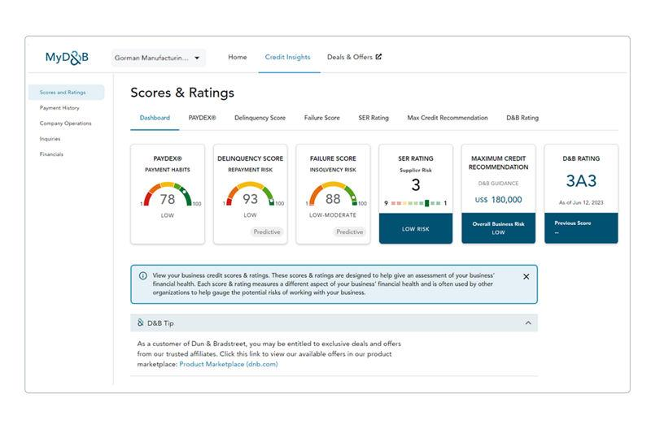

## Table of Contents

## What is Dun & Bradstreet and what services do they provide?

Dun & Bradstreet is a company that helps other businesses learn about their customers and partners. They collect information about companies all over the world and use it to create reports and scores that show how reliable and trustworthy a business is. This can help companies decide if they want to work with or sell to another business.

They offer many services to help businesses. One main service is giving companies a special number called a D-U-N-S Number, which is like a unique ID for a business. This number helps businesses keep track of their customers and partners. Dun & Bradstreet also provides credit reports and scores, which tell a business if another company is likely to pay its bills on time. They also offer data and analytics services, which help businesses understand market trends and make better decisions.

## How does Dun & Bradstreet gather and manage its data?

Dun & Bradstreet gathers its data from many different places. They collect information from public records, like business registrations and court documents. They also get data from businesses themselves, who might share details when they apply for a D-U-N-S Number or a credit report. Additionally, Dun & Bradstreet works with other companies and data providers to get more information. This way, they can build a big picture of a business's activities and financial health.

Once they have the data, Dun & Bradstreet organizes and checks it carefully. They use special computer programs to sort and clean the data, making sure it is accurate and up-to-date. They also have people who review the data to fix any mistakes. This helps them create reliable reports and scores that businesses can trust. By managing their data well, Dun & Bradstreet can provide useful information to their customers.

## What is the history of Dun & Bradstreet and how has it evolved?

Dun & Bradstreet started a long time ago in 1841. It was founded by Lewis Tappan, who wanted to help businesses know if other businesses were good to work with. At first, they made [books](/wiki/algo-trading-books) that told about the credit of different companies. These books were called "The Mercantile Agency." Over the years, they grew bigger and started to collect more information from all over the world. In 1933, they started giving out a special number called the D-U-N-S Number, which helps businesses keep track of other businesses.

As time went on, Dun & Bradstreet changed a lot. They started using computers to store and manage their data, which made it easier to keep everything up-to-date. They also started offering more services, like credit reports and scores, to help businesses make better decisions. In the 1990s, they split into two companies but came back together in 2018. Today, Dun & Bradstreet uses new technology like big data and [artificial intelligence](/wiki/ai-artificial-intelligence) to give businesses even more useful information. They help companies all over the world understand their customers and partners better.

## Who are the main competitors of Dun & Bradstreet?

Dun & Bradstreet has a few main competitors that also help businesses learn about other companies. One big competitor is Experian, which is known for credit reports and scores. Experian helps businesses check if other companies are good to work with by giving them information about their credit and financial health. Another competitor is Equifax, which also provides credit reports and data about businesses. Equifax helps companies make smart choices about who to work with by giving them detailed information about other businesses.

Another important competitor is Moody's, which is well-known for its credit ratings and analysis. Moody's helps businesses understand the financial risks of working with other companies. They give ratings that show how likely a business is to pay back its debts. Lastly, there is S&P Global, which also offers credit ratings and market intelligence. S&P Global helps businesses make informed decisions by providing them with data and analysis about the financial health and market trends of other companies.

## How does Dun & Bradstreet generate revenue and what are its main sources of income?

Dun & Bradstreet makes money by selling its data and services to other businesses. They offer things like credit reports, scores, and data analytics that help companies make smart decisions about who to work with or sell to. When a business wants to know more about another company, they can buy a report from Dun & Bradstreet. This helps them understand if the other company is reliable and likely to pay its bills on time. Companies also pay to get a D-U-N-S Number, which is like a special ID for their business, and this is another way Dun & Bradstreet earns money.

Another big way Dun & Bradstreet generates revenue is through subscriptions and licenses. Businesses can subscribe to get regular updates and access to Dun & Bradstreet's data. This means they can keep track of changes in other companies over time. They also offer licenses to their data and analytics tools, which let companies use this information in their own systems. By selling these subscriptions and licenses, Dun & Bradstreet earns a steady stream of income. Overall, their main sources of income come from selling reports, D-U-N-S Numbers, subscriptions, and licenses.

## What are the different funding rounds that Dun & Bradstreet has gone through?

Dun & Bradstreet has gone through different funding rounds to help grow their business. In 2018, they got a big investment from a group of investors led by a company called CC Capital. This investment helped Dun & Bradstreet go back to being a public company, which means they could sell shares to the public. This was a big step for them because it helped them raise a lot of money to keep improving their services and growing their business.

After becoming a public company again, Dun & Bradstreet continued to raise money through the stock market. They did this by selling more shares to investors who believed in their business. This helped them keep up with new technology and expand their services to more countries. By getting funding in these different ways, Dun & Bradstreet was able to stay strong and keep helping businesses all over the world.

## How does Dun & Bradstreet assess and assign credit ratings to businesses?

Dun & Bradstreet looks at many things to decide a business's credit rating. They check how much money the business makes, how much it owes, and if it pays its bills on time. They also look at public records, like court documents, to see if the business has any legal problems. All this information helps them understand if a business is good at managing its money and likely to pay back what it owes.

Once they have all the information, Dun & Bradstreet uses special math formulas to give the business a credit score. This score shows how risky it is to lend money to the business. A high score means the business is very likely to pay back its debts, so it's less risky. A low score means the business might have trouble paying back what it owes, so it's more risky. This credit score helps other businesses decide if they want to work with or lend money to the company.

## What are some of the major acquisitions made by Dun & Bradstreet and how have they impacted its operations?

Dun & Bradstreet has made several important acquisitions over the years, which have helped them grow and offer more services. One big acquisition was in 2019 when they bought Lattice Engines, a company that uses artificial intelligence to help businesses find new customers. This acquisition helped Dun & Bradstreet use new technology to make their data and services even better. Another important acquisition was in 2020 when they bought Bisnode, a company that provides business information in Europe. This helped Dun & Bradstreet expand their services to more countries and get more information about businesses in Europe.

These acquisitions have had a big impact on Dun & Bradstreet's operations. By buying Lattice Engines, they were able to use AI to give businesses more useful information about their customers and partners. This made their reports and scores more accurate and helpful. The acquisition of Bisnode helped them reach more customers in Europe and offer services in more languages. This made Dun & Bradstreet a stronger company that can help businesses all over the world make better decisions.

## How does Dun & Bradstreet use technology and analytics in its operations?

Dun & Bradstreet uses technology and analytics to make their data more useful and accurate. They use special computer programs to collect, sort, and clean the data they get from different places. This helps them make sure the information they have is correct and up-to-date. They also use artificial intelligence, which is like smart computer thinking, to find patterns and trends in the data. This helps them predict how businesses will do in the future and make better reports and scores.

By using technology and analytics, Dun & Bradstreet can offer more helpful services to businesses. For example, they use AI to help companies find new customers by looking at data to see who might be interested in their products. They also use analytics to create detailed reports and scores that show how reliable a business is. This helps other businesses decide if they want to work with or lend money to a company. Overall, technology and analytics help Dun & Bradstreet give businesses the information they need to make smart decisions.

## What are the global operations of Dun & Bradstreet and in which countries do they have a presence?

Dun & Bradstreet has a big presence all over the world. They help businesses in many countries learn about other companies. They have offices and teams in places like the United States, the United Kingdom, Canada, and Australia. They also work in many countries in Europe, like Germany, France, and Italy. In Asia, they are active in countries such as China, Japan, and India. They even have operations in Latin America, with teams in Brazil and Mexico.

By being in so many countries, Dun & Bradstreet can collect information from all over the world. This helps them give businesses a complete picture of other companies, no matter where they are. They use this global data to make reports and scores that are useful for businesses everywhere. This way, a company in one country can learn about a business in another country and make smart decisions about working together.

## What are the key financial performance indicators for Dun & Bradstreet over the past decade?

Over the past decade, Dun & Bradstreet has shown steady growth in its revenue. From 2013 to 2023, their total revenue increased from about $1.7 billion to around $2.2 billion. This growth came from selling more reports, D-U-N-S Numbers, and subscriptions to their data services. They also made money from their acquisitions, like Lattice Engines and Bisnode, which helped them reach more customers and offer new services. However, their operating income has had ups and downs. In some years, like 2018, they had higher operating costs because of their investments in technology and global expansion. But overall, their operating income has been positive, showing that they are making money after paying for their business expenses.

Dun & Bradstreet's net income has also varied over the decade. In 2013, their net income was about $250 million, but it dropped in some years due to costs from acquisitions and other investments. By 2023, their net income was around $300 million, showing that they were able to recover and grow. Their earnings per share (EPS) followed a similar pattern, starting at around $1.50 in 2013 and reaching about $1.80 in 2023. This shows that the company has been able to generate more profit for its shareholders over time. Overall, Dun & Bradstreet's financial performance over the past decade reflects a company that is growing and adapting to changes in the market.

## What are the future strategic plans of Dun & Bradstreet and how do they plan to expand their market reach?

Dun & Bradstreet wants to grow and help more businesses around the world. They plan to do this by using new technology like artificial intelligence and big data. This will help them give businesses even better information about other companies. They also want to offer more services that help companies find new customers and understand market trends. By doing this, they hope to make more money and reach more businesses in different countries.

To expand their market reach, Dun & Bradstreet is looking to grow in places like Asia and Latin America. They already have teams in countries like China, India, Brazil, and Mexico, but they want to do even more there. They also plan to keep buying other companies that can help them offer new services and reach more customers. By working hard on these plans, Dun & Bradstreet hopes to become an even bigger and more helpful company for businesses everywhere.

## References & Further Reading

[1]: Bergstra, J., Bardenet, R., Bengio, Y., & Kégl, B. (2011). ["Algorithms for Hyper-Parameter Optimization."](https://dl.acm.org/doi/10.5555/2986459.2986743) Advances in Neural Information Processing Systems 24.

[2]: ["Advances in Financial Machine Learning"](https://www.amazon.com/Advances-Financial-Machine-Learning-Marcos/dp/1119482089) by Marcos Lopez de Prado

[3]: ["Evidence-Based Technical Analysis: Applying the Scientific Method and Statistical Inference to Trading Signals"](https://www.amazon.com/Evidence-Based-Technical-Analysis-Scientific-Statistical/dp/0470008741) by David Aronson

[4]: ["Machine Learning for Algorithmic Trading"](https://github.com/stefan-jansen/machine-learning-for-trading) by Stefan Jansen

[5]: ["Quantitative Trading: How to Build Your Own Algorithmic Trading Business"](https://www.amazon.com/Quantitative-Trading-Build-Algorithmic-Business/dp/1119800064) by Ernest P. Chan