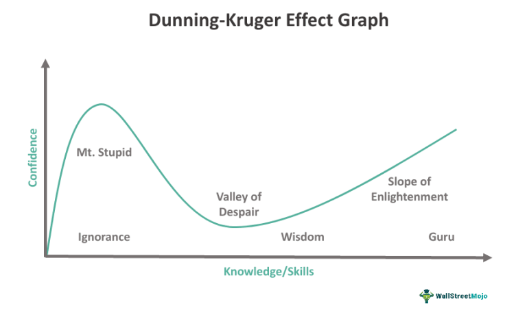

Finance psychology explores how psychological influences affect financial decision-making. It integrates concepts from behavioral economics and cognitive psychology to understand why individuals make certain financial choices. Cognitive biases, systematic patterns of deviation from norm or rationality in judgment, play a crucial role in these decisions. One specific cognitive bias is the Dunning-Kruger Effect, which highlights a cognitive distortion where individuals with limited knowledge in a domain tend to overestimate their competence. Conversely, experts may underestimate their abilities due to their awareness of the vastness of their field.

In finance and trading, the Dunning-Kruger Effect can lead to significant implications. Novice traders, overconfident in their limited understanding, might engage in risky trading strategies without fully grasping the potential consequences. This overconfidence can result in financial losses that could have been avoided with a more realistic self-assessment. The effect does not only concern novices; experts too may fall victim when they doubt their capabilities, potentially missing profitable opportunities due to an overly cautious approach.



Algorithmic trading introduces an alternative to human biases in financial markets. Using computer algorithms, it automates trading decisions based on predefined criteria, thereby minimizing emotional and cognitive biases. Algorithms process vast amounts of data swiftly and execute trades with precision, potentially outperforming human traders who are susceptible to biases like the Dunning-Kruger Effect.

These topics of finance psychology, cognitive biases, and algorithmic trading interrelate deeply. While human traders can improve awareness of biases through education and experience, algorithmic trading offers a technological solution to mitigate them. Combining psychological insights with sophisticated trading algorithms presents an opportunity to understand and potentially counterbalance the cognitive distortions that influence financial markets.

## Table of Contents

## Understanding the Dunning-Kruger Effect

The Dunning-Kruger Effect is a psychological phenomenon wherein individuals with limited knowledge or competence in a given domain overestimate their own abilities. This cognitive bias was identified in a study conducted by David Dunning and Justin Kruger, published in 1999. The researchers based their findings on investigations that explored the relationship between self-perception of skill and actual competence, revealing that those with less knowledge are often unaware of their own deficiencies, leading them to rate their abilities as higher than warranted.

The effect manifests prominently in individuals whose lack of expertise blinds them to their incompetency. This disconnect between perceived and actual ability can afflict a range of skills and disciplines, from academia to finance. For novices, the Dunning-Kruger Effect can result in overconfidence, leading to errors in judgment and decision-making. These individuals are often unaware of how much they do not know, which prevents them from seeking further learning or validation from external sources. On the other hand, experts might underestimate their abilities because they have a greater awareness of the complexity and breadth of the field, causing them to evaluate their skills less favorably in comparison.

In finance, this bias can manifest in novice traders who believe they can outperform the market without a comprehensive understanding of market dynamics or risk management. This overconfidence can result in significant financial losses, as inexperienced investors may take on excessive risk without appreciating the potential for downside. Conversely, seasoned financial analysts may undervalue their insights due to awareness of the limits of their knowledge and the uncertainty inherent in markets.

Beyond finance, the Dunning-Kruger Effect is observable in various sectors. For example, in the medical field, individuals with rudimentary understanding of health information might misjudge their ability to diagnose or treat illnesses, potentially leading to dangerous self-treatment practices.

Overall, awareness of the Dunning-Kruger Effect can facilitate more accurate self-assessment and encourage individuals to seek feedback and further education. The implications of this cognitive bias underscore the importance of humility and continuous learning, recognizing that overconfidence without sufficient basis can lead to misguided actions and decisions across various domains.

## Cognitive Biases in Financial Decision-Making

Cognitive biases are systematic patterns of deviation from norm or rationality in judgment, and they significantly influence financial decision-making. These biases can lead investors to make decisions that are not aligned with their financial goals and can result in suboptimal investment outcomes.

Beyond the Dunning-Kruger Effect, which highlights the tendency of individuals with lower ability to overestimate their competence, several other cognitive biases affect financial decisions. One common bias is **confirmation bias**, where investors seek out information that confirms their pre-existing beliefs while ignoring contradictory evidence. This can lead to a reinforcement of misconceptions and result in poor investment choices.

Another influential cognitive bias is **loss aversion**, a concept introduced by Daniel Kahneman and Amos Tversky. Loss aversion describes the tendency for individuals to prefer avoiding losses rather than acquiring equivalent gains. This bias can cause investors to hold on to losing assets for too long, hoping to avoid the realization of a loss, or to sell winning assets too early to lock in gains.

**Overconfidence** is another prevalent cognitive bias that affects financial decision-making. Overconfident investors might overestimate their knowledge or predictive power about the market, leading them to take on excessive risk. This can contribute to increased trading frequency, higher transaction costs, and ultimately lower returns.

Psychological factors also play a crucial role in shaping investment strategies. Emotions such as fear and greed can amplify cognitive biases, leading to decisions that deviate from a rational investment strategy. For instance, during market [volatility](/wiki/volatility-trading-strategies), fear may drive investors to sell assets impulsively, while greed can lead individuals to chase rising stocks without due diligence.

To mitigate these biases, self-awareness is essential. Investors who recognize their cognitive biases are better positioned to implement strategies that counteract irrational decision-making. This can include setting predetermined criteria for buying or selling assets, remaining disciplined to long-term goals, and seeking diverse perspectives to challenge personal assumptions.

Moreover, structured decision-making processes and rules can reduce the impact of cognitive biases. For example, employing checklists for investment decisions or adopting a systematic rebalancing strategy can help investors adhere to their financial plans without falling prey to emotional distractions. Continuous education and feedback mechanisms are also vital in cultivating a mindset that is resilient to cognitive biases and enhancing one's ability to make informed financial decisions.

## Impact of the Dunning-Kruger Effect on Trading

The Dunning-Kruger Effect, a cognitive bias where individuals with limited knowledge or competence overestimate their own abilities, can lead to significant challenges in trading and investment. This phenomenon often results in poor investment outcomes, primarily due to overconfidence and inadequate assessment of trading risks.

Case studies abound with examples illustrating the troublesome impact of this effect. Consider a novice investor entering the stock market with minimal knowledge but excessive confidence. Such an investor may engage in high-risk trades, wrongly assuming that quick successes in a bull market demonstrate their trading prowess. When the market shifts, these investors often face substantial losses as their lack of understanding of market dynamics becomes apparent. This scenario is not uncommon during periods of economic growth, when bullish markets can give inexperienced traders the misguided belief that they have mastered the craft, only for the bubble to burst unexpectedly (e.g., the Dot-com bubble of the late 1990s).

Risk-taking behaviors and trading performance are especially vulnerable to the Dunning-Kruger Effect. Overconfident traders often allocate excessive capital to speculative stocks or leverage without understanding the inherent risks. This can lead to increased portfolio volatility and potential drawdowns that far exceed their risk tolerance. The volatility ($\sigma^2$) of a portfolio is a critical metric, and overconfidence can lead to substantially misestimated volatility, wrongly influencing a trader's assessment of risk:

$$
\sigma^2 = \sum_{i=1}^{n} \sum_{j=1}^{n} w_i w_j \sigma_{ij}
$$

Where $w_i$ and $w_j$ are the weights of assets in the portfolio, and $\sigma_{ij}$ represents the covariance between the returns of two assets.

Moreover, overconfidence doesn't only affect individual traders but can also lead to broader market fluctuations. Traders overestimating their ability to predict market movements contribute to excessive buying or selling pressure. This can exacerbate trends, leading to bubble formations or underscores in asset prices when collective trader sentiments misalign with actual economic indicators. For example, overconfident traders might ignore warning signs ahead of economic downturns, maintaining long positions based on supposed insights contrary to expert consensus.

Mitigating the Dunning-Kruger Effect requires fostering self-awareness and a realistic appraisal of one's abilities. This includes acknowledging the importance of expertise and seeking continuous education in trading and market analysis. Leveraging data-driven insights and simulations can help traders evaluate their strategies objectively, reducing the influence of overconfidence. Ultimately, recognizing and compensating for the Dunning-Kruger Effect is crucial in improving trading success and maintaining stability within financial markets.

## Algorithmic Trading: Mitigating Human Bias

Algorithmic trading refers to the use of computer algorithms to automate trading strategies, typically with the goal of executing orders at the optimal price and time. This approach leverages computational power to analyze vast datasets and execute trades at speeds and frequencies that are impossible for human traders. The role of [algorithmic trading](/wiki/algorithmic-trading) in financial markets has expanded significantly, accounting for a substantial proportion of trading [volume](/wiki/volume-trading-strategy) in various asset classes.

One of the primary advantages of algorithmic trading is its ability to mitigate the impact of human biases. Cognitive biases, such as overconfidence and emotional decision-making, can lead to irrational trading behaviors. By adhering strictly to predefined rules and criteria, algorithms eliminate emotional factors from the trading process. This can lead to more rational, consistent decision-making, improving trading outcomes.

The removal of emotion from trading offers several benefits. Algorithms can efficiently process vast amounts of information to identify trading opportunities based on historical data patterns and quantitative models. This enables traders to exploit market inefficiencies and achieve better execution prices. Moreover, algorithmic trading reduces the influence of short-term market sentiments and reactions, aligning trades more closely with strategic objectives.

However, there are limitations to removing human emotions from trading. Algorithms rely on historical data and assumptions embedded in their design, meaning they may not always adapt quickly to unforeseen market conditions or black swan events. Additionally, algorithms can be susceptible to technical failures and errors, which may result in significant financial losses. Furthermore, the increased reliance on algorithmic trading can lead to decreased human oversight, potentially exacerbating systemic risks in times of market volatility.

Algorithms play a crucial role in consistently applying trading strategies. They execute trades based on established parameters such as timing, price, or volume, ensuring adherence to an overall investment strategy. For instance, a simple algorithm might be designed to buy a stock when its 50-day moving average crosses above its 200-day moving average, commonly known as the "Golden Cross" strategy. Python code for such a strategy using the `pandas` library might look as follows:

```python
import pandas as pd

# Assume 'data' is a pandas DataFrame containing historical stock prices with a 'Close' column
data['50_MA'] = data['Close'].rolling(window=50).mean()
data['200_MA'] = data['Close'].rolling(window=200).mean()

# Generate buy/sell signals
data['Signal'] = 0
data.loc[data['50_MA'] > data['200_MA'], 'Signal'] = 1  # Buy signal
data.loc[data['50_MA'] <= data['200_MA'], 'Signal'] = -1  # Sell signal
```

In summary, algorithmic trading serves as a powerful tool for reducing human biases in financial markets. While it offers benefits such as improved efficiency and consistency, traders must also be aware of the limitations and potential risks involved. Continuing development and analysis of algorithmic strategies will be essential in navigating the complexities of modern financial markets.

## Strategies to Avoid the Dunning-Kruger Effect in Finance

Mitigating the Dunning-Kruger Effect in finance, particularly in trading, requires adopting strategies that address the overconfidence often exhibited by novices who lack awareness of their limitations. Implementing these strategies is crucial for sound financial decision-making and improved trading outcomes.

### Continuous Learning and Feedback
Continuous learning is essential for maintaining an accurate self-assessment of one's skills and knowledge. Engaging with up-to-date educational resources, such as financial journals, online courses, and webinars, can help traders expand their understanding of market dynamics and trading strategies. Additionally, establishing a routine for receiving feedback is vital. Participating in trading groups or forums enables individuals to share insights and critiques, providing a broader perspective on their trading decisions. Employing performance metrics and analytics tools to regularly assess trading outcomes can also provide critical feedback, highlighting areas for improvement.

### Professional Development and Mentorship
Professional development programs and mentorship opportunities are instrumental in refining traders' skills and enhancing their market knowledge. Mentors, who are typically experienced professionals, can offer personalized guidance, helping mentees navigate complex market scenarios and recognize their cognitive biases. Moreover, attending industry conferences and seminars fosters networking with seasoned professionals, further aiding personal growth and knowledge acquisition. Structured mentorship also supports traders in setting realistic goals and developing disciplined trading habits, reducing the risks associated with overconfidence.

### Data-Driven Insights and Simulations
Leveraging data-driven insights is a powerful way to counteract the Dunning-Kruger Effect. Data analytics tools can process vast amounts of market data, enabling traders to make informed decisions based on empirical evidence rather than gut feelings. Implementing [backtesting](/wiki/backtesting) strategies, where trading algorithms are tested on historical data, allows traders to evaluate the viability of their strategies without financial risk. Simulation environments provide realistic market scenarios for traders to hone their skills and test strategies in a risk-free setting. By examining the outcomes of these simulations, traders can develop a deeper understanding of market behavior and improve their decision-making processes.

In conclusion, avoiding the pitfalls of the Dunning-Kruger Effect in finance necessitates a commitment to continuous learning, professional growth, and the application of data-driven methodologies. These strategies collectively enhance self-awareness and foster informed trading practices, ultimately leading to more successful financial outcomes.

## Conclusion

Finance psychology and cognitive biases significantly influence decision-making processes within financial markets. Cognitive biases, deeply rooted in human psychology, often lead individuals to make irrational financial choices that deviate from logical predictions. One particularly impactful cognitive bias is the Dunning-Kruger Effect. This cognitive bias affects individuals' self-assessment accuracy, resulting in overconfidence, especially among those with limited knowledge or expertise. As novice traders overestimate their capabilities, they may make hazardous financial decisions, leading to suboptimal investment performance or financial losses.

Algorithmic trading has emerged as a powerful tool to combat cognitive biases, including the Dunning-Kruger Effect. By employing sophisticated algorithms, trading strategies can be systematized, minimizing emotional and psychological interference. These algorithms execute trades based on pre-defined rules and data-driven insights, which can lead to more consistent and rational trading outcomes. While algorithmic trading streamlines decision-making, it's essential to acknowledge that the complete eradication of biases isn't guaranteed, as algorithms are still designed based on human input and assumptions.

Informed trading and self-awareness are crucial for market participants aiming to mitigate the influence of biases. Continuous learning and mentorship can provide invaluable feedback, fostering an environment where traders can develop more realistic self-assessments. By remaining vigilant and open to growth, traders can better recognize their limitations and strengths, potentially improving their decision-making processes.

Ultimately, understanding finance psychology and cognitive biases underscores the importance of integrating both technological solutions and personal development strategies. The Dunning-Kruger Effect serves as a reminder that self-awareness and objective evaluation are vital for effective financial decision-making. Leveraging algorithmic trading, complemented by a commitment to personal growth, offers a pathway towards more rational and successful engagement in financial markets.

## References & Further Reading

[1]: Kruger, J., & Dunning, D. (1999). ["Unskilled and Unaware of It: How Difficulties in Recognizing One's Own Incompetence Lead to Inflated Self-Assessments."](https://www.researchgate.net/publication/12688660_Unskilled_and_Unaware_of_It_How_Difficulties_in_Recognizing_One's_Own_Incompetence_Lead_to_Inflated_Self-Assessments) Journal of Personality and Social Psychology, 77(6), 1121-1134.

[2]: Kahneman, D., & Tversky, A. (1979). ["Prospect Theory: An Analysis of Decision under Risk."](http://web.mit.edu/curhan/www/docs/Articles/15341_Readings/Behavioral_Decision_Theory/Kahneman_Tversky_1979_Prospect_theory.pdf) Econometrica, 47(2), 263-291.

[3]: Barber, B. M., & Odean, T. (2001). ["Boys Will Be Boys: Gender, Overconfidence, and Common Stock Investment."](https://academic.oup.com/qje/article-abstract/116/1/261/1939000) The Quarterly Journal of Economics, 116(1), 261-292. 

[4]: Thaler, R. H. (2005). ["Advances in Behavioral Finance, Volume II."](https://www.degruyter.com/document/doi/10.1515/9781400829125/html) Princeton University Press.

[5]: J. H. Cochrane. (1999). ["New Facts in Finance."](https://www.nber.org/papers/w7169) Economic Perspectives, Vol. 23, No. 3, pp. 36-58.

[6]: Pardo, R. (2008). ["The Evaluation and Optimization of Trading Strategies."](https://onlinelibrary.wiley.com/doi/book/10.1002/9781119196969) Wiley Trading.