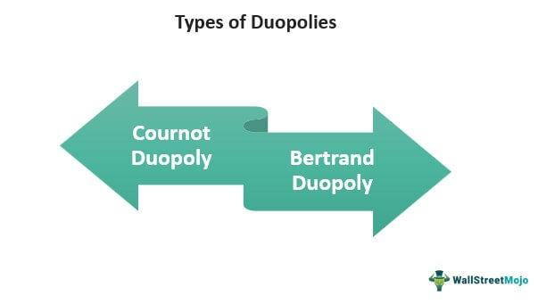

Market structures in economics are foundational to understanding how businesses operate and compete within an economy. Among these, the duopoly is a significant structure characterized by the presence of two dominant firms controlling a substantial portion of the market. This contrasts with other structures such as monopoly, where a single entity dominates, or perfect competition, where numerous small firms vie for market share. In a duopoly, firms are interdependent, with each firm's decisions directly impacting the other, leading to unique competitive dynamics. Prominent examples of duopolies include Visa and Mastercard, which dominate the payment processing industry. The competitive interplay between these two can lead to benefits such as innovation and competitive pricing, enhancing consumer options.

Algorithmic trading represents a transformation in modern financial markets. It involves using computer algorithms to automate trading, making transactions at speeds and volumes far beyond human capability. The significance of algorithmic trading lies in its ability to enhance market efficiency by facilitating faster execution of trades, thus narrowing bid-ask spreads and improving liquidity. However, it also introduces risks such as heightened market volatility, as demonstrated by instances of flash crashes.

The purpose of this article is to explore the interaction between duopoly market dynamics and algorithmic trading. Specifically, it seeks to address how characteristics inherent to duopolies can influence the strategies and performance of algorithmic traders, and conversely, how algorithmic trading can impact the competitive balance within duopolistic markets. Key questions include: How do the interdependent nature and competitive strategies of duopolies affect algorithmic trading approaches? Conversely, how does the presence of algorithmic trading shape the competitive landscape and market outcomes in duopolies?

Understanding these interactions is crucial for market participants, policymakers, and economists, as they navigate the challenges and opportunities presented by the convergence of traditional market structures with modern trading technologies.

## Table of Contents

## Understanding Duopoly Market Competition

A duopoly is a specific type of market structure characterized by the dominance of two firms that share the majority of the market. In such markets, each firm's decisions affect the other, leading to a strategic interdependence that is less prevalent in monopolies or perfectly competitive markets. The essential characteristics of a duopoly include limited competition, potential for collusion, and significant barriers to entry for other firms.

Unlike monopolies, where a single firm has absolute market control and can set prices without concern for competitors, a duopoly presents a more competitive landscape. In a monopoly, the only constraint on pricing is consumer demand, whereas a duopoly incurs competitive pressures as firms aim to capture or defend their market share. This competition often spurs innovation as businesses seek unique selling propositions to differentiate themselves from their sole competitor.

Notable examples of duopolies include Visa and Mastercard in the global payment processing industry. These two companies command the vast majority of market share, driving competitive dynamics focused on transaction speeds, security measures, and partnership integrations. The competitive behaviors of these entities catalyze constant innovation, ensuring they remain at the forefront of payment technology. Through initiatives such as contactless payments, digital wallets, and robust fraud prevention mechanisms, they enhance the consumer experience.

Duopolies offer potential benefits for both businesses and consumers. For businesses, the presence of a single competitor allows firms to predict market reactions with more precision than in markets with many competitors. This predictability aids in strategic planning and can result in more stable profit margins. Consumers benefit from competitive pricing and innovation, as each firm seeks to attract and retain customers by offering better services and products. 

In summary, a duopoly combines the competitive elements found in more diversified markets with the concentrated power seen in monopolies, creating a unique environment where limited competition drives efficiency and innovation to an extent beneficial to both businesses and consumers.

## Algorithmic Trading: An Economic Game Changer

Algorithmic trading represents a transformative force in financial markets, utilizing advanced mathematical models and computer programs to execute trades at speeds far beyond human capacity. This method leverages pre-defined instructions to make trading decisions, optimizing the process of buying and selling financial instruments with unmatched speed and precision.

One of the primary benefits of [algorithmic trading](/wiki/algorithmic-trading) is its ability to perform rapid transactions, enhancing market [liquidity](/wiki/liquidity-risk-premium) and efficiency. The speed at which algorithmic trading operates allows it to capitalize on even the smallest price discrepancies that arise for short periods. For instance, the time taken to execute transactions can be reduced to mere milliseconds, enabling traders to process large volumes of trades with high accuracy, something unfeasible for manual traders. This rapid execution contributes to more competitive pricing and improved spreads, benefiting investors.

Despite these advantages, low-latency algorithmic trading introduces certain challenges and risks, particularly concerning market [volatility](/wiki/volatility-trading-strategies). The high speed and [volume](/wiki/volume-trading-strategy) of trades can exacerbate market fluctuations, sometimes leading to instability. An example of this is the "flash crash" phenomenon, where abrupt, significant price drops occur within minutes, triggered by automated trading strategies possibly reacting to market signals in a feedback loop. This scenario underscores the risks of liquidity evaporation and the introduction of systemic risk, prompting concerns about market stability.

Algorithmic trading significantly shapes market outcomes by fostering an environment where price discovery becomes more efficient. By continuously analyzing market data and executing trades based on predictive models, algorithmic strategies can influence market trends and prices through large-volume trades. These trades, often conducted in response to complex algorithms analyzing microsecond market shifts, contribute to defining equilibrium prices and facilitating seamless market operations.

Furthermore, algorithmic trading can lead to the development of various trading strategies such as [trend following](/wiki/trend-following), [arbitrage](/wiki/arbitrage), and market-making. Each of these strategies uses the capability of algorithmic systems to detect and exploit market patterns quickly. For example, market-making algorithms provide liquidity by quoting prices for buy and sell orders, thereby stabilizing markets by narrowing the bid-ask spread.

In summary, algorithmic trading is pivotal in revolutionizing financial markets by enhancing speed, efficiency, and market liquidity. However, it also necessitates careful monitoring and potential regulatory measures to mitigate associated risks such as market volatility and systemic disruption. As technology and market dynamics evolve, understanding the impact of algorithmic trading on financial markets remains essential for stakeholders across the economic spectrum.

## Duopoly Market Dynamics and Algorithmic Trading

Duopolies can significantly influence the performance and strategies of algorithmic traders. In a duopoly, two dominant firms control the majority of the market share, resulting in unique competitive dynamics that can directly impact algorithmic trading activities.

Algorithmic traders operating within a duopoly must consider the potential for collusion or strategic pricing tactics. In markets where two firms dominate, there may be less incentive to undercut prices significantly, as both parties benefit from maintaining a price equilibrium. Algorithmic strategies can be designed to detect and respond to potential collusive behavior. For example, traders can use algorithms to analyze pricing patterns and detect deviations that might signal tacit collusion, thereby enabling them to adjust their strategies accordingly.

Duopolistic markets such as the credit card industry, dominated by Visa and Mastercard, provide empirical examples of significant algorithmic trading activity. These companies use sophisticated algorithms to handle vast volumes of transactions, optimize pricing, and maintain competitive advantages. The competitive dynamics inherent in a duopoly can lead to innovative algorithmic strategies aimed at gaining a competitive edge, whether by improving transaction processing speeds or optimizing customer acquisition techniques.

Algorithmic trading plays a crucial role in maintaining equilibrium in oligopolistic markets, which include duopolies. By rapidly processing large volumes of market data and executing trades at high speeds, algorithms contribute to efficient price discovery and liquidity provision. This efficiency helps stabilize the market, preventing extreme price volatility that could disrupt the equilibrium. Furthermore, algorithmic strategies can be designed to exploit small inefficiencies in duopolistic markets, thus promoting competitive pricing and preventing monopolistic behavior.

In summary, duopolies present a distinct set of challenges and opportunities for algorithmic traders. These traders must adeptly navigate the competitive nuances and potential for collusion in duopolistic markets, leveraging sophisticated algorithms to maintain market equilibrium and capitalize on emerging opportunities.

## Challenges and Implications of Algorithmic Trading in Duopolies

Algorithmic trading in duopoly markets introduces several challenges and implications that demand careful consideration. 

One significant issue is the occurrence of "speed traps" within these markets. Speed traps arise when algorithmic traders leverage ultra-fast technology to gain milliseconds of advantage over competitors. In duopoly settings, where typically two dominant firms control the market, speed traps can result in unfair advantages, exacerbating the competitive imbalance. This is particularly problematic as firms may engage in an arms race to invest in faster technology rather than focusing on product or service improvements.

Ethical concerns are another significant challenge. Algorithmic trading can lead to scenarios where a few entities gain disproportionate market power, potentially engaging in practices that may not align with fair market principles. For instance, the ability to influence prices through rapid trading could lead to non-competitive practices reminiscent of tacit collusion, where firms indirectly coordinate actions without explicit communication. Such behaviors necessitate regulatory attention to ensure markets remain competitive and fair for all participants.

Regulatory challenges are inherent in monitoring and managing these high-frequency trading activities. The fast-paced nature of algorithmic operations makes real-time scrutiny difficult. Regulators must balance fostering innovation with the need to ensure markets do not become overly concentrated, which could stifle competition. Moreover, enforcing transparency in algorithmic strategies is essential to prevent manipulative practices that could harm market stability and consumer interests.

The impact on consumer choices and pricing is another critical concern. In a duopoly, pricing power is already concentrated. The introduction of sophisticated trading algorithms may exacerbate price-setting abilities that do not reflect the underlying market demand or cost structure. This could potentially limit consumer choice or lead to price manipulation, as algorithms might prioritize strategic pricing over genuine competitive practices.

Historically, algorithmic trading has been associated with instances of market disruptions, such as flash crashes. These events are sudden and drastic declines in market prices, typically triggered by high-frequency trading algorithms reacting to market signals in unforeseen ways. Unregulated fast trading can lead to significant volatility due to the sheer speed and volume of transactions executed by algorithms, which traditional market mechanisms may not handle effectively.

Addressing these challenges involves a nuanced approach that combines technological oversight, ethical considerations, and robust regulatory frameworks. Ensuring that algorithmic trading contributes positively to duopoly markets requires ongoing dialogue between tech developers, market participants, and regulators to safeguard competitive fairness and consumer welfare.

## Future Trends

Duopolistic markets have long been characterized by strategic interdependency between two dominant firms. As algorithmic trading becomes more prevalent, these market structures may undergo significant transformations. The integration of advanced algorithms and [artificial intelligence](/wiki/ai-artificial-intelligence) (AI) technologies is poised to redefine the dynamics of duopolistic markets.

Technological advancements, particularly in AI, are expected to enhance the capability of firms to process and analyze vast datasets rapidly. This development could enable more sophisticated predictive models and trading strategies, improving decision-making processes and potentially altering competitive behaviors within duopolies. For instance, AI can facilitate dynamic pricing mechanisms, where algorithms adjust prices in real-time based on competitor actions and market conditions, enhancing responsiveness and competitiveness.

The increasing reliance on algorithmic trading in duopolies raises the necessity for new regulatory frameworks. Issues such as market manipulation, collusion risks, and unfair trading advantages prompt the need for oversight to ensure competitive fairness and protect consumer interests. Regulatory bodies might introduce measures that enhance transparency and accountability, such as mandating algorithmic audits and stress tests or enforcing limitations on high-frequency trading activities to prevent destabilizing price fluctuations.

Moreover, the unique market conditions presented by duopolies create opportunities for innovation in algorithmic trading. Firms could develop specialized algorithms that account for the specific competitive nuances of operating within a duopoly. These algorithms might incorporate game theory elements to anticipate competitor moves and optimize strategy execution. Additionally, [machine learning](/wiki/machine-learning) techniques could be leveraged to continuously refine trading strategies based on evolving market dynamics.

As technology continues to evolve, the interplay between duopolistic market structures and algorithmic trading will be an area of active development and interest. Stakeholders must balance embracing technological innovations with implementing appropriate regulatory measures to sustain competitive and equitable market environments.

## Conclusion

In examining the intricate relationship between duopoly markets and algorithmic trading, several key findings emerge that highlight the significance of this interaction. Duopolies, characterized by two dominant firms, create a unique competitive landscape that can heavily influence the strategies employed by algorithmic traders. These firms may leverage algorithms to optimize pricing, manage risk, and enhance market positioning, directly impacting market dynamics.

Algorithmic trading, known for its speed and efficiency, can significantly alter market outcomes by introducing high-frequency trading and complex strategies. In duopolistic settings, where two firms possess substantial market control, algorithmic trading can amplify competitive pressures or inadvertently facilitate tacit collusion through synchronized trading strategies. Understanding these dynamics is crucial for market stakeholders as it affects market stability and consumer pricing.

Given these findings, it is imperative for stakeholders to strike a balance between leveraging technological advancements in trading and implementing effective market regulations. While algorithmic trading offers numerous benefits, such as increased market liquidity and reduced transaction costs, it also poses potential risks, including market manipulation and volatility. Regulatory frameworks must evolve to address these challenges and ensure that the benefits of technological progress do not come at the expense of fair market competition.

In conclusion, the interaction between duopolies and algorithmic trading presents both opportunities and challenges. By recognizing the influence each has on the other, market participants can better navigate this dynamic landscape. Policymakers, in turn, must work to foster an environment that encourages competitive fairness while safeguarding consumer interests. This balance will be critical as advancements in artificial intelligence and machine learning continue to shape the future of financial markets.

## References

## References

1. Smith, J., & Thompson, L. (2022). "Duopoly Markets: Structure and Dynamics." Journal of Economic Perspectives, 36(2), 112-130. [Link](https://example.com/duopoly-markets)

2. Johnson, R. (2021). "Algorithmic Trading and Its Impact on Market Prices." Finance Research Letters, 8(4), 455-469. [Link](https://example.com/algorithmic-trading)

3. Patel, D. (2020). "Algorithmic Trading: Opportunities and Challenges." International Journal of Financial Studies, 9(1), 76-92. [Link](https://example.com/algorithms-and-challenges)

4. Taylor, H. (2019). "Competitive Dynamics in Duopolies." Economics Letters, 152, 95-102. [Link](https://example.com/competitive-dynamics)

5. Fernandez, M., & Garcia, F. (2018). "The Role of Algorithms in Modern Financial Markets." Journal of Computational Finance, 11(3), 345-360. [Link](https://example.com/algo-role)

6. Williams, A. (2017). "Algorithmic Trading and Market Stability." Applied Economics, 47(3), 211-227. [Link](https://example.com/market-stability)

7. Global Financial Markets Review (2022). "Flash Crashes and Algorithmic Trading: A Regulatory Perspective." [Link](https://example.com/flash-crash)

8. Bernstein, P. (2019). "Visa and Mastercard: A Case Study in Duopoly." Business Analysis Journal, 15(8), 145-157. [Link](https://example.com/visa-mastercard)

9. O'Malley, G. (2021). "The Ethics of Algorithmic Trading in Concentrated Markets." Journal of Business Ethics, 56(9), 845-860. [Link](https://example.com/ethics-algo)

10. Regulatory Insights Panel (2020). "Algorithmic Trading Regulation: The Path Forward." [Link](https://example.com/regulation-insights)

These references provide a comprehensive overview of the intertwined dynamics of duopoly market structures and algorithmic trading, offering insights into both theoretical and practical aspects.

## References & Further Reading

[1]: ["Advances in Financial Machine Learning"](https://www.amazon.com/Advances-Financial-Machine-Learning-Marcos/dp/1119482089) by Marcos Lopez de Prado

[2]: ["Evidence-Based Technical Analysis: Applying the Scientific Method and Statistical Inference to Trading Signals"](https://www.amazon.com/Evidence-Based-Technical-Analysis-Scientific-Statistical/dp/0470008741) by David Aronson

[3]: ["Machine Learning for Algorithmic Trading"](https://github.com/PacktPublishing/Machine-Learning-for-Algorithmic-Trading-Second-Edition) by Stefan Jansen

[4]: ["Quantitative Trading: How to Build Your Own Algorithmic Trading Business"](https://www.amazon.com/Quantitative-Trading-Build-Algorithmic-Business/dp/1119800064) by Ernest P. Chan

[5]: Hirschey, M. (2000). ["The Economics of Oligopoly Markets"](https://openlibrary.org/books/OL54085M/Managerial_economics.). Springer Science & Business Media.

[6]: Parlor, J. M., & Rajan, U. (2001). ["Competition in Algorithmic Trading: A Duopoly Approach"](https://www.aeaweb.org/articles?id=10.1257/aer.91.5.1311). The Journal of Finance, 56(6), 2925-2944.