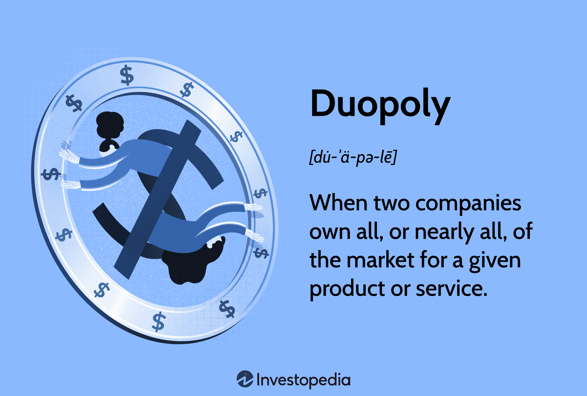

## Table of Contents

## What is a duopoly in economics?

A duopoly is a market situation where there are only two big companies selling the same kind of product or service. Imagine if only two companies made all the soda in the world. That would be a duopoly. Because there are just two big players, they have a lot of power over prices and what they sell. They might even work together to keep prices high, which is called collusion.

In a duopoly, the two companies often watch each other closely. If one company lowers its prices, the other might do the same to keep customers. This can lead to price wars, which can be good for customers because prices go down. But it can also be bad for the companies because they might not make as much money. Sometimes, the government keeps an eye on duopolies to make sure the companies aren't doing anything unfair to keep their power or to hurt customers.

## What are the main characteristics of a duopoly?

In a duopoly, there are only two big companies that sell the same thing. This means they have a lot of control over the market. They can decide how much to charge for their product or service because there aren't many other choices for customers. Sometimes, these two companies might even work together to keep prices high, which is called collusion. But they also have to be careful because if one company lowers its prices, the other might have to do the same to keep their customers, which can lead to a price war.

These two companies in a duopoly often keep a close eye on each other. They watch what the other company does and try to stay one step ahead. This can make the market more competitive, but it can also be risky for the companies because they might end up making less money if they keep lowering prices. Governments sometimes watch duopolies closely to make sure the companies are playing fair and not doing anything to hurt customers or other smaller companies that might want to enter the market.

## How does a duopoly differ from a monopoly?

A duopoly is when there are only two big companies selling the same thing. They share the market and have to watch each other closely. If one company lowers its prices, the other might do the same to keep customers. This can lead to price wars, which can be good for customers because prices go down. But it can be risky for the companies because they might make less money.

A monopoly is different because there is only one company selling something. This company has total control over the market and can set prices however it wants. There is no other company to compete with, so customers have to buy from this one company if they want the product or service. Governments often watch monopolies closely to make sure they don't take advantage of their power and hurt customers.

In a duopoly, the two companies might even work together to keep prices high, which is called collusion. But in a monopoly, there's no need for collusion because there's no competition at all. Both duopolies and monopolies can affect the market a lot, but they do it in different ways because of the number of companies involved.

## What are the two primary types of duopoly?

The first type of duopoly is called a Cournot duopoly. In this type, the two companies decide how much of their product to make before they know what the other company is doing. They guess how much the other company will make and then decide how much to make themselves. This can lead to a situation where both companies end up making too much, and the price of the product goes down.

The second type is called a Bertrand duopoly. In this type, the two companies decide on the price of their product instead of how much to make. They try to set a lower price than the other company to attract more customers. This can lead to a price war, where both companies keep lowering their prices until they are making very little money. Both types of duopolies show how the two companies interact and compete with each other in different ways.

## Can you explain Cournot duopoly with an example?

Imagine there are only two ice cream shops in a small town: Shop A and Shop B. This is a Cournot duopoly because both shops need to decide how much ice cream to make before knowing what the other shop will do. Shop A might think, "If Shop B makes 100 scoops, I should make 150 scoops to get more customers." At the same time, Shop B might think, "If Shop A makes 150 scoops, I should make 120 scoops." They both guess what the other will do and then decide how much to make.

In this situation, both shops might end up making too much ice cream. If Shop A makes 150 scoops and Shop B makes 120 scoops, there could be more ice cream than people want to buy. This means the price of ice cream might go down because there's so much of it. Both shops have to be careful because if they keep making too much, they might not make any money. This shows how in a Cournot duopoly, the two companies have to guess and plan their production carefully to stay competitive.

## What is a Bertrand duopoly and how does it function?

A Bertrand duopoly is a market where there are only two companies selling the same thing, and they compete by setting prices. Instead of deciding how much to make like in a Cournot duopoly, these companies focus on setting the lowest price to attract more customers. For example, imagine there are only two gas stations in a town. If one station sets the price of gas at $3 per gallon, the other might set it at $2.90 to get more customers. This competition can lead to a price war where both stations keep lowering their prices to stay ahead.

In a Bertrand duopoly, if both companies keep lowering their prices, they might end up making very little money. If the gas stations keep dropping their prices, they might both end up selling gas at a price that is too low to make a profit. This is why companies in a Bertrand duopoly have to be careful. They need to balance attracting customers with making enough money to stay in business. It's a tricky situation where both companies are always watching each other and trying to find the best price to set.

## How do firms in a duopoly compete with each other?

In a duopoly, the two big companies compete with each other in different ways. One way is by setting prices. If one company lowers its prices, the other might do the same to keep customers. This can lead to a price war, where both companies keep dropping their prices until they are making very little money. It's like a game where both companies are always watching each other and trying to find the best price to set.

Another way firms in a duopoly compete is by deciding how much to make. If one company makes a lot of something, the other might make more too, hoping to sell more than the first company. But if both companies make too much, there might be more of the product than people want to buy. This can make the price go down, and both companies might end up making less money. It's a tricky balance, where both companies have to guess what the other will do and plan carefully.

Sometimes, the two companies might even work together to keep prices high. This is called collusion, and it can be good for the companies because they make more money, but it can be bad for customers because they have to pay more. Governments keep an eye on duopolies to make sure the companies aren't doing anything unfair to keep their power or to hurt customers.

## What are some real-world examples of duopolies?

A good example of a duopoly is the market for commercial airplanes. There are only two big companies that make most of the planes airlines use: Boeing from the United States and Airbus from Europe. These two companies compete to sell their planes to airlines all over the world. They watch each other closely and try to make the best planes at the best prices. If one company comes out with a new type of plane, the other might work on a similar one to keep up.

Another example is the soft drink market, where Coca-Cola and Pepsi dominate. These two companies make most of the soda that people drink. They compete by coming up with new flavors, running big advertising campaigns, and sometimes lowering their prices to attract more customers. If Coca-Cola starts a new ad campaign, Pepsi might do something similar to keep their share of the market. Both companies have to be careful because if they lower their prices too much, they might not make as much money.

## How does game theory apply to duopolies?

Game theory is a way to understand how the two companies in a duopoly make decisions. It's like a game where each company has to guess what the other will do and then decide what to do themselves. In a duopoly, the companies might compete by setting prices or deciding how much to make. If one company lowers its price, the other might do the same to keep customers. This can lead to a price war, where both companies keep dropping their prices until they are making very little money. Game theory helps us see how these decisions can affect the market and the companies.

For example, in a Cournot duopoly, the companies decide how much to make before knowing what the other will do. They guess what the other will make and then decide their own amount. If both guess wrong, they might make too much, and the price of their product goes down. In a Bertrand duopoly, the companies compete by setting prices. If one sets a lower price, the other might follow to attract more customers. This can lead to a situation where both companies end up making very little money because their prices are too low. Game theory shows us how these different ways of competing can lead to different outcomes for the companies and the market.

## What are the potential benefits and drawbacks of a duopoly for consumers?

A duopoly can be good for consumers because it can lead to lower prices. When there are only two big companies selling the same thing, they might start a price war to get more customers. This means consumers can buy things for less money. Also, the two companies might try to make their products better or come up with new things to stand out from each other. This can give consumers more choices and better products.

But a duopoly can also be bad for consumers. Sometimes, the two companies might work together to keep prices high. This is called collusion, and it means consumers have to pay more. Also, because there are only two big companies, it can be hard for new companies to start selling the same thing. This means consumers might not have as many choices. If the two companies don't compete well, consumers might end up paying more for worse products.

## How do government regulations affect duopolies?

Governments keep a close eye on duopolies to make sure the two big companies are playing fair. They do this because they want to protect customers and make sure they aren't paying too much or getting bad products. If the government sees that the two companies are working together to keep prices high, which is called collusion, they might step in and stop it. They can also make rules to help new companies start selling the same thing, so customers have more choices.

Sometimes, the government might break up a duopoly if they think it's too powerful and not good for customers. This means they might force one of the companies to split into smaller companies or let other companies into the market. This can help make prices lower and give customers better choices. Governments use these rules to make sure the market stays fair and that customers are treated well.

## What advanced economic models are used to analyze duopolies?

One advanced economic model used to analyze duopolies is the Cournot model. In this model, the two companies in a duopoly decide how much of their product to make before knowing what the other company will do. They guess what the other company might make and then decide how much to make themselves. This can lead to a situation where both companies end up making too much, and the price of the product goes down. The Cournot model helps economists understand how these guesses and decisions affect the market and the companies' profits.

Another model is the Bertrand model. In this model, the two companies compete by setting prices instead of deciding how much to make. They try to set a lower price than the other company to attract more customers. This can lead to a price war, where both companies keep lowering their prices until they are making very little money. The Bertrand model shows how the competition over prices can affect the market and the companies' profits. Both models help economists see how different ways of competing in a duopoly can lead to different outcomes for the companies and the market.

## References & Further Reading

[1]: ["Advances in Financial Machine Learning"](https://www.amazon.com/Advances-Financial-Machine-Learning-Marcos/dp/1119482089) by Marcos Lopez de Prado

[2]: ["Evidence-Based Technical Analysis: Applying the Scientific Method and Statistical Inference to Trading Signals"](https://www.amazon.com/Evidence-Based-Technical-Analysis-Scientific-Statistical/dp/0470008741) by David Aronson

[3]: ["Machine Learning for Algorithmic Trading"](https://github.com/PacktPublishing/Machine-Learning-for-Algorithmic-Trading-Second-Edition) by Stefan Jansen

[4]: ["Quantitative Trading: How to Build Your Own Algorithmic Trading Business"](https://www.amazon.com/Quantitative-Trading-Build-Algorithmic-Business/dp/1119800064) by Ernest P. Chan

[5]: Hirschey, M. (2000). ["The Economics of Oligopoly Markets"](https://openlibrary.org/books/OL54085M/Managerial_economics.). Springer Science & Business Media.

[6]: Parlor, J. M., & Rajan, U. (2001). ["Competition in Algorithmic Trading: A Duopoly Approach"](https://www.aeaweb.org/articles?id=10.1257/aer.91.5.1311). The Journal of Finance, 56(6), 2925-2944.