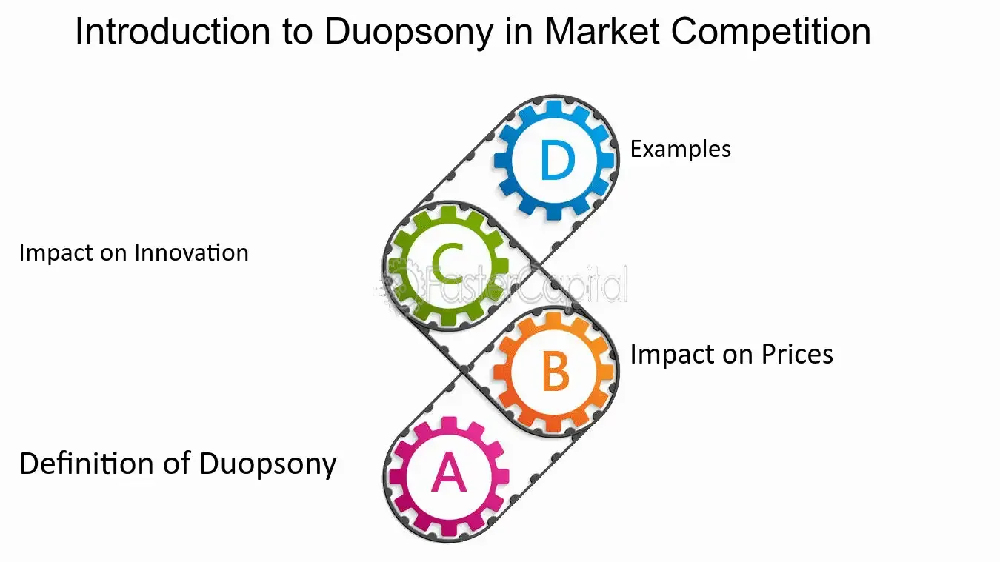

## Table of Contents

## What is the basic definition of duopsony?

A duopsony is a market situation where there are only two buyers for a product or service. This is different from a monopoly, where there is only one seller, or a monopsony, where there is only one buyer. In a duopsony, the two buyers have a lot of power because they can influence the price and other terms of the market.

Because there are only two buyers, sellers in a duopsony often have to accept the terms set by these buyers. This can lead to lower prices for the sellers and less competition among the buyers. The two buyers might even work together to keep prices low, which can affect the overall market and the sellers' ability to make a profit.

## How does duopsony differ from monopsony and oligopsony?

A duopsony is when there are only two buyers in a market. This means that these two buyers can have a big say in setting the prices and other rules. It's different from a monopsony, where there's just one buyer. In a monopsony, that one buyer has total control over the market because they're the only one buying. So, in a duopsony, the sellers have a bit more choice than in a monopsony, but they still don't have much power because there are only two buyers.

An oligopsony is when there are a few buyers in the market, more than two but not a lot. This is different from a duopsony because there are more buyers, so sellers have a bit more freedom to choose who to sell to. But, like in a duopsony, the buyers in an oligopsony can still work together to keep prices low. So, while a duopsony is just two buyers, an oligopsony can have three, four, or more, but it's still a situation where the buyers have more power than the sellers.

## Can you provide a simple example of a duopsony market?

Imagine a small town where there are only two big factories that buy all the apples from local farmers. These two factories are the only ones buying apples, so they decide the price they will pay the farmers. This is a duopsony because there are only two buyers for the apples.

In this situation, the farmers don't have many choices. If they want to sell their apples, they have to sell to one of the two factories. The factories might even talk to each other and agree to keep the price they pay for apples low. This means the farmers might not get as much money for their apples as they would in a market with more buyers.

## What are the key characteristics of a duopsony market?

In a duopsony market, there are only two buyers for a product or service. This means these two buyers have a lot of power because they can decide the price they will pay. Sellers in this market don't have many choices, so they often have to accept the price set by the buyers. This can lead to lower prices for the sellers because they can't go to other buyers to get a better deal.

The two buyers in a duopsony might work together to keep the prices they pay low. This can make it hard for sellers to make a good profit. Because there are only two buyers, the market can be less competitive, and the buyers can control the market more than if there were many buyers. This situation can affect how much the sellers earn and how the whole market works.

## How do duopsonies affect suppliers and market prices?

In a duopsony, there are only two buyers for a product or service. This means that these two buyers have a lot of power over the sellers. Because there are only two places to sell to, suppliers often have to accept whatever price the buyers offer. This can lead to lower prices for the sellers because they can't go to other buyers to get a better deal. The suppliers might not make as much money as they would if there were more buyers in the market.

The two buyers in a duopsony might work together to keep the prices they pay low. They can do this because they know the sellers don't have many other options. When the buyers keep the prices low, it affects the whole market. The sellers might struggle to make a good profit, and this can even change how much of the product is made or how many people want to sell it. So, in a duopsony, the market prices are often lower, and this can be tough for the suppliers.

## What industries are most likely to exhibit duopsony characteristics?

Some industries that often show duopsony characteristics are farming and sports. In farming, there might be only two big companies that buy all the crops from farmers. These companies can decide the price they pay, and farmers don't have many other places to sell their crops. This makes it hard for farmers to get a good price for their hard work. In sports, like professional leagues, there might be only two teams that want to sign a certain type of player. These teams can offer lower salaries because the players don't have many other teams to choose from.

Another industry where you can see duopsony is in manufacturing. For example, there might be only two big car companies in a region that buy parts from local suppliers. These two companies can set the price they pay for the parts, and the suppliers have to accept it because they don't have other buyers. This can make it tough for the suppliers to make a profit. So, in these industries, the few buyers have a lot of power, and this affects the sellers and the overall market prices.

## What are the potential benefits of a duopsony for buyers?

In a duopsony, buyers have a lot of power because there are only two of them. This means they can decide how much they want to pay for things. When there are only two buyers, sellers don't have many other places to go, so they have to accept the price the buyers offer. This can help the buyers save money because they can keep the prices low.

The two buyers in a duopsony might also work together to keep prices down. They can talk to each other and agree on how much they will pay. This way, they can make sure they don't have to spend too much money. For the buyers, this is good because they can get what they need without paying a lot.

## What are the challenges and drawbacks for suppliers in a duopsony market?

In a duopsony market, suppliers face a lot of challenges because there are only two buyers. This means suppliers don't have many choices for where to sell their products. If the two buyers decide to pay low prices, the suppliers have to accept it because they can't go to other buyers to get a better deal. This can make it hard for suppliers to make enough money to cover their costs and make a profit. They might have to sell their products for less than they would like, which can be tough on their business.

Another big problem for suppliers in a duopsony is that the two buyers might work together to keep prices low. When the buyers agree on a low price, suppliers can't do much about it. This can lead to a situation where suppliers feel squeezed because they don't have the power to negotiate better terms. Over time, this can make it hard for suppliers to stay in business, and some might even have to close down if they can't make enough money.

## How do barriers to entry function in a duopsony market?

In a duopsony market, barriers to entry make it hard for new buyers to start buying. These barriers can be things like high costs to set up a business or rules that make it tough for new buyers to come in. When it's hard for new buyers to enter the market, the two existing buyers keep their power. They can keep paying low prices because sellers don't have other places to go. This means the two buyers can control the market and keep things the way they want.

Because of these barriers, sellers in a duopsony don't get more choices even if they want them. If new buyers can't start buying, the sellers are stuck with the two existing buyers. This makes it hard for sellers to get better prices or better terms. The barriers to entry help the two buyers stay strong and keep their power over the market, which can be tough for the sellers.

## What regulatory measures can be implemented to address issues in duopsony markets?

To help fix problems in duopsony markets, governments can use rules to make sure things are fair for sellers. One way is to stop the two buyers from working together to keep prices low. This can be done with laws that say buyers can't talk to each other about prices. If buyers break these rules, they can get in trouble, which can help sellers get better prices. Another way is to make it easier for new buyers to come into the market. Governments can do this by giving money or help to new businesses that want to start buying, or by changing rules that make it hard for new buyers to start.

Another thing governments can do is to watch the market closely to make sure the two buyers are not being unfair. They can set up groups to check if the buyers are paying fair prices and treating sellers right. If they find problems, they can make the buyers change how they do things. This can help sellers get a better deal and make more money. By using these rules and watching the market, governments can help make duopsony markets fairer for everyone.

## How can new entrants overcome barriers to entry in a duopsony market?

New entrants in a duopsony market can overcome barriers to entry by finding ways to start buying with less money. They can do this by starting small and growing slowly, or by finding partners to share the costs. Sometimes, new buyers can also get help from the government, like loans or grants, to help them start. Another way is to use new ideas or technology to buy things in a different way, which can make it easier and cheaper to get into the market.

Another way new entrants can overcome barriers is by showing sellers that they can offer better deals. If new buyers can pay more or offer better terms than the two existing buyers, sellers might want to sell to them instead. This can help new buyers get a foothold in the market. It's also important for new buyers to understand the rules and find ways to work around them. If they can figure out how to follow the rules but still get into the market, they have a better chance of succeeding.

## What advanced economic theories explain the dynamics and stability of duopsony markets?

One advanced economic theory that helps explain the dynamics and stability of duopsony markets is game theory. Game theory looks at how the two buyers in a duopsony might act and react to each other. It's like a game where each buyer tries to guess what the other will do and then decides what's best for them. In a duopsony, the two buyers might work together to keep prices low, but they also have to be careful not to push too hard because that could make sellers leave the market. Game theory helps us understand how these buyers can find a balance where they both get what they want without causing too many problems.

Another theory that explains duopsony markets is the concept of market power. In a duopsony, the two buyers have a lot of market power because they control most of the buying. This power lets them set the prices they want to pay, which can affect how much sellers earn. The stability of a duopsony market depends on how the buyers use their power. If they use it wisely and keep prices at a level where sellers can still make a profit, the market can stay stable. But if they push prices too low, sellers might leave, and the market could become unstable. Understanding market power helps us see why duopsony markets work the way they do and how they can stay balanced over time.

## References & Further Reading

[1]: Luo, Y., & Donnelly, R. (2020). ["Market Power and Its Impacts on Market Structure."](https://www.dovepress.com/exploring-cortical-and-hippocampal-changes-in-temporal-lobe-epilepsy-u-peer-reviewed-fulltext-article-IJGM) Journal of Economics.

[2]: Ghemawat, P. (1991). ["Commitment: The Dynamic of Strategy."](https://archive.org/details/commitmentdynami00ghem) Free Press.

[3]: Lopez de Prado, M. (2018). ["Advances in Financial Machine Learning"](https://www.amazon.com/Advances-Financial-Machine-Learning-Marcos/dp/1119482089) John Wiley & Sons.

[4]: Aronson, D. (2007). ["Evidence-Based Technical Analysis: Applying the Scientific Method and Statistical Inference to Trading Signals"](https://www.amazon.com/Evidence-Based-Technical-Analysis-Scientific-Statistical/dp/0470008741) John Wiley & Sons.

[5]: Jansen, S. (2020). ["Machine Learning for Algorithmic Trading"](https://github.com/stefan-jansen/machine-learning-for-trading) Packt Publishing.

[6]: Chan, E. P. (2008). ["Quantitative Trading: How to Build Your Own Algorithmic Trading Business"](https://github.com/ftvision/quant_trading_echan_book) John Wiley & Sons.