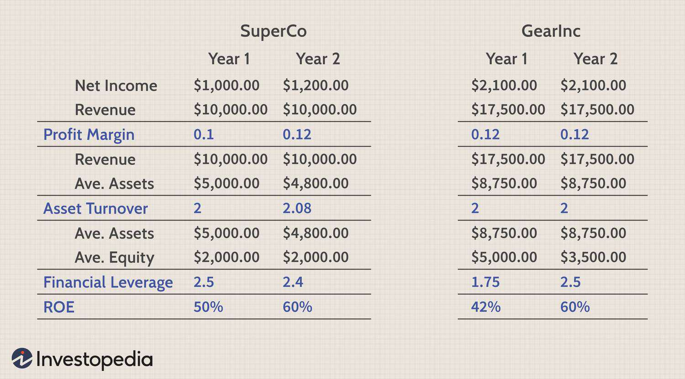

The world of investing often involves a complex web of strategies and analyses designed to maximize financial returns and manage risks. Among these methodologies, DuPont Analysis is a pivotal tool for investors seeking a comprehensive understanding of a company's financial health. Developed in the early 20th century by the DuPont Corporation, this analysis decomposes a company's Return on Equity (ROE) into three critical components: profit margin, asset turnover, and equity multiplier. By analyzing these components, investors can gain insights into operational efficiency, asset utilization, and financial leverage, thereby identifying both strengths and areas for potential improvement within a company.

In recent years, the advent of algorithmic trading has further revolutionized how investors implement such financial analyses. By automating trade execution based on predefined criteria, algorithmic trading allows for real-time decision-making and the efficient incorporation of complex analyses like DuPont. This technological advancement enables investors to make data-driven decisions that align closely with a company's financial health indicators.



This article explores the intersection of DuPont Analysis with modern investment strategies and algorithmic trading. By integrating these elements, investors can refine their approaches, optimize investment decisions, and potentially enhance financial returns. The combination of traditional financial analysis with state-of-the-art trading technologies represents a significant evolution in strategic investment, offering a robust framework for navigating today's dynamic financial markets.

## Table of Contents

## Understanding DuPont Analysis

DuPont Analysis, formulated by the DuPont Corporation in the early 1900s, serves as a sophisticated technique to evaluate a company's Return on Equity (ROE). This approach dissects ROE into three fundamental components: profit margin, asset turnover, and equity multiplier. By doing so, it offers a granular view of a firm's financial performance, providing insights into operational efficiency, asset utilization, and financial leverage.

The breakdown of ROE using the DuPont model is expressed as follows:

$$
\text{ROE} = \text{Profit Margin} \times \text{Asset Turnover} \times \text{Equity Multiplier}
$$

Each component reveals crucial information about different aspects of the company's business.

1. **Profit Margin** is calculated by dividing net income by revenue. It measures the efficiency with which a company converts sales into net income. A higher profit margin indicates superior cost control and pricing strategy, allowing more profit to be retained from each dollar of sales. 

2. **Asset Turnover** assesses how efficiently a company utilizes its assets to generate sales. It is computed by dividing revenue by total assets. This ratio highlights a firm's effectiveness in deploying its assets, showing how much revenue is produced with each dollar of assets owned. A higher asset turnover ratio suggests better asset utilization.

3. **Equity Multiplier** reflects the extent of a company's financial leverage. It is determined by dividing total assets by shareholders' equity. It indicates the portion of a firm's assets that are financed by shareholder equity versus debt. A higher equity multiplier suggests that a larger portion of asset financing is sourced from debt, which can amplify returns but also increase financial risk.

By understanding these components, investors can identify and assess the strengths and weaknesses within a company's operations and financial structure. The DuPont Analysis allows for a nuanced understanding of what drives a company's ROE and facilitates more informed investment decisions based on the identified operational efficiencies, asset utilization levels, and leverage strategies.

## Components of DuPont Analysis

The DuPont Analysis methodically breaks down the Return on Equity (ROE) into three distinct components: Net Profit Margin, Asset Turnover, and Equity Multiplier. Each component provides unique insights into different aspects of a company's operational and financial performance.

**Net Profit Margin** is calculated as the net income divided by net sales. It measures the percentage of profit derived from revenue and serves as an indicator of a company's operational efficiency. A higher net profit margin suggests that the company is effectively managing its costs and expenses relative to its sales revenues. Mathematically, it is expressed as:

$$
\text{Net Profit Margin} = \frac{\text{Net Income}}{\text{Net Sales}}
$$

**Asset Turnover** measures how efficiently a company utilizes its assets to generate sales. It is calculated by dividing net sales by average total assets. A higher asset turnover ratio indicates that the company is using its assets more efficiently to produce revenue, implying effective management of asset utilization. This component is critical for assessing a company’s operational efficiency in leveraging its asset base:

$$
\text{Asset Turnover} = \frac{\text{Net Sales}}{\text{Average Total Assets}}
$$

**Equity Multiplier** illustrates the extent of financial leverage used by a company, represented by the ratio of total assets to shareholders' equity. This component indicates how much of a company's assets are financed by its shareholders versus creditors. A higher equity multiplier suggests greater leverage, indicating that a company is using more debt to finance its assets, which can amplify both potential returns and risks:

$$
\text{Equity Multiplier} = \frac{\text{Total Assets}}{\text{Shareholders' Equity}}
$$

Together, these three components form a comprehensive view of a company's financial performance by dissecting ROE into its operational, asset utilization, and financial leverage aspects. This structured approach not only highlights the strength of each component but also helps identify areas for potential improvement. These insights are invaluable for investors aiming to assess a company’s overall financial health.

## DuPont Analysis in Investment Decisions

Investors utilize DuPont Analysis to evaluate the financial performance of companies, particularly when assessing businesses within the same industry. This framework allows investors to decompose a company's Return on Equity (ROE) into distinct, analytical components, each revealing valuable insights into different aspects of the firm's operations.

The analysis begins with a breakdown of ROE into three primary components: the net profit margin, asset turnover, and the equity multiplier. This can be represented through the formula:

$$
\text{ROE} = \text{Net Profit Margin} \times \text{Asset Turnover} \times \text{Equity Multiplier}
$$

Here, the net profit margin evaluates the company's ability to convert sales into profit, offering insight into operational efficiency. For example, a high net profit margin indicates that the company retains a significant portion of its revenues as profit, which reflects effective cost management and pricing strategies.

Asset turnover measures how effectively a company utilizes its assets to generate revenue. A higher asset turnover suggests that the company is efficiently using its assets to produce sales, indicating good asset management.

Finally, the equity multiplier reflects the level of financial leverage used by the company, comparing total assets to shareholders' equity. A higher equity multiplier implies more leverage, indicating that the firm is funding a significant portion of its assets with debt, which can amplify both returns and risks.

By dissecting these components, investors can identify where a company's strengths and weaknesses lie. For instance, if a firm boasts a high ROE due primarily to a substantial equity multiplier, it might signal more risk due to increased leverage. Conversely, a strong ROE driven by a high net profit margin or asset turnover could indicate robust operational efficiency or effective asset utilization.

Such insights are crucial in forming strategic investment decisions. Investors can use DuPont Analysis not only to gauge a company's current strengths but also to identify areas necessitating improvement. Consequently, it helps investors in assessing whether to invest based on a company's operational strengths, optimal asset management, or leverage strategies, ultimately guiding portfolio allocation and risk management decisions.

## Integrating DuPont Analysis with Algorithmic Trading

Algorithmic trading, a critical innovation in modern finance, leverages sophisticated algorithms to manage and execute trades based on predefined criteria. This approach can be particularly effective when integrating analytical tools like the DuPont Analysis, which dissects a company's Return on Equity (ROE) into three distinct components: profit margin, asset turnover, and equity multiplier. By embedding these components into algorithmic models, traders can make more informed and strategic trading decisions based on a company’s underlying financial health.

Incorporating DuPont components into [algorithmic trading](/wiki/algorithmic-trading) can begin with defining key financial metrics that signify a company's performance. For instance, the Net Profit Margin ($\text{NPM}$), calculated as the ratio of net income to sales, reflects a company's operational efficiency. Asset Turnover ($\text{AT}$) indicates how effectively a firm utilizes its assets to generate revenue, calculated as sales divided by average total assets. Finally, the Equity Multiplier ($\text{EM}$), which is total assets divided by total equity, provides insight into financial leverage.

Algorithmic trading systems can be programmed to identify opportunities where these metrics reflect favorable conditions. For example, a high net profit margin might signal an efficient operation worth investing in, while a lower equity multiplier might indicate a company with lower financial risk owing to less debt relative to equity. Combining these metrics, traders can construct an algorithm that automatically analyzes these criteria and executes trades when a threshold is met. 

In practice, a Python-based algorithm could be constructed to scrape necessary financial data, calculate DuPont metrics, and implement a trading strategy. Here's an illustrative example:

```python
import yfinance as yf  # For more datasets, visit: https://paperswithbacktest.com/datasets

def calculate_dupont_metrics(ticker):
    data = yf.Ticker(ticker)
    financials = data.financials
    balance_sheet = data.balance_sheet

    net_income = financials.loc['Net Income'].mean()
    sales = financials.loc['Total Revenue'].mean()
    avg_assets = balance_sheet.loc['Total Assets'].mean()
    avg_equity = balance_sheet.loc['Total Stockholder Equity'].mean()

    npm = net_income / sales
    at = sales / avg_assets
    em = avg_assets / avg_equity

    return npm, at, em

def trading_decision(npm, at, em, npm_threshold=0.1, at_threshold=1, em_threshold=2):
    if npm > npm_threshold and at > at_threshold and em < em_threshold:
        return "BUY"
    else:
        return "HOLD/SELL"

ticker = "AAPL"
npm, at, em = calculate_dupont_metrics(ticker)
decision = trading_decision(npm, at, em)
print(f"Trading decision for {ticker}: {decision}")
```

In this example, we gather financial data for a specific company, compute the DuPont metrics, and make a trading decision based on set thresholds for each component. This integration ensures decisions are data-driven and align with the company's financial standing, reacting swiftly to market changes and optimizing investment portfolios.

Through such integrations, traders can harness the detailed insights provided by DuPont Analysis and the efficiency of algorithmic trading to implement strategies that enhance returns. This blend of traditional financial analysis with cutting-edge technology thus provides a comprehensive approach to navigating and capitalizing on market opportunities.

## Case Studies and Practical Applications

Case studies serve as a valuable means of illustrating the application of DuPont Analysis in strategic decision-making by financial giants, offering practical insights into how the methodology can be harnessed for impactful investment strategies. Companies such as Ford Motor Company and major banks exemplify the practical applications of DuPont Analysis in evaluating financial performance and guiding investment decisions.

Ford Motor Company provides a relevant example of how DuPont Analysis can be utilized to assess a company’s financial strategy and performance. By dissecting Ford's Return on Equity (ROE) through the DuPont formula, analysts can gain insights into the automotive giant's operational efficiency, asset management, and financial leverage. The DuPont formula is expressed as:

$$
\text{ROE} = \text{Net Profit Margin} \times \text{Asset Turnover} \times \text{Equity Multiplier}
$$

1. **Net Profit Margin**: This component reflects Ford's ability to convert revenue into profit, shedding light on operational efficiency and cost management.
2. **Asset Turnover**: This metric measures how effectively Ford utilizes its assets to generate sales, serving as an indicator of asset management capabilities.
3. **Equity Multiplier**: This aspect evaluates the degree of financial leverage Ford employs, providing insights into its capital structure strategy.

Analyzing these components allows investors to ascertain whether Ford's strengths lie in profit generation, asset usage, or leverage. For instance, a higher equity multiplier might suggest the use of more debt financing, which could amplify ROE if managed effectively.

Similarly, major banking institutions integrate DuPont Analysis to align their strategic initiatives with financial outcomes. Banks rely on DuPont metrics to assess profitability drivers and identify areas for improvement, particularly in optimizing capital allocation and managing financial leverage. By applying DuPont Analysis, banks can refine their strategies to enhance shareholder value through informed decisions about risk management, operational efficiencies, and investment in growth opportunities.

These practical applications demonstrate the potency of DuPont Analysis in translating financial metrics into actionable strategies. They underscore the analysis's capacity to furnish investors and companies with a nuanced understanding of performance, facilitating strategic decisions that are aligned with long-term financial objectives. Such insights are vital for navigating competitive industries and achieving sustainable growth.

## Limitations of DuPont Analysis

DuPont Analysis, while a powerful tool for financial assessment, presents certain limitations that investors should be aware of. At its core, this analysis relies on quantifiable financial data often sourced from company-reported financial statements. Such data can be subject to manipulation through creative accounting practices, potentially distorting the true financial health of a company. This underscores the necessity for vigilance and a critical approach when interpreting results.

Another limitation lies in its retrospective nature. DuPont Analysis provides insights based on historical financial performance rather than predictive analytics. While it can illuminate past operational efficiency, asset utilization, and financial leverage, it does not inherently forecast future performance. For instance, past profitability and efficiency metrics may not hold in fluctuating economic environments or under different management strategies.

Investors are therefore advised to supplement DuPont Analysis with additional financial analyses. Combining it with forward-looking metrics, market trend analyses, and qualitative assessments of industry conditions can provide a more holistic view of a company's trajectory. A comprehensive approach ensures that investors can account for broader macroeconomic conditions, sector-specific trends, and potential future risks.

In summary, while DuPont Analysis offers valuable insights, it should not be the sole determinant in investment decisions. The strategic integration of this analysis with other financial tools and market assessments ensures a more robust framework for evaluating potential investments.

## Conclusion

DuPont Analysis remains a vital tool for dissecting and understanding financial health in the investment world. Its ability to decompose Return on Equity (ROE) into profit margin, asset turnover, and equity multiplier provides a multi-faceted view of a company's financial performance. This granularity allows investors to identify operational efficiencies, assess asset utilization, and evaluate financial leverage—all crucial aspects for making informed investment decisions.

When combined with algorithmic trading, DuPont Analysis offers a robust framework for executing data-driven strategies. Algorithmic trading systems can incorporate DuPont's components to adjust trading parameters dynamically based on a company's financial health. For example, an algorithm could automatically favor companies with improving profit margins or decreasing leverage ratios. This integration supports real-time decision-making, which is essential in volatile markets where rapid information processing can translate to improved trading outcomes.

As the financial market continues to evolve, integrating traditional analyses like DuPont with modern technologies will likely enhance trading strategies and outcomes. The synergy of time-tested financial evaluation methods with cutting-edge algorithmic tools offers exciting possibilities for both traders and investors. Conclusively, while DuPont Analysis alone provides a snapshot of a company’s financial status, its combination with algorithmic solutions elevates its applicability, ensuring it remains a cornerstone in the toolkit for optimizing investment strategies.

## References & Further Reading

[1]: ["The DuPont Model: Evaluating ROE"](https://www.investopedia.com/terms/d/dupontanalysis.asp) on Investopedia

[2]: ["Advances in Financial Machine Learning"](https://www.amazon.com/Advances-Financial-Machine-Learning-Marcos/dp/1119482089) by Marcos Lopez de Prado

[3]: ["Quantitative Trading: How to Build Your Own Algorithmic Trading Business"](https://www.amazon.com/Quantitative-Trading-Build-Algorithmic-Business/dp/1119800064) by Ernest P. Chan

[4]: ["Financial Analysis with R"](https://accountinginsights.org/r-for-financial-analysis-techniques-and-applications/) by Mark Hunt

[5]: ["Machine Learning for Algorithmic Trading"](https://github.com/PacktPublishing/Machine-Learning-for-Algorithmic-Trading-Second-Edition) by Stefan Jansen