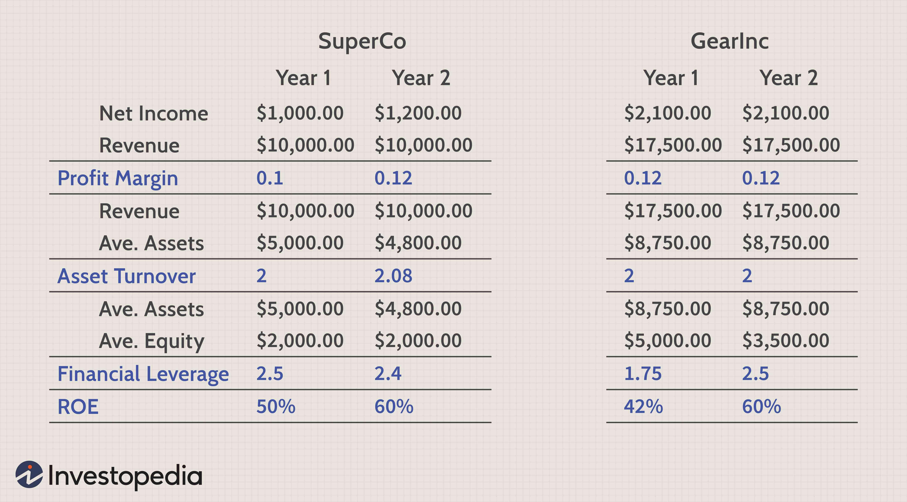

## Table of Contents

## What is DuPont Analysis?

DuPont Analysis is a way to understand how a company makes money. It breaks down the return on equity (ROE) into three parts: profit margin, asset turnover, and financial leverage. This helps people see which parts of the business are doing well and which need improvement. By looking at these three parts, you can figure out if the company is good at making profits, using its assets, or using borrowed money.

The first part, profit margin, shows how much profit the company makes from each dollar of sales. A high profit margin means the company is good at turning sales into profit. The second part, asset turnover, shows how well the company uses its assets to make sales. A high asset turnover means the company is using its assets efficiently. The third part, financial leverage, shows how much the company uses debt to boost its returns. More debt can increase returns but also increases risk. By understanding these three parts, you can get a clearer picture of the company's performance.

## Who developed the DuPont Analysis and why?

The DuPont Analysis was developed by a company called DuPont in the 1920s. DuPont is a big chemical company that wanted to find a better way to understand how well it was doing financially. They came up with this method to break down their return on equity into smaller pieces, which made it easier to see where they were doing well and where they needed to improve.

The reason DuPont developed this analysis was to help their managers make better decisions. By understanding the different parts of their business, like how much profit they were making, how well they were using their assets, and how much they were relying on debt, they could focus on the areas that needed the most attention. This helped DuPont become more efficient and profitable, and the method became popular with other companies too.

## What are the three main components of DuPont Analysis?

The three main parts of DuPont Analysis are profit margin, asset turnover, and financial leverage. Profit margin tells you how much money a company makes from each dollar of sales. If a company has a high profit margin, it means they are good at turning their sales into profit. Asset turnover shows how well a company uses its things, like machines or buildings, to make sales. A high asset turnover means the company is using its stuff efficiently.

Financial leverage is the third part, and it shows how much a company uses borrowed money to make more money. Using more debt can help a company make bigger returns, but it also makes things riskier. By looking at these three parts together, you can see which areas of the business are doing well and which ones need to be better. This helps people make smarter choices about how to run the company.

## How does DuPont Analysis help in understanding a company's financial performance?

DuPont Analysis helps people understand a company's financial performance by breaking down the return on equity (ROE) into three easy-to-understand parts: profit margin, asset turnover, and financial leverage. This method makes it simpler to see where a company is doing well and where it needs to improve. For example, if a company has a high profit margin, it means they are good at making money from their sales. If they have a high asset turnover, it shows they are using their things, like machines or buildings, efficiently to make sales.

By looking at these three parts, people can figure out if a company is good at making profits, using its assets, or using borrowed money. If a company has a lot of debt, it might have a higher ROE because of financial leverage, but this also means more risk. Understanding these parts helps managers and investors make better decisions about how to run the company or where to invest their money. It's like looking at a puzzle and seeing how all the pieces fit together to show the whole picture of the company's financial health.

## Can you explain the formula for the basic DuPont model?

The basic DuPont model helps break down a company's return on equity (ROE) into three parts: profit margin, asset turnover, and financial leverage. The formula for the basic DuPont model is: ROE = (Net Profit Margin) x (Asset Turnover) x (Equity Multiplier). In simple terms, this means you multiply how much profit the company makes from its sales, how well it uses its stuff to make sales, and how much it uses borrowed money to make more money.

To understand it better, let's look at each part. Net Profit Margin is calculated as Net Income divided by Sales, which shows how much profit the company makes from each dollar of sales. Asset Turnover is calculated as Sales divided by Total Assets, which shows how well the company uses its assets to generate sales. The Equity Multiplier is calculated as Total Assets divided by Total Equity, which shows how much the company relies on debt. By multiplying these three parts together, you get the company's ROE, which tells you how well the company is using the money its shareholders have invested.

## What is the difference between the basic and extended DuPont models?

The basic DuPont model breaks down a company's return on equity (ROE) into three parts: profit margin, asset turnover, and financial leverage. It uses the formula ROE = (Net Profit Margin) x (Asset Turnover) x (Equity Multiplier). This helps people see how a company makes money by looking at how much profit it makes from sales, how well it uses its assets, and how much it uses borrowed money. It's a simple way to understand the overall financial health of a company.

The extended DuPont model goes a step further by breaking down the net profit margin into more parts. It uses the formula ROE = (Net Profit / Sales) x (Sales / Total Assets) x (Total Assets / Total Equity). In this model, the net profit part is split into operating income and non-operating income, and it also considers taxes and interest. This gives a more detailed view of where the company's profits are coming from and how different parts of the business are affecting the overall return on equity. It's more complex but can provide deeper insights into the company's performance.

## How can DuPont Analysis be used to compare companies within the same industry?

DuPont Analysis can help people compare companies in the same industry by breaking down their return on equity into three easy parts: profit margin, asset turnover, and financial leverage. When you look at these parts for different companies, you can see which ones are better at making profits from their sales, using their stuff to make more sales, and using borrowed money to make bigger returns. For example, if Company A has a higher profit margin than Company B, it means Company A is better at turning its sales into profit. If Company B has a higher asset turnover, it means they are using their machines and buildings more efficiently to make sales.

By comparing these parts, people can figure out which company is doing better in different areas and why. This can help investors decide where to put their money or help managers see what their company needs to work on. For instance, if a company has a lower ROE than its competitors because of a low profit margin, the managers might focus on cutting costs or raising prices to improve that part. If another company has a high ROE but it's mostly because of high financial leverage, it might be taking on too much risk. So, DuPont Analysis gives a clear picture of how companies stack up against each other and where they can improve.

## What are the limitations of using DuPont Analysis?

DuPont Analysis is a great tool to understand how a company makes money, but it has some limits. One big problem is that it doesn't look at all the things that might affect a company's performance. For example, it doesn't consider things like the economy, what customers want, or new rules that might change how the company does business. So, even if a company looks good using DuPont Analysis, there might be other things going on that could hurt it.

Another limit is that DuPont Analysis can be hard to use if companies are in different industries. Each industry has its own way of doing things, so what works for one company might not work for another. If you compare a car company to a tech company using DuPont Analysis, you might not get a fair picture because their business models are so different. So, it's best to use DuPont Analysis to compare companies that are in the same industry and have similar ways of making money.

## How does DuPont Analysis integrate with other financial analysis tools?

DuPont Analysis works well with other financial tools to give a full picture of a company's health. For example, it can be used with ratio analysis, which looks at different numbers from a company's financial statements to see how well it's doing. DuPont Analysis breaks down return on equity into profit margin, asset turnover, and financial leverage. These parts can be compared with other ratios, like the current ratio that shows if a company can pay its short-term bills, or the debt-to-equity ratio that shows how much a company relies on borrowed money. By using DuPont Analysis along with these other ratios, people can get a better idea of where a company is strong and where it might need to improve.

DuPont Analysis also fits well with trend analysis, which looks at how a company's numbers change over time. By looking at the trends in profit margin, asset turnover, and financial leverage, people can see if a company is getting better or worse at making money. This can be compared with trends in other financial metrics, like revenue growth or net income, to see the bigger picture. Using DuPont Analysis with these other tools helps people make smarter decisions about investing in or running a company.

## Can you provide a real-world example of DuPont Analysis in action?

Let's look at how DuPont Analysis helped a big company called Walmart. Walmart is a huge store that sells all kinds of things, from food to clothes. They used DuPont Analysis to see how well they were doing and where they could do better. When they looked at their profit margin, they saw that they were making a small profit from each sale. This made sense because Walmart tries to keep prices low to attract more customers. But when they looked at their asset turnover, they saw that they were really good at using their stores and trucks to make a lot of sales. This showed that Walmart was efficient at using its stuff to make money. Finally, when they looked at their financial leverage, they saw that they used a bit of debt to help grow their business, but not too much. This helped them understand that their high return on equity came from being good at using their assets, even if their profit margins were small.

Another example is how a car company like Ford used DuPont Analysis. Ford makes cars and trucks, and they wanted to see how they could improve their financial performance. When they used DuPont Analysis, they found that their profit margin was okay, but not great. This meant they needed to work on making more money from each car they sold. When they looked at their asset turnover, they saw that they were not using their factories and machines as well as they could. This told them they needed to find ways to make more cars with the same stuff. Finally, when they looked at their financial leverage, they saw that they were using a lot of debt, which was risky. By understanding these three parts, Ford could focus on making more profit from each car, using their factories better, and maybe using less debt to improve their overall return on equity.

## How can investors use DuPont Analysis to make informed decisions?

Investors can use DuPont Analysis to make smart choices about where to put their money. By breaking down a company's return on equity into three simple parts—profit margin, asset turnover, and financial leverage—investors can see how well a company is doing in different areas. For example, if a company has a high profit margin, it means they are good at turning their sales into profit. If another company has a high asset turnover, it means they are using their machines and buildings efficiently to make sales. By comparing these parts across different companies, investors can figure out which ones are doing better and why. This helps them decide which companies might be good investments.

DuPont Analysis also helps investors understand the risks involved. If a company has a high return on equity because of high financial leverage, it means they are using a lot of borrowed money. This can be risky because if things go wrong, the company might have trouble paying back its debts. By looking at all three parts of the DuPont model, investors can see if a company's high returns are coming from smart business moves or just from taking on a lot of debt. This gives them a clearer picture of the company's financial health and helps them make better decisions about where to invest their money.

## What advanced techniques can be applied to enhance the insights gained from DuPont Analysis?

To get even better insights from DuPont Analysis, you can use something called trend analysis. This means looking at how the three parts of DuPont Analysis—profit margin, asset turnover, and financial leverage—change over time. By doing this, you can see if a company is getting better or worse at making money, using its stuff, or using borrowed money. For example, if a company's profit margin keeps going up, it means they are getting better at turning sales into profit. If their asset turnover goes down, it might mean they need to use their machines and buildings more efficiently. By looking at these trends, you can predict how the company might do in the future and make smarter choices about investing or running the business.

Another advanced technique is to use DuPont Analysis along with other financial tools, like ratio analysis. Ratio analysis looks at different numbers from a company's financial statements to see how well it's doing. For example, you can compare the parts of DuPont Analysis with other ratios, like the current ratio, which shows if a company can pay its short-term bills, or the debt-to-equity ratio, which shows how much a company relies on borrowed money. By using DuPont Analysis with these other ratios, you can get a fuller picture of the company's health. This helps you see not just how the company makes money, but also how it manages its money and what risks it might be facing.

## What is DuPont Analysis and how can it be understood?

DuPont Analysis, developed by the DuPont Corporation, is a financial assessment tool that breaks down the Return on Equity (ROE) into distinct components, providing a clearer view of a company's fiscal health. This method dissects ROE to reveal the underlying drivers of financial performance, namely profit margin, asset turnover, and financial leverage.

The traditional three-step DuPont formula is expressed as:

$$
\text{ROE} = (\text{Net Profit Margin}) \times (\text{Asset Turnover}) \times (\text{Equity Multiplier})
$$

1. **Net Profit Margin**: This component indicates the percentage of profit a company makes for each dollar of sales. It measures operational efficiency and cost management.

2. **Asset Turnover**: This ratio examines a company's ability to generate sales from its assets, thus reflecting the efficiency with which a company uses its resources.

3. **Equity Multiplier**: It gauges financial leverage by comparing a company’s total assets to its equity. It indicates how much of a company’s assets are financed by shareholders versus debt.

The three-part formula allows for targeted analysis, enabling investors to identify where a company excels or falters regarding profitability, operational efficiency, or financial structure.

In addition to this framework, DuPont Analysis can be expanded into a five-step model, offering further detail by incorporating tax and interest burdens. These additional components help quantify the impacts of taxation and debt on profitability. The extended formula is:

$$
\text{ROE} = (\text{Tax Burden}) \times (\text{Interest Burden}) \times (\text{EBIT Margin}) \times (\text{Asset Turnover}) \times (\text{Equity Multiplier})
$$

Here, the tax burden refers to the proportion of earnings retained after taxes, while the interest burden reflects earnings after interest relative to earnings before interest. The EBIT margin focuses on earnings before interest and taxes relative to sales.

This comprehensive approach provides a more granular understanding of financial performance, making DuPont Analysis an essential tool for investors aiming to dissect intricate financial statements and assess a company's operational and structural strengths and weaknesses.

## How can DuPont Analysis be applied to investment evaluation?

DuPont Analysis serves as a pivotal tool for investors aiming to comprehend the driving forces behind a company's financial performance. By deconstructing Return on Equity (ROE) into three foundational components—profit margin, asset turnover, and financial leverage—this analysis allows for a nuanced evaluation of a company's operational prowess and strategic financial decisions. The formula applied here is:

$$
\text{ROE} = (\text{Net Profit Margin}) \times (\text{Asset Turnover}) \times (\text{Equity Multiplier})
$$

**Comparative Analysis between Companies**

When comparing companies within the same industry, DuPont Analysis proves invaluable. By analyzing the individual components of ROE, investors can discern variations in operational efficiency and strategic financing methodologies. For instance, two companies may exhibit similar ROE, yet their financial outcomes could be driven by different combinations of profit margins, asset turnovers, and leverage. Identifying these differences is crucial in evaluating company-specific strengths and potential areas for improvement.

**Informed Decision-Making for Asset Allocation and Risk Management**

The insights garnered from DuPont Analysis empower investors to make more informed decisions regarding their investment portfolios. By pinpointing the elements contributing most significantly to a company's ROE, investors can allocate assets more strategically, focusing on organizations that align with their financial goals and risk tolerance. Additionally, understanding these financial dynamics aids investors in managing risk more effectively, by highlighting companies that may rely heavily on leverage versus those that capitalize on operational efficiency.

**Establishing Industry-Specific Benchmarks**

DuPont Analysis facilitates the establishment of industry-specific performance benchmarks. By examining the typical profit margins, asset turnovers, and leverage ratios within a particular sector, investors can position their investments to capture opportunities that may be overlooked by less analytical approaches. This creates a framework through which investment decisions are grounded in a comprehensive understanding of industry norms, better aligning expected company performance with investor objectives.

By leveraging these principles, investors capitalize on a structured approach to financial analysis, informing portfolio strategy and enhancing the potential for successful investment outcomes.

## What are some practical applications of DuPont Analysis as demonstrated through case studies?

DuPont Analysis has been instrumental in providing deep insights into a company's financial health, demonstrating its potential through various case studies across multiple industries. These case studies illustrate how different components of Return on Equity (ROE) can offer a nuanced understanding of a company's performance, guiding investment decisions. 

One notable case is within the retail industry where two leading companies exhibited similar ROE figures. However, a closer examination through DuPont Analysis revealed divergent performance drivers. Company A had a high ROE primarily due to robust profit margins, indicating strong pricing strategies and cost management. In contrast, Company B attained similar ROE largely through a high asset turnover rate, reflecting operational efficiency in inventory management and sales velocity.

The formula used in this analysis is: 

$$
\text{ROE} = \text{Net Profit Margin} \times \text{Asset Turnover} \times \text{Equity Multiplier}
$$

For Company A:

* Net Profit Margin = 20%
* Asset Turnover = 0.5
* Equity Multiplier = 3

$$
\text{ROE}_{A} = 0.20 \times 0.5 \times 3 = 0.30 \, \text{or} \, 30\%
$$

For Company B:

* Net Profit Margin = 10%
* Asset Turnover = 1.0
* Equity Multiplier = 3

$$
\text{ROE}_{B} = 0.10 \times 1.0 \times 3 = 0.30 \, \text{or} \, 30\%
$$

Despite the identical ROE, the underlying metrics provided investors with pivotal data regarding each company's strategic focus and operational priorities.

In the technology sector, another case study highlighted the significance of the financial leverage effect. Company C, a fast-growing tech firm, demonstrated an impressive ROE driven substantially by a high equity multiplier. However, DuPont Analysis flagged the potential risk associated with its high financial leverage. This insight prompted cautious investment strategies that balanced potential growth with the inherent risks of high debt levels.

Additionally, in the manufacturing sector, DuPont Analysis was used to compare operational efficiencies. Two competitor firms, Company D and Company E, both reported similar ROE figures. Yet, DuPont Analysis revealed that Company D's ROE was predominantly due to superior asset turnover, while Company E showed high financial leverage. This understanding aided investors in identifying which company operated more efficiently versus which relied heavily on debt to boost equity returns.

These examples demonstrate the practical application of DuPont Analysis across sectors, highlighting operational efficiencies, financial strategies, and the strengths or vulnerabilities of different performance drivers like profit margins, asset turnover, and financial leverage. With these insights, investors can make more informed decisions that align with their risk preferences and strategic objectives.

## What are the advantages and challenges of DuPont Analysis?

DuPont Analysis offers investors and analysts a comprehensive breakdown of a company's financial state by decomposing Return on Equity (ROE) into its core components. These components—the profit margin, asset turnover, and equity multiplier—allow for a nuanced understanding of the factors influencing a company's profitability and financial efficiency. This detailed view aids in strategic business decision-making by pinpointing specific strengths and weaknesses within a company's operations. By breaking down ROE into these elements, analysts can better assess the company's performance over time and relative to its peers.

The advantage of DuPont Analysis lies in its capacity for fostering more accurate and meaningful comparative analysis. By examining individual elements of ROE, investors can identify what drives profitability differences across companies within the same industry. This insight enables the establishment of industry-specific benchmarks, which are crucial for strategic forecasting and making informed investment decisions. For instance, a company with a high ROE driven primarily by high financial leverage may present different risks than another company with a high ROE achieved through superior asset management.

Despite its strengths, DuPont Analysis presents several challenges. The method relies heavily on the availability and accuracy of financial data. Discrepancies or inaccuracies in reported financial statements can lead to misleading analysis. This dependency underscores the importance of using reliable data sources and maintaining rigorous data validation processes.

Furthermore, DuPont Analysis can become unwieldy when attempting to incorporate multifaceted metrics across complex financial statements. The primary three-step DuPont formula, which uses the equation:

$$
\text{ROE} = (\text{Net Profit Margin}) \times (\text{Asset Turnover}) \times (\text{Equity Multiplier})
$$

may be expanded to a five-step model to include additional factors like tax and interest burdens. While this granularity offers a deeper insight, it also demands more detailed and potentially complex calculations, increasing the risk of errors.

Understanding these challenges is essential for effectively leveraging DuPont Analysis within financial strategies. It requires not only familiarity with financial statements and metrics but also a strategic mindset to interpret the data appropriately. Implementing this analysis necessitates careful consideration of how data variability might affect the conclusions drawn and how to best apply those conclusions to guide investment decisions. By addressing these challenges, analysts can maximize the utility of DuPont Analysis in shaping robust financial strategies.

## References & Further Reading

[1]: ["Financial Intelligence for Entrepreneurs: What You Really Need to Know About the Numbers"](https://store.hbr.org/product/financial-intelligence-for-entrepreneurs-what-you-really-need-to-know-about-the-numbers/1915) by Karen Berman and Joe Knight

[2]: ["The DuPont Model: Evaluating Its Effectiveness as a Financial Analysis Tool"](https://www.investopedia.com/terms/d/dupontanalysis.asp) by John W. Hormberg and Jacob C. Iversen in the Journal of Finance and Accountancy

[3]: ["Algorithmic Trading: Winning Strategies and Their Rationale"](https://www.wiley.com/en-us/Algorithmic+Trading%3A+Winning+Strategies+and+Their+Rationale-p-9781118460146) by Ernie Chan

[4]: ["Principles of Corporate Finance"](https://www.amazon.com/Principles-Corporate-Finance-Richard-Brealey/dp/0077404890) by Richard Brealey, Stewart Myers, and Franklin Allen

[5]: ["Financial Statement Analysis and Security Valuation"](https://www.mheducation.com/highered/product/financial-statement-analysis-security-valuation-penman/M9780078025310.html) by Stephen H. Penman