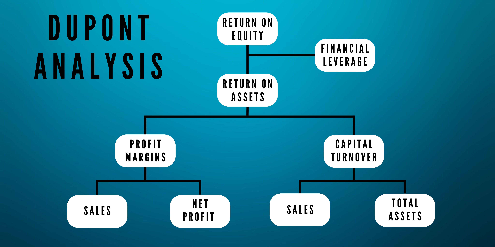

DuPont Analysis is an essential tool in financial analysis, particularly in evaluating a company's Return on Equity (ROE). Developed by the DuPont Corporation, this analytical framework deconstructs ROE into several fundamental components, offering a comprehensive insight into financial performance. The primary components include net profit margin, asset turnover, and equity multiplier. Together, they reveal how each aspect contributes to overall profitability and efficiency.

This article examines the application of DuPont Analysis in algorithmic trading, where these detailed insights can significantly enhance decision-making. By understanding the nuances of operational efficiency, asset utilization, and financial leverage, investors can make informed decisions. Such insights are crucial in today's data-driven trading environment, where precision and speed are paramount.



Beyond understanding the core components, this article will explore the advantages and challenges associated with DuPont Analysis. Its integration into algorithmic trading represents a significant advancement, allowing for more precise trading strategies. By marrying traditional financial analysis with computational power, investors can optimize their portfolios to align with specific financial goals and market conditions.

## Table of Contents

## Understanding DuPont Analysis

DuPont Analysis is a powerful tool used to dissect a company's Return on Equity (ROE) by breaking it down into three critical components: net profit margin, asset turnover, and equity multiplier. This decomposition allows investors to gain a nuanced understanding of a company's financial health and operational effectiveness.

The net profit margin is calculated as net income divided by sales revenue. It reflects how efficiently a company converts revenue into profit. A higher net profit margin suggests that the company is effective at cost control and pricing strategy, leading to robust profitability. Mathematically, it is expressed as:

$$
\text{Net Profit Margin} = \frac{\text{Net Income}}{\text{Sales}}
$$

Asset turnover, the second component, measures how efficiently a company uses its assets to generate sales. It is determined by dividing total sales by average total assets. This metric provides insight into the company's operational efficiency, indicating how well it is utilizing its assets. A high asset turnover rate suggests effective asset utilization, enhancing overall performance. The formula for asset turnover is:

$$
\text{Asset Turnover} = \frac{\text{Sales}}{\text{Average Total Assets}}
$$

The equity multiplier, the final component, indicates the degree of financial leverage a company is using. It is calculated by dividing average total assets by average shareholders' equity. This ratio shows the proportion of assets financed by shareholders' equity compared to debt. A higher equity multiplier implies greater use of debt financing, which can amplify returns but also introduces higher risk. It is calculated as follows:

$$
\text{Equity Multiplier} = \frac{\text{Average Total Assets}}{\text{Average Shareholders' Equity}}
$$

By combining these three components, DuPont Analysis provides a comprehensive picture of how a company's ROE is derived, making it easier to identify areas of strength and opportunities for improvement. The ROE can be expressed as the product of the three components:

$$
\text{ROE} = \text{Net Profit Margin} \times \text{Asset Turnover} \times \text{Equity Multiplier}
$$

This breakdown is invaluable for investors seeking a detailed understanding of a company's financial performance, guiding strategic decisions that could lead to optimized investment outcomes.

## Applying DuPont Analysis to Investment Evaluation

Investors leverage DuPont Analysis to evaluate the financial performance of companies within the same industry. This method enables nuanced comparisons by breaking down Return on Equity (ROE) into distinct components: net profit margin, asset turnover, and equity multiplier.

The net profit margin, calculated as $\frac{\text{Net Income}}{\text{Sales}}$, reveals how effectively a company turns its sales into profits. A higher net profit margin indicates better cost efficiency, as more revenue is retained as profit after covering operational expenses.

Asset turnover, computed with the formula $\frac{\text{Sales}}{\text{Total Assets}}$, measures how efficiently a company uses its assets to generate sales. A higher ratio reflects more productive use of the company's asset base, indicating effective asset utilization strategies.

The equity multiplier, expressed as $\frac{\text{Total Assets}}{\text{Shareholders' Equity}}$, shows the degree of financial leverage employed by the company. It indicates the proportion of assets financed by the shareholder's equity, versus debt, and can highlight an aggressive or conservative capital structure approach.

By decomposing ROE into these components, investors can pinpoint whether a company's strengths lie in cost efficiency, efficient asset utilization, or leverage strategies. This analytical approach facilitates informed decision-making relative to asset allocation and risk management, allowing for optimized investment strategies tailored to distinct financial strengths and weaknesses.

Moreover, DuPont Analysis assists in establishing industry-specific performance benchmarks, which align investment decisions with sector norms. For example, industries with traditionally high capital intensity might expect lower asset turnover but could compensate with higher net profit margins or different leverage levels. Understanding these benchmarks allows investors to evaluate companies not just as standalone entities but within the competitive context of their industry, leading to more strategic investment decisions.

## DuPont Analysis and Algorithmic Trading

Algorithmic trading, which employs computational models to make data-driven trading decisions, can benefit significantly from DuPont Analysis. This financial framework, by breaking down Return on Equity (ROE) into net profit margin, asset turnover, and equity multiplier, provides a detailed view of a company's financial health. These insights are crucial for constructing precise algorithmic models that guide trading strategies.

Net profit margin, one of the key components, indicates how efficiently a company turns its revenues into profit, helping traders identify cost management effectiveness. Asset turnover measures how effectively a company uses its assets to generate revenue, which is vital for strategies focusing on growth and efficiency. Lastly, the equity multiplier reveals the extent of a company's financial leverage, offering insights into risk levels in capital structuring.

By integrating these metrics into algorithmic models, traders can enhance their decision-making with a detailed understanding of a company’s operational and financial structure. For instance, a high net profit margin might attract algorithms focusing on value investing, while high asset turnover could be appealing to growth-oriented models. Additionally, understanding the equity multiplier helps algorithms assess financial risk, optimal for strategies involving leveraged positions.

In high-frequency trading environments, where immediate responsiveness to financial changes is essential, DuPont Analysis assists algorithms in adapting to variations in a company’s financial health efficiently. Algorithmic models can be programmed to recalibrate their strategies automatically based on real-time data inputs of the DuPont metrics, ensuring continuous optimization of trading tactics.

Python, a leading programming language in the financial industry, is particularly suited for implementing DuPont Analysis in [algorithmic trading](/wiki/algorithmic-trading). Through libraries like NumPy and pandas, Python allows for efficient computation and data manipulation of financial metrics. Here's a simple code snippet to calculate the DuPont components:

```python
import pandas as pd

# Example data
financials = {'Net_Income': 1000000, 'Sales': 5000000, 'Assets': 2000000, 'Equity': 1000000}

# Calculate DuPont Components
def calculate_dupont(financials):
    net_profit_margin = financials['Net_Income'] / financials['Sales']
    asset_turnover = financials['Sales'] / financials['Assets']
    equity_multiplier = financials['Assets'] / financials['Equity']
    roe = net_profit_margin * asset_turnover * equity_multiplier
    return net_profit_margin, asset_turnover, equity_multiplier, roe

net_profit_margin, asset_turnover, equity_multiplier, roe = calculate_dupont(financials)
print(f'Net Profit Margin: {net_profit_margin:.2%}')
print(f'Asset Turnover: {asset_turnover:.2f}')
print(f'Equity Multiplier: {equity_multiplier:.2f}')
print(f'Return on Equity (ROE): {roe:.2%}')
```

This code calculates the net profit margin, asset turnover, equity multiplier, and ROE from a given set of financial data. By embedding such calculations in broader trading algorithms, financial institutions can ensure their strategies are underpinned by a robust and comprehensive analysis, optimizing returns while managing risk effectively.

## Case Studies: Practical Applications of DuPont Analysis

Case studies illustrate the practical application of DuPont Analysis across diverse industries. In the retail sector, companies like Walmart and Tiffany & Co. exhibit distinct Return on Equity (ROE) drivers due to their unique strategic approaches. Walmart, known for its cost leadership strategy, focuses on maximizing asset turnover and maintaining a moderate net profit margin to achieve a competitive ROE. In contrast, Tiffany & Co. emphasizes high net profit margins through exclusive product offerings and branding, leading to a different ROE composition characterized by a strong net profit component.

In the technology sector, firms like Apple and Microsoft employ varied approaches to sustain similar ROE figures. Apple's strategy involves significant investment in research and development, leading to premium pricing and high net profit margins. Microsoft, on the other hand, has established a robust enterprise service division contributing to steady asset turnover and a balanced equity multiplier. These different routes result in similar ROE outcomes, albeit through varied operational focuses.

Manufacturing giants such as General Motors (GM) and Tesla highlight how different financial structures can achieve comparable ROE. GM leverages a strong equity base with a moderate equity multiplier, relying on efficient asset turnover and net profit management. Tesla, conversely, employs a higher equity multiplier reflecting its extensive growth and investment strategy, coupled with strong sales growth enhancing its net profit margin. This illustrates the diverse paths to achieving effective financial performance as seen through the DuPont lens.

These examples underscore the utility of DuPont Analysis in informing strategic financial decisions and highlight sector-specific operational priorities. By breaking down ROE into its core components, businesses can better understand their financial strengths and areas for improvement, allowing for targeted strategy development in alignment with industry norms and company objectives.

## Advantages and Challenges of DuPont Analysis

DuPont Analysis offers a detailed examination of a company's financial performance by breaking down Return on Equity (ROE) into its component parts: net profit margin, asset turnover, and equity multiplier. This decomposition provides a clearer understanding of which factors are contributing the most to a company’s profitability and financial health. By focusing on these components, the analysis enhances comparative analysis and allows organizations to identify areas of strength and opportunities for improvement.

One significant advantage of DuPont Analysis is its ability to highlight company strengths, such as cost management and operational efficiency. By examining the net profit margin, investors can assess how effectively a company transforms revenue into profit. The asset turnover ratio provides insights into how efficiently a company employs its assets to generate sales. Additionally, the equity multiplier reveals the extent to which a company uses financial leverage to finance its assets. Together, these metrics give investors a comprehensive view of a company's operational and financial strategies.

However, the effectiveness of DuPont Analysis heavily relies on the accuracy and precision of the financial data used. It can sometimes necessitate adaptations to incorporate additional factors such as taxes and interest. These variables can significantly impact net profit and, consequently, ROE. Moreover, DuPont Analysis does not consider non-financial factors that could affect a company’s performance, such as management quality, market conditions, or competitive dynamics. Therefore, it is crucial to combine DuPont Analysis with other financial and qualitative analyses to obtain a holistic picture of a company’s performance.

Understanding both the advantages and challenges of DuPont Analysis is essential for harnessing its potential in financial decision-making. By acknowledging its limitations and leveraging its insights into operational efficiency, asset utilization, and financial leverage, investors and analysts can make more informed investment decisions.

## Conclusion

DuPont Analysis remains a cornerstone tool for understanding company profitability through its detailed examination of Return on Equity (ROE). By dissecting ROE into critical components such as net profit margin, asset turnover, and financial leverage, analysts gain a comprehensive overview of a company's financial health. This decomposition allows for a granular understanding of how operational efficiency, effective use of assets, and leverage strategies contribute to overall profitability.

The integration of DuPont Analysis with algorithmic trading represents a significant advancement in optimizing trading strategies. By embedding these financial insights into computational models, algorithmic trading systems can enhance their decision-making processes. This synergy aids in identifying profitable opportunities and mitigating risks with precision.

Despite its limitations, DuPont Analysis offers crucial insights into operational, asset, and financial leverage, which can be pivotal in formulating strategic investment decisions. It allows investors to precisely ascertain where a company's strengths and weaknesses lie, facilitating informed portfolio management and asset allocation strategies.

As financial analysis tools continue to evolve, the future integration of traditional analysis like DuPont with modern technologies will likely continue to revolutionize investment strategies. The incorporation of these methodologies in big data analytics, [machine learning](/wiki/machine-learning), and [artificial intelligence](/wiki/ai-artificial-intelligence) will enable investors to glean richer insights, further enhancing portfolio outcomes and fostering robust financial decision-making.

## References & Further Reading

For those seeking to deepen their understanding of DuPont Analysis and its applications, a wealth of resources is available across various media. Books such as "Financial Intelligence" by Karen Berman and Joe Knight offer foundational knowledge, while "The Warren Buffett Way" by Robert G. Hagstrom provides insights into its use in value investing. For academic perspectives, journals like the "Journal of Finance" and "Financial Analysts Journal" frequently publish articles dissecting ROE analysis and its efficacy in different economic contexts.

Python programming offers robust tools for financial analysis, facilitating automation and the integration of DuPont Analysis with algorithmic trading strategies. Libraries such as NumPy, pandas, and matplotlib can be used to calculate and visualize DuPont metrics. The following Python snippet demonstrates how to compute the components of DuPont Analysis:

```python
import pandas as pd

def calculate_dupont_metrics(net_income, sales, assets, equity):
    net_profit_margin = net_income / sales
    asset_turnover = sales / assets
    equity_multiplier = assets / equity
    roe = net_profit_margin * asset_turnover * equity_multiplier
    return net_profit_margin, asset_turnover, equity_multiplier, roe

# Example usage
net_income = 50000
sales = 300000
assets = 100000
equity = 50000
dupont_metrics = calculate_dupont_metrics(net_income, sales, assets, equity)
print("Net Profit Margin:", dupont_metrics[0])
print("Asset Turnover:", dupont_metrics[1])
print("Equity Multiplier:", dupont_metrics[2])
print("Return on Equity (ROE):", dupont_metrics[3])
```

Further, practical coding tutorials are available on platforms like DataCamp and Coursera, offering structured courses on financial modeling and quantitative analysis. These courses are beneficial for individuals aiming to integrate these analytical skills with modern trading and investment strategies.

Staying informed about the latest developments in financial analytics can also be achieved through webinars and conferences. Platforms such as the CFA Institute and the Global Association of Risk Professionals (GARP) regularly host events and publish content related to investment analysis tools, ensuring practitioners are well-equipped with up-to-date knowledge and techniques.  

