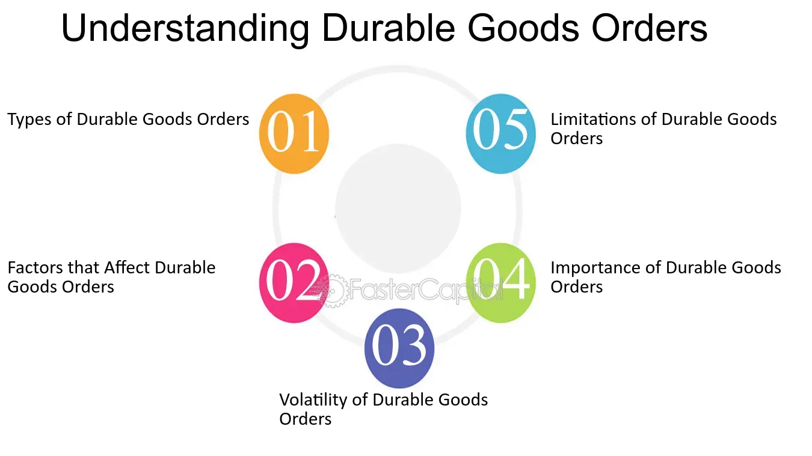

## Table of Contents

## What are durable goods?

Durable goods are items that last a long time and can be used over and over again. These are things like cars, washing machines, and furniture. They are different from things that get used up quickly, like food or soap. People usually spend more money on durable goods because they are meant to last for years.

Buying durable goods is important for the economy. When people buy these items, it can show that they feel confident about their money situation. Companies that make durable goods also create jobs and help the economy grow. So, when you see more people buying things like refrigerators or computers, it often means the economy is doing well.

## Why are durable goods orders important?

Durable goods orders are important because they show how confident people and businesses feel about the economy. When people order more durable goods, like cars or appliances, it means they think they will have enough money in the future to keep using these items. This is a good sign for the economy because it shows people are not worried about losing their jobs or having less money.

Also, when companies get more orders for durable goods, they often need to hire more workers to make these items. This creates more jobs and helps the economy grow. So, watching durable goods orders can help us understand if the economy is getting better or worse. If orders go up, it's usually a good sign that the economy is doing well.

## How are durable goods orders measured?

Durable goods orders are measured by counting how many orders businesses get for these long-lasting items each month. The U.S. government, specifically the Census Bureau, collects this information by asking companies about their orders. They add up all the orders and release a report that shows if orders went up or down compared to the last month.

This report is important because it helps people understand how the economy is doing. If orders for durable goods go up, it means businesses and people are feeling good about spending money on things that last a long time. If orders go down, it might mean people are worried about the future and are not buying as much. Economists and business leaders watch these numbers closely to make decisions.

## What sectors are typically included in durable goods orders?

Durable goods orders include many different types of products that last a long time. Some of the main sectors are transportation equipment, like cars and airplanes. Another big sector is machinery, which includes things like farm equipment and industrial machines. Electronics and appliances, like computers and refrigerators, are also part of durable goods orders. Furniture and household items, such as beds and tables, are included too.

These sectors are important because they show how much people and businesses are willing to spend on things that will last for years. When orders for transportation equipment go up, it often means people feel good about buying cars or companies are investing in new airplanes. If orders for machinery increase, it might mean factories are getting busier and need more equipment. Orders for electronics and appliances can show how much people are spending on home improvements or new technology. Furniture orders can tell us about how many people are moving into new homes or redecorating.

## How often are durable goods orders reported?

Durable goods orders are reported every month. The U.S. Census Bureau collects the data and releases a report that shows how many orders businesses got for long-lasting items like cars, machines, and furniture. This report comes out around the 26th of each month.

The monthly report is important because it helps people understand how the economy is doing. If orders for durable goods go up, it means businesses and people are feeling good about spending money on things that last a long time. If orders go down, it might mean people are worried about the future and are not buying as much. Economists and business leaders watch these numbers closely to make decisions.

## What is the difference between core and non-core durable goods?

Core durable goods are items that last a long time and don't include things that can change a lot from month to month, like cars and planes. These are called "non-defense capital goods excluding aircraft." They are important because they show how much businesses are spending on things they need to keep running, like machines and computers. When people talk about core durable goods, they are looking at a more stable part of the economy that doesn't get affected as much by big, one-time purchases.

Non-core durable goods, on the other hand, include everything that core durable goods leave out. This means they include transportation items like cars, trucks, and airplanes. These items can make the numbers go up and down a lot because people might buy a lot of cars one month and not many the next. Non-core durable goods give a broader picture of what people and businesses are buying, but they can be less reliable for understanding the long-term health of the economy.

## How do durable goods orders impact the economy?

Durable goods orders show how much people and businesses are willing to spend on things that last a long time, like cars and washing machines. When orders go up, it means people feel good about their money and are not worried about the future. This is good for the economy because it means people are buying more and businesses might need to hire more workers to make these goods. More jobs mean more people have money to spend, which helps the economy grow even more.

If durable goods orders go down, it can mean people are worried about losing their jobs or having less money. They might not want to spend on big items that last a long time. This can slow down the economy because businesses might not need to make as many goods, so they might not hire as many people. When fewer people are working, they have less money to spend, which can make the economy weaker. So, watching durable goods orders helps us understand if the economy is getting stronger or weaker.

## What are some common trends observed in durable goods orders data?

Durable goods orders often go up and down because of what's happening in the economy. When the economy is doing well, people feel good about spending money on things like cars and appliances. This means orders for durable goods go up. But if the economy is not doing well, people might be worried about their jobs and money, so they don't buy as many big items. This makes orders go down. Also, big events like holidays or new car models coming out can make orders go up for a short time.

Another trend is that orders for transportation items, like cars and planes, can change a lot from month to month. These big items can make the numbers look very different. That's why economists often look at core durable goods orders, which don't include transportation items. Core orders give a better idea of how businesses are spending on things they need to keep running, like machines and computers. This helps show a more stable picture of the economy.

## How can businesses use durable goods orders data for strategic planning?

Businesses can use durable goods orders data to make smart plans about what to make and sell. If the data shows that orders for things like cars or washing machines are going up, a business might decide to make more of these items. They might also hire more workers to help make these goods. This helps the business be ready to meet the demand and make more money. On the other hand, if orders are going down, a business might choose to make fewer items or look for other things to sell that people want more.

Durable goods orders data can also help businesses understand what people and other businesses are thinking about the economy. If orders are going up, it means people feel good about spending money on big items that last a long time. This can help a business decide to invest in new machines or open new stores because they think the economy will keep doing well. But if orders are going down, a business might be more careful with their money and not make big changes. This way, they can be ready for if the economy gets worse.

## What are the limitations of using durable goods orders as an economic indicator?

Durable goods orders can be a helpful way to see how the economy is doing, but they have some problems. One big problem is that the numbers can change a lot from month to month. This is because big items like cars and airplanes can make the numbers go up or down a lot. If a company gets a big order for airplanes one month, it can make it look like the economy is doing much better than it really is. So, it can be hard to know if the economy is really getting better or if it's just because of one big order.

Another problem is that durable goods orders only show part of the economy. They don't tell us about things like food or clothes, which people buy all the time. Also, the data can be affected by things like holidays or new products coming out. For example, if a new car model comes out, orders might go up for a short time, but that doesn't mean the whole economy is doing better. So, while durable goods orders can give us some information, they need to be used with other data to get a full picture of the economy.

## How do international factors influence durable goods orders?

International factors can have a big impact on durable goods orders. If other countries are doing well, they might buy more things like cars or machines from the U.S. This can make durable goods orders go up. But if other countries are not doing well, they might not buy as much, which can make orders go down. Also, if the value of the U.S. dollar goes up, it can make U.S. goods more expensive for other countries, so they might buy less. On the other hand, if the dollar goes down, U.S. goods can be cheaper, and other countries might buy more.

Another way international factors can affect durable goods orders is through trade policies. If the U.S. puts taxes on goods from other countries, it can make those goods more expensive, and people might buy more U.S.-made durable goods instead. But if other countries put taxes on U.S. goods, it can make it harder for U.S. companies to sell their products abroad, which can lower durable goods orders. So, what happens in other parts of the world can really change how many durable goods are ordered in the U.S.

## What advanced statistical methods can be used to analyze durable goods orders data?

To understand durable goods orders data better, people can use a method called time series analysis. This method looks at how the data changes over time. It can help find patterns, like if orders go up and down at certain times of the year. Time series analysis can also help predict what might happen next. By looking at past data, it can guess if orders will go up or down in the future. This can be really helpful for businesses trying to plan what to make and sell.

Another useful method is regression analysis. This helps see how different things affect durable goods orders. For example, it can show how changes in the economy or interest rates might make orders go up or down. Regression analysis can also help figure out which factors are most important. By understanding these relationships, businesses can make better decisions. They can see what might happen if the economy changes or if they change their prices. This way, they can be ready for different situations.

## What is the importance of durable goods orders in economic analysis?

Durable goods orders are pivotal in economic analysis as they offer invaluable insights into the economic growth trajectory, business investment trends, and consumer confidence levels. This monthly report, released by the U.S. Census Bureau, serves as a critical barometer of economic health, directly affecting various market components and influencing both GDP forecasting and market sentiment.

The role of durable goods orders in gauging economic growth is substantial. An increase in these orders typically signals a rise in business investments, as companies are likely to spend more on capital goods such as machinery, equipment, and vehicles. This points to business confidence in future economic conditions, suggesting a robust economic climate. Conversely, a decrease could imply that businesses are scaling back on investments, potentially due to anticipated economic slowdowns or uncertainty in demand.

This data set holds significant sway over GDP forecasts. Durable goods orders provide an early indication of changes in production activity and industrial output, which are integral parts of Gross Domestic Product calculations. For instance, economists and market analysts incorporate trends from durable goods orders into economic models to refine GDP growth forecasts. The impact can be represented in a simplified form:

$$
\text{GDP growth} \approx \alpha \times \text{Increase in Durable Goods Orders}
$$

where $\alpha$ is a factor representing the proportion of investment impact on GDP growth.

Moreover, the analysis of durable goods orders aids investors in grasping the manufacturing sector's role in ensuring economic stability and identifying future potential. Since durable goods are high-cost items and significant investments, an uptick in their orders often reflects an optimistic outlook from manufacturers regarding consumer demand and their capability to generate revenue. This optimism translates to improved market sentiment, enhancing the attractiveness of equity investments in manufacturing and associated sectors.

Furthermore, the ripple effects from shifts in durable goods orders extend to other economic indicators, such as industrial production and employment rates, thereby painting a comprehensive picture of economic conditions. Investors and policymakers scrutinize these orders to align their strategies with anticipated economic trends, optimize capital allocations, and prioritize policy decisions.

In summary, durable goods orders serve as a fundamental component in economic analysis, embodying the interconnectedness between manufacturing activities and broader economic dynamics. Their influence on GDP projections and market sentiment underscores their critical role in shaping both short-term market reactions and long-term economic planning.

## What are the strategies for utilizing durable goods orders in algo trading?

Algorithmic trading, by utilizing durable goods orders, employs various strategies to optimize market operations. News-based [algorithmic trading](/wiki/algorithmic-trading) is one such approach where trades are executed based on the immediate analysis of durable goods orders as soon as they are released. This involves creating algorithms that react to significant deviations from expected figures, exploiting short-term market inefficiencies. Traders often establish criteria that trigger buy or sell orders depending on whether the durable goods data surpasses or falls short of market forecasts. This responsiveness can capture profit from volatile price movements following unexpected economic news.

Trend-following strategies, on the other hand, focus on the tendency of asset prices to continue moving in the direction of an established trend. In the context of durable goods orders, if the data consistently shows growth, algorithms are programmed to buy stocks in the manufacturing sector, betting on sustained upward [momentum](/wiki/momentum). Mathematical models such as moving average convergence divergence (MACD) can be applied to identify the initiation of these trends.

Mean reversion strategies assume that prices and returns eventually move back to the mean, meaning any significant increase or decrease due to durable goods orders will eventually correct. Algorithms based on this strategy monitor deviations and initiate trades when prices diverge substantially from the average, anticipating a return to normal levels. Calculating the z-score of a stock price in relation to its historical average helps in identifying mean reversion opportunities:

$$

\text{Z-score} = \frac{X - \mu}{\sigma} 
$$

where $X$ is the current price, $\mu$ is the mean, and $\sigma$ is the standard deviation.

Pair trading is another strategy, which involves taking a position in two correlated stocks, betting on their relative performance. For example, an algorithm might buy stock in a company outperforming the sector's durable goods orders, while shorting another that is underperforming, capitalizing on the relative strength or weakness. Advanced statistical models can help identify pairs with strong historical correlations, which if diverged significantly, would likely converge.

Lastly, utilizing advanced trading platforms is crucial for the successful implementation of these strategies. These platforms provide real-time access to durable goods data and other relevant market information, ensuring that trading decisions are informed and executed promptly. Modern platforms integrate [machine learning](/wiki/machine-learning) algorithms, which enhance predictive capabilities and optimize decision-making processes, thereby improving trading efficiency and effectiveness.

## References & Further Reading

[1]: U.S. Census Bureau. ["Manufacturers’ Shipments, Inventories, & Orders (M3) Survey."](https://www.census.gov/manufacturing/m3/index.html)

[2]: Tsay, R. S. (2010). ["Analysis of Financial Time Series."](https://onlinelibrary.wiley.com/doi/book/10.1002/9780470644560) Wiley.

[3]: Pindyck, R. S., & Rubinfeld, D. L. (2017). ["Microeconomics."](https://archive.org/details/microeconomics0007pind) Pearson.

[4]: Kim, K. J. (2003). ["Financial time series forecasting using support vector machines."](https://www.sciencedirect.com/science/article/pii/S0925231203003722) Neurocomputing, 55(1-2), 307-319.

[5]: Lopez de Prado, M. (2018). ["Advances in Financial Machine Learning."](https://www.amazon.com/Advances-Financial-Machine-Learning-Marcos/dp/1119482089) Wiley.