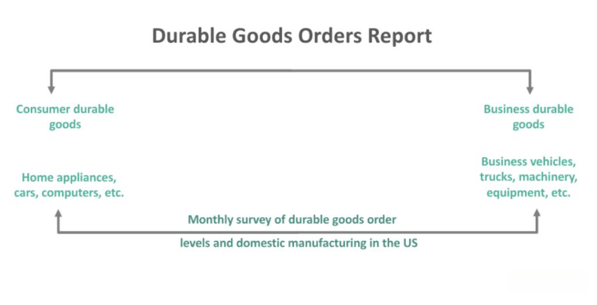

The economic landscape is deeply intertwined with a variety of key indicators that facilitate a comprehensive understanding of market dynamics and forecasting economic growth. Among these indicators, the Durable Goods Orders report stands out as a critical tool for economists, investors, and policymakers. This report, regularly compiled by the U.S. Census Bureau, provides invaluable insights into the health of the manufacturing sector, a pivotal component of the economy. 

Durable goods orders encapsulate the volume of new orders placed with domestic manufacturers for delivery of long-lasting items, typically those expected to last three years or more. Such goods include aircraft, vehicles, household appliances, and machinery. Due to their substantial cost and long-term use, fluctuations in the demand for durable goods often reflect broader economic conditions. An increase in orders generally signals an uptick in economic activity, suggesting enhanced consumer confidence and business investment. Conversely, a decline may portend economic slowdowns, alerting stakeholders to potential contractions in economic output.



In this article, we examine durable goods orders as not only a crucial economic indicator but also as a barometer of manufacturing vitality. Understanding these dynamics is essential for entities across the financial spectrum, from industry analysts to algorithmic traders, who use these insights to make informed decisions in rapidly evolving markets. By analyzing durable goods orders, we can gauge the overall direction of economic trends, anticipate shifts in the manufacturing sector, and leverage this information for strategic advantages in various areas, including sophisticated algorithmic trading systems.

## Table of Contents

## What Are Durable Goods Orders?

Durable goods orders are a crucial metric collected monthly via a survey orchestrated by the United States Census Bureau. This survey quantifies the volume of new orders allocated for manufactured goods expected to endure a minimum of three years. Such goods include automobiles, appliances, and machinery—products not only instrumental in daily life but also economically significant as indicators of industrial strength.

The durable goods report is an essential barometer for investors and analysts as it furnishes invaluable insights into industrial activity and the broader economic landscape. A surge in durable goods orders typically signals a positive trajectory in economic growth. This growth is often indicative of increasing consumer confidence and corporate investment in plant, property, and equipment. Conversely, a downturn in these orders may serve as an early warning of an impending economic slowdown. During such periods, businesses may become cautious, scaling back on inventory accumulation and capital spending, which subsequently affects employment rates and GDP growth.

Understanding data from durable goods orders allows stakeholders to forecast market movements and economic conditions effectively, making it an indispensable tool in both macroeconomic analysis and strategic business decision-making.

## Importance of Durable Goods Orders in Economic Analysis

Durable goods orders are pivotal in economic analysis as they offer invaluable insights into the economic growth trajectory, business investment trends, and consumer confidence levels. This monthly report, released by the U.S. Census Bureau, serves as a critical barometer of economic health, directly affecting various market components and influencing both GDP forecasting and market sentiment.

The role of durable goods orders in gauging economic growth is substantial. An increase in these orders typically signals a rise in business investments, as companies are likely to spend more on capital goods such as machinery, equipment, and vehicles. This points to business confidence in future economic conditions, suggesting a robust economic climate. Conversely, a decrease could imply that businesses are scaling back on investments, potentially due to anticipated economic slowdowns or uncertainty in demand.

This data set holds significant sway over GDP forecasts. Durable goods orders provide an early indication of changes in production activity and industrial output, which are integral parts of Gross Domestic Product calculations. For instance, economists and market analysts incorporate trends from durable goods orders into economic models to refine GDP growth forecasts. The impact can be represented in a simplified form:

$$
\text{GDP growth} \approx \alpha \times \text{Increase in Durable Goods Orders}
$$

where $\alpha$ is a factor representing the proportion of investment impact on GDP growth.

Moreover, the analysis of durable goods orders aids investors in grasping the manufacturing sector's role in ensuring economic stability and identifying future potential. Since durable goods are high-cost items and significant investments, an uptick in their orders often reflects an optimistic outlook from manufacturers regarding consumer demand and their capability to generate revenue. This optimism translates to improved market sentiment, enhancing the attractiveness of equity investments in manufacturing and associated sectors.

Furthermore, the ripple effects from shifts in durable goods orders extend to other economic indicators, such as industrial production and employment rates, thereby painting a comprehensive picture of economic conditions. Investors and policymakers scrutinize these orders to align their strategies with anticipated economic trends, optimize capital allocations, and prioritize policy decisions.

In summary, durable goods orders serve as a fundamental component in economic analysis, embodying the interconnectedness between manufacturing activities and broader economic dynamics. Their influence on GDP projections and market sentiment underscores their critical role in shaping both short-term market reactions and long-term economic planning.

## Durable Goods Orders and Manufacturing Sector

The manufacturing industry uses durable goods orders as a critical tool for projecting production requirements and planning employment levels. Durable goods, defined as manufactured items with a lifespan of at least three years, include products such as vehicles, appliances, machinery, and technology equipment. Monitoring the trends in these orders enables companies within this sector to make strategic decisions regarding production schedules, inventory management, and workforce requirements.

For instance, an increase in durable goods orders typically signals robust demand, prompting manufacturers to ramp up production efforts and, potentially, hire additional workers to meet the demand. Conversely, a decline in orders may lead companies to scale back production or delay capital investment projects, affecting employment levels and operational strategies. This cyclical nature underscores the importance of accurate and timely data from the Durable Goods Orders report.

Moreover, the indicator provides valuable insights into the supply chain dynamics, allowing businesses to optimize their processes. By analyzing trends in durable goods orders, companies can adjust their procurement and inventory strategies to avoid overproduction or stockouts, balancing supply with anticipated demand. This optimization can be critical for sectors like machinery, technology manufacturing, and transportation, where large capital investments and intricate supply chains are at play.

Furthermore, the data from durable goods orders can serve as a forecaster of economic fluctuations, directly influencing companies' strategic planning. For example, an increase in orders for transportation equipment or industrial machinery often indicates future economic expansion, as businesses invest in infrastructure and capacity improvements. In contrast, a slowdown in orders can help businesses anticipate and prepare for potential economic downturns by realigning their production processes and resource allocations. 

In essence, understanding and analyzing durable goods orders equips manufacturing companies with the necessary insights to navigate complex market conditions, ensuring that their operations are responsive and aligned with broader economic trends.

## Algorithmic Trading and Its Link to Economic Indicators

Algorithmic trading involves the use of computer algorithms to automate trading decisions based on predefined criteria. This sophisticated approach to trading is particularly sensitive to economic indicators, such as the durable goods orders report, due to their ability to impact market sentiment and provide snapshots of economic health. The processing speed and precision of algorithms offer traders an edge by reacting almost instantaneously to changes in economic data.

At its core, [algorithmic trading](/wiki/algorithmic-trading) relies on the efficient analysis of vast amounts of data, making it well-suited to handle the timely release of economic indicators. For example, when the durable goods orders report is released, it provides crucial information on business investments in equipment, reflecting both current and future economic activities. As the report's data is disseminated, trading algorithms parse this information to detect anomalies or trends. This rapid analysis allows traders to capitalize on any potential market movements resulting from the news.

The relationship between durable goods orders and financial markets can be seen as twofold. Firstly, a significant rise in durable goods orders typically indicates increased production and investment within the economy, which can lead to bullish market conditions. Conversely, a decline might suggest an economic slowdown, prompting bearish sentiments. Algorithmic traders exploit these signals to adjust their market positions accordingly.

Understanding the integration of durable goods data into trading algorithms can enhance market strategies. For instance, algorithms may be programmed to execute trades when specific thresholds are met, such as a percentage increase or decrease in orders. Python, a prevalent language in algorithmic trading, allows for the implementation of these strategies efficiently. Here is a simple example of how one might code an algorithm to respond to durable goods order data:

```python
import requests

# Hypothetical API endpoint for durable goods data
api_endpoint = "https://api.economicdata.com/durable_goods"

def get_durable_goods_data():
    response = requests.get(api_endpoint)
    return response.json()

def trading_decision(durable_goods_data):
    order_growth_threshold = 5  # 5% growth as a significant threshold
    order_decline_threshold = -5  # -5% decline as a significant threshold

    growth_percentage = durable_goods_data['growth_percentage']

    if growth_percentage > order_growth_threshold:
        return "Buy"
    elif growth_percentage < order_decline_threshold:
        return "Sell"
    else:
        return "Hold"

# Execute the trading decision
data = get_durable_goods_data()
action = trading_decision(data)
print(f"Trading Action: {action}")
```

This example demonstrates a simple algorithm that uses a hypothetical API to obtain durable goods data and makes a basic trading decision based on growth percentage thresholds. By integrating similar logic into more sophisticated systems, traders can enhance their strategy to not only increase profitability but also stabilize their market positions amidst economic fluctuations. Thus, the utilization of economic indicators like durable goods orders is invaluable in the realm of algorithmic trading, where milliseconds can define success or failure in the market.

## Strategies for Utilizing Durable Goods Orders in Algo Trading

Algorithmic trading, by utilizing durable goods orders, employs various strategies to optimize market operations. News-based algorithmic trading is one such approach where trades are executed based on the immediate analysis of durable goods orders as soon as they are released. This involves creating algorithms that react to significant deviations from expected figures, exploiting short-term market inefficiencies. Traders often establish criteria that trigger buy or sell orders depending on whether the durable goods data surpasses or falls short of market forecasts. This responsiveness can capture profit from volatile price movements following unexpected economic news.

Trend-following strategies, on the other hand, focus on the tendency of asset prices to continue moving in the direction of an established trend. In the context of durable goods orders, if the data consistently shows growth, algorithms are programmed to buy stocks in the manufacturing sector, betting on sustained upward [momentum](/wiki/momentum). Mathematical models such as moving average convergence divergence (MACD) can be applied to identify the initiation of these trends.

Mean reversion strategies assume that prices and returns eventually move back to the mean, meaning any significant increase or decrease due to durable goods orders will eventually correct. Algorithms based on this strategy monitor deviations and initiate trades when prices diverge substantially from the average, anticipating a return to normal levels. Calculating the z-score of a stock price in relation to its historical average helps in identifying mean reversion opportunities:

$$

\text{Z-score} = \frac{X - \mu}{\sigma} 
$$

where $X$ is the current price, $\mu$ is the mean, and $\sigma$ is the standard deviation.

Pair trading is another strategy, which involves taking a position in two correlated stocks, betting on their relative performance. For example, an algorithm might buy stock in a company outperforming the sector's durable goods orders, while shorting another that is underperforming, capitalizing on the relative strength or weakness. Advanced statistical models can help identify pairs with strong historical correlations, which if diverged significantly, would likely converge.

Lastly, utilizing advanced trading platforms is crucial for the successful implementation of these strategies. These platforms provide real-time access to durable goods data and other relevant market information, ensuring that trading decisions are informed and executed promptly. Modern platforms integrate [machine learning](/wiki/machine-learning) algorithms, which enhance predictive capabilities and optimize decision-making processes, thereby improving trading efficiency and effectiveness.

## Conclusion

Durable goods orders serve as a vital economic indicator, offering essential insights into the health of the manufacturing sector and the overall trajectory of economic trends. These orders reflect business investment levels and consumer confidence, making them a critical tool for economic analysis and forecasting. Understanding their implications can guide both policymakers and businesses in making informed decisions.

In the context of algorithmic trading, durable goods orders provide substantial opportunities for strategic market engagement. The ability to rapidly process and respond to this economic data enables traders to capitalize on market movements prompted by the report's release. By integrating durable goods data into their algorithms, traders can develop strategies that enhance profitability and align with prevailing market trends.

Harnessing the insights derived from durable goods orders through advanced trading systems can significantly benefit investors. These systems facilitate real-time access to critical economic indicators, allowing investors to make timely and informed decisions. As a result, this can contribute to greater market stability, as market participants base their strategies on comprehensive and current economic information. Overall, the effective use of durable goods orders in both economic analysis and algorithmic trading underscores their significance in maintaining a well-informed and resilient financial market environment.

## References & Further Reading

[1]: U.S. Census Bureau. ["Manufacturers’ Shipments, Inventories, & Orders (M3) Survey."](https://www.census.gov/manufacturing/m3/index.html)

[2]: Tsay, R. S. (2010). ["Analysis of Financial Time Series."](https://onlinelibrary.wiley.com/doi/book/10.1002/9780470644560) Wiley.

[3]: Pindyck, R. S., & Rubinfeld, D. L. (2017). ["Microeconomics."](https://archive.org/details/microeconomics0007pind) Pearson.

[4]: Kim, K. J. (2003). ["Financial time series forecasting using support vector machines."](https://www.sciencedirect.com/science/article/pii/S0925231203003722) Neurocomputing, 55(1-2), 307-319.

[5]: Lopez de Prado, M. (2018). ["Advances in Financial Machine Learning."](https://www.amazon.com/Advances-Financial-Machine-Learning-Marcos/dp/1119482089) Wiley.