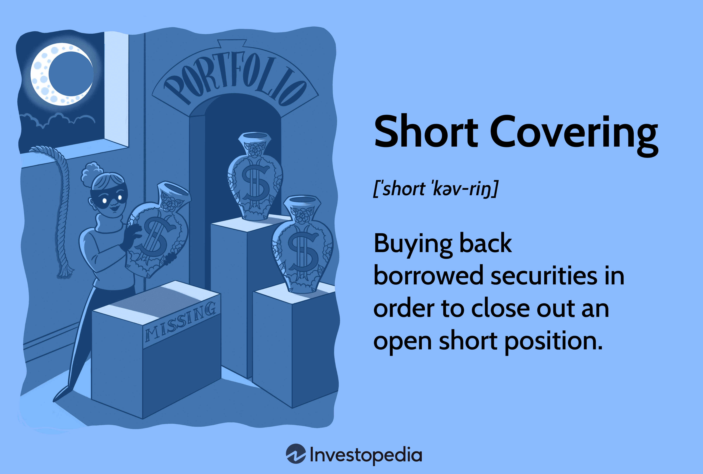

## Table of Contents

## What is short selling?

Short selling is when an investor borrows shares of a stock from someone else and sells those shares right away. The investor hopes that the price of the stock will go down. If it does, they can buy the same number of shares back at the lower price and return them to the person they borrowed from. The investor makes money because they sold the shares at a higher price than they bought them back for.

However, short selling can be risky. If the stock price goes up instead of down, the investor loses money. They still have to buy the shares back to return them, but now they have to pay more than they got when they sold them. This can lead to big losses if the stock price rises a lot. Because of this risk, short selling is usually done by experienced investors who understand the market well.

## What does 'duration before covering' mean in the context of short selling?

In short selling, 'duration before covering' means the amount of time an investor waits before they buy back the shares they borrowed and sold. When an investor shorts a stock, they are betting that the price will go down. They need to buy the shares back eventually to return them to the person they borrowed from. The time between selling the borrowed shares and buying them back is the 'duration before covering.'

This duration is important because it affects how much money the investor can make or lose. If the investor thinks the price will keep going down, they might wait longer before covering. But if the price starts to go up, they might decide to cover sooner to avoid losing more money. The longer they wait, the riskier it gets because the stock price could change a lot.

## Why is the duration before covering important for short sellers?

The duration before covering is really important for short sellers because it decides how much money they can make or lose. When someone shorts a stock, they borrow shares, sell them, and hope the price goes down. If they think the price will keep dropping, they might wait longer before buying the shares back. Waiting longer can mean more profit if the price keeps falling. But it's risky because if the price starts to go up, they could lose a lot of money.

So, short sellers have to think carefully about when to cover. If they cover too soon, they might miss out on more profits if the price keeps going down. But if they wait too long and the price goes up, they'll have to buy the shares back at a higher price than they sold them for. This can lead to big losses. That's why figuring out the right time to cover is a big part of short selling.

## How does the duration before covering affect potential profits or losses?

The duration before covering is super important for short sellers because it can make a big difference in how much money they make or lose. When someone shorts a stock, they borrow shares, sell them, and hope the price goes down. If they think the price will keep dropping, they might wait longer before buying the shares back. Waiting longer can mean more profit if the price keeps falling. For example, if they sold the shares at $50 and the price drops to $40, they can buy back the shares at $40 and make a $10 profit per share.

But waiting too long can be risky. If the price starts to go up instead of down, the short seller could lose money. If they wait and the price goes up to $60, they'll have to buy the shares back at $60, which is $10 more than they sold them for. This means they lose $10 per share. So, short sellers need to be careful about when they decide to cover. They have to balance the chance of making more money by waiting longer with the risk of losing money if the price goes up.

## What are the common factors that influence the decision on when to cover a short position?

When short sellers decide when to cover their position, they look at a few important things. One big thing is how the stock price is moving. If the price keeps going down like they hoped, they might wait longer to buy the shares back because they could make more money. But if the price starts to go up, they might decide to cover sooner to stop their losses from getting bigger. They also watch the market news and any new information about the company, like earnings reports or big announcements, because these can change the stock price quickly.

Another thing that influences their decision is how much risk they're willing to take. Some short sellers might be okay with waiting longer if they think the price will drop even more. But others might want to play it safe and cover their position earlier to avoid big losses. They also think about how long they've been holding the short position. The longer they wait, the more the stock price could change, so they have to be careful about timing their move to buy the shares back.

## Can you explain the concept of a short squeeze and its relation to duration before covering?

A short squeeze is when a lot of people who shorted a stock start to lose money because the stock price goes up instead of down. When this happens, these short sellers rush to buy back the shares they borrowed to stop losing more money. This rush to buy back the shares can push the stock price up even more, making things worse for the short sellers. It's like a snowball effect where the price keeps going up because everyone is trying to cover their short positions at the same time.

The duration before covering is really important in a short squeeze. If short sellers wait too long to cover their positions, they might get caught in a short squeeze. If they see the stock price starting to go up, they need to decide quickly whether to buy back the shares or wait longer. Waiting too long can be risky because if a short squeeze happens, they could lose a lot of money. So, short sellers need to keep a close eye on the stock price and be ready to cover their positions if they think a short squeeze might be coming.

## What are the risks associated with holding a short position for an extended duration?

Holding a short position for a long time can be really risky. The main risk is that the stock price could go up instead of down. If that happens, the short seller will lose money because they have to buy the shares back at a higher price than they sold them for. The longer they wait, the more the stock price could go up, and the bigger their losses could be. This is why short sellers need to watch the stock price carefully and be ready to act fast if things start to go the wrong way.

Another risk is that the short seller might miss important news or changes about the company. If the company does something good, like announcing better earnings or a new product, the stock price could jump up suddenly. This can catch short sellers off guard and lead to big losses. Also, if a lot of other short sellers are in the same position, there could be a short squeeze. This is when everyone tries to buy back their shares at the same time, pushing the stock price up even more. So, holding a short position for too long can be dangerous because there are so many things that could go wrong.

## How do market trends and volatility impact the strategy for duration before covering?

Market trends and how much the market moves around, or [volatility](/wiki/volatility-trading-strategies), can really change how long a short seller waits before covering their position. If the market is going down and stocks are losing value, a short seller might feel good about waiting longer. They think the price will keep dropping, so they can make more money by not covering right away. But if the market is going up, it's a different story. The short seller might get worried and decide to cover sooner to avoid losing money if the stock price keeps going up.

Volatility also plays a big part. If the market is moving a lot, it can be hard to guess what will happen next. A short seller might not want to wait too long because the stock price could suddenly jump up. They need to be ready to cover quickly if things start to change. On the other hand, if the market is calm and not moving much, a short seller might feel safer waiting longer. They can take their time because the stock price isn't likely to change a lot all of a sudden. So, understanding the market trends and how much the market is moving can help a short seller decide the best time to cover their position.

## What are some advanced techniques for determining the optimal duration before covering?

One advanced way to figure out the best time to cover a short position is by using technical analysis. This means looking at charts and patterns to see where the stock price might go next. Short sellers can use things like moving averages, which show the average price of the stock over time, to help decide when to cover. If the stock price starts to move above a key moving average, it might be a sign that the price is going up, and it could be a good time to cover. They can also look at other indicators like the Relative Strength Index (RSI) to see if the stock is overbought or oversold, which can help them decide if the price might change soon.

Another technique is to use [fundamental analysis](/wiki/fundamental-analysis), which involves looking at the company's financial health and news. Short sellers can keep an eye on earnings reports, news about the company, and changes in the industry to guess where the stock price might go. If they see something that could make the stock price go up, like a better-than-expected earnings report, they might decide to cover sooner. They can also use options data to see what other investors are thinking. If a lot of people are buying call options, which bet on the stock price going up, it might be a sign that the stock price could rise, and it's time to cover the short position.

Combining both technical and fundamental analysis can give short sellers a better idea of when to cover. By watching the stock's price movements and understanding the company's situation, they can make smarter decisions about the duration before covering. This can help them avoid big losses and make the most profit from their short positions.

## How do regulatory requirements affect the duration before covering in short selling?

Regulatory requirements can change how [long short](/wiki/equity-long-short) sellers wait before covering their positions. In some places, there are rules about how long you can hold a short position. For example, some countries have a rule called the "uptick rule," which says you can only short a stock if its price has gone up a little bit since the last trade. This can make short sellers more careful about when they cover, because they have to wait for the right moment to short the stock again if they want to keep their position open.

Another way regulations can affect the duration before covering is through margin requirements. These are rules about how much money short sellers need to keep in their account to cover their short positions. If the stock price goes up a lot, the short seller might get a "margin call," which means they have to put more money into their account or cover their position right away. This can push short sellers to cover sooner than they planned, because they don't want to lose more money or be forced to close their position. So, understanding these rules is important for short sellers when deciding how long to wait before covering.

## Can you discuss case studies or historical examples where duration before covering played a critical role?

One famous example where the duration before covering was super important is the case of Volkswagen in 2008. A lot of investors thought the stock price would go down, so they shorted it. But then Porsche announced they owned a lot more of Volkswagen than people thought. This made the stock price shoot up really fast. Short sellers who waited too long to cover their positions lost a ton of money because they had to buy back the shares at a much higher price. This is a classic example of a short squeeze, where waiting too long to cover can lead to huge losses.

Another example is the GameStop short squeeze in early 2021. A bunch of people on social media decided to buy GameStop stock, making its price go up a lot. Many big investors had shorted GameStop, betting its price would go down. When the price started going up, these short sellers had to decide quickly if they should cover their positions. Some waited too long, hoping the price would drop again, but it kept going up. Those who didn't cover soon enough lost a lot of money because they had to buy back the shares at a much higher price than they sold them for. This shows how important it is to watch the market closely and be ready to cover a short position if things start to go the wrong way.

## What are the latest research findings or expert opinions on managing duration before covering in short selling?

Recent research and expert opinions suggest that managing the duration before covering in short selling is crucial for minimizing risk and maximizing profits. Experts emphasize the importance of using both technical and fundamental analysis to make informed decisions. Technical analysis, like watching moving averages and other indicators, can help short sellers spot trends and potential price reversals. Fundamental analysis, such as keeping an eye on company news and earnings reports, helps them understand if the stock's value might change soon. By combining these methods, short sellers can better predict when it's the right time to cover their positions.

Another key finding from recent studies is the impact of market sentiment and social media on short selling strategies. With the rise of platforms like Reddit, where groups of retail investors can influence stock prices, short sellers need to be more aware of these trends. For example, the GameStop short squeeze showed how quickly a stock's price can change due to social media-driven buying. Experts suggest that short sellers should monitor these platforms and be ready to adjust their duration before covering based on shifts in market sentiment. This proactive approach can help them avoid getting caught in a short squeeze and manage their positions more effectively.

## References & Further Reading

[1]: Bergstra, J., Bardenet, R., Bengio, Y., & Kégl, B. (2011). ["Algorithms for Hyper-Parameter Optimization."](https://dl.acm.org/doi/10.5555/2986459.2986743) Advances in Neural Information Processing Systems 24.

[2]: ["Advances in Financial Machine Learning"](https://www.amazon.com/Advances-Financial-Machine-Learning-Marcos/dp/1119482089) by Marcos Lopez de Prado

[3]: ["Evidence-Based Technical Analysis: Applying the Scientific Method and Statistical Inference to Trading Signals"](https://www.amazon.com/Evidence-Based-Technical-Analysis-Scientific-Statistical/dp/0470008741) by David Aronson

[4]: ["Machine Learning for Algorithmic Trading"](https://github.com/stefan-jansen/machine-learning-for-trading) by Stefan Jansen

[5]: ["Quantitative Trading: How to Build Your Own Algorithmic Trading Business"](https://www.amazon.com/Quantitative-Trading-Build-Algorithmic-Business/dp/1119800064) by Ernest P. Chan