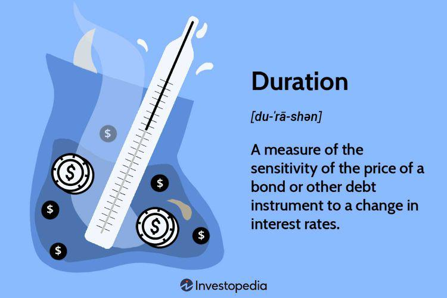

Fixed income securities, such as bonds, play a pivotal role in the financial markets, providing stability and predictable returns for investors. These securities are particularly appealing for those seeking to diversify their portfolios and mitigate risks associated with equity investments. With fixed income instruments, investors essentially lend money to issuers, such as corporations or governments, and receive periodic interest payments over a specified term, along with the return of the principal upon maturity.

The introduction of algorithmic trading and other advanced technologies has brought about significant changes in fixed income investing approaches. These innovations enable traders and investors to execute transactions with unprecedented speed and precision, harnessing vast amounts of data to drive informed decision-making. As a result, the modern landscape of fixed income trading is markedly different from its traditional form.



One crucial concept in fixed income investing is duration, which measures a bond's sensitivity to changes in interest rates. This metric provides insights into the potential volatility of a bond's price as interest rates fluctuate. Understanding duration is vital for managing interest rate risk and aligning investment strategies with market conditions.

Algorithmic trading, by leveraging sophisticated algorithms and machine learning, enhances the management of fixed income investments. It allows for optimal trade execution, better liquidity management, and effective risk control. This confluence of technology and investment strategy opens new avenues for both traditional investors and tech-savvy traders to optimize their returns and manage risks effectively.

In today's rapidly evolving financial markets, it is essential for investors, whether newcomers or seasoned professionals, to grasp these transformational changes. By integrating foundational concepts like duration with the advancements brought by algorithmic trading, investors can navigate the complexities of fixed income markets more confidently and strategically. Understanding these dynamics is key to unlocking the full potential of fixed income securities in a modern investment portfolio.

## Table of Contents

## Understanding Fixed Income Duration

Duration is a fundamental concept in fixed income investing, crucial for assessing the impact of interest rate fluctuations on bond prices. It reflects the weighted average time required to receive a bond's cash flows, allowing investors to estimate the sensitivity of the bond's price to changes in interest rates.

The primary role of duration is to help investors manage [interest rate](/wiki/interest-rate-trading-strategies) risk. Bonds with high duration values are more sensitive to interest rate changes, meaning their prices are likely to experience larger fluctuations with rate shifts. Conversely, bonds with lower duration are less sensitive, exhibiting smaller price changes in response to interest rate variations. Investors can use duration to align their portfolios with their risk tolerance and market outlook, thereby effectively managing interest rate exposure.

There are various measures of duration, each with its specific purpose. Macaulay Duration, one of the earliest measures, expresses duration in years and serves as a foundation for understanding other duration metrics. It calculates the weighted average time until a bondholder receives the cash flows of a bond. The formula for Macaulay Duration $D_M$ is as follows:

$$

D_M = \frac{\sum_{t=1}^{n} \frac{t \times C_t}{(1+y)^t}}{P} 
$$

Where:  
- $D_M$ is the Macaulay Duration,  
- $t$ represents the time period in years,  
- $C_t$ is the cash flow at time $t$,  
- $y$ is the yield to maturity,  
- $P$ is the current bond price.

Modified Duration expands on the Macaulay Duration by quantifying the percentage change in a bond's price for a 1% change in yield, making it a vital tool for assessing a bond's price [volatility](/wiki/volatility-trading-strategies):

$$

Modified\ Duration = \frac{D_M}{1 + \frac{y}{m}} 
$$

Where $m$ is the number of compounding periods per year. This measure is particularly useful for estimating potential price movements due to yield changes.

Beyond Macaulay and Modified Duration, other measures like Effective Duration account for bonds with embedded options. Effective Duration is crucial for analyzing bonds that can be called or put before maturity, as it incorporates the effects of changing cash flows due to these features.

Understanding and utilizing these various duration measures empowers investors to more precisely manage their portfolios' interest rate risk, enhance decision-making, and optimize investment returns in the fixed income market.

## Types of Duration Measures

Macaulay Duration is a fundamental measure used in bond analysis, representing the weighted average time required to receive the bond's cash flows. This duration measure is particularly useful for comparing durations across bonds with different maturity dates by focusing on the timing of cash flows rather than the bond's specific maturity. The formula for Macaulay Duration ($D_M$) is given by:

$$

D_M = \frac{\sum_{t=1}^{T} \left( \frac{t \cdot C_t}{(1 + y)^t} \right)}{\sum_{t=1}^{T} \left( \frac{C_t}{(1 + y)^t} \right)} 
$$

where $t$ represents each time period, $C_t$ is the cash flow at time $t$, $y$ is the yield to maturity, and $T$ is the total number of periods until maturity.

Modified Duration is an extension of Macaulay Duration, providing an estimate of the price sensitivity of a bond to changes in interest rates. It adjusts Macaulay Duration by considering the bond's yield and is expressed as:

$$

D_{Mod} = \frac{D_M}{(1 + y/n)} 
$$

where $n$ is the number of compounding periods per year. Modified Duration is instrumental in assessing a bond's price volatility in response to a 1% change in yield. 

Effective Duration is another critical measure, particularly relevant for bonds with embedded options, such as callable or putable bonds. This measure accounts for changes in a bond's cash flow patterns due to options being exercised when interest rates change. Effective Duration requires a more complex valuation model, often involving scenario analysis or option-adjusted spread models, as it involves estimating how a bond's price responds to various interest rate environments.

These duration measures provide investors with critical tools to assess and manage interest rate risk effectively, allowing for informed decision-making in fixed income portfolio management. Understanding the distinctions and applications of each duration type enhances the investor's ability to implement tailored strategies for risk mitigation and return optimization.

## The Role of Algo Trading in Fixed Income

Algorithmic trading has brought significant evolution to the fixed income market by enabling faster and more precise trading decisions. This approach relies on leveraging historical data and employing advanced algorithms to analyze market conditions and execute trades at optimal times, thus enhancing efficiency and [liquidity](/wiki/liquidity-risk-premium) in trading activities.

In fixed income investing, where bonds and other debt instruments are involved, the use of algo trading systems allows traders to manage risk more effectively by predicting shifts in interest rates and market trends. The algorithms can quickly process vast amounts of data, identifying patterns and making decisions that human traders might miss or take longer to discern. This capability is crucial in the fixed income market, where prices are highly sensitive to changes in interest rates and economic indicators.

AI-driven strategies have further elevated the role of [algorithmic trading](/wiki/algorithmic-trading), offering more sophisticated tools for market prediction and strategy adaptation. These algorithms are built to not only assess current market data but to learn from it, constantly improving their ability to forecast market movements. For example, a [machine learning](/wiki/machine-learning) model might use time series analysis to predict yield curve shifts, taking into account historical rates, economic forecasts, and geopolitical events.

In Python, a basic example of implementing such a predictive model could involve using libraries like `pandas` for data manipulation and `scikit-learn` or `TensorFlow` for building models. Consider the following simplified Python code snippet using linear regression to predict bond prices based on interest rates:

```python
import pandas as pd
from sklearn.model_selection import train_test_split
from sklearn.linear_model import LinearRegression

# Sample data: interest rates and corresponding bond prices
data = pd.DataFrame({
    'interest_rate': [1.5, 1.7, 1.9, 2.1, 2.3, 2.5],
    'bond_price': [105, 104, 102, 101, 99, 97]
})

# Split data into features (X) and target (y)
X = data[['interest_rate']]
y = data['bond_price']

# Split into training and test sets
X_train, X_test, y_train, y_test = train_test_split(X, y, test_size=0.2, random_state=0)

# Create and train the model
model = LinearRegression()
model.fit(X_train, y_train)

# Predict bond prices
predictions = model.predict(X_test)
print(predictions)
```

This basic model can be expanded with more complex algorithms and data inputs to improve accuracy and adapt to the unique features of fixed income markets.

The integration of algorithmic trading and AI technologies not only paves the way for more effective trading strategies but also significantly transforms the landscape of investment management in fixed income markets. By automatically adjusting strategies based on real-time data and predictive analytics, investors can improve their ability to navigate volatile markets and achieve better risk-adjusted returns.

## Strategies for Utilizing Duration in Trading

Investors engage in either long-duration or short-duration strategies based on their predictions of future interest rate movements. A long-duration strategy typically involves holding bonds with a higher sensitivity to interest rate changes, which means that these investments are more beneficial when interest rates are expected to decline. This is due to the inverse relationship between bond prices and interest rates: as rates fall, bond prices typically rise, leading to capital gains. On the other hand, short-duration strategies are designed to reduce exposure to interest rate risk by focusing on bonds that are less sensitive to interest rate changes. These strategies offer protection and stability in a rising rate environment because the lower sensitivity of these bonds helps preserve their value as rates increase.

Algorithmic strategies play a critical role in enhancing these duration-based approaches. By leveraging algorithmic trading, investors and portfolio managers can dynamically adjust the duration of their portfolios in response to real-time market conditions. Algorithms analyze vast amounts of market data to optimize the timing and execution of trades, thus maintaining an optimal portfolio duration even as interest rates fluctuate. The agility of algorithmic strategies enables investors to better manage risk and seize opportunities for gain in volatile market environments.

Traders today increasingly depend on [artificial intelligence](/wiki/ai-artificial-intelligence) (AI) to refine their duration-related strategies. AI algorithms enhance profitability and minimize risk by processing real-time data to forecast interest rate movements and adjust portfolio durations accordingly. For instance, machine learning models can identify patterns in historical interest rate data and use them to predict future trends. By continuously learning from market data, AI-driven algorithms optimize trading decisions and adapt strategies to changing conditions without the need for constant human intervention. This technological approach augments traditional investment strategies, offering a sophisticated toolset for navigating the complexities of fixed income markets.

An example of integrating AI into duration management can be demonstrated using a simple Python script for predictive modeling:

```python
import numpy as np
import pandas as pd
from sklearn.linear_model import LinearRegression
from sklearn.model_selection import train_test_split
from sklearn.metrics import mean_squared_error

# Sample data
data = pd.DataFrame({
    'interest_rate': np.random.rand(100),
    'bond_price': np.random.rand(100)
})

X = data[['interest_rate']]
y = data['bond_price']

# Split data into training and test sets
X_train, X_test, y_train, y_test = train_test_split(X, y, test_size=0.2, random_state=42)

# Train a linear regression model
model = LinearRegression()
model.fit(X_train, y_train)

# Predict and evaluate the model
predictions = model.predict(X_test)
mse = mean_squared_error(y_test, predictions)

print(f'Mean squared error: {mse}')
```

This script demonstrates a basic regression model predicting bond prices based on interest rates. While simplistic, this type of model forms the foundation for more complex AI-driven strategies that can efficiently adjust portfolio durations in response to forecasts of interest rate movements. By integrating advanced algorithms into their strategies, investors not only enhance decision-making capabilities but also achieve superior outcomes in managing fixed income investments.

## Conclusion

As fixed income markets continue to evolve, understanding duration and leveraging algorithmic trading have become essential elements for successful investment strategies. Duration, as a measure of a bond's sensitivity to interest rate changes, remains a fundamental concept for managing interest rate risk. Traditional investment approaches that center on bond selection and duration management provide a solid foundation. However, incorporating algorithmic techniques into these traditional methods can significantly enhance both efficiency and investment outcomes.

By integrating foundational concepts like duration with state-of-the-art technologies, investors can better navigate the complexities of fixed income trading. Algorithmic trading, with its ability to process vast amounts of data and execute trades swiftly, allows for more precise adjustments to changing market conditions. For example, using Python and libraries like NumPy and Pandas, investors can develop algorithms to optimize portfolio duration, thereby effectively managing risk and capitalizing on interest rate movements.

```python
import numpy as np
import pandas as pd

# Example: calculate modified duration
def calculate_modified_duration(price, yield_change, delta_price):
    return -delta_price / (price * yield_change)

# Example bond data
bond_data = {'price': [1000, 950, 1020], 'yield_change': [0.01, 0.015, 0.02], 'delta_price': [-50, 70, 80]}
df = pd.DataFrame(bond_data)

# Calculate modified duration for each bond
df['modified_duration'] = df.apply(lambda row: calculate_modified_duration(row['price'], row['yield_change'], row['delta_price']), axis=1)

print(df)
```

Embracing these advancements offers investors the potential for better risk management while enhancing returns in a rapidly changing market environment. As technology and data analytics continue to transform the fixed income landscape, those who adapt and incorporate these tools will be better positioned to achieve their financial goals.

## References & Further Reading

[1]: Fabozzi, F. J. (2000). ["Fixed Income Analysis."](https://books.google.com/books/about/Fixed_Income_Analysis.html?id=lujLawVLS3YC) John Wiley & Sons.

[2]: Hull, J. (2015). ["Options, Futures, and Other Derivatives."](https://books.google.com/books/about/Options_Futures_and_Other_Derivatives.html?id=t6CSAgAAQBAJ) Pearson Education.

[3]: Chaboud, A. P., Chiquoine, B., Hjalmarsson, E., & Vega, C. (2014). ["Rise of the Machines: Algorithmic Trading in the Foreign Exchange Market."](https://www.jstor.org/stable/43612951) The Review of Financial Studies, 27(9), 2911-2947.

[4]: Fabozzi, F. J., Shiller, R. J., & Tunaru, R. (2010). ["Robust Portfolio Optimization and Management."](http://aida.econ.yale.edu/~shiller/pubs/property-derivatives2010.pdf) John Wiley & Sons.

[5]: Andrews, D. W. K. (1991). ["Heteroskedasticity and Autocorrelation Consistent Covariance Matrix Estimation."](https://www.econometricsociety.org/publications/econometrica/1991/05/01/heteroskedasticity-and-autocorrelation-consistent-covariance) Econometrica, 59(3), 817-858.

[6]: Joshi, M. (2008). ["The Concepts and Practice of Mathematical Finance."](https://assets.cambridge.org/97805215/14088/frontmatter/9780521514088_frontmatter.pdf) Cambridge University Press.

[7]: ["Algorithmic Trading: Winning Strategies and Their Rationale"](https://www.wiley.com/en-us/Algorithmic+Trading%3A+Winning+Strategies+and+Their+Rationale-p-9781118460146) by Ernie Chan

[8]: ["Fixed Income Securities: Tools for Today's Markets"](https://www.wiley.com/en-us/Fixed+Income+Securities%3A+Tools+for+Today%27s+Markets%2C+4th+Edition-p-9781119835554) by Bruce Tuckman and Angel Serrat