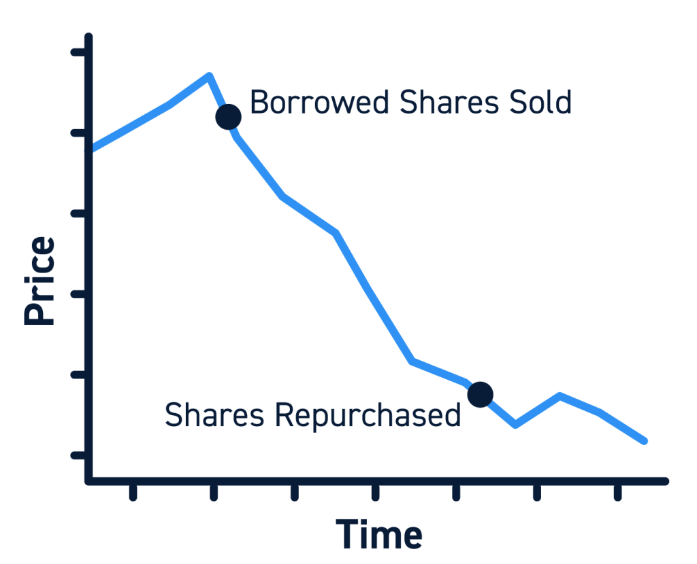

## Table of Contents

## What is short selling?

Short selling is when someone borrows shares of a stock from a broker and sells them, hoping to buy them back later at a lower price. This way, they can return the borrowed shares and keep the difference as profit. It's like betting that the price of a stock will go down instead of up. If the stock price does drop, the short seller can buy the shares back cheaper and make money.

However, short selling can be risky. If the stock price goes up instead of down, the short seller will lose money. They'll have to buy back the shares at a higher price to return them, which means they'll have to pay more than they got from selling them initially. This can lead to big losses, especially if the price keeps rising. So, while short selling can be profitable, it's important to understand the risks involved.

## How long can a short position be held?

A short position can be held for as long as the short seller wants, but there are some things to keep in mind. When you short a stock, you are borrowing shares from a broker. You need to make sure you can keep borrowing those shares for as long as you want to hold your short position. If the broker wants the shares back, you'll have to return them, which means you'll have to buy them back and close your short position.

Also, holding a short position for a long time can be risky. If the stock price goes up while you're holding your short position, you could lose a lot of money. The longer you hold, the more time there is for the stock price to go up. So, while you can technically hold a short position for a long time, you need to be careful and watch the stock price closely.

## What are the basic rules for short selling duration?

When you short sell a stock, you borrow shares from a broker and sell them, hoping to buy them back later at a lower price. There's no set time limit on how long you can hold a short position. You can keep it open as long as you can keep borrowing the shares from your broker. But, if your broker wants the shares back, you'll have to return them by buying them back, which means you'll have to close your short position.

Holding a short position for a long time can be risky. If the stock price goes up while you're holding your short, you could lose a lot of money. The longer you hold, the more time there is for the stock price to go up. So, even though you can hold a short position for a long time, it's important to watch the stock price closely and be ready to close your position if things start going the wrong way.

## What factors influence the decision to close a short position?

When you have a short position, you might decide to close it based on a few key things. One big thing is if the stock price starts going up instead of down. If it goes up a lot, you could lose a lot of money, so you might want to close your short position to stop the losses. Another thing is if your broker wants the shares back that you borrowed to short sell. If they need them back, you have to buy the shares to return them, which means you have to close your short position.

Another factor is if you think the stock has reached its lowest point and might start going up again. If you believe the stock is about to go up, it's a good time to close your short position and take your profits before the price goes up. Also, sometimes news or events can change how you feel about the stock. If something happens that makes you think the stock will do better than you thought, you might decide to close your short position to avoid losing money.

## How does the duration of short selling affect potential profits and losses?

The longer you hold a short position, the more time you have to make money if the stock price goes down. If you think the stock will keep going down, holding your short position for a longer time can lead to bigger profits. But, you have to be careful. If you hold your short position for a long time, there's more chance for the stock price to go up instead. If it goes up, you could lose a lot of money. The longer you wait, the more you could lose if the stock price goes up.

Holding a short position for a long time also means you have to keep borrowing the shares from your broker. If your broker wants the shares back, you have to buy them back to return them, no matter what the price is. This can force you to close your short position at a bad time, which can lead to losses. So, while holding a short position for a long time can lead to bigger profits if the stock price goes down, it also increases the risk of bigger losses if the stock price goes up.

## What are the risks associated with holding a short position for an extended period?

Holding a short position for a long time can be risky. If the stock price goes up while you're holding your short, you could lose a lot of money. The longer you hold, the more time there is for the stock price to go up. This means your losses could get bigger and bigger the longer you wait. It's like betting against the stock, and if you're wrong, the cost can be high.

Another risk is that you have to keep borrowing the shares from your broker. If your broker wants the shares back, you have to buy them back to return them, no matter what the price is. This can force you to close your short position at a bad time, which can lead to losses. So, while holding a short position for a long time can lead to bigger profits if the stock price goes down, it also increases the risk of bigger losses if things don't go your way.

## How do regulatory requirements impact the duration of short selling?

Regulatory requirements can affect how long you can hold a short position. Some rules might say you have to tell people about your short position if it gets really big. This can make it harder to keep your short position secret, which might make you want to close it sooner. Also, some places have rules about how long you can borrow shares to short sell. If you can't borrow the shares anymore, you have to buy them back and close your short position, no matter what the price is.

Another thing is that some countries have rules that can stop short selling completely during certain times, like when the stock market is going down a lot. If this happens, you have to close your short position right away, even if you think the stock price will keep going down. So, knowing the rules in your area is important because they can make you close your short position sooner than you planned.

## What are the differences in short selling duration strategies between retail and institutional investors?

Retail investors, who are everyday people trading on their own, usually don't hold short positions for a long time. They often close their short positions quickly because they don't have a lot of money to lose if the stock price goes up. Retail investors might also not have as much information as big investors, so they might be more likely to close their short positions if they see the stock price starting to go up. They might also be affected more by rules that say they have to tell people about their short positions if they get too big.

On the other hand, institutional investors, like big banks or investment funds, can hold short positions for a longer time. They have more money and can handle bigger losses if the stock price goes up. They also have more information and better ways to figure out if a stock will go down. Institutional investors might use special tools to help them borrow shares for a longer time, so they can keep their short positions open even if the rules change. But, they still have to watch out for rules that might make them close their short positions sooner than they want.

## How can market conditions affect the optimal duration of a short sale?

Market conditions can really change how long you should hold a short sale. If the market is going down and everyone is worried, it might be a good time to hold your short sale for longer. You might think the stock price will keep going down, so you can make more money by waiting. But, you have to be careful. If the market suddenly starts going up because of good news or something else, you could lose a lot of money. So, you need to watch the market closely and be ready to close your short sale if things start to change.

Another thing to think about is how much the market is moving around. If the market is really up and down a lot, it can be hard to know how long to hold your short sale. You might want to close it quickly to avoid big losses if the stock price jumps up. On the other hand, if the market is calm and not moving much, you might feel okay holding your short sale for longer. But, even in a calm market, you need to be ready for surprises that could make the stock price go up. So, market conditions can make a big difference in how long you should hold a short sale, and you always need to be ready to change your plan.

## What advanced techniques can be used to manage the duration of short selling?

One advanced technique to manage the duration of short selling is using stop-loss orders. A stop-loss order is like a safety net. You set a price at which you want to close your short position if the stock price goes up. This can help you limit your losses if the stock price starts to rise. Another technique is using options. Options give you the right to buy or sell a stock at a certain price. You can use options to protect your short position. For example, you can buy a call option to limit your losses if the stock price goes up a lot.

Another way to manage the duration of short selling is by using technical analysis. This means looking at charts and patterns to guess where the stock price might go next. If you see signs that the stock price might go up, you might decide to close your short position sooner. Also, some investors use a technique called "short covering." This is when you buy back the shares you shorted to close your position, but you do it slowly over time. This can help you manage the risk of the stock price going up while you're still short.

These techniques can help you decide how long to hold a short position. But remember, short selling is risky, and even with these advanced techniques, you can still lose money. Always be ready to change your plan if the market or the stock price does something unexpected.

## How does the cost of borrowing shares influence the duration of a short position?

When you short sell, you borrow shares from someone else and sell them, hoping to buy them back later at a lower price. The cost of borrowing those shares can affect how long you want to keep your short position open. If the cost to borrow the shares is low, you might feel okay holding your short position for a longer time because it won't cost you much to keep borrowing. But if the cost to borrow the shares goes up a lot, it can eat into your profits or even make you lose money, so you might decide to close your short position sooner to avoid paying more to borrow the shares.

The cost of borrowing shares can change based on how many people want to borrow them and how many are available to borrow. If a lot of people want to short the same stock, the cost to borrow those shares can go up because there aren't enough shares to go around. This can make you think twice about holding your short position for a long time. If you see that the cost to borrow is going up, you might decide to close your short position to save money, even if you think the stock price will keep going down.

## What historical examples illustrate the impact of short selling duration on market events?

One famous example is the case of Volkswagen in 2008. A lot of people were short selling Volkswagen shares, betting that the price would go down. But then, Porsche announced it had bought a big chunk of Volkswagen shares, which made the stock price shoot up. People who had shorted Volkswagen had to buy back the shares at a much higher price to close their positions. Some of them held their short positions for too long, hoping the price would go back down. But it didn't, and they ended up losing a lot of money. This event showed how dangerous it can be to hold a short position for too long if the stock price suddenly goes up.

Another example is the GameStop short squeeze in 2021. A lot of big investors were short selling GameStop shares, thinking the company was going to do badly. But then, a group of people on the internet decided to buy a lot of GameStop shares to push the price up. This made the short sellers lose money because they had to buy back the shares at a higher price. Some short sellers held their positions hoping the price would drop, but it kept going up. This showed how holding a short position for too long can lead to big losses if the stock price goes against what you expected.

## What is Exploring Short Selling?

Short selling is an investment strategy used to capitalize on declining stock prices. Essentially, an investor borrows shares from a brokerage firm and sells them at the current market price, anticipating that the stock price will drop. If the price does decline, the investor can then buy back the shares at the lower price, return them to the lender, and pocket the difference as profit. This mechanism can be represented simply by:

$$
\text{Profit} = (\text{Sell Price} - \text{Buyback Price}) \times \text{Number of Shares} - \text{Borrowing Costs}
$$

Short sellers contribute significantly to market liquidity and price discovery. By betting against overvalued stocks, they bring information to the market, challenging inflated prices and helping to correct market inefficiencies. Historically, adept short sellers have been praised for exposing fraudulent practices in companies, exemplified by cases like Enron in the early 2000s where short selling revealed financial discrepancies [1].

However, short selling carries inherent risks. The potential for loss is theoretically infinite, as there is no cap on how high a stock's price can rise. If the stock price increases instead of decreasing, short sellers may face substantial financial losses. This risk was vividly illustrated by the GameStop saga in January 2021, where retail investors orchestrated a short squeeze. A short squeeze occurs when a heavily shorted stock's price surges, forcing short sellers to buy back shares at higher prices to cover their positions, further driving up the stock price. This episode demonstrated both the rapid wealth erosion risks for short sellers and the potential for market [volatility](/wiki/volatility-trading-strategies) [2].

Despite the risks, short selling can be a useful tool for hedging and diversifying investment portfolios when combined with effective risk management practices. The strategy allows investors to hedge against potential downturns in other investments, balancing their portfolio exposures across varying market conditions.

References:

1. Partnoy, F. (2009). *The Match King: Ivar Kreuger, the Financial Genius Behind a Century of Wall Street Scandals*. PublicAffairs.
2. Frenkel, S., De La Merced, M. J., Lee, E. (2021). “In GME Frenzy, a Boon for Redditors and a Lesson for Short Sellers.” *The New York Times*. Retrieved from https://www.nytimes.com

Additional reading:

- Greenblatt, J. (2010). *The Big Short: Inside the Doomsday Machine*. W.W. Norton & Company.
- Lhabitant, F-S. (2010). *Hedge Funds: Quantitative Insights*. Wiley Finance.

(Note: Text from the PDF was not used as no PDF was provided during task execution. The content is based on generally known information and supplemented with citations for context.)

## References & Further Reading

### Books and Articles

1. **"Algorithmic Trading: Winning Strategies and Their Rationale" by Ernie Chan**  
   This book provides a comprehensive overview of developing algorithmic trading strategies using quantitative finance principles. It blends theory with practical applications, making it valuable for both novice and experienced traders.

2. **"Short Selling: Strategies, Risks, and Rewards" by Amit Kumar**  
   This text details various short selling strategies, dissecting their risks and benefits. It includes historical examples that clarify the role of short sellers in the market.

3. **"Quantitative Trading: How to Build Your Own Algorithmic Trading Business" by Ernest P. Chan**  
   A practical guide for traders interested in quantitative finance, this book covers the nuts and bolts of building algorithmic trading systems.

4. **"Flash Boys: A Wall Street Revolt" by Michael Lewis**  
   While not a technical guide, this book offers insights into the world of high-frequency trading (HFT) and the impacts of algorithmic trading on markets. It is a narrative account that provides a broader perspective on trading ethics and technological influence.

### Institutional Publications and Papers

1. **“High-Frequency Trading and its Effects on Market Quality” by the Securities and Exchange Commission (SEC)**  
   This paper examines how high-frequency trading impacts various aspects of market quality, including liquidity, volatility, and price discovery.

2. **“Algorithmic and High-Frequency Trading: An Overview” by the Bank for International Settlements (BIS)**  
   A detailed report from BIS that explores the evolution and mechanics of algorithmic and high-frequency trading, along with their market implications.

3. **“Short Selling and Market Efficiency” by the Journal of Finance**  
   An academic paper exploring the relationship between short selling activities and market efficiency, with empirical evidence to support its analyses.

### Online Resources

1. **Investopedia’s Algorithmic Trading and Short Selling Sections**  
   Investopedia offers a plethora of articles and video tutorials explaining the concepts of algorithmic trading and short selling, suitable for all levels of expertise.

2. **QuantConnect and AlgoTrader Platforms**  
   For those interested in practical implementation, these platforms provide resources and tools for [backtesting](/wiki/backtesting) and deploying algorithmic trading strategies.

3. **Coursera and edX Online Courses**  
   These platforms offer courses on algorithmic trading and quantitative finance, equipping learners with the necessary tools and knowledge to be successful in these fields.

### Encouragement for Continuous Learning

Investment strategies like short selling and algorithmic trading are continually evolving with market dynamics and technological advancements. To effectively leverage these strategies, continuous learning and adaptation are essential. Resources such as [books](/wiki/algo-trading-books), institutional publications, academic papers, and online learning platforms provide invaluable knowledge and insights that keep investors abreast of emerging trends and techniques. By staying informed, readers are better positioned to navigate the complexities of the modern stock market and maximize their investment potential.

