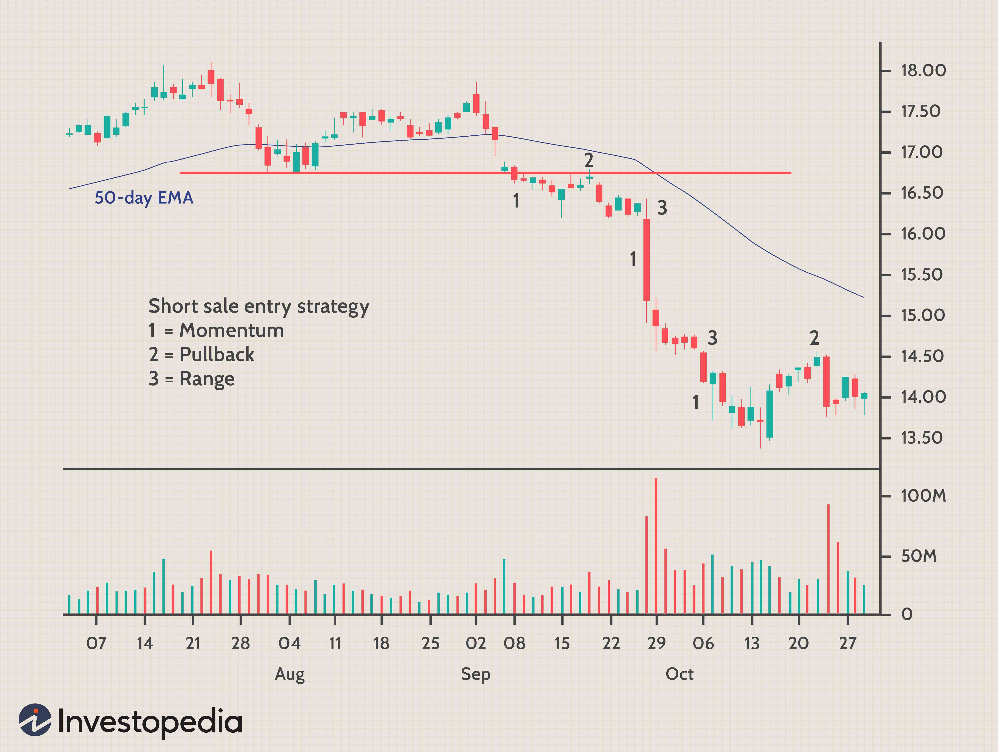

The stock market is an arena providing a spectrum of opportunities for investors, significantly shaped by various trading strategies. Among these, short selling and algorithmic trading stand out for their unique approaches and potential to enhance trading efficiency and profitability. Short selling is a technique where investors borrow stocks to sell them immediately, aiming to buy them back later at a lower price, thus profiting from expected declines in stock values. This strategy not only offers potential profits from falling markets but also plays a role in market liquidity and price discovery.

On the other hand, algorithmic trading employs advanced computer algorithms to execute trades at high speeds and volumes. By leveraging mathematical models and pre-set criteria, it minimizes human intervention, aiming for precision and optimization in trade executions.



This article focuses on understanding how these distinct strategies—one taking advantage of declining stock values and the other emphasizing speed and efficiency—can be harnessed individually and in harmony. The integration of short selling with algorithmic trading holds potential for superior trading performance by combining the predictive aspects of short selling with the execution strength of algorithms. Consequently, a thorough understanding of these strategies could be crucial for investors aspiring to maximize their returns while navigating the complexities of the contemporary stock market.

## Table of Contents

## Understanding Investment in the Stock Market

Investing in the stock market involves purchasing shares of publicly traded companies, thereby acquiring a stake in those businesses. The stock market serves as a crucial platform for companies seeking to raise capital by issuing shares through an Initial Public Offering (IPO). This process, known as a "company float," facilitates the transition of a company's status from private to public, enabling it to access a broader pool of investors.

**Company Floats and Market Dynamics**

The concept of floating a company—commonly referred to as a company "float"—is instrumental in determining a firm's liquidity and market valuation. A well-strategized float attracts a wide array of investors, leading to increased trading activity and enhanced liquidity. Liquidity is essential as it allows investors to buy or sell shares with ease, minimizing the impact on the stock's price. Higher liquidity typically translates into a more accurate reflection of a company's true market value, as it incorporates information from a broad base of market participants.

**Stock Market as a Capital-Raising Platform**

The stock market's significance extends beyond individual companies; it plays a vital role in the broader economic landscape. By facilitating [capital raising](/wiki/hedge-fund-capital-raising), the market allows companies to fund expansion, innovation, and operations—factors that contribute positively to economic growth. This dynamic underscores the market's role as an economic barometer, reflecting broader economic health and investor sentiment.

**Benefits of Stock Market Participation**

For investors, the stock market offers numerous benefits:

1. **Growth Potential**: Historically, the stock market has provided avenues for wealth generation through capital appreciation and dividends.

2. **Diversification**: Investors can diversify their portfolios across different sectors and industries, reducing risk through exposure to a variety of assets.

3. **Liquidity**: The high liquidity of the stock market allows investors to quickly adjust their portfolios in response to market changes or shifts in personal investment goals.

However, participation in the stock market is not without its challenges.

**Challenges for Investors**

1. **Market Volatility**: Stock prices can be highly volatile, influenced by economic data, geopolitical events, and market speculation. This volatility can lead to significant gains or losses.

2. **Information Asymmetry**: Investors often grapple with information asymmetry, where companies and insiders might possess information that is not readily available to the public.

3. **Psychological Factors**: Emotions and biases can significantly impact investment decisions, potentially leading to suboptimal trading behaviors like panic selling or overconfidence.

In conclusion, understanding the foundational aspects of stock market investing—such as company floats, [liquidity](/wiki/liquidity-risk-premium), and the market's capital-raising function—is crucial for investors aiming to navigate its complexities successfully. Despite the inherent challenges, informed and strategic participation in the stock market can yield substantial financial rewards.

## Exploring Short Selling

Short selling is an investment strategy used to capitalize on declining stock prices. Essentially, an investor borrows shares from a brokerage firm and sells them at the current market price, anticipating that the stock price will drop. If the price does decline, the investor can then buy back the shares at the lower price, return them to the lender, and pocket the difference as profit. This mechanism can be represented simply by:

$$
\text{Profit} = (\text{Sell Price} - \text{Buyback Price}) \times \text{Number of Shares} - \text{Borrowing Costs}
$$

Short sellers contribute significantly to market liquidity and price discovery. By betting against overvalued stocks, they bring information to the market, challenging inflated prices and helping to correct market inefficiencies. Historically, adept short sellers have been praised for exposing fraudulent practices in companies, exemplified by cases like Enron in the early 2000s where short selling revealed financial discrepancies [1].

However, short selling carries inherent risks. The potential for loss is theoretically infinite, as there is no cap on how high a stock's price can rise. If the stock price increases instead of decreasing, short sellers may face substantial financial losses. This risk was vividly illustrated by the GameStop saga in January 2021, where retail investors orchestrated a short squeeze. A short squeeze occurs when a heavily shorted stock's price surges, forcing short sellers to buy back shares at higher prices to cover their positions, further driving up the stock price. This episode demonstrated both the rapid wealth erosion risks for short sellers and the potential for market [volatility](/wiki/volatility-trading-strategies) [2].

Despite the risks, short selling can be a useful tool for hedging and diversifying investment portfolios when combined with effective risk management practices. The strategy allows investors to hedge against potential downturns in other investments, balancing their portfolio exposures across varying market conditions.

References:

1. Partnoy, F. (2009). *The Match King: Ivar Kreuger, the Financial Genius Behind a Century of Wall Street Scandals*. PublicAffairs.
2. Frenkel, S., De La Merced, M. J., Lee, E. (2021). “In GME Frenzy, a Boon for Redditors and a Lesson for Short Sellers.” *The New York Times*. Retrieved from https://www.nytimes.com

Additional reading:

- Greenblatt, J. (2010). *The Big Short: Inside the Doomsday Machine*. W.W. Norton & Company.
- Lhabitant, F-S. (2010). *Hedge Funds: Quantitative Insights*. Wiley Finance.

(Note: Text from the PDF was not used as no PDF was provided during task execution. The content is based on generally known information and supplemented with citations for context.)

## The Rise of Algorithmic Trading

Algorithmic trading refers to the use of computer programs and systems to execute stock market trades with minimal human intervention. This method leverages algorithms—sets of predefined rules or instructions based on mathematical models—to evaluate data and execute trades. The rise of [algorithmic trading](/wiki/algorithmic-trading) has significantly transformed stock market operations, predominantly through its contributions to increased efficiency and liquidity.

High-frequency trading ([HFT](/wiki/high-frequency-trading-strategies)), a subset of algorithmic trading, is characterized by high speed and high turnover rates. Algorithms facilitate HFT by executing thousands to millions of transactions in fractions of a second, enabling traders to capitalize on small price discrepancies that exist for mere milliseconds. This speed is achieved through low-latency, high-performance computing, co-location services, and direct market access, allowing traders to act faster than traditional market participants.

Algorithmic trading relies heavily on technical infrastructure. The fundamental technical requirements include high-speed internet connections, powerful computing resources, sophisticated software capable of back-testing, and advanced analytics to process and interpret vast amounts of market data swiftly. Moreover, successful algorithmic trading systems often necessitate the integration of [machine learning](/wiki/machine-learning) and [artificial intelligence](/wiki/ai-artificial-intelligence) technologies to improve prediction models and strategy development.

Typical strategies employed in algorithmic trading include:

1. **Statistical Arbitrage**: Algorithms identify and exploit price inefficiencies across correlated securities by executing simultaneous buy/sell orders to earn profits from short-term trends or mispricings.

2. **Market Making**: Algorithms place simultaneous buy and sell orders for a stock, aiming to profit from the spread between the bid and ask prices. This provides liquidity and ensures tighter spreads, benefiting overall market efficiency.

3. **Trend Following**: By analyzing historical price data and identifying prolonged directional movements, algorithms execute trades that align with the current trend, whether upward or downward.

4. **Mean Reversion**: This strategy assumes that a stock's price will revert to its average over time. Algorithms are programmed to identify stocks that are temporarily trading above or below their historically normal range and execute trades accordingly.

5. **News-based Trading**: Algorithms process real-time news feeds and deploy natural language processing techniques to gauge the potential impact of breaking news on stock prices, executing trades based on sentiment analysis.

In conclusion, the ascent of algorithmic trading has introduced a new paradigm in stock market operations. It combines precision, speed, and advanced statistical analyses to optimize trading strategies, providing a competitive edge over traditional methods. However, this evolution also demands a robust technical setup and continuous refinement of algorithms to adapt to ever-changing market conditions.

## Advantages and Disadvantages

Algorithmic trading has transformed the financial markets, providing numerous advantages to traders and investors. One of the primary benefits is the reduction of transaction costs. Algorithms can execute trades at optimal times, taking advantage of minute market fluctuations that human traders might miss. This capability minimizes the bid-ask spread and the market impact of trades, leading to more cost-efficient execution.

Moreover, algorithmic trading significantly reduces emotional bias. Human emotions such as fear and greed can lead to irrational decision-making, resulting in suboptimal trading outcomes. By using predefined rules and models, algorithmic trading ensures a consistent approach to executing trades, devoid of emotional interference.

However, algorithmic trading is not without challenges. The reliance on technology means there is an inherent dependency that can lead to risks if systems fail. Technical glitches, software bugs, or connectivity issues can result in substantial financial losses. Furthermore, the increasing use of similar algorithms by multiple market participants may contribute to unexpected market behaviors and volatility, often exacerbating market trends rather than stabilizing them.

Ethical concerns also arise in algorithmic trading, primarily due to its potential to manipulate the market. High-frequency trading, a subset of algorithmic trading, has faced criticism for creating an uneven playing field, favoring those with access to superior technology. This has prompted regulatory bodies to impose stricter scrutiny and requirements to ensure fair practices.

In summary, while algorithmic trading offers benefits like reduced costs and elimination of emotional biases, it is accompanied by challenges such as technological dependency, potential market impacts, and ethical concerns, all of which necessitate careful consideration and regulatory oversight.

## Integrating Short Selling and Algo Trading

Integrating the practice of short selling with algorithmic trading represents a sophisticated strategy that combines the potential high returns of directional betting against overvalued stocks with the precision and speed of automated systems. This fusion leverages advanced computational methods to enhance decision-making processes and efficiency.

Short selling involves borrowing securities to sell them with the aim of buying them back at a lower price, thus profiting from the anticipated decline in their value. When integrated into algorithmic trading, this strategy can be optimized through the use of complex algorithms that continuously scan and analyze market data to identify viable short selling opportunities.

### Algorithm Design and Implementation

The creation of algorithms for short selling necessitates a robust understanding of both predictive modeling and real-time data processing. Algorithms are typically designed to comprehend market signals, such as price [momentum](/wiki/momentum), trading [volume](/wiki/volume-trading-strategy) anomalies, and sentiment indicators mined from news feeds or social media platforms. This can be accomplished through machine learning models trained on historical data to predict future price movements and determine optimal points for initiating or closing a short position.

A simplistic example in Python to detect short selling signals might utilize libraries such as pandas for data manipulation and scikit-learn for machine learning:

```python
import pandas as pd
from sklearn.ensemble import RandomForestClassifier
from ta.momentum import RSIIndicator

# Load historical data
data = pd.read_csv('stock_data.csv')
data['RSI'] = RSIIndicator(data['close']).rsi()

# Feature engineering
data['Price_Change'] = data['close'].pct_change()
features = data[['RSI', 'Price_Change']]

# Labels for whether the price decreased the next day
data['Target'] = (data['close'].shift(-1) < data['close']).astype(int)

# Train model
model = RandomForestClassifier()
model.fit(features[:-1], data['Target'][:-1])

# Predict short selling opportunities
predictions = model.predict(features)
```
This code processes historical stock data to generate features and use them for training a machine learning model to predict short selling signals.

### Risk Management Practices

Given the inherent risks associated with both short selling and algorithmic trading, robust risk management strategies are vital. Short selling carries the risk of potentially infinite losses, while reliance on algorithmic models requires safeguards against technological failures or erroneous trading signals. To mitigate these risks, several practices should be employed:

1. **Stop-Loss Orders**: Automatically executing sell orders to limit losses should a short position move unfavorably.
2. **Diversification**: Avoid concentrating short selling strategies on a single security or sector to buffer against systemic risks.
3. **Algorithm Testing and Validation**: Regular backtesting is essential to ensure algorithms perform reliably under varied and unforeseen market conditions.
4. **Real-Time Monitoring**: Continuous oversight of algorithm performance, with provisions for human intervention if anomalies are detected, can help manage and mitigate risk promptly.

Integrating short selling into algorithmic trading thus demands an intricate mix of advanced technical methodologies and prudent risk management, creating a robust framework. This strategic marriage yields opportunities for enhanced returns while safeguarding against the volatile nature of financial markets.

## Case Studies and Examples

### Case Studies and Examples

The 2021 GameStop short squeeze serves as a significant event for analyzing strategies employed in short selling and algorithmic trading. GameStop, a video game retailer, became the center of attention when a large group of retail investors on social media platforms like Reddit's WallStreetBets initiated a massive short squeeze. Short sellers, including several hedge funds, had placed significant bets against GameStop, anticipating its stock price to fall due to fundamental challenges the company was facing. However, the orchestrated buying frenzy by retail investors drove the stock price up dramatically, causing a liquidity crisis for short sellers who were forced to cover their positions at substantial losses. Short sellers can face infinite losses when stock prices rise unchecked, underscoring the inherent risks in this strategy.

Algorithmic traders were also caught off guard during the GameStop frenzy. Many algorithms are designed to react to market trends and momentum; thus, algorithms augmented the volatility by either participating in the buying spikes or rapidly adjusting their parameters in response to unusual trading volumes and price movements. This event highlighted the importance of incorporating flexibility into algorithmic strategies to manage risk during atypical market conditions characterized by abrupt volatility spikes.

Hedge funds, which use sophisticated strategies blending short selling and algorithmic trading, often employ risk management techniques such as pairs trading or statistical [arbitrage](/wiki/arbitrage). These strategies are designed to mitigate risk by balancing long and short positions across correlated assets. For instance, in pairs trading, two correlated stocks are traded in a manner where one is shorted and the other is long, aiming to profit from the relative performance rather than the absolute price movement.

The GameStop event revealed lessons for market participants, emphasizing the necessity of robust risk management protocols. Hedge funds and algorithmic traders must ensure algorithms are equipped to detect and adapt to new market anomalies promptly. This may involve employing machine learning techniques to predict potential short squeeze scenarios or setting alert mechanisms for detecting unusual social media-driven momentum which could impact stock prices.

In summary, the 2021 GameStop short squeeze illustrates the potential vulnerabilities and adaptive requirements for short sellers and algorithmic traders when traditional strategies encounter non-conventional market forces. The event accelerated reassessment of algorithm effectiveness and risk handling measures, creating a landscape focused on enhanced resilience and foresight in trading strategies.

## Conclusion

In examining the strategies of short selling and algorithmic trading, we uncover their significant impact on modern financial markets. Short selling allows investors to benefit from declining stock prices, serving as a mechanism for enhanced liquidity and price discovery. Meanwhile, algorithmic trading enables the execution of trades with unparalleled speed and precision, reducing transaction costs and mitigating emotional biases in decision-making.

The integration of these approaches presents investors with opportunities for significant returns. However, they also entail considerable risks, including potential infinite losses in short selling and the technological dependencies associated with algorithmic trading. Therefore, a balanced approach is essential. Continuous learning and adaptation are critical for investors and traders to remain competitive and responsive to market changes. As trading strategies become more sophisticated, the need for ongoing education and skills development is crucial.

Ultimately, while these strategies offer potent tools for maximizing investment gains, they require careful consideration of their respective risks. Embracing both opportunities and challenges allows investors to navigate the complexities of today's financial markets effectively.

## References & Further Reading

### Books and Articles

1. **"Algorithmic Trading: Winning Strategies and Their Rationale" by Ernie Chan**  
   This book provides a comprehensive overview of developing algorithmic trading strategies using quantitative finance principles. It blends theory with practical applications, making it valuable for both novice and experienced traders.

2. **"Short Selling: Strategies, Risks, and Rewards" by Amit Kumar**  
   This text details various short selling strategies, dissecting their risks and benefits. It includes historical examples that clarify the role of short sellers in the market.

3. **"Quantitative Trading: How to Build Your Own Algorithmic Trading Business" by Ernest P. Chan**  
   A practical guide for traders interested in quantitative finance, this book covers the nuts and bolts of building algorithmic trading systems.

4. **"Flash Boys: A Wall Street Revolt" by Michael Lewis**  
   While not a technical guide, this book offers insights into the world of high-frequency trading (HFT) and the impacts of algorithmic trading on markets. It is a narrative account that provides a broader perspective on trading ethics and technological influence.

### Institutional Publications and Papers

1. **“High-Frequency Trading and its Effects on Market Quality” by the Securities and Exchange Commission (SEC)**  
   This paper examines how high-frequency trading impacts various aspects of market quality, including liquidity, volatility, and price discovery.

2. **“Algorithmic and High-Frequency Trading: An Overview” by the Bank for International Settlements (BIS)**  
   A detailed report from BIS that explores the evolution and mechanics of algorithmic and high-frequency trading, along with their market implications.

3. **“Short Selling and Market Efficiency” by the Journal of Finance**  
   An academic paper exploring the relationship between short selling activities and market efficiency, with empirical evidence to support its analyses.

### Online Resources

1. **Investopedia’s Algorithmic Trading and Short Selling Sections**  
   Investopedia offers a plethora of articles and video tutorials explaining the concepts of algorithmic trading and short selling, suitable for all levels of expertise.

2. **QuantConnect and AlgoTrader Platforms**  
   For those interested in practical implementation, these platforms provide resources and tools for [backtesting](/wiki/backtesting) and deploying algorithmic trading strategies.

3. **Coursera and edX Online Courses**  
   These platforms offer courses on algorithmic trading and quantitative finance, equipping learners with the necessary tools and knowledge to be successful in these fields.

### Encouragement for Continuous Learning

Investment strategies like short selling and algorithmic trading are continually evolving with market dynamics and technological advancements. To effectively leverage these strategies, continuous learning and adaptation are essential. Resources such as [books](/wiki/algo-trading-books), institutional publications, academic papers, and online learning platforms provide invaluable knowledge and insights that keep investors abreast of emerging trends and techniques. By staying informed, readers are better positioned to navigate the complexities of the modern stock market and maximize their investment potential.

