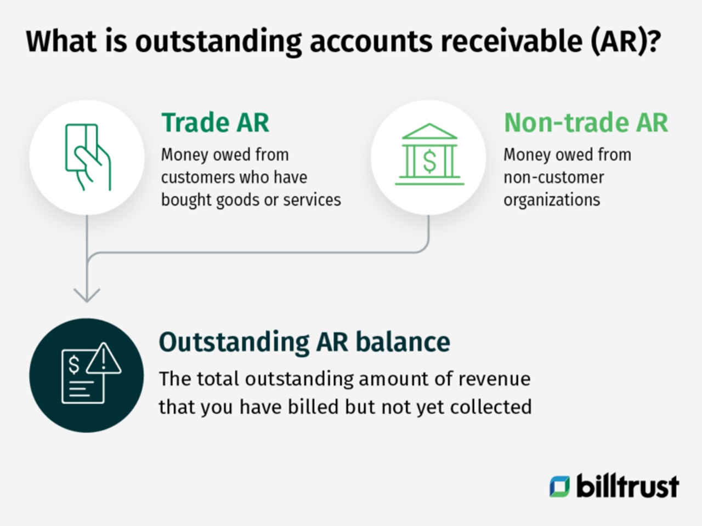

## Table of Contents

## What is the definition of accounts receivable?

Accounts receivable is the money that a business is owed by its customers for goods or services that have been sold but not yet paid for. It is considered an asset on the company's balance sheet because it represents future cash inflows. When a business sells something on credit, it records the amount as accounts receivable, expecting to receive payment at a later date.

Managing accounts receivable is important for a business's cash flow. If customers delay payments or do not pay at all, it can affect the company's ability to pay its own bills. Businesses often set credit terms and may offer discounts for early payment to encourage customers to pay on time. Keeping track of accounts receivable helps businesses understand their financial health and plan for the future.

## Why is the duration of outstanding accounts receivable important for a business?

The duration of outstanding accounts receivable is important for a business because it affects how quickly the company gets paid. If customers take a long time to pay, the business might not have enough money to cover its own bills. This can cause problems with cash flow, making it hard for the business to buy new things or pay employees. Keeping track of how long it takes to get paid helps the business plan better and make sure it always has enough money to keep running smoothly.

Another reason the duration of outstanding accounts receivable matters is that it can show how healthy the business is. If the time to collect money from customers keeps getting longer, it might mean that the business is having trouble getting paid. This could be a warning sign that the business needs to change how it gives credit or chase payments more quickly. By watching this duration closely, the business can take action early to fix any problems and keep its financial situation strong.

## How is the duration of outstanding accounts receivable typically measured?

The duration of outstanding accounts receivable is usually measured by something called the "average collection period." This is the average number of days it takes for a business to get paid after it sells something on credit. To find this number, you take the total accounts receivable and divide it by the total credit sales for a period, then multiply by the number of days in that period.

Another way to measure this is by using the "days sales outstanding" (DSO). DSO is similar to the average collection period but focuses on how many days' worth of sales are still unpaid. You calculate DSO by dividing the total accounts receivable by the total sales for a period, then multiplying by the number of days in that period. Both methods help businesses see how quickly they are getting paid and if they need to do anything to speed up the process.

## What is the difference between average collection period and days sales outstanding (DSO)?

The average collection period and days sales outstanding (DSO) are both ways to measure how long it takes for a business to get paid after selling something on credit. The average collection period is calculated by dividing the total accounts receivable by the total credit sales for a period, then multiplying by the number of days in that period. This gives you the average number of days it takes to collect payments from customers.

DSO is similar but focuses on how many days' worth of sales are still unpaid. To find DSO, you divide the total accounts receivable by the total sales for a period, then multiply by the number of days in that period. While both methods give you an idea of how quickly a business is getting paid, DSO can be used with total sales instead of just credit sales, making it a bit more flexible. Both are important for understanding and managing a business's cash flow.

## What are common industry benchmarks for the duration of outstanding accounts receivable?

Common industry benchmarks for the duration of outstanding accounts receivable can vary a lot depending on the type of business. For example, in the retail industry, the average collection period might be around 30 days. This means that, on average, it takes about a month for a retail business to get paid after selling something on credit. In contrast, in the construction industry, the average collection period can be much longer, sometimes up to 90 days or more, because projects can take a long time to finish and get paid for.

These benchmarks are important because they help businesses see if they are doing better or worse than others in their industry. If a business's average collection period is much longer than the industry average, it might mean that they need to change how they handle credit or chase payments more quickly. On the other hand, if their collection period is shorter than the industry average, it shows that they are doing a good job at getting paid quickly, which is great for their cash flow.

## How can a company calculate its own days sales outstanding?

A company can calculate its own days sales outstanding (DSO) by using a simple formula. First, you need to know the total amount of money that customers owe you at the end of a period, which is your total accounts receivable. Then, you find out how much money you made from sales during that same period. To get the DSO, you divide the total accounts receivable by the total sales, and then multiply that number by the number of days in the period you are looking at. For example, if you have $50,000 in accounts receivable at the end of a 30-day month and your total sales for that month were $200,000, your DSO would be ($50,000 / $200,000) * 30 = 7.5 days.

Knowing your DSO is important because it tells you how quickly you are getting paid by your customers. If your DSO is low, it means you are getting paid quickly, which is good for your cash flow. If your DSO is high, it might mean that you need to look at your credit policies or how you collect payments. By keeping an eye on your DSO, you can make sure your business stays healthy and has enough money to keep running smoothly.

## What factors can affect the duration of outstanding accounts receivable?

Several things can make the time it takes to get paid longer or shorter. One big thing is how a business sets its credit terms. If a business lets customers pay later, like giving them 60 days instead of 30, then it will take longer to get paid. Another thing is how good the business is at chasing payments. If they remind customers to pay on time and follow up quickly, they might get paid faster. Also, the kind of business matters. For example, in industries like construction, projects can take a long time, so getting paid can take longer too.

The economy can also change how quickly a business gets paid. If the economy is doing well, customers might have more money and pay faster. But if the economy is bad, customers might have less money and take longer to pay. Another thing to think about is how much customers trust the business. If customers think the business is doing well and will be around for a long time, they might pay more quickly. But if they think the business might have problems, they might hold onto their money longer. All these things together can make a big difference in how long it takes for a business to get paid.

## What strategies can a business implement to reduce the duration of outstanding accounts receivable?

A business can do several things to get paid faster. One way is to set clear credit terms that customers have to follow. For example, they can tell customers they need to pay within 30 days. They can also offer discounts for paying early, like giving a small discount if the customer pays within 10 days. This can make customers want to pay sooner. Another thing a business can do is to send reminders to customers when payments are due. If a payment is late, the business should follow up quickly and politely to ask for the money. This helps keep the money coming in faster.

Another strategy is to check customers' credit before giving them credit. If a business knows a customer usually pays late, they might want to ask for payment upfront or not give them credit at all. Using technology can also help. Businesses can use software to keep track of who owes them money and send automatic reminders. This saves time and makes sure nothing gets forgotten. Finally, having good relationships with customers can make a big difference. If customers trust the business and feel good about it, they are more likely to pay on time. By using these strategies, a business can make sure it gets paid faster and keeps its cash flow healthy.

## How does the credit policy of a company influence the duration of outstanding accounts receivable?

A company's credit policy plays a big role in how long it takes to get paid. If the policy lets customers take a long time to pay, like 60 or 90 days, then the company will wait longer to get its money. On the other hand, if the policy says customers need to pay quickly, like within 30 days, the company can get its money faster. The credit policy also decides who gets to buy on credit. If the company is strict and only gives credit to customers who always pay on time, it will usually get paid faster than if it gives credit to everyone, even those who might pay late.

Another way the credit policy affects how long it takes to get paid is by setting rules for late payments. If the policy says there will be fees or no more credit for late payments, customers might be more likely to pay on time. The policy can also offer discounts for paying early, which can make customers want to pay sooner. By having a good credit policy, a company can make sure it gets its money back quickly and keeps its cash flow healthy.

## What are the potential risks of having a long duration of outstanding accounts receivable?

Having a long duration of outstanding accounts receivable can be risky for a business. One big risk is that it can hurt the business's cash flow. If customers take a long time to pay, the business might not have enough money to pay its own bills, like rent or salaries. This can make it hard for the business to keep running smoothly. If the business can't buy new things or pay its workers, it might have to borrow money, which can lead to more problems.

Another risk is that the longer the money is outstanding, the more likely it is that customers might not pay at all. This is called bad debt, and it can really hurt the business's profits. If a lot of customers don't pay, the business could lose a lot of money. This can make it hard for the business to plan for the future and might even put it in danger of going out of business. Keeping the duration of outstanding accounts receivable short helps lower these risks and keeps the business strong.

## How can advanced analytics and technology help in managing the duration of outstanding accounts receivable?

Advanced analytics and technology can help businesses manage how long it takes to get paid by making it easier to keep track of who owes them money. With special software, a business can see all its accounts receivable in one place. This software can send reminders to customers when payments are due and even predict which customers might pay late. By using data to understand patterns, the business can make better decisions about who to give credit to and how to chase payments more effectively. This can help the business get paid faster and keep its cash flow healthy.

Technology also helps by making the whole process of managing accounts receivable easier and faster. For example, businesses can use electronic invoices instead of paper ones, which can speed up the payment process. They can also use online payment systems that let customers pay right away. With real-time data, the business can see right away if a payment is late and take action quickly. By using these tools, a business can reduce the time it takes to get paid and lower the risk of not getting paid at all.

## What are the best practices for optimizing the duration of outstanding accounts receivable in different industries?

In the retail industry, one of the best ways to get paid faster is by setting clear credit terms, like asking customers to pay within 30 days. Offering a small discount for paying early can also help. Retail businesses should also use technology to send reminders when payments are due and to keep track of who owes them money. By checking a customer's credit history before giving them credit, a retail business can avoid giving credit to people who might pay late. Good customer relationships are also important because happy customers are more likely to pay on time.

In the construction industry, where projects can take a long time, it's important to have a detailed payment schedule in the contract. This schedule should break down payments into stages, like when certain parts of the project are done. Using technology to manage these payments and send reminders can help keep the money coming in on time. Construction businesses should also be strict about checking a customer's credit before starting a project and might ask for a down payment to reduce the risk of not getting paid. Keeping good communication with clients throughout the project can also make sure payments happen when they're supposed to.

In the healthcare industry, managing accounts receivable can be tricky because of insurance and billing issues. To get paid faster, healthcare providers should make sure their billing is accurate and send out invoices quickly. Using electronic billing systems can speed up the process and reduce mistakes. It's also important to follow up with insurance companies and patients to make sure payments are made on time. By having a clear policy on how payments are handled and using technology to keep track of everything, healthcare businesses can improve their cash flow and reduce how long they wait to get paid.

## What is the understanding of Accounts Receivable and how does payment duration work?

Accounts receivable (AR) represent the outstanding invoices a company expects to collect from its customers. These invoices are financial assets recorded on the company's balance sheet that reflect money owed by clients for goods or services provided. Efficient management of AR is pivotal for maintaining liquidity and operational viability. This involves converting invoices into cash promptly, which facilitates maintaining a stable cash flow. The prompt conversion of AR into cash reduces the likelihood of encountering financial distress and enhances a business's ability to sustain its operations without resorting to external financing.

The duration for payment, typically set at 30, 45, or 60 days, is a critical [factor](/wiki/factor-investing) influencing a company's cash flow and operational continuity. This payment period determines the time frame within which customers are expected to settle their invoices. A longer payment duration can strain a company's cash flow, necessitating the need for borrowing to cover short-term liabilities. Conversely, shorter payment terms improve cash flow by accelerating revenue collection. Businesses can manage credit policies more effectively by analyzing customer payment behaviors and developing tailored strategies for collections. Statistical tools and historical data analysis can be employed to understand patterns in payment behaviors, allowing for optimization of credit and collection strategies.

Improving the turnover of accounts receivable is essential for enhancing cash flow and reducing financial risks. AR turnover, a ratio that measures how efficiently a company collects revenue from its customers, is calculated as follows:

$$
\text{AR Turnover Ratio} = \frac{\text{Net Credit Sales}}{\text{Average Accounts Receivable}}
$$

An elevated AR turnover ratio suggests quicker collection of receivables, indicative of effective credit policies and collection efforts. Implementing automated systems for tracking invoices and payment receipts can assist companies in staying on top of receivables. Additionally, offering customers discounts for early payments, known as cash discounts, can incentivize prompt invoice settlement and improve the AR turnover ratio. Improved turnover not only supports better cash flow management but also reduces the risk of bad debts, thereby enhancing the financial health of a business.

## References & Further Reading

[1]: ["Advances in Financial Machine Learning"](https://www.amazon.com/Advances-Financial-Machine-Learning-Marcos/dp/1119482089) by Marcos Lopez de Prado

[2]: ["Evidence-Based Technical Analysis: Applying the Scientific Method and Statistical Inference to Trading Signals"](https://www.amazon.com/Evidence-Based-Technical-Analysis-Scientific-Statistical/dp/0470008741) by David Aronson

[3]: ["Machine Learning for Algorithmic Trading"](https://github.com/stefan-jansen/machine-learning-for-trading) by Stefan Jansen

[4]: ["Quantitative Trading: How to Build Your Own Algorithmic Trading Business"](https://www.amazon.com/Quantitative-Trading-Build-Algorithmic-Business/dp/1119800064) by Ernest P. Chan

[5]: Mian, S. L., & Smith, C. W. (1992). "Accounts Receivable Management Policy: Theory and Evidence." The Journal of Finance, 47(1), 169-200.