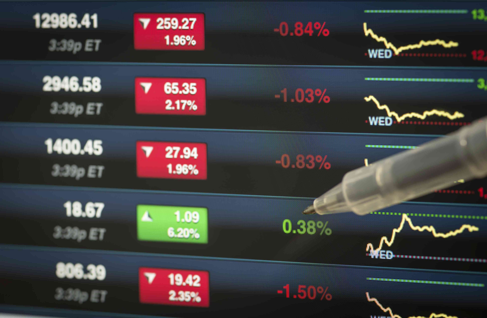

Financial markets are foundational to the global economy, encompassing a range of venues where buyers and sellers exchange financial assets such as stocks, bonds, derivatives, and currencies. These markets facilitate the efficient allocation of resources, price discovery, and risk management. Trading within these markets can be executed through various strategies, one of the most notable being the short position. 

A short position is a trading strategy where an investor sells a security that they do not currently own, with the intention of buying it back at a lower price. This is often done on margin, borrowing the security to sell it and later repurchase it, ideally at a reduced cost to realize a profit. Traders might choose to go short in anticipation of a decline in the security's price, leveraging market downtrends. Notable historical examples of short positions include the actions of investors like George Soros, who famously shorted the British pound in 1992. The practice of short selling can profoundly impact the markets, influencing prices and market sentiments.



Algorithmic trading, or algo trading, involves using computer algorithms to execute trades at speeds and frequencies unimaginable to human traders. It's a significant facet of modern finance, contributing to over 60% of trades in global equity markets. The growth of algo trading is influenced by technological advancements, the need for precision in trade executions, and the ability to capitalize on minute market inefficiencies. These algorithms can process vast amounts of data and employ complex strategies, such as statistical arbitrage and pattern recognition, optimizing trade outcomes and minimizing human errors.

Integrating short positions with algorithmic trading presents a strategic advantage in trading. Algorithms can swiftly analyze market trends and execute short trades with enhanced speed and accuracy, capitalizing on microsecond-level market movements. This integration allows traders to manage risks more effectively and potentially achieve higher returns compared to traditional methods. As financial markets continue to evolve, the synergy between short positions and algorithmic trading is poised to redefine trading strategies, offering robust tools for navigating market volatilities.

## Table of Contents

## Understanding Short Positions in Trading

A short position in trading involves selling a financial asset that the trader does not own, typically by borrowing it from a broker. The intention is to repurchase the asset at a lower price, thereby profiting from the price difference. This strategy is based on the assumption that the asset’s price will decline. The process begins with borrowing shares of a stock or another asset from a brokerage, followed by immediate sale on the open market. When the asset price decreases, the trader buys the asset back at the reduced price and returns it to the lender, pocketing the difference.

Traders might choose to short a position in several scenarios. Common motivations include bearish outlooks, where market sentiment or financial analysis predicts a decline in a stock’s price, or as part of a hedging strategy to protect other investments in their portfolio. For example, if an investor holds a significant number of shares in a particular sector, they might short a related index to mitigate the risk of potential losses from the sector’s downturn.

Historically, short positions have significantly impacted financial markets. A notable example is the global financial crisis of 2008, where the shorting of mortgage-backed securities highlighted vulnerabilities in financial institutions and led to increased scrutiny. Another famous instance is the more recent GameStop short squeeze in January 2021, where retail investors collectively drove up the stock's price, forcing short sellers to incur substantial losses.

The risks associated with short positions are considerable. Unlike long positions where the maximum loss is limited to the invested capital, short selling carries the potential for unlimited losses. As there's no cap on how high an asset's price can rise, a short seller could face losses exceeding their initial investment if they must repurchase at significantly higher prices. Additionally, the borrowing costs for the asset and dividends paid to the real owner during the shorting period can also affect profitability.

However, the rewards can be substantial if the trader's predictions about a price decline materialize. Successful short selling can lead to profits even when broader markets are declining, offering opportunities for gains during bearish market conditions. Furthermore, short selling can serve as a useful tool for portfolio diversification and risk management when used judiciously.

## Algorithmic Trading: An Overview

Algorithmic trading, often abbreviated as algo trading, refers to the use of computer programs and algorithms to execute trades in financial markets. This form of trading is integral to modern finance due to its ability to process vast amounts of market data and execute decisions at speeds unattainable by human traders. The key feature of [algorithmic trading](/wiki/algorithmic-trading) is its reliance on mathematical models and computations to derive trading strategies, thus eliminating emotional biases that typically affect human decision-making.

### Types of Algorithms Used in Trading

There are several types of algorithms employed in trading, each designed to address specific market conditions or objectives:

1. **Trend-Following Algorithms**: These algorithms identify and exploit market trends without forecasting. They primarily use moving averages, channel breakouts, and related filters to determine the trend direction.

2. **Mean Reversion Algorithms**: Based on the assumption that prices fluctuate around a mean value, these algorithms identify opportunities where a security’s price has deviated significantly from its average, betting on a return to the mean.

3. **Arbitrage Algorithms**: These algorithms look for price disparities across different markets or instruments. They are designed to earn risk-free profit by simultaneously buying and selling through these discrepancies, as long as they are greater than the transaction costs involved.

4. **Market-Making Algorithms**: These algorithms place orders on both sides of the order book to capture the spread in volatile and liquid markets. They provide liquidity to the market and profit from bid-ask spreads.

5. **Sentiment-Based Algorithms**: Utilizing data mining techniques on news articles, social media, and other textual sources, these algorithms forecast price movements based on market sentiment.

### Advantages of Algo Trading Over Traditional Methods

The advantages of algorithmic trading over traditional methods are manifold:

- **Speed and Efficiency**: Algorithms can process and analyze market data much faster than any human, executing trades in fractions of a second. This speed is crucial in high-frequency trading, where opportunities may exist for only a few milliseconds.

- **Accuracy and Consistency**: By eliminating the human element, algorithmic trading reduces the likelihood of errors that can occur in manual trading. It ensures consistent execution of trading strategies as outlined in the code.

- **Backtesting and Optimization**: Before deploying an algorithm, traders can backtest it using historical market data to validate the strategy’s effectiveness. This can help optimize parameters to maximize performance before risking capital.

### Managing and Executing Trades Faster and More Efficiently

Algorithmic trading manages and executes trades by leveraging the computational power of modern-day computers. Here's how it achieves speed and efficiency:

- **Data Analysis**: Algorithms continuously scan markets for trading opportunities by analyzing real-time data feeds, which include price and volume data. The calculations are based on predefined criteria established by the trader.

- **Automated Order Placement**: Once a trading signal is generated, algorithms promptly place orders without any delay, ensuring better execution prices and reduced transaction costs.

- **Risk Management**: Algorithms incorporate real-time risk management protocols to actively monitor market conditions, adjusting positions and recalibrating strategies to align with the trader's risk tolerance.

- **Code Example**: A simple example of an algorithmic trading strategy in Python might involve using a moving average crossover strategy. Here is a basic outline using the `pandas` and `numpy` libraries:

```python
import pandas as pd
import numpy as np

# Load historical price data
data = pd.read_csv('stock_prices.csv')

# Calculate moving averages
short_window = 40
long_window = 100

data['Short_MA'] = data['Close'].rolling(window=short_window, min_periods=1).mean()
data['Long_MA'] = data['Close'].rolling(window=long_window, min_periods=1).mean()

# Generate trading signals
data['Signal'] = 0
data['Signal'][short_window:] = np.where(data['Short_MA'][short_window:] > data['Long_MA'][short_window:], 1, -1)

# Execution logic for buy/sell based on 'Signal'
data['Position'] = data['Signal'].shift()

# Evaluate performance of the strategy
data['Strategy_Returns'] = data['Position'] * data['Market_Returns']

# Print resulting DataFrame for trade positions
print(data[['Short_MA', 'Long_MA', 'Signal', 'Position']])
```

In conclusion, algorithmic trading represents a significant evolution in the way trades are executed in financial markets. By utilizing sophisticated algorithms to process information and execute trades at high speeds, it offers numerous advantages over traditional trading methods, making it a vital component of modern finance.

## The Intersection of Short Positions and Algo Trading

Algorithmic trading has revolutionized how short positions are managed and executed, bringing precision and speed to financial markets. By leveraging sophisticated algorithms, traders can dynamically adjust their positions based on real-time market data, enhancing the execution of short positions with an efficiency that surpasses traditional trading methods. 

Algorithms can significantly enhance trade execution for short positions by automating complex processes, analyzing vast datasets, and reacting swiftly to market signals. These algorithms incorporate predefined criteria to initiate short sales, enabling traders to capitalize on market downturns without manual intervention. For example, using a [momentum](/wiki/momentum)-based algorithm, traders can identify bearish trends and execute short positions when a stock price dips below a certain moving average. 

Data and analytics play a crucial role in making informed short calls. Algorithms utilize a range of data, including historical price movements, trading volumes, and market sentiment indicators, to forecast future price changes. These data-driven strategies allow for a more informed approach to short selling, where probabilities and statistical patterns guide decision-making. Machine learning techniques, such as regression analysis and neural networks, can further refine these predictions, offering deeper insights into potential market directions. 

One common strategy combining short positions with algorithmic trading is pairs trading. In this strategy, traders simultaneously short sell one stock while buying another, capitalizing on the relative pricing discrepancies between the two. For instance, if Stock A and Stock B typically move in tandem but Stock A suddenly decreases in value, algorithms might identify it as an anomaly, prompting a short on Stock A and a long position on Stock B. This approach minimizes market risk while potentially profiting from price convergence.

High-frequency trading ([HFT](/wiki/high-frequency-trading-strategies)) has notably impacted short selling by increasing the speed and [volume](/wiki/volume-trading-strategy) at which short positions are executed. HFT firms utilize algorithms to initiate trades in fractions of a second, allowing for rapid exploitation of small price differentials. While HFT can lead to increased market [liquidity](/wiki/liquidity-risk-premium), it also raises concerns about market manipulation and increased [volatility](/wiki/volatility-trading-strategies). The propensity for rapid short selling in significant quantities can exacerbate price declines, posing additional challenges to regulators and market participants. 

In summary, the integration of algorithms enhances the execution of short positions by improving precision, leveraging comprehensive analytics, and exploiting advanced trading strategies like pairs trading. Despite the challenges posed by high-frequency trading, algorithmic approaches provide a powerful toolset for traders navigating the complexities of modern financial markets.

## Advantages of Using Algo Trading for Short Positions

Algorithmic trading offers significant advantages for executing short positions efficiently. One of the primary benefits is the improved speed and precision in executing trades. Algorithms can process large volumes of data and execute trades in milliseconds or even microseconds, which is crucial in today’s fast-paced financial markets. This rapid processing capability ensures that traders can capitalize on short-term market movements and price discrepancies more effectively than manual trading methods.

Another advantage is the reduction of emotional decision-making and human error. Trading, especially short selling, can be highly stressful and subject to psychological biases. Algorithmic systems operate based on predefined criteria and logic, which eliminates impulsive decisions and emotional responses that can arise during market volatility. By adhering strictly to data-driven strategies, these systems enhance the overall discipline of trading operations.

Moreover, algorithmic trading systems enhance the ability to predict market fluctuations and trends. These systems can integrate vast amounts of historical and real-time data to identify patterns and forecast potential market movements. Advanced algorithms employ statistical models and [machine learning](/wiki/machine-learning) techniques to analyze complex datasets, providing traders with insights that are beyond the capabilities of traditional analysis methods.

The potential for greater profitability is another compelling advantage of using sophisticated algorithms for short positions. Sophisticated trading algorithms can optimize entry and [exit](/wiki/exit-strategy) points, adjust to market conditions in real-time, and hedge against losses by executing complex strategies like short squeezes or paired trades. For instance, a Python-based algorithm using libraries such as `pandas` for data manipulation and `scikit-learn` for predictive modeling can be employed to backtest strategies and refine them for maximum efficiency:

```python
import pandas as pd
from sklearn.model_selection import train_test_split
from sklearn.ensemble import RandomForestRegressor

# Load and preprocess market data
data = pd.read_csv('market_data.csv')
features = data.drop('target', axis=1)
target = data['target']

# Split data into training and testing sets
X_train, X_test, y_train, y_test = train_test_split(features, target, test_size=0.2, random_state=42)

# Train a predictive model
model = RandomForestRegressor(n_estimators=100, random_state=42)
model.fit(X_train, y_train)

# Predict market trends
predictions = model.predict(X_test)

# Evaluate model performance
accuracy = model.score(X_test, y_test)
print(f'Prediction accuracy: {accuracy:.2f}')
```

This pseudocode exemplifies how traders can leverage machine learning to enhance decision-making processes for short positions, ultimately improving returns.

In summary, algo trading provides a framework through which traders can harness improved execution speed, reduce psychological biases, anticipate market trends with high accuracy, and exploit profit opportunities through complex and adaptive strategies.

## Challenges in Algo Trading with Short Positions

Algorithmic trading, especially when applied to short positions, presents several challenges that traders and institutions must navigate. One of the primary concerns involves technical and operational risks. These risks encompass software failures, where bugs or glitches in trading algorithms can lead to unintended positions or financial losses. Data inaccuracies further exacerbate these issues; erroneous or delayed data can cause algorithms to make flawed trading decisions. Ensuring robust software testing and using reliable data sources are essential strategies in mitigating these risks.

Market risks specific to algorithmic short selling are another challenge. Short positions require borrowing securities to sell them with the hope that prices will fall. However, if the market moves against the short position, potential losses are theoretically unlimited since asset prices can rise indefinitely. Algorithms need to incorporate contingencies for such adverse movements, often using stop-loss orders or volatility predictions to protect against substantial losses.

Regulatory challenges pose another layer of complexity. Financial markets globally are subject to stringent regulations designed to maintain market stability and protect investor interests. Algorithmic trading, with its high-speed execution capabilities, must comply with rules regarding market manipulation and transparent operations. Compliance requires constant monitoring of regulatory changes and integrating features into trading algorithms that ensure adherence to these regulations.

To mitigate these risks, various strategies are employed. Regular audits and stress tests of algorithmic systems help identify potential vulnerabilities. A robust risk management framework, incorporating real-time monitoring and alerts, can enhance the resilience of algorithms. Advanced machine learning models are increasingly used to predict market anomalies, allowing algorithms to adjust their strategies dynamically.

Moreover, employing a diversified range of algorithms that specialize in different market conditions can reduce reliance on a single trading strategy. This diversification helps manage the inherent risks of short selling, especially during volatile periods.

In summary, while algorithmic trading for short positions offers numerous advantages, it requires careful management of technical, market, and regulatory challenges to be effective. By implementing comprehensive strategies, traders can enhance the reliability and efficiency of their algorithmic short selling approaches.

## Future Trends in Algo Trading and Short Positions

Artificial intelligence (AI) and machine learning (ML) are set to play pivotal roles in the future of algorithmic trading, specifically regarding short positions. These technologies enhance the proficiency of algorithms by allowing them to learn from vast datasets and improve over time. Unlike traditional algorithms that follow predefined instructions, AI-powered systems can adapt their strategies based on market changes and historical performance data.

One significant development in short selling algorithms is the integration of [reinforcement learning](/wiki/reinforcement-learning), a type of machine learning where models learn to make decisions by interacting with the trading environment. This approach enables algorithms to optimize short-selling strategies by minimizing risks and maximizing returns. The complex decision-making process in short selling, which includes determining the right time to enter and exit positions, can greatly benefit from the adaptive capabilities of reinforcement learning.

The impact of regulatory changes also influences the trajectory of algo trading and short positions. Regulators are increasingly scrutinizing algorithmic trading to ensure market stability and prevent manipulative practices such as spoofing. These regulatory pressures may lead to the development of more transparent and robust algorithms that can comply with evolving norms. The introduction of stricter reporting requirements and the need for real-time risk management systems could drive innovations in algorithm design, pushing for greater security and reliability.

Looking ahead, the financial markets' future with advanced trading technologies promises increased efficiency and democratization of trading opportunities. Predictive analytics, fueled by AI, could offer traders unprecedented insights into market trends and potential disruptions. As these technologies mature, they might reduce the entry barriers for retail investors, enabling wider participation in sophisticated trading strategies such as short selling.

In summary, the integration of AI and machine learning in algorithmic trading, combined with anticipated regulatory evolutions, will likely lead to more intelligent, adaptive, and compliant trading systems. These advancements will not only refine short selling strategies but also shape the overall financial landscape, fostering an environment that supports innovation and growth in trading methodologies.

## Conclusion

The combination of algorithmic trading and short positions represents a significant evolution in the mechanisms of financial markets. Algorithmic trading, with its reliance on data-driven strategies and sophisticated algorithms, has revolutionized the way trades are executed, offering efficiency and precision previously unattainable via manual trading. Short positions, which allow traders to benefit from declining asset prices, are naturally amplified by the capabilities of algorithmic systems. This integration facilitates faster execution, minimizes slippage, and optimizes the entry and exit points—factors crucial for the profitability of short trades.

The potential benefits of this combination are profound. Algorithms equipped with advanced analytics can swiftly detect market signals that human traders might miss, allowing for more accurate predictions and timely actions. By reducing emotional biases and cognitive errors that typically plague human traders, algorithmic models enhance decision-making processes. Furthermore, the profitability of short positions can significantly increase when algorithms implement high-frequency trading techniques, capturing minute price discrepancies efficiently.

However, the journey is not without challenges. The technical risks associated with algorithmic trading, such as software glitches or data inaccuracies, can lead to significant financial losses. Market conditions that are unusual or unexpected can pose substantial risks to automated systems, sometimes exacerbating the losses in short positions. Additionally, the regulatory landscape surrounding both algorithmic trading and short selling is continuously evolving, requiring market participants to remain vigilant and adaptive.

Given these complexities, traders are encouraged to explore modern trading strategies that integrate algorithms with short selling. This approach demands a robust understanding of both the technological and regulatory environments. As traders develop and refine these strategies, they contribute to the evolution of dynamic trading ecosystems characterized by increased efficiency and resilience.

Looking forward, the integration of [artificial intelligence](/wiki/ai-artificial-intelligence) and machine learning into algorithmic trading is expected to further enhance these strategies, offering more sophisticated and adaptive trading models. These advancements will likely continue to shape the future of financial markets, paving the way for innovation and growth in trading strategies. Despite the inherent challenges, embracing these technologies is crucial for staying competitive in today's rapidly evolving financial landscape.

## References & Further Reading

[1]: Bergstra, J., Bardenet, R., Bengio, Y., & Kégl, B. (2011). ["Algorithms for Hyper-Parameter Optimization."](https://papers.nips.cc/paper/4443-algorithms-for-hyper-parameter-optimization) Advances in Neural Information Processing Systems 24.

[2]: ["Advances in Financial Machine Learning"](https://www.amazon.com/Advances-Financial-Machine-Learning-Marcos/dp/1119482089) by Marcos Lopez de Prado

[3]: ["Evidence-Based Technical Analysis: Applying the Scientific Method and Statistical Inference to Trading Signals"](https://www.amazon.com/Evidence-Based-Technical-Analysis-Scientific-Statistical/dp/0470008741) by David Aronson

[4]: ["Machine Learning for Algorithmic Trading"](https://github.com/stefan-jansen/machine-learning-for-trading) by Stefan Jansen

[5]: ["Quantitative Trading: How to Build Your Own Algorithmic Trading Business"](https://www.amazon.com/Quantitative-Trading-Build-Algorithmic-Business/dp/1119800064) by Ernest P. Chan