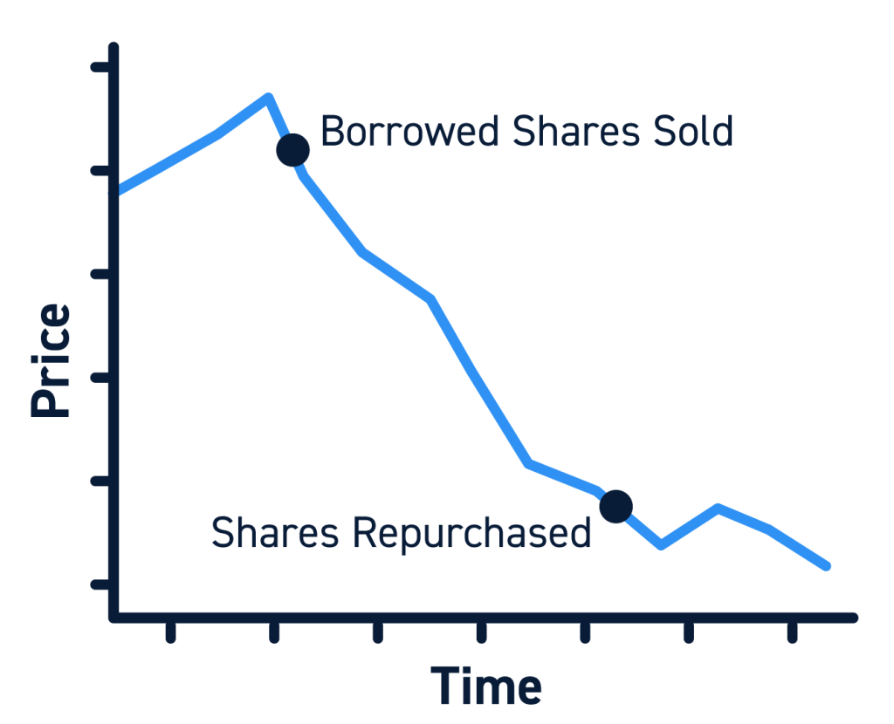

## Table of Contents

## What is a short position in trading?

A short position in trading is when someone sells something they don't own, hoping to buy it back later at a lower price. This is different from a long position, where you buy something and hope its price goes up. People take short positions because they think the price of the thing they're selling will go down.

For example, imagine you think the price of a stock will drop. You can borrow that stock from someone else and sell it right away. If the price does go down, you can buy the stock back at the lower price and give it back to the person you borrowed it from. You make money because you sold it for more than you bought it back for. But if the price goes up instead, you lose money because you have to buy it back at a higher price to return it.

## How long can a short position typically last?

A short position can last as long as the person wants it to, but there are some things to think about. When you take a short position, you are borrowing something to sell it. The person or place you borrowed from might want it back after a while. This means you might have to end your short position sooner than you planned if they ask for it back.

Also, short positions can be risky. If the price of what you sold goes up a lot, you could lose a lot of money. So, people usually don't keep short positions for a very long time because it's too risky. They might keep it for a few days or weeks, but it depends on how much risk they are willing to take and what they think will happen to the price.

## What factors influence the duration of a short position?

The duration of a short position depends on a few things. One big thing is how long the person or place you borrowed from will let you keep the stock. They might want it back after a while, which means you have to end your short position. Another thing is how much risk you want to take. If the price goes up a lot, you could lose a lot of money. So, if you think the price might go up, you might not want to keep the short position for too long.

Another [factor](/wiki/factor-investing) is what you think will happen to the price. If you think the price will go down quickly, you might keep the short position for just a short time. But if you think it will take longer for the price to go down, you might keep it for longer. Also, sometimes there are rules or costs that can make you end the short position sooner. For example, if it costs a lot to keep borrowing the stock, you might not want to keep the short position for too long.

## What are the risks of holding a short position for an extended period?

Holding a short position for a long time can be very risky. The biggest risk is that the price of the stock you sold might go up instead of down. If this happens, you will lose money because you have to buy the stock back at a higher price to return it to the person you borrowed it from. The longer you hold the short position, the more time there is for the price to go up, which means you could lose more money.

Another risk is that the person or place you borrowed the stock from might want it back. If they ask for it back, you have to end your short position, even if the price hasn't gone down yet. This can be a problem if you were hoping to wait longer for the price to drop. Also, keeping a short position for a long time might cost more money because of fees or interest you have to pay for borrowing the stock. These costs can add up and make the short position more expensive to hold.

## How do market conditions affect the decision to maintain or close a short position?

Market conditions play a big role in deciding whether to keep or close a short position. If the market is going down and it looks like it will keep going down, you might want to keep your short position. You think the price will drop more, so you wait to buy the stock back at a lower price. But if the market starts going up, it can be scary. You might decide to close your short position quickly to avoid losing more money if the price keeps rising.

Sometimes, the market can be unpredictable. If there's a lot of news or big events happening, the market might move in ways you didn't expect. This can make it hard to know if you should keep your short position or not. If the market is very unstable, you might choose to close your short position to be safe, even if you think the price might still go down later. It's all about balancing the chance of making more money with the risk of losing money if the market doesn't go the way you hope.

## What are the costs associated with maintaining a short position over time?

Keeping a short position over time can cost you money in different ways. One big cost is the fees you have to pay for borrowing the stock you sold. These fees can add up, especially if you keep the short position for a long time. The longer you hold the stock, the more you have to pay in borrowing fees. Also, if the stock pays dividends, you might have to pay those dividends to the person you borrowed the stock from. This is because you sold the stock, so you owe them any dividends that the stock pays out while you have the short position.

Another cost is the risk of losing money if the stock price goes up. The longer you keep the short position, the more time there is for the price to rise. If it does go up, you will lose money when you have to buy the stock back at the higher price. This can be a big cost if the price goes up a lot. So, you need to think about these costs when deciding how long to keep a short position. It's all about balancing the money you might make if the price goes down with the money you might lose if it goes up, plus the fees you have to pay.

## How can traders use technical analysis to determine the optimal duration of a short position?

Traders can use technical analysis to help decide how long to keep a short position by looking at charts and patterns. They might look for signs that the price will keep going down, like when the price breaks below a key support level. If they see this, they might decide to keep the short position longer because they think the price will drop more. They might also use indicators like moving averages or the Relative Strength Index (RSI) to see if the stock is oversold, which could mean the price might bounce back up soon. If they think the price will bounce back, they might decide to close the short position sooner.

Another way traders use technical analysis is by looking at chart patterns that show when the price might reverse. For example, if they see a pattern like a head and shoulders, it might mean the price is about to go up. If they see this, they might close their short position to avoid losing money if the price does go up. Technical analysis can also help traders set stop-loss orders, which are like safety nets that automatically close the short position if the price goes up too much. This can help them manage the risk of holding a short position for too long.

## What role does fundamental analysis play in deciding the length of a short position?

Fundamental analysis helps traders decide how long to keep a short position by looking at the company's financial health and the overall market conditions. If a trader sees that a company is doing badly, like losing money or having a lot of debt, they might think the stock price will keep going down. This could make them want to keep the short position longer, hoping to buy the stock back at a lower price later. They might also look at things like earnings reports or news about the company to see if there are any signs that the price will drop more.

On the other hand, if [fundamental analysis](/wiki/fundamental-analysis) shows that the company's problems are getting better, or if there's good news that could make the stock price go up, a trader might decide to close the short position sooner. They don't want to lose money if the price starts to rise. So, fundamental analysis helps traders balance the risks and rewards of holding a short position, by giving them a better idea of what might happen to the stock price in the future.

## Can regulatory changes impact the duration of short positions?

Yes, regulatory changes can affect how long someone might keep a short position. If the government or financial authorities change the rules about short selling, it might make it harder or more expensive to keep a short position. For example, if new rules say you have to report your short positions more often or pay higher fees, you might decide to close your short position sooner to avoid these costs or extra work.

Also, some regulatory changes might limit how long you can keep a short position. If the rules change and say you can only borrow a stock for a certain amount of time, you might have to close your short position earlier than you planned. So, it's important to keep an eye on any regulatory news because it can change how you manage your short positions.

## How do experienced traders manage the duration of their short positions differently from beginners?

Experienced traders usually have a better understanding of how to manage the duration of their short positions compared to beginners. They know how to use technical and fundamental analysis to make smarter decisions about when to keep or close their positions. They look at charts, patterns, and financial reports to guess where the stock price might go next. They also pay attention to market news and regulatory changes that could affect their short positions. Because they have more experience, they are better at balancing the risks and rewards of holding a short position for a longer time.

Beginners, on the other hand, might not know as much about these things. They might hold onto a short position for too long because they don't understand the risks or they might close it too soon because they're scared of losing money. They might not look at all the information that experienced traders use, like technical indicators or company financials. As a result, beginners might make decisions based on emotions rather than careful analysis. Over time, as they learn more and gain experience, beginners can start to manage their short positions more like experienced traders do.

## What are some advanced strategies for timing the exit of a short position?

Experienced traders use advanced strategies to decide when to [exit](/wiki/exit-strategy) a short position. One strategy is to use stop-loss orders, which automatically close the short position if the stock price goes up to a certain level. This helps limit losses if the price moves against them. Another strategy is to use technical indicators like the Relative Strength Index (RSI) or moving averages to spot when a stock might be about to reverse. If these indicators show that the stock is oversold or the price is about to go up, traders might decide it's time to close their short position to avoid a price increase.

Another strategy involves looking at market sentiment and news. If there's a lot of positive news about the company or the market, it might be a sign that the stock price will go up. Experienced traders might close their short position before this happens to avoid losses. They also might use options strategies, like buying call options to hedge their short positions. This means if the stock price goes up, the call options can help offset some of the losses from the short position. By using these strategies, experienced traders can better time their exits and manage the risks of holding short positions.

## How can historical data be used to predict the optimal duration of short positions?

Traders can use historical data to guess how long they should keep a short position by looking at how stocks have moved in the past. They can study old stock prices and see how long it usually takes for a stock to go down after it starts dropping. If they find that a certain stock often goes down for a few weeks before going back up, they might decide to keep their short position for about that long. Historical data can also show them times when the market was like it is now, and what happened to stock prices back then. This can help them make a better guess about what might happen next.

But using historical data isn't perfect. The past doesn't always tell us what will happen in the future, because things like news, company changes, or big world events can make stock prices move differently. Still, by looking at a lot of old data, traders can spot patterns and trends that might help them decide when to close their short position. They can use this information to set up plans, like stop-loss orders, to help them exit their short position at the right time and not lose too much money if the stock price goes up.

## References & Further Reading

[1]: Bergstra, J., Bardenet, R., Bengio, Y., & Kégl, B. (2011). ["Algorithms for Hyper-Parameter Optimization."](https://papers.nips.cc/paper/4443-algorithms-for-hyper-parameter-optimization) Advances in Neural Information Processing Systems 24.

[2]: ["Advances in Financial Machine Learning"](https://www.amazon.com/Advances-Financial-Machine-Learning-Marcos/dp/1119482089) by Marcos Lopez de Prado

[3]: ["Evidence-Based Technical Analysis: Applying the Scientific Method and Statistical Inference to Trading Signals"](https://www.amazon.com/Evidence-Based-Technical-Analysis-Scientific-Statistical/dp/0470008741) by David Aronson

[4]: ["Machine Learning for Algorithmic Trading"](https://github.com/stefan-jansen/machine-learning-for-trading) by Stefan Jansen

[5]: ["Quantitative Trading: How to Build Your Own Algorithmic Trading Business"](https://www.amazon.com/Quantitative-Trading-Build-Algorithmic-Business/dp/1119800064) by Ernest P. Chan