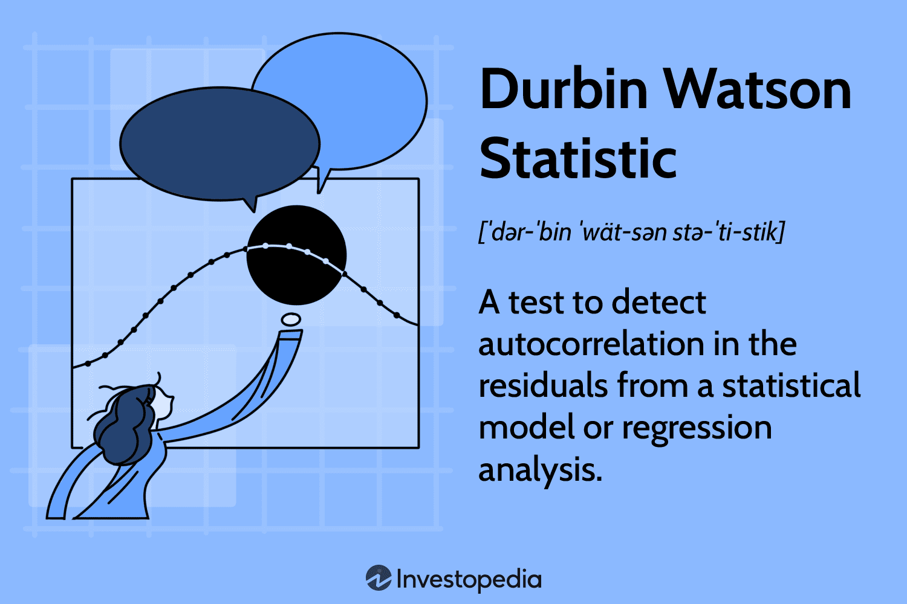

In the rapidly advancing field of algorithmic trading, traders utilize a variety of sophisticated statistical tools to aid in the design, analysis, and enhancement of their trading strategies. One integral instrument in this arsenal is the Durbin-Watson statistic. This statistic plays a crucial role in the analysis of autocorrelation within the residuals of regression models.

Autocorrelation, the correlation of a signal with a delayed copy of itself, can dramatically affect the accuracy and reliability of predictions derived from historical data. The Durbin-Watson test helps detect the presence of autocorrelation at lag 1, a vital factor in assessing the validity of regression models. A thorough understanding of how to deploy the Durbin-Watson test effectively equips algorithmic traders with insights into both market trends and potential prediction errors.



In the context of regression analysis, the Durbin-Watson statistic ranges from 0 to 4. A value of 2 indicates no autocorrelation, values below 2 suggest positive autocorrelation, and values above 2 point to negative autocorrelation. By accurately identifying these patterns, traders can refine their models to mitigate prediction errors, ultimately leading to more consistent and reliable trading strategies.

This article will cover the essential components of the Durbin-Watson test, its implications for regression analysis, and its significance in algorithmic trading. For both seasoned traders and statistical enthusiasts, employing the Durbin-Watson test in trading models through advanced statistical tests can result in more robust and dependable outcomes.

## Table of Contents

## Understanding the Durbin-Watson Statistic

The Durbin-Watson (DW) statistic serves as a critical tool in regression analysis to identify autocorrelation at lag 1 in the residuals. The value of the Durbin-Watson statistic, calculated from the residuals of a regression model, can range from 0 to 4. A value near 2 signifies no autocorrelation, while values lower than 2 point toward positive autocorrelation and values higher than 2 indicate negative autocorrelation.

The importance of understanding autocorrelation in the context of financial markets stems from its impact on the predictability of security prices based on historical data. Autocorrelation measures the correlation of a time series with its own past values, indicating the degree to which past data points influence the current data point. This is particularly vital in financial markets where past price movements often inform future trends, affecting the decisions made by traders.

To calculate the Durbin-Watson statistic, the following formula is used:

$$
DW = \frac{\sum_{t=2}^{n} (e_t - e_{t-1})^2}{\sum_{t=1}^{n} e_t^2}
$$

where $e_t$ represents the residual at time $t$, and $n$ is the number of observations. This formula essentially sums the squared differences between successive residuals and divides by the sum of squared residuals, providing a measure of the degree to which residuals are correlated.

Interpreting the DW statistic requires consideration of its bounds and critical values. When utilized within regression models, a DW value significantly lower than 2 suggests residual autocorrelation which could undermine the model's predictive power. Similarly, values markedly higher than 2 may indicate negative autocorrelation, which also needs addressing to maintain model integrity.

For analysts and traders, understanding the nuances of the Durbin-Watson statistic enables the refinement of predictive models by identifying and adjusting for potential autocorrelation. This fosters more reliable and accurate models, crucial for effective [algorithmic trading](/wiki/algorithmic-trading) strategies. As such, integrating the DW statistic into the evaluation of regression models enhances the interpretation of time series data, aiding in the development of robust trading algorithms.

## Application in Regression Analysis

Regression analysis serves as a pivotal element of predictive modeling, particularly within the algorithmic trading domain, to anticipate stock prices and market trends. However, a significant challenge in regression analysis is the assumption that residuals are uncorrelated. The presence of autocorrelation in regression residuals can lead to inefficiencies in parameter estimates and erroneous conclusions regarding the relationships among variables. Autocorrelation indicates that residuals are sequentially correlated, violating the assumption of independence. This often results in underestimated standard errors, inflated R-squared values, and overconfident predictions that do not generalize well to new data.

The Durbin-Watson (DW) statistic is a crucial diagnostic tool used to detect autocorrelation in regression residuals. It quantifies the degree to which sequential residuals are similar to one another. The DW statistic is calculated using the formula:

$$

DW = \frac{\sum_{i=2}^{n}(e_i - e_{i-1})^2}{\sum_{i=1}^{n}e_i^2} 
$$

where $e_i$ represents the residuals from the regression, and $n$ is the total number of observations. The test statistic value ranges between 0 and 4, where a value near 2 suggests no autocorrelation, values less than 2 indicate positive autocorrelation, and values greater than 2 suggest negative autocorrelation.

Applying the Durbin-Watson test enables traders to diagnose whether the assumptions of their regression models hold true, thereby enhancing the reliability of their predictive models. Identifying autocorrelation alerts traders to potential issues in their regression models, guiding them towards corrective measures that ensure model validity.

To effectively incorporate the Durbin-Watson test in regression analysis, practitioners can use statistical software such as Python. The following Python code snippet demonstrates the implementation of the Durbin-Watson test using the `statsmodels` library:

```python
import statsmodels.api as sm
import numpy as np

# Example regression data
X = np.random.rand(100, 3)  # Independent variables
y = X @ np.array([1.5, -2.0, 3.0]) + np.random.randn(100) * 0.5  # Dependent variable with some noise

# Add a constant to the model (y-intercept)
X = sm.add_constant(X)

# Fit the regression model
model = sm.OLS(y, X).fit()

# Calculate the Durbin-Watson statistic
dw_statistic = sm.stats.durbin_watson(model.resid)
print(f'Durbin-Watson Statistic: {dw_statistic}')
```

Through this code, traders can readily assess the presence of autocorrelation in their regression models. Ensuring the absence of autocorrelation through the DW test leads to enhanced model accuracy, allowing traders to make informed decisions based on more reliable forecasts. By integrating the Durbin-Watson statistic as part of the regression analysis toolkit, algorithmic traders can refine their strategies and improve the robustness of their trading models.

## The Role in Algorithmic Trading

Algorithmic trading relies on statistical models that automate decision-making through predefined strategies. The integration of the Durbin-Watson test within these models is essential for refining strategies by identifying and addressing autocorrelation issues, which can impair the effectiveness of trading algorithms.

Incorporating the Durbin-Watson statistic helps traders identify autocorrelation in the residuals of regression models. This is crucial because autocorrelation, or correlation between successive residuals, can imply that the model is misrepresenting the time series data. An uncompensated autocorrelation may lead to inefficiencies in trading models and potentially flawed decision-making processes. The Durbin-Watson test provides a formal means to detect this issue, with its statistic ideally approaching the value of two in the absence of first-order autocorrelation.

Traders enhance model performance by correcting for detected autocorrelation, thus improving the predictive power and precision of their trading systems. For example, a Durbin-Watson statistic significantly different from 2 prompts a trader to revisit the model specifications and consider techniques like introducing lag variables or transforming data to rectify autocorrelation, leading to a more calibrated and effective algorithmic strategy.

Detecting autocorrelation also aids in comprehending asset price movements more accurately. For instance, in a time series model of stock prices where successive periods show evidence of autocorrelation, utilizing the Durbin-Watson test helps refine the model by accounting for these interdependencies. This makes the algorithm's predictions more attuned to the underlying market dynamics, thereby enhancing accuracy.

In practical applications, case studies show how the Durbin-Watson test is used by quantitative analysts to validate trading strategies. A trader might apply the Durbin-Watson test as part of their [backtesting](/wiki/backtesting) routine, ensuring the model's residuals are minimally autocorrelated. By confirming the efficiency of the model, traders can make informed decisions with higher confidence in their algorithmic outcomes.

In summary, the Durbin-Watson test is pivotal for verifying and improving the statistical integrity of trading models. By addressing autocorrelation concerns, it enhances the fidelity and efficacy of algorithmic trading strategies, ensuring algorithms are based on reliable data interpretations and are able to adapt to real-time market changes efficiently.

## Addressing Autocorrelation Issues

When autocorrelation is detected in a time series, it is crucial to address it to maintain the reliability of statistical models and trading strategies. Autocorrelation can distort estimates of model parameters and undermine the assumptions on which many statistical methods are based. Fortunately, several techniques can be employed to mitigate autocorrelation.

**Introduction of Lag Variables**

One of the primary methods to correct for autocorrelation involves introducing lagged variables. This strategy involves incorporating previous observations as additional predictors in the model. For instance, if we suspect autocorrelation at lag 1, including the lagged value of the dependent variable can potentially capture the serial dependency:

$$

Y_t = \beta_0 + \beta_1 X_t + \beta_2 Y_{t-1} + \epsilon_t 
$$

In this model, $Y_{t-1}$ is the lagged dependent variable.

**Differencing the Data**

Differencing is another common technique, especially useful for non-stationary time series. By taking the difference between consecutive observations, this method can help remove trends and stochastic components inducing autocorrelation:

$$

Y_t' = Y_t - Y_{t-1} 
$$

This process may be repeated, known as differencing of order $d$, to achieve stationarity.

**Model Transformation**

Transforming the model, such as through a logarithmic or Box-Cox transformation, can sometimes address autocorrelation. Such transformations can stabilize the variance across the data, reducing autocorrelation.

**Cochrane-Orcutt Procedure**

The Cochrane-Orcutt procedure is highly effective for addressing first-order autocorrelation ($\rho$). This iterative method involves estimating the autocorrelation parameter and then transforming the regression model to account for it. This can be implemented by:

1. Estimating the original regression model to obtain residuals.
2. Calculating the autocorrelation coefficient ($\rho$) from these residuals.
3. Transforming the data using $\rho$:
$$
   Y_t - \rho Y_{t-1} = \beta_0(1 - \rho) + \beta_1 (X_t - \rho X_{t-1}) + v_t

$$

4. Re-estimating the regression model using the transformed variables.
5. Repeating these steps until $\rho$ stabilizes.

**Statistical Software Implementation**

Most modern statistical software, such as R, Python's statsmodels, and others, can detect and adjust for autocorrelation:

Here is an example using Python's statsmodels library to detect and rectify autocorrelation:

```python
import pandas as pd
import numpy as np
from statsmodels.tsa.stattools import adfuller
from statsmodels.regression.linear_model import OLS
from statsmodels.stats.stattools import durbin_watson
from statsmodels.regression.linear_model import yule_walker

# Assuming 'data' is a DataFrame with 'Y' as the dependent and 'X' as the independent variable
model = OLS(data['Y'], data[['X']]).fit()

# Check for autocorrelation
dw_stat = durbin_watson(model.resid)
print(f'Durbin-Watson statistic: {dw_stat}')

# Apply Cochrane-Orcutt if needed
rho = yule_walker(model.resid, order=1)[0]
data['Y_diff'] = data['Y'].diff()
data['X_diff'] = data['X'].diff()
data.dropna(inplace=True)

cochrane_orcutt_model = OLS(data['Y_diff'] - rho * data['Y_diff'].shift(), 
                            data[['X_diff'] - rho * data['X_diff'].shift()]).fit()
```

Utilizing these techniques effectively can eliminate the biases introduced by autocorrelation, ensuring that trading models reflect true market dynamics without overfitting.

## Conclusion

The Durbin-Watson statistic serves as a critical tool in maintaining the robustness of regression models pivotal to algorithmic trading. By detecting autocorrelation effectively, traders can avoid model inefficiencies, ensuring their strategies are both reliable and performance-driven. When used correctly, the Durbin-Watson test acts as a safeguard against misleading results that can arise from serially correlated errors, which can distort the understanding of the true relationships between variables in the market. 

Incorporating this test into your analytical arsenal allows for more accurate interpretation of market data, which is crucial for designing competent trading algorithms that can adapt to the ever-changing market dynamics. The structured approach offered by the Durbin-Watson statistic enhances one’s ability to handle financial data with precision and test market hypotheses effectively, leading to more informed decision-making.

Ultimately, the inclusion of the Durbin-Watson statistic in the development of trading models is advocated as it underscores the importance of statistical rigor in trading. It provides a foundation for developing strategies that are not only robust but also grounded in a thorough analysis of market data. As algorithmic trading continues to evolve, the application of such statistical tests is invaluable, reinforcing the necessity for traders to adopt rigorous analytical techniques in their model-building processes.

## References & Further Reading

[1]: ["Durbin, J., & Watson, G. S. (1950). Testing for Serial Correlation in Least Squares Regression: I."](https://www.jstor.org/stable/2333240) Biometrika, 37(3/4), 409-428.

[2]: ["Statsmodels Documentation on Durbin-Watson Test"](https://www.statsmodels.org/stable/generated/statsmodels.stats.stattools.durbin_watson.html) - Official documentation for the implementation of the Durbin-Watson test in the Python statsmodels library.

[3]: ["Time Series Analysis"](https://www.tableau.com/analytics/what-is-time-series-analysis) by Rob J Hyndman and George Athanasopoulos - A comprehensive guide to time series analysis including methods to address autocorrelation.

[4]: ["Introductory Econometrics: A Modern Approach"](https://faculty.cengage.com/titles/9781337558860) by Jeffrey M. Wooldridge - Offers insights into econometrics methods, including those for addressing autocorrelation.

[5]: ["Algorithmic Trading: Winning Strategies and Their Rationale"](https://www.wiley.com/en-us/Algorithmic+Trading%3A+Winning+Strategies+and+Their+Rationale-p-9781118460146) by Ernest P. Chan - Focuses on advanced algorithmic trading methods and statistical techniques, including regression analysis.