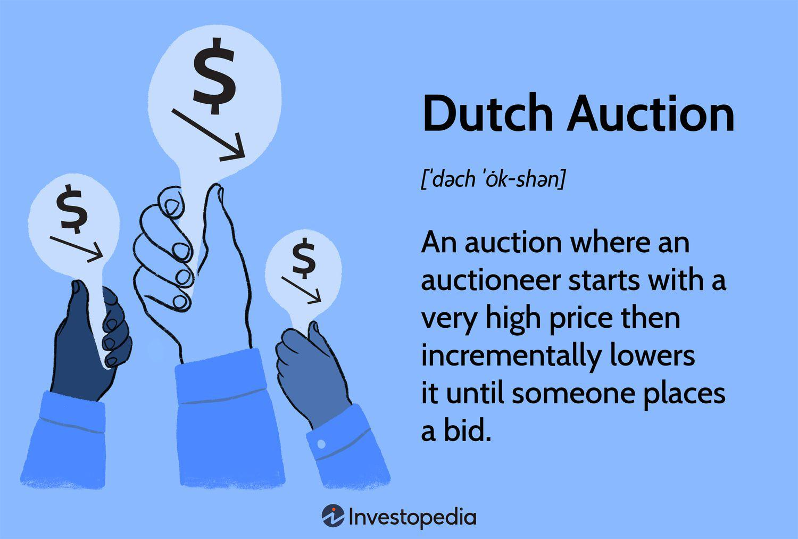

The financial markets are complex ecosystems where various mechanisms come into play to facilitate efficient trading and investments. Among these mechanisms, the Dutch auction stands out as a distinctive auction process notable for its descending price structure. This auction type commences with a high starting bid that decreases incrementally until a participant accepts the prevailing price. Originating from 17th-century Dutch flower markets, this model has been adapted for modern financial applications, particularly within public offerings and algorithmic trading. The Dutch auction facilitates a fast and efficient price discovery process, distinguishing itself from traditional auction models by fostering an environment of transparency and democratization.

One of the key areas where Dutch auctions are employed is in public offerings, notably initial public offerings (IPOs). In this setting, Dutch auctions allow companies to set market-driven prices for stocks, broadening participation across diverse investor profiles and mitigating speculative price surges. Such a pricing method encourages transparency and enables a more democratized approach to stock allocations. A notable example of its application in an IPO is Google's public offering in 2004, which effectively minimized speculative price fluctuations that are common in conventional IPOs.



Additionally, Dutch auctions have found a synergistic role in the domain of algorithmic trading. Algorithmic trading relies on advanced computational algorithms to process market data and execute trades at high speeds. Integrating Dutch auction mechanisms into these algorithms can enhance the efficiency of price discovery, shorten transaction durations, and optimize trading entries and exits. This integration offers traders a strategic edge, particularly in high-frequency trading environments where precision and speed are paramount. 

This article will therefore explore these aspects, focusing initially on understanding the concept of Dutch auctions, their implications in public offerings, and subsequently their integration with algorithmic trading.

## Table of Contents

## Understanding Dutch Auctions in Financial Markets

A Dutch auction is a unique auction method characterized by its descending price mechanism, where the auction begins with a high starting bid. The auctioneer subsequently lowers the price in incremental steps until a participant is willing to accept the current offer, resulting in a rapid and effective price discovery process. This type of auction is particularly efficient as it minimizes the time required to reach a mutually agreeable price between buyers and sellers.

The origins of the Dutch auction trace back to the 17th-century Dutch flower markets, where it was initially used to sell flowers and other perishable goods. The fast-paced nature of this auction format suited the needs of these markets, as it allowed sellers to quickly liquidate inventory at market-driven prices, reflecting demand conditions effectively.

In contemporary financial markets, the Dutch auction model has been adapted and applied to various financial instruments, including bonds, stocks, and treasury securities. For example, the U.S. Treasury employs a modified version of the Dutch auction to sell government securities, ensuring transparent and fair price discovery that reflects the aggregate demand of bidders.

The mathematical representation of a Dutch auction can be seen through the concept of demand elasticity, where the auctioneer reduces the price $P$ at predetermined intervals $\Delta t$, and the first bidder to accept declares the transaction. This can be expressed as:

$$
P = P_0 - k \cdot t
$$

where $P_0$ is the initial price, $k$ is the decremental step size, and $t$ is the time elapsed until a bid is accepted. The swift convergence of the auction to an equilibrium price reflects the market’s valuation of the item being auctioned.

The application of Dutch auctions in financial markets underscores their efficiency and efficacy in price determination across a wide spectrum of economic sectors. By adapting this historical model to modern trading environments, Dutch auctions continue to facilitate effective and transparent transactions, providing a robust framework for price setting in various scenarios.

## Dutch Auctions in Public Offerings

Dutch auctions have gained traction in the sphere of initial public offerings (IPOs) due to their ability to foster a more inclusive participation from a diverse array of investors. Unlike traditional book-building methods, where investment banks set the initial share price through a closed process, the Dutch auction process begins with a high offering price that incrementally decreases until enough bids are received to sell the offered shares. This auction type allows companies to set a market-driven price for their stock offerings. 

This mechanism ensures transparency, as all participants have equal access to information regarding the bidding process, aligning with efforts to democratize financial markets. By removing the intermediaries that can potentially distort pricing with selective disclosures, Dutch auctions support a fairer pricing strategy, thereby aligning the incentives of issuers and investors.

A quintessential example of the Dutch auction in practice is Google's IPO in 2004. Google's adoption of this method was aimed at allowing individual investors to participate on more equal terms with institutional investors, thereby reducing the speculative frenzy often associated with traditional IPOs. By using a Dutch auction, Google sought to curtail the [volatility](/wiki/volatility-trading-strategies) typically seen in post-IPO trading, often referred to as "price pops." The approach was largely successful: Google set a price of $85 per share, which aligned closely with where the stock began trading after its debut on the public market. This helped minimize the immediate disparity between the IPO price and initial trading price, a gap that commonly benefits only a select group of investors in a traditional IPO setting.

Overall, the use of Dutch auctions in public offerings signifies a shift towards more equitable practices in financial markets, allowing companies to engage with a broader pool of investors without the price distortions introduced by excessive speculative activity.

## Benefits and Drawbacks of Using Dutch Auctions

Dutch auctions present a range of benefits and drawbacks for companies considering this approach for public offerings. These auctions are lauded for their transparency, cost efficiency, and ability to democratize access to IPOs. By allowing participants to bid at prices they are willing to pay, Dutch auctions foster a more transparent pricing mechanism. This is because the final transaction price is determined openly, eradicating any ambiguity that might otherwise accompany traditional book-building methods. Additionally, cost efficiencies are realized by bypassing intermediaries traditionally involved in setting IPO prices, potentially saving companies significant underwriting fees.

The democratized nature of Dutch auctions further enhances their attractiveness. By allowing a broader spectrum of investor participation — from institutional investors to individual retail investors — these auctions can democratize the investment landscape, enabling more equitable access to shares at fair market prices. This inclusivity can lead to increased interest and participation in public offerings, potentially boosting the market's [liquidity](/wiki/liquidity-risk-premium) and appeal.

Despite these advantages, Dutch auctions are not without their challenges. A primary concern is the reduced price control available to issuers. In a traditional IPO, underwriters play a crucial role in managing price and demand; however, in a Dutch auction, prices are driven by the bids of participants, which may not align with the issuer’s valuation expectations. This can result in issuers receiving less-than-optimal prices for their shares, impacting their fundraising goals.

Price volatility is another potential drawback of Dutch auctions. As the auction progresses and prices drop, the uncertainty may create price swings, introducing volatility that can deter risk-averse investors. This can lead to unpredictable outcomes regarding the final sale price, occasionally resulting in prices that are significantly below market expectations.

Given these pros and cons, companies must carefully weigh their options when considering Dutch auctions for public offerings. Thorough analysis and careful planning are essential to leverage the benefits while mitigating the potential disadvantages associated with this auction model.

## Integration of Dutch Auctions in Algorithmic Trading

Algorithmic trading employs sophisticated algorithms to process real-time market data and execute transactions with minimal human intervention. One innovative method within this trading paradigm involves the integration of Dutch auction mechanisms. This approach can significantly enhance price discovery and shorten transaction durations, offering a strategic advantage in fast-paced trading environments.

Dutch auctions, known for their descending price mechanism, can augment [algorithmic trading](/wiki/algorithmic-trading) systems by providing a more immediate and accurate reflection of market supply and demand. This integration allows the system to dynamically adjust prices in response to market conditions, facilitating quicker alignment of buy and sell orders and improving liquidity.

Consider the basic structure of a Dutch auction algorithm: it begins with a high initial price and decreases incrementally until a participant accepts the price. In algorithmic trading, this process can be optimized by leveraging real-time data analytics and [machine learning](/wiki/machine-learning). For instance, algorithms can predict the optimal timing for price reductions based on historical trading patterns and current market volatility. This ensures that the auction process balances speed and accuracy in reaching market-clearing prices.

```python
def dutch_auction(price, decrement, min_price, bids):
    # price: initial price, decrement: price decrement value, min_price: lowest possible price
    # bids: list of potential bids
    while price > min_price:
        if price in bids:
            return price  # Auction clears at this accepted bid
        price -= decrement
    return min_price  # Fallback to the minimum price if no bids accepted prior
```

Incorporating Dutch auction mechanisms within algorithmic trading not only aids in optimizing trading entries and exits but also strengthens risk management practices. By ensuring trades are conducted closer to true market value, the potential for significant losses due to adverse price movements is reduced. Furthermore, as the algorithm iterates through potential prices, transparency is maintained, allowing traders to make informed decisions based on observable market data.

The integration of Dutch auction principles in algorithmic trading systems promises a more efficient trading process. It aligns the speed and automation of algorithms with the fairness and transparency of auction-based price discovery, creating a robust mechanism for modern trading strategies. As markets continue to digitize and evolve, employing such hybrid methodologies will likely become more prevalent for achieving strategic and competitive advantages.

## Algorithmic Trading: Benefits and Considerations

Algorithmic trading, leveraging Dutch auction mechanisms, offers several advantages for financial market participants. By utilizing algorithms, traders benefit from more precise and efficient trading strategies that are not only profitable but also adaptable to rapidly changing market conditions. The integration of algorithmic trading with Dutch auction principles allows traders to execute trades with remarkable speed, which is crucial in high-frequency trading environments where milliseconds can make a significant difference.

One of the primary benefits of using algorithms in Dutch auction settings is their ability to quickly respond to price changes. Algorithms can process vast amounts of market data in real-time, enabling traders to make rapid decisions and secure favorable trading positions before their competition. This rapid response capability provides a competitive edge, especially in markets where prices fluctuate rapidly.

Implementing these strategies requires careful consideration of risk management, an essential component to protect against potential losses. Algorithmic trading systems can incorporate risk management protocols to monitor and limit exposure to unfavorable price movements. These protocols might include stop-loss orders, position size limits, and volatility-based adjustments to trading strategies.

Backtesting is another critical consideration when using algorithms in Dutch auctions. By simulating trading strategies on historical market data, traders can evaluate the potential effectiveness of these strategies before implementing them in real markets. Backtesting helps identify strengths and weaknesses in the trading model, allowing for refinements that can improve performance.

Market volatility is a significant [factor](/wiki/factor-investing) to consider. High volatility can present both opportunities and risks. Algorithms need to be calibrated to adapt to varying levels of market volatility, ensuring they operate efficiently without being overly sensitive to noise or sudden market spikes. This requires robust algorithm design and continuous monitoring to maintain optimal performance amidst changing market conditions.

In summary, while the use of algorithms in Dutch auctions can significantly enhance trading strategies, it necessitates a focus on risk management, thorough [backtesting](/wiki/backtesting), and sensitivity to market volatility. By addressing these considerations, traders can harness the full potential of algorithmic trading, achieving greater precision, efficiency, and profitability.

## Real-World Applications and Examples

The Dutch auction model exhibits significant versatility across various financial markets such as foreign exchange ([forex](/wiki/forex-system)), commodity trading, and initial public offerings (IPOs). In the context of forex trading, the Dutch auction can facilitate an efficient mechanism for currency auctions held by central banks to manage national foreign exchange reserves or influence exchange rates. By allowing buyers to determine the price at which they are willing to acquire currency before the price is gradually lowered until a match is found, this method promotes transparency and reduces risk in volatile currency markets.

In commodity trading, Dutch auctions can enable producers to sell goods like agricultural products or energy resources effectively by quickly discovering market-clearing prices that reflect current supply and demand dynamics. This rapid price determination process helps producers and traders efficiently manage inventory turnover and hedge against price volatility.

Algorithmic trading systems can integrate Dutch auction principles to enhance dynamic pricing strategies in these financial contexts. By employing automated algorithms that adapt to the descending auction model, traders can achieve optimal execution of buy or sell orders by fine-tuning entry and [exit](/wiki/exit-strategy) points based on quantitative market analyses. This is particularly useful in high-frequency trading environments where milliseconds can determine substantial financial outcomes. 

```python
# Sample Python code illustrating a simple Dutch Auction model
def dutch_auction(starting_price, decrement, bids):
    """
    Simulate a Dutch auction.

    starting_price: The initial high price for the auction.
    decrement: The amount by which the price is reduced in each step.
    bids: A list of tuples representing bidder IDs and their maximum bid prices.

    Returns the winning bid and final price.
    """
    price = starting_price
    while price > 0:
        for bidder_id, max_price in bids:
            if price <= max_price:
                return (bidder_id, price)
        price -= decrement
    return None

# Example usage
bids = [('Bidder_1', 90), ('Bidder_2', 85), ('Bidder_3', 80)]
winning_bid = dutch_auction(100, 5, bids)
print(f"Winning Bid: {winning_bid}")
```

Successful implementations of Dutch auctions in algorithmic trading underscore their potential for strategic advantage. Google's IPO in 2004 is a prominent example where a Dutch auction was utilized to set the share price, allowing for broader investor participation and reducing the potential for speculative price spikes. This application demonstrated the auction format's capacity to achieve a market-driven price discovery process with widespread market democratization benefits.

## Conclusion

Dutch auctions are reshaping the dynamics of financial markets and trading strategies. By starting with a high price and adjusting downwards until a bid is accepted, this auction model offers precise price discovery and improved market efficiency. The application of Dutch auctions in algorithmic trading opens up new avenues for enhancing these efficiencies, as automated systems can leverage the dynamic pricing mechanism to make swift and informed trading decisions.

Incorporating Dutch auctions into algorithmic trading frameworks allows participants to benefit from increased transparency and democratized access to trading opportunities. With advanced algorithms, traders can quickly adapt to price movements, enabling smarter trade executions and optimizing entry and exit points. This synergy not only streamlines the trading process but also broadens market participation by making it more accessible to a diverse range of traders.

As financial markets evolve with rapid technological advancements, the strategic understanding and utilization of Dutch auctions become crucial. Their deployment can reduce transaction costs, limit speculative pricing behaviors, and potentially stabilize market volatility through a more balanced and transparent bidding process. Consequently, mastering Dutch auctions and their integration with algorithmic trading can offer significant competitive advantages, positioning firms and individual traders alike to thrive in a continually changing market environment.

## References & Further Reading

[1]: Biais, B., Bisière, C., & Pouget, S. (2014). ["Equilibrium Pricing and Allocations in Client-Driven Auctions."](https://papers.ssrn.com/sol3/papers.cfm?abstract_id=3261063) Journal of Finance, 69(2), 617-653.

[2]: Casella, A. (1999). ["Tradable Deficit Permits: Efficient Implementation of the Stability Pact in the European Monetary Union."](https://www.jstor.org/stable/1344691) Economic Policy, 14(29), 323-361.

[3]: Gollier, C., & Laffont, J.-J. (1999). ["Information and the Organization of Double Auctions."](https://scholar.google.com/citations?user=pZOhHT4AAAAJ) Journal of Public Economics, 73(3), 430-469.

[4]: Klemperer, P. (1999). ["Auction Theory: A Guide to the Literature."](https://onlinelibrary.wiley.com/doi/abs/10.1111/1467-6419.00083) Journal of Economic Surveys, 13(3), 227-286.

[5]: Vickrey, W. (1961). ["Counterspeculation, Auctions, and Competitive Sealed Tenders."](https://onlinelibrary.wiley.com/doi/10.1111/j.1540-6261.1961.tb02789.x) Journal of Finance, 16(1), 8-37.

[6]: Google Inc. (2004). ["Final Prospectus - Form S-1."](https://www.thecorporatecounsel.net/blog/2004/04/google-ipo-prospectus-here-is.html) United States Securities and Exchange Commission. 

[7]: ["Algorithmic Trading and DMA: An Introduction to Direct Access Trading Strategies"](https://www.semanticscholar.org/paper/Algorithmic-trading-%26-DMA-%3A-an-introduction-to-Johnson/aa5de1ab883d5e23b6651faa7c1807586d688e4b) by Barry Johnson

[8]: Bolten, S. (2000). ["Investment under Uncertainty and the Value of Real and Financial Flexibility."](https://papers.ssrn.com/sol3/papers.cfm?abstract_id=2364067) Journal of Economic Education, 31(3), 283-306.