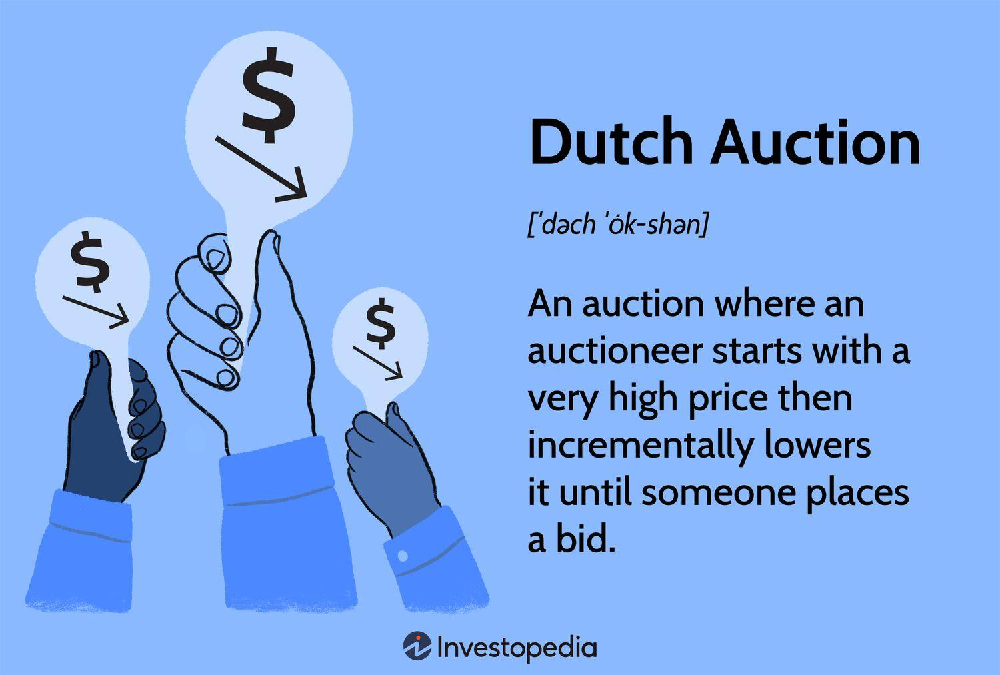

## Table of Contents

## What is a Dutch auction?

A Dutch auction is a type of auction where the auctioneer starts with a high asking price and gradually lowers it until someone in the crowd accepts the current price or the auctioneer reaches a predetermined reserve price. This is different from a traditional auction where people bid higher and higher until the highest bidder wins. In a Dutch auction, the first person to accept the price wins the item.

Dutch auctions are often used for selling large quantities of similar items, like flowers in the Netherlands, where the auction got its name. They can also be used for selling stocks or bonds. The advantage of a Dutch auction is that it can be quicker than a traditional auction because the price drops until someone accepts it, rather than waiting for people to keep bidding higher.

## How does a Dutch auction differ from a traditional auction?

A Dutch auction and a traditional auction are different in how they work. In a traditional auction, the auctioneer starts with a low price and people keep bidding higher until no one wants to bid more. The person with the highest bid wins the item. It's like a competition where the price goes up until someone wins.

In a Dutch auction, it's the opposite. The auctioneer starts with a high price and slowly lowers it until someone says they want the item at the current price. The first person to accept the price wins. This type of auction can be faster because the price goes down until someone decides to take it, instead of waiting for people to keep bidding higher.

## What are the key components of a Dutch auction?

In a Dutch auction, the auctioneer starts with a high price and slowly lowers it until someone decides to buy the item at the current price. This is different from a regular auction where people bid higher and higher. The key part of a Dutch auction is that the price goes down, not up. The auctioneer keeps lowering the price until someone says they want the item.

Another important part of a Dutch auction is that the first person to accept the price wins the item. This makes the auction faster because it stops as soon as someone agrees to the price. Dutch auctions are often used for selling many similar items quickly, like flowers in the Netherlands.

## Can you explain the process of a Dutch auction step-by-step?

In a Dutch auction, the auctioneer starts with a high price and slowly lowers it. They keep announcing the price as it goes down. Everyone at the auction can see and hear the price dropping. People are waiting for the price to get to a point where they think it's a good deal. 

When the price gets to a point where someone thinks it's a good deal, they shout out that they want to buy the item at that price. The auction stops right then, and the person who shouted out gets the item. They pay the price that was announced when they said they wanted it. This way, the auction can be quick because it stops as soon as someone agrees to the price.

## What are the advantages of using a Dutch auction strategy?

One advantage of using a Dutch auction is that it can be faster than a regular auction. In a regular auction, people have to keep bidding higher until no one wants to bid more. This can take a long time. But in a Dutch auction, the auctioneer starts with a high price and keeps lowering it until someone says they want the item. The auction stops right away when someone agrees to the price, so it can be quicker.

Another advantage is that Dutch auctions are good for selling a lot of similar items at once. For example, in the Netherlands, they use Dutch auctions to sell flowers. It's a good way to sell many flowers quickly because the price keeps going down until someone buys them. This makes it easier to sell large quantities of things like flowers or even stocks and bonds.

## What are the potential disadvantages or risks associated with Dutch auctions?

One potential disadvantage of Dutch auctions is that they can be risky for the seller. If the auctioneer starts with a high price and no one buys the item, the price might drop too low. This could mean the seller gets less money than they hoped for. It's hard to know the right starting price, and if it's too high, the auction might end with a very low price.

Another risk is that buyers might wait too long to bid. Since the price keeps going down, some people might think they can get an even better deal if they wait a bit longer. But if someone else bids before them, they might miss out on the item. This can lead to buyers feeling disappointed or frustrated if they miss out on a good deal because they waited too long.

## In what scenarios is a Dutch auction most effectively used?

Dutch auctions work best when you need to sell a lot of the same kind of thing quickly. For example, in the Netherlands, they use Dutch auctions to sell flowers. The auctioneer starts with a high price and keeps lowering it until someone buys the flowers. This way, they can sell many flowers fast because the price keeps going down until someone says they want them. It's a good way to sell things like flowers or even stocks and bonds when you have a lot of them and want to sell them quickly.

Another good time to use a Dutch auction is when you want to sell something fast and don't mind if the price goes down a bit. If you start with a high price and no one buys it, the price will drop until someone does. This can be risky because you might not get as much money as you hoped for, but it's a good way to sell things quickly. So, if you need to sell something fast and are okay with the price maybe being lower, a Dutch auction could be a good choice.

## How can a Dutch auction be implemented in an online setting?

In an online setting, a Dutch auction can be set up using a website or an app. The auctioneer starts by setting a high price for the item and then slowly lowers it over time. This can be shown on a countdown timer or a price drop indicator that everyone can see. People watching the auction can decide when they think the price is right for them and click a button to buy the item at the current price. The auction stops as soon as someone clicks to buy, and they get the item at the price shown when they clicked.

This method is good for selling things online because it can be done quickly and reach a lot of people. It's easy for people to see the price going down and decide when to buy. Websites can use automatic systems to lower the price at set times, making the process smooth and fair for everyone. This way, online Dutch auctions can be a fast and effective way to sell items like electronics, tickets, or even stocks and bonds.

## What are some real-world examples of Dutch auctions?

One famous real-world example of Dutch auctions is in the flower markets of the Netherlands. They use Dutch auctions to sell lots of flowers quickly. The auctioneer starts with a high price for a batch of flowers and slowly lowers it until someone in the crowd decides to buy them. This way, they can sell many flowers fast because the price keeps going down until someone says they want them. It's a good way to sell things like flowers when you have a lot of them and want to sell them quickly.

Another example is when companies want to sell their stocks or bonds. Sometimes, they use Dutch auctions to do this. The company sets a high price for the stocks or bonds and then lowers it until investors decide to buy them. This can be a quick way to sell a lot of stocks or bonds because the price goes down until someone agrees to buy them. It's also used by the U.S. Treasury to sell securities, where they start with a high price and lower it until investors buy the securities at the current price.

## How do bidders strategize in a Dutch auction to maximize their chances of winning?

In a Dutch auction, bidders need to decide when to buy the item as the price keeps going down. A good strategy is to set a maximum price they are willing to pay before the auction starts. When the auctioneer's price gets close to their maximum, they should be ready to buy the item. If they wait too long, someone else might buy it first, so they need to act quickly when the price is right for them.

Another strategy is to watch how other bidders are acting. If they see that other people are waiting for the price to drop even lower, they might need to act faster to beat them. Bidders can also try to guess how low the price might go by looking at past auctions for similar items. This can help them decide when to buy the item at the best possible price.

## What role does pricing strategy play in the success of a Dutch auction?

Pricing strategy is very important for a Dutch auction to work well. The auctioneer needs to start with a high price that is not too high, or no one will buy the item. If the starting price is too high, the auction might end with a very low price because the auctioneer has to keep lowering it until someone buys it. The right starting price can help the seller get a good price for the item and make the auction go quickly.

The auctioneer also needs to know how fast to lower the price. If they lower it too slowly, people might get bored and leave the auction. If they lower it too fast, the price might drop too much before someone buys the item. Finding the right speed can help make sure the auction is exciting and that the item sells for a good price. A good pricing strategy can make a Dutch auction successful by getting the right balance between speed and price.

## How can advanced data analytics improve the outcomes of Dutch auctions?

Advanced data analytics can help make Dutch auctions work better by looking at past auctions to find patterns. For example, by studying old auctions, the auctioneer can see what starting prices worked well and how fast the price should drop. This can help them set the right starting price and speed for the auction, so it goes smoothly and the item sells for a good price. Data analytics can also look at what buyers usually pay for similar items, which helps the auctioneer set a price that will attract buyers.

Another way data analytics can help is by understanding how buyers behave during the auction. By looking at data from past auctions, the auctioneer can see when buyers usually decide to buy the item. This can help them make the auction more exciting and keep buyers interested. For example, if data shows that buyers often wait until the price is very low, the auctioneer might start with a lower price or drop the price faster to encourage people to buy sooner. Using data analytics can make Dutch auctions more successful by helping the auctioneer make smart choices about pricing and timing.

## References & Further Reading

[1]: Ausubel, L. M. (1997). ["An Efficient Ascending-Bid Auction for Multiple Objects."](https://www.jstor.org/stable/3592830) The American Economic Review, 87(3), 538–554.

[2]: Klemperer, P. (2004). ["Auctions: Theory and Practice."](https://papers.ssrn.com/sol3/papers.cfm?abstract_id=491563) Princeton University Press.

[3]: Biais, B., Bossaerts, P., & Rochet, J.-C. (2002). ["An Optimal Auction for a Multiple Object Procurement Problem."](https://www.semanticscholar.org/paper/An-optimal-IPO-mechanism-Biais-Bossaerts/abfa7659d5fa92eb7314722af38c1adb2f3639d9) Econometrica, 70(4), 1427–1450.

[4]: Milgrom, P. (2004). ["Putting Auction Theory to Work."](http://www.econ.ucla.edu/riley/271/Milgrom-Putting%20Auction%20Theory%20to%20Work.pdf) Cambridge University Press.

[5]: Varian, H. R. (2007). ["Position Auctions."](https://people.ischool.berkeley.edu/~hal/Papers/2006/position.pdf) International Journal of Industrial Organization, 25(6), 1163–1178.