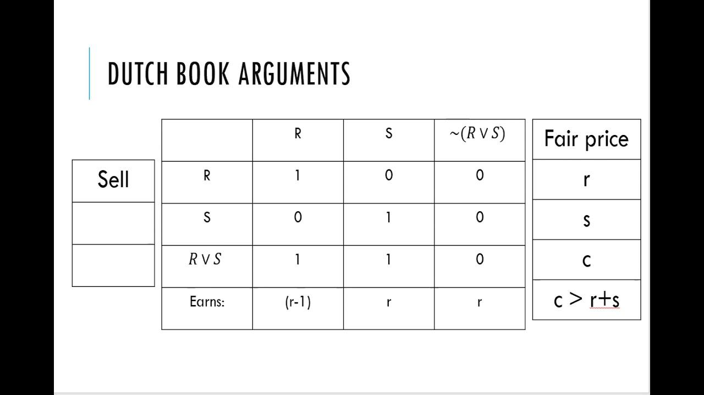

The Dutch Book Theorem is a critical concept within probability theory that has profound implications for fields such as betting strategy, probability calculations, and algorithmic trading. This theorem delineates the conditions under which inconsistent probabilities can lead to certain losses, a phenomenon commonly known as a 'Dutch Book'. Such a scenario occurs when an individual's probability assessments are incoherent, meaning they violate the fundamental axioms of probability theory, which can be exploited for guaranteed profit by an informed counterparty.

This article aims to provide a comprehensive exploration of the Dutch Book Theorem, detailing its applications in refining betting strategies and enhancing the robustness of algorithmic trading systems. Understanding the theorem is vital for identifying irrationality in probability assignments, which plays a crucial role in decision-making processes across various domains. By maintaining logical consistency in probabilistic models, individuals and organizations can mitigate risks and improve their decision-making frameworks.



Moreover, the Dutch Book Theorem holds significant implications for boosting the efficiency of algorithmic trading systems. In these contexts, adherence to coherent probabilities is paramount to prevent exploitable inconsistencies that could lead to financial losses. The relevance of the theorem extends beyond gambling and trading, impacting economic theory and behavioral analysis, emphasizing the importance of ensuring rational probability assessments to avoid adverse outcomes. As probability-based models continue to evolve, the Dutch Book Theorem remains a fundamental principle guiding the development and application of sound probabilistic reasoning in diverse fields.

## Table of Contents

## Understanding the Dutch Book Theorem

The Dutch Book Theorem is a fundamental concept in probability theory, highlighting situations where subjective probabilities, when inconsistent with classical probability axioms, can result in guaranteed financial losses. This setup, known as a 'Dutch Book', exploits these inconsistencies through a series of bets that ensure a loss regardless of the outcome. 

The root of this inconsistency often lies in flawed probability estimations, which can stem from human errors or cognitive biases. Humans are predisposed to biases such as overconfidence, availability heuristic, and representativeness which can skew judgment and lead to the erroneous assignment of probabilities. For example, if someone assigns a total probability that doesn't sum to one for all possible outcomes, they are susceptible to a Dutch Book scenario. 

To counteract this, employing the principles of Bayesian probability can help decision-makers maintain coherence in their probability assessments. Bayesian probability allows for the updating of beliefs with new evidence, which ensures that subjective probabilities remain aligned with the axioms of probability. This alignment is critical in avoiding information arbitrage, where inconsistencies could otherwise be exploited for profit. 

Coherence in probability assignments is essential as it prevents structured forms of [arbitrage](/wiki/arbitrage) that can arise when probabilities are inconsistently estimated. This theorem is invaluable for identifying and addressing vulnerabilities in betting strategies, offering a framework to enhance decision-making processes. By ensuring that probability assessments adhere to consistent and rational standards, the Dutch Book Theorem provides a check against erroneous decision-making, which is crucial for maintaining fairness and logic in both gambling scenarios and broader financial decision frameworks.

## Dutch Book Theorem in Betting Strategies

The Dutch Book Theorem plays a critical role in betting strategies by illustrating how irrational betting odds can lead to exploitable conditions for guaranteed profits. This concept is particularly observed in horse racing and sports betting, where bookmakers are tasked with establishing odds that are reflective of actual probabilities in order to prevent certain losses.

In the betting industry, odds represent the perceived likelihood of a particular outcome occurring. However, when these odds are set inconsistently with the principles of probability theory, the potential for a Dutch Book arises. This occurs when a series of bets are positioned in such a manner that they ensure a positive payoff, irrespective of the event's outcome, thus exploiting the inconsistencies in the odd calculations.

Professional bettors leverage the Dutch Book Theorem to identify and rectify these inconsistencies, turning potential losses into profitable opportunities. By scrutinizing the odds and identifying discrepancies, bettors can employ strategies that exploit irrational price settings. This requires a data-driven approach, where probabilities are assessed with high precision to align betting odds with realistic assessments.

In practical terms, bookmakers should ensure their odds are coherent with probability theory to preclude Dutch Book scenarios. For instance, if a bookmaker offers odds that imply a greater than 100% probability across all outcomes of an event (due to overpricing every possible event), they expose themselves to a Dutch Book. By understanding the theorem, bookmakers can adjust their odds to reflect more accurate probability distributions, effectively minimizing their exposure to risk.

The Dutch Book Theorem thus underscores the necessity for rational and data-supported approaches in setting betting odds. By ensuring that these odds align with authentic probability assessments, both bookmakers and bettors can make more informed and strategic decisions, thereby enhancing their potential for success while reducing exposure to unnecessary risk.

## Probability and Algorithmic Trading

In [algorithmic trading](/wiki/algorithmic-trading), the Dutch Book Theorem plays a crucial role in ensuring that trading models maintain logical consistency and avoid potential exploitation. As algorithmic trading relies heavily on probabilistic models to make decisions, it is essential that these models reflect coherent probability assignments. A Dutch Book scenario arises when there is an opportunity to construct a series of bets that guarantee a profit due to incoherent probabilities; hence, ensuring coherence is vital for safeguarding against such scenarios.

Algorithms in this domain must embody the axioms of probability theory to prevent inconsistencies that could lead to financial losses. Specifically, this involves adhering to coherent belief systems, which can be achieved through principles like Bayesian probability. By employing Bayesian updating, algorithms can adjust probabilities in a consistent manner as new information becomes available, avoiding discrepancies that could be exploited under Dutch Book conditions.

For instance, consider an algorithm that uses Bayesian inference to update the probability of a stock price increase based on new market data. The formula for updating the probability can be expressed as:

$$
P(A|B) = \frac{P(B|A) \cdot P(A)}{P(B)}
$$

Where:
- $P(A|B)$ is the posterior probability of event $A$ given $B$
- $P(B|A)$ is the likelihood of $B$ given $A$
- $P(A)$ is the prior probability of $A$
- $P(B)$ is the probability of $B$

By consistently applying such updates, the algorithm avoids incoherence and maintains a robust trading strategy. In a competitive market, any deviation from coherent probability assessments can be swiftly exploited by opponents, leading to significant financial detriments.

Furthermore, integrating the Dutch Book Theorem into trading algorithms ensures these systems are reliable. Stress testing models through simulation can identify potential incoherences in the probability assignments, allowing developers to make necessary adjustments before the model is deployed in live environments.

A Python implementation of a simple Bayesian update could look like this:

```python
def bayesian_update(prior, likelihood, evidence):
    posterior = (likelihood * prior) / evidence
    return posterior

# Example usage
prior_probability = 0.6
likelihood = 0.7
evidence = 0.8

posterior_probability = bayesian_update(prior_probability, likelihood, evidence)
print(f"Updated Probability: {posterior_probability:.2f}")
```

This principle ensures that, within the fast-paced conditions of financial markets, algorithmic models not only operate effectively but also adapt swiftly and accurately to new market data. This adaptability, grounded in coherent probabilistic reasoning, provides a competitive advantage that is essential for successful algorithmic trading. As such, the Dutch Book Theorem serves as a vital framework, guiding the development and execution of algorithms that underpin modern, probabilistic trading strategies.

## Behavioral Economics and the Dutch Book Theorem

The Dutch Book Theorem is intricately linked to behavioral economics, a field that explores the influence of human psychology on economic decision-making. Behavioral economics has shown that cognitive biases can distort rational judgment, leading individuals to assign inconsistent probabilities to events. These inconsistencies can pave the way for the creation of a Dutch Book—a situation where a clever bettor can guarantee a profit regardless of the outcome by exploiting these flawed probability assignments.

Cognitive biases, such as overconfidence, anchoring, and availability heuristic, commonly result in the formulation of inconsistent probabilities. Overconfidence may cause individuals to excessively trust their assessments, whereas anchoring can lead to reliance on initial information when making decisions, skewing their probability judgments. The availability heuristic may cause individuals to overestimate the probability of events that readily come to mind, possibly due to recent exposure. These biases can lead not only to irrational decision-making but also expose bettors and traders to losses through Dutch Books.

To mitigate the impacts of these biases, economists and traders can construct strategies aimed at fostering more rational decision-making processes. A central technique involves promoting the use of coherent probability assessments, aligning subjective probabilities more closely with the axioms of probability theory. This alignment minimizes the risks of inconsistency and enhances decision-making quality. 

The Dutch Book Theorem provides insights into how these cognitive biases affect decision-making by highlighting the susceptibility to guaranteed losses when probabilities are assigned inconsistently. By recognizing and adjusting for these biases, it encourages more rational behavior through coherent probability assessments. For instance, integrating Bayesian probability updating can help correct biased probability estimates, promoting more consistent decision-making.

Furthermore, merging behavioral insights with probability theory can improve the accuracy of predictions and enhance decision-making models. By systematically addressing cognitive biases, it becomes possible to develop models that reflect more realistic probability estimates, thus improving decision-making outcomes in economic and trading contexts. This interdisciplinary approach helps create robust systems that are less prone to error, aligning economic practices with more sound risk management strategies and ultimately leading to more optimal economic and financial decisions.

## Conclusion

The Dutch Book Theorem is a powerful conceptual tool that offers significant insights into rational decision-making within probability contexts, playing a crucial role in both betting strategies and algorithmic trading systems. This theorem underlines the critical importance of maintaining consistency in probability assessments, ensuring that decision-makers can safeguard against guaranteed financial losses that arise from incoherent probabilities.

In the context of betting, adherence to the principles of the Dutch Book Theorem helps maintain the logical integrity of odds, thus providing an advantage over irrational market participants. For traders and economists alike, the theorem reinforces the necessity of constructing coherent probabilistic models. These models not only prevent the construction of Dutch Books against them but also enhance the robustness of investment strategies, delivering more reliable outcomes in uncertain market conditions. As betting platforms and financial markets continue to grow in complexity, the relevance and application of the Dutch Book Theorem persist in expanding, offering strategies to ensure rational risk assessment.

Achieving coherence in probability assignments presents an ongoing challenge, as well as an opportunity. It encourages the development of algorithms and decision-making frameworks that consistently reflect realistic probabilities. For both traders and bettors, embracing the theorem's principles is not merely a requirement for effective strategy formulation but also a means to achieving a competitive edge in increasingly sophisticated environments.

## References & Further Reading

[1]: de Finetti, B. (1974). ["Theory of Probability: A Critical Introductory Treatment."](https://onlinelibrary.wiley.com/doi/book/10.1002/9781119286387) Wiley.

[2]: O'Hagan, A. (1994). ["Bayesian Inference."](https://books.google.com/books/about/Kendall_s_Advanced_Theory_of_Statistics.html?id=ZWa7cQAACAAJ) Kendall's Library of Statistics.

[3]: Schick, K. D. (1997). ["On the Dutch Book Argument and the Representation of Belief."](https://link.springer.com/article/10.1023/A:1004996226545) Synthese, 112(2), 189-205.

[4]: Dawid, A. P. (1982). ["The Well-Calibrated Bayesian."](http://fitelson.org/seminar/dawid.pdf) Journal of the American Statistical Association, 77(379), 605-613.

[5]: Williams, J. D. (1995). ["Probability with Martingales."](https://www.cambridge.org/highereducation/books/probability-with-martingales/B4CFCE0D08930FB46C6E93E775503926) Cambridge University Press.