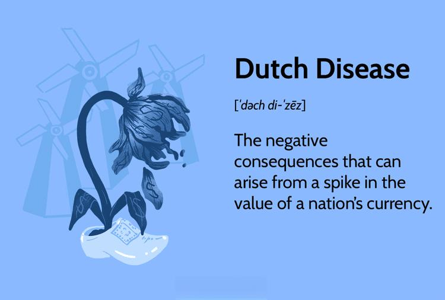

## Table of Contents

## What is Dutch Disease?

Dutch Disease is an economic term that describes a situation where a country's economy gets too focused on one thing, usually because it found a lot of natural resources like oil or gas. When this happens, the country's currency becomes stronger because it earns a lot of money from selling these resources. This makes other things the country makes, like cars or food, more expensive for other countries to buy. As a result, these other industries start to struggle and may even shrink.

This can cause problems because the country becomes too dependent on just one part of its economy. If the price of the natural resource goes down, or if it runs out, the country can be in big trouble. It's called Dutch Disease because it first happened in the Netherlands after they found a lot of natural gas in the 1960s. The name reminds us that even good news, like finding valuable resources, can lead to big challenges if a country doesn't manage it well.

## Where did the term 'Dutch Disease' originate?

The term 'Dutch Disease' comes from what happened in the Netherlands in the 1960s. They found a big amount of natural gas in the North Sea. This made them earn a lot of money from selling the gas. But it also made their currency, the guilder, become stronger. This meant that other things they made, like products for export, became more expensive for other countries to buy. As a result, these other industries started to do worse.

The economist The Economist magazine wrote about this problem in 1977. They called it 'Dutch Disease' because it started in the Netherlands. The term spread to describe similar situations in other countries where a big find of natural resources causes problems for the rest of the economy. It shows how a country can face challenges even when it seems to be doing well because of one big success.

## What are the main symptoms of Dutch Disease?

Dutch Disease has a few main symptoms that show up when a country focuses too much on one thing, like oil or gas. One big symptom is that the country's currency gets stronger. This happens because the country earns a lot of money from selling the resource. When the currency is strong, it makes other things the country makes, like cars or food, more expensive for other countries to buy. This can hurt these other industries because they can't sell as much.

Another symptom is that the industries that don't involve the main resource start to shrink. Because the currency is strong, these industries find it hard to compete with other countries. People might also move from these industries to work in the booming resource sector, which makes the problem worse. Over time, the country can become too dependent on just one part of its economy. If something goes wrong with the resource, like the price dropping or it running out, the whole economy can be in trouble.

## How does Dutch Disease affect a country's economy?

Dutch Disease can really change a country's economy in a big way. When a country finds a lot of a valuable resource like oil or gas, it starts to earn a lot of money from selling it. This makes the country's currency stronger. But a strong currency makes other things the country makes, like cars or food, more expensive for other countries to buy. So, these other industries start to struggle because they can't sell as much. People might also leave these industries to work in the booming resource sector, which makes the problem even worse.

Over time, the country can become too focused on just the resource. This means the economy is not balanced and depends too much on one thing. If the price of the resource goes down, or if it runs out, the country can be in big trouble. The other industries that shrank might not be able to grow back quickly enough to help. So, Dutch Disease can make a country's economy less stable and more risky.

## Can you provide a simple example of Dutch Disease?

Imagine a small country called Sunnyland that found a huge amount of gold in its mountains. Everyone got excited because they could sell the gold and make a lot of money. But as they sold more gold, their money, the Sunny Dollar, became stronger. This made things like Sunnyland apples and Sunnyland toys more expensive for other countries to buy. So, fewer people bought Sunnyland apples and toys, and the farmers and toy makers started to struggle.

Because the gold mining jobs paid well, many people left farming and toy making to work in the mines. Over time, Sunnyland became really good at mining gold but not so good at making apples and toys. If the price of gold ever went down, or if they ran out of gold, Sunnyland would be in big trouble because they didn't have strong apple and toy industries anymore. This is what Dutch Disease looks like in a simple way.

## What sectors are typically impacted by Dutch Disease?

Dutch Disease usually hurts the parts of the economy that make things to sell to other countries. These are called the manufacturing and agriculture sectors. When a country finds a lot of a valuable resource like oil or gas, it makes a lot of money from selling it. This makes the country's money, or currency, stronger. When the currency is strong, it makes the things the country makes, like cars or food, more expensive for other countries to buy. So, these industries start to struggle because they can't sell as much.

The service sector can also be affected by Dutch Disease. This includes things like tourism and financial services. When a country's economy focuses too much on one resource, it might not spend as much money on other services. People might also move from these service jobs to work in the booming resource sector, which makes the problem worse. Over time, the country can become too dependent on just the resource, and if something goes wrong with it, the whole economy can be in trouble.

## How can a country mitigate the effects of Dutch Disease?

A country can try to fix Dutch Disease by not letting its money, or currency, get too strong. They can do this by saving some of the money they make from the resource in a special fund instead of spending it all right away. This keeps the currency from getting too strong and hurting other industries like farming and making things. Another way is to help these other industries by giving them money or making it easier for them to sell their products in other countries. This can help them stay strong even when the resource is doing well.

Another thing a country can do is to make sure it doesn't depend too much on just one thing. They can spend some of the money they make from the resource on other parts of the economy, like building schools or roads. This can help create jobs in different areas and keep the economy balanced. It's also important to have good rules about how the resource is used and sold, so the country can keep making money from it for a long time. By doing these things, a country can avoid the big problems that come with Dutch Disease.

## What role do government policies play in managing Dutch Disease?

Government policies are very important in managing Dutch Disease. When a country finds a lot of a valuable resource like oil or gas, the government can use policies to stop the country's money, or currency, from getting too strong. They can do this by saving some of the money they make from the resource in a special fund instead of spending it all right away. This helps keep the currency from getting too strong and hurting other parts of the economy, like farming and making things. The government can also help these other industries by giving them money or making it easier for them to sell their products in other countries.

Another way government policies can help is by making sure the country doesn't depend too much on just one thing. The government can spend some of the money they make from the resource on other parts of the economy, like building schools or roads. This can help create jobs in different areas and keep the economy balanced. It's also important for the government to have good rules about how the resource is used and sold, so the country can keep making money from it for a long time. By using these policies, the government can help avoid the big problems that come with Dutch Disease.

## Are there historical examples of countries that have experienced Dutch Disease?

One big example of Dutch Disease is what happened in the Netherlands in the 1960s. They found a lot of natural gas in the North Sea and started making a lot of money from it. But this made their money, the guilder, stronger. This meant that other things they made, like products for export, became more expensive for other countries to buy. As a result, these other industries started to do worse. This is why it's called Dutch Disease, because it first happened in the Netherlands.

Another example is Venezuela. They have a lot of oil and used to make a lot of money from it. But their money, the bolivar, got too strong. This made it hard for them to sell other things they made, like food and cars, to other countries. Over time, Venezuela became too focused on oil and didn't take care of other parts of their economy. When the price of oil went down, it caused big problems for them. This shows how Dutch Disease can really hurt a country if it's not managed well.

## How does Dutch Disease relate to the resource curse?

Dutch Disease and the resource curse are connected because they both talk about problems that can happen when a country finds a lot of a valuable resource like oil or gas. Dutch Disease is when a country's money gets too strong because it makes a lot of money from the resource. This makes other things the country makes, like cars or food, more expensive for other countries to buy. As a result, these other industries start to struggle and may even shrink. The resource curse is a bigger idea that says having a lot of natural resources can actually make a country poorer instead of richer. This can happen because of Dutch Disease, but also because of other problems like bad government, corruption, and fighting over the resources.

Both Dutch Disease and the resource curse show how finding valuable resources can lead to big challenges. When a country focuses too much on one resource, it can become too dependent on it. If the price of the resource goes down, or if it runs out, the country can be in big trouble. This is part of the resource curse. Dutch Disease is one way the resource curse can happen, by making the country's economy unbalanced and hurting other industries. So, managing resources well is important to avoid these problems and make sure the country can keep growing and doing well.

## What are the long-term economic consequences of Dutch Disease if left unmanaged?

If a country doesn't manage Dutch Disease, it can face big problems in the long run. When a country finds a lot of a valuable resource like oil or gas, it might focus too much on that one thing. This makes the country's money stronger, which hurts other parts of the economy like farming and making things. Over time, these other industries get smaller and weaker. People might leave these jobs to work in the resource industry, which makes the problem even worse. If the country depends too much on the resource and something goes wrong, like the price dropping or the resource running out, the whole economy can be in big trouble.

In the long term, not managing Dutch Disease can make a country's economy less stable and more risky. The country might not have strong industries in other areas to help if the resource industry fails. This can lead to higher unemployment and slower growth because the economy is not balanced. It can also make it hard for the country to recover if the resource industry faces problems. So, it's really important for a country to take steps to manage Dutch Disease and keep its economy strong and balanced over time.

## What advanced economic models are used to study Dutch Disease?

Economists use different models to study Dutch Disease and understand how it affects a country's economy. One common model is the two-sector model, which looks at the resource sector and the non-resource sector. In this model, when a country finds a lot of a valuable resource, it makes a lot of money from it. This makes the country's money stronger, which makes things from the non-resource sector, like cars or food, more expensive for other countries to buy. As a result, the non-resource sector starts to struggle. This model helps economists see how the resource sector can hurt other parts of the economy.

Another model is the three-sector model, which adds a third sector called the tradable sector. This sector includes things that can be easily bought and sold in other countries, like manufactured goods. In this model, the resource sector can make the country's money stronger, which hurts both the non-resource sector and the tradable sector. The three-sector model helps economists understand how Dutch Disease can affect different parts of the economy in different ways. Both models show how important it is for a country to manage its resources well to avoid big problems.

## What is Dutch Disease and how can it be understood?

Dutch Disease is a term used to describe the negative economic consequences that can occur when a country experiences a significant increase in wealth from natural resources. The term originated from the economic effects observed in the Netherlands following the discovery of large natural gas fields in the North Sea during the 1960s. After this resource discovery, the Dutch guilder appreciated, which led to a decline in the competitiveness of the country's manufacturing sector as exports became more expensive on the global market. This phenomenon is characterized by several symptoms:

1. **Currency Appreciation**: A major influx of foreign currency from resource exports causes the domestic currency to appreciate, making other exporting sectors less competitive.

2. **Resource Allocation Shift**: Resources such as labor and capital are drawn away from non-resource sectors like manufacturing and agriculture towards the booming resource sector.

3. **Deindustrialization**: The traditional manufacturing sector shrinks as a direct result of reduced competitiveness and resource allocation shift, potentially leading to job losses and economic contraction in those areas.

4. **Volatility and Dependency**: Economies suffering from Dutch Disease often become overly dependent on natural resources, making them vulnerable to global commodity price fluctuations.

### Case Studies: Historical Examples

Several countries have been affected by Dutch Disease, each illustrating different facets of the phenomenon:

- **Netherlands**: The archetype of Dutch Disease. The Dutch manufacturing sector experienced a downturn following the natural gas boom.

- **Nigeria**: After the 1970s oil boom, Nigeria's non-oil sectors suffered due to increased currency value and neglect, leading to economic instability as oil prices fluctuated.

- **Canada**: The appreciation of the Canadian dollar, driven by oil sands development, put pressure on its manufacturing sector, especially in Ontario and Quebec.

### Macroeconomic Impact

The macroeconomic implications of Dutch Disease are significant. When a resource-blessed country experiences its currency appreciating, export-oriented industries become less competitive. This phenomenon is often explained through the Rybczynski theorem, which states that an increase in a resource will disproportionately harm the less resource-intensive industries. Mathematically, if $R$ represents the increase in resource extraction and $X_m$ and $X_r$ represent the outputs of manufacturing and resource sectors, respectively, the equation can be denoted as:

$$
\Delta X_m < 0 \quad \text{and} \quad \Delta X_r > 0
$$

The contraction of the manufacturing and agricultural sectors poses long-term risks including the loss of technological advancements, reduced employment opportunities, and a diminished capacity to withstand external economic shocks due to over-reliance on a single sector.

### Long-term Consequences

Economies that become heavily reliant on natural resources risk encountering the "resource curse," where despite significant resource wealth, growth is stunted due to [volatility](/wiki/volatility-trading-strategies), rent-seeking, corruption, and institutional weakening. Economic structures become less diversified, innovation is stifled, and there's limited resilience against global price swings in commodities.

In conclusion, Dutch Disease serves as a cautionary tale for resource-rich nations, emphasizing the necessity for balanced economic policies that promote diversification and stable growth across sectors. Implementing strategic measures to mitigate currency volatility and promote investment in non-resource industries is crucial to prevent the negative cycles associated with this economic condition.

## References & Further Reading

[1]: Corden, W. M., & Neary, J. P. (1982). ["Booming Sector and De-industrialisation in a Small Open Economy."](https://www.jstor.org/stable/2232670) The Economic Journal, 92(368), 825-848.

[2]: Auty, R. M. (1993). ["Sustaining Development in Mineral Economies: The Resource Curse Thesis."](https://www.taylorfrancis.com/books/mono/10.4324/9780203422595/sustaining-development-mineral-economies-richard-auty) Routledge.

[3]: Sachs, J. D., & Warner, A. M. (2001). ["The Curse of Natural Resources."](https://www.sciencedirect.com/science/article/pii/S0014292101001258) European Economic Review, 45(4), 827-838.

[4]: Van der Ploeg, F. (2011). ["Natural Resources: Curse or Blessing?"](https://www.aeaweb.org/articles?id=10.1257/jel.49.2.366) Journal of Economic Literature, 49(2), 366-420.

[5]: Humphreys, M., Sachs, J. D., & Stiglitz, J. E. (2007). ["Escaping the Resource Curse."](https://cup.columbia.edu/book/escaping-the-resource-curse/9780231141963) Columbia University Press.