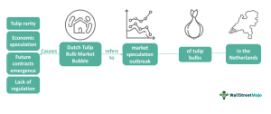

Tulip mania, often referred to as the Dutch tulip bulb market bubble, stands as one of the most illustrious instances of an economic bubble. Originating in the Dutch Republic during the early 17th century, this phenomenon provides a historical backdrop for understanding speculative trading. Central to this analysis is the rapid escalation in the prices of tulip bulbs, reaching values that far exceeded the annual income of skilled artisans. The surge in demand was primarily driven by the allure of exotic tulip varieties, also known as 'broken' bulbs, which captured the fascination of the Dutch merchant class and aristocracy.

The tulip craze is often cited as an early example of market speculation gone awry, culminating in a dramatic burst in 1637 when tulip prices precipitously collapsed. Despite this market contraction, which left many investors with significantly devalued bulbs, the overall economic impact was relatively contained. However, the psychological scars left on traders and investors were indelible, serving as a cautionary tale of speculative excesses that resonate to this day.



In analyzing tulip mania, this article seeks to unravel the intricacies of the bubble and its subsequent burst, offering valuable lessons for contemporary financial markets. These include insights into market psychology and the collective behavior that can drive asset prices well beyond their intrinsic values. Additionally, an exploration of algorithmic trading in today's markets reveals parallels with the past, as such technologies can amplify market trends and, at times, contribute to volatility reminiscent of historic bubbles.

By comparing tulip mania with other prominent financial bubbles, such as the dot-com bubble and the cryptocurrency markets, this analysis provides a nuanced understanding of speculative frenzy and market dynamics. Recognizing the repeating patterns in market behavior aids current market participants in crafting informed trading strategies and avoiding the pitfalls of irrational exuberance. Through the lens of history, investors are reminded of the importance of diversification, maintaining a rational investment approach, and the dangers posed by the fear of missing out (FOMO). Understanding these elements not only offers perspectives on past events but also provides guidance for navigating modern financial landscapes.

## Table of Contents

## The Origin and Rise of Tulip Mania

Tulip bulbs were first introduced to Europe in the late 16th century, quickly capturing the fascination of various social strata, particularly within the Dutch elite. Originating from the Ottoman Empire, these vibrant flowers soon became cherished as luxurious and prestigious symbols among wealthy individuals and the merchant class in the Netherlands. The unique beauty of tulips, combined with their novelty, contributed to their status as a coveted commodity.

By the early 17th century, interest in tulips reached feverish levels, driven primarily by the allure of 'broken' bulbs—tulips exhibiting striking patterns of color due to a mosaic virus. These exotic varieties commanded the highest prices and fueled speculative trading, as collectors and investors sought to possess the most extraordinary specimens. The Dutch economy, during this period, was prosperous, marked by robust trade, a thriving middle class, and financial innovation. Consequently, the expanding merchant class and affluent aristocrats began to see tulip bulbs as not only objects of beauty but also as profitable assets for trade, akin to precious metals or artworks.

Speculation spiraled as tulip prices escalated rapidly, with some bulbs fetching sums that surpassed the annual income of a skilled artisan. This intense trading activity sparked what would become one of the first recorded speculative bubbles in history. The rising tulip prices were driven by a combination of factors: the intrinsic novelty of the product, the rarity of certain breeds, and an escalating speculative fervor that gripped participants across different social classes.

The market dynamics during this period illustrate the characteristics of a classic economic bubble, where asset prices substantially exceed their intrinsic value due to endemic speculation. Coins and promissory notes were commonly used in transactions, facilitating the rapid trading of tulip contracts. This financial environment allowed more individuals to partake in the tulip market, thus perpetuating the cycle of speculation and price inflation.

The tulip craze exemplified the susceptibility of markets to irrational exuberance, where the desire for gain and fear of missing out can inflate asset prices to unsustainable levels. This phenomenon reflects the complex interplay between cultural factors, economic conditions, and human psychology that define periods of speculative mania.

## The Bubble Bursts: From Boom to Bust

In 1637, the tulip market experienced a dramatic collapse, marking the end of what is now referred to as tulip mania. Tulip prices, which had escalated rapidly due to speculative trading, suddenly plummeted, leaving numerous investors with bulbs valued far below the exorbitant prices they initially paid. This sharp decline in value is characteristic of a speculative bubble bursting, where prices fall quickly after reaching unsustainable levels.

Several factors contributed to the bubble's burst. A key element was the tightening of credit. During the height of tulip mania, many traders engaged in contracts where payment was due only after bulbs were harvested. This practice, akin to modern futures contracts, relied heavily on credit availability. As uncertainty crept into the market, credit conditions became less favorable. This led to a reluctance among buyers to honor contracts at previously agreed-upon high prices, causing a rapid depreciation in tulip values.

Although the tulip market's collapse had minimal long-term repercussions on the broader Dutch economy, its psychological impact was significant. Many contemporary accounts, albeit exaggerated, described tales of financial ruin. Such narratives have perpetuated tulip mania as a cautionary tale of speculative excess, highlighting the dangers of irrational exuberance in investment practices.

Historical records and legends from the period emphasize the societal fascination with tulip mania, contributing to its status as a vivid example of market folly. This emphasizes the potential for psychological and emotional factors to heavily influence financial market dynamics, a theme observed in later economic bubbles throughout history.

## Lessons Learned: Tulip Mania as a Parable for Modern Markets

Tulip mania serves as a cautionary tale of how psychological factors and herd behavior can significantly inflate market prices beyond their intrinsic values. This historical episode is frequently compared to modern financial bubbles, such as the late 1990s dot-com bubble and the recent [cryptocurrency](/wiki/cryptocurrency) market surges. During tulip mania, the excitement and speculative fervor surrounding rare tulip bulbs caused their prices to skyrocket, driven largely by the collective psychological impulses of investors eager to capitalize on perceived opportunities.

A pivotal lesson from tulip mania is the critical importance of diversification in investment portfolios. Diversification mitigates risk by distributing investments across various assets, reducing the potential impact of a single market's downturn. A balanced portfolio guards against the [volatility](/wiki/volatility-trading-strategies) intrinsic to speculative assets, which can experience extreme fluctuations in value, as seen during tulip mania.

Understanding market fundamentals is another essential takeaway. Investors lured by the prospect of quick gains frequently overlook underlying economic principles, which can lead to unsustainable price bubbles. The intrinsic value of an asset is determined by its fundamental characteristics, not by market hype or temporary consumer demand. Rational investment strategies emphasize a comprehensive analysis of these fundamentals, helping investors avoid pitfalls similar to those encountered during tulip mania.

The phenomenon also underscores the dangers associated with the fear of missing out (FOMO), a powerful motivator in speculative markets. This psychological impulse can drive investors to engage in risky financial behavior, as they fear losing potential profits. During tulip mania, such fear resulted in a buying frenzy that ultimately proved unsustainable. Modern investors are similarly prone to these impulses, highlighting the enduring relevance of the lessons from tulip mania.

In conclusion, tulip mania illustrates that market psychology can significantly influence financial markets, sometimes leading to dramatic consequences. By focusing on diversification, understanding market fundamentals, and maintaining rational investment strategies, investors can better navigate the complexities of modern markets and avoid repeating the mistakes of the past.

## Algorithmic Trading in the Modern Market

Algorithmic trading has transformed the dynamics of modern financial markets through the use of complex algorithms to automate and optimize trading decisions. By leveraging vast amounts of financial data, these algorithms analyze market conditions and execute trades with extraordinary speed and efficiency, which traditional trading methods cannot match. The primary advantage of [algorithmic trading](/wiki/algorithmic-trading) lies in its ability to increase market [liquidity](/wiki/liquidity-risk-premium) and efficiency. Algorithms can swiftly process information and respond almost instantaneously to market changes, enabling a higher [volume](/wiki/volume-trading-strategy) of transactions and tighter bid-ask spreads. This increased market fluidity contributes to more accurate price discovery and generally supports a more stable trading environment.

However, algorithmic trading is not without its drawbacks. One significant issue is the potential for algorithms to amplify market trends. In cases where multiple algorithms react similarly to the same market data, they can collectively exacerbate price movements, thus increasing market volatility. This behavior can contribute to rapid price swings and sometimes resemble the speculative bubbles of the past, such as tulip mania. For example, during a market downturn, synchronized selling by algorithms may cause prices to plummet more sharply than they would otherwise.

To mitigate these risks, algorithmic trading strategies must incorporate safeguards against excessive volatility. Measures such as circuit breakers, which temporarily halt trading during extreme market movements, are commonly implemented. Additionally, algorithms may include parameters to avoid executing trades during periods of high volatility or when market depth changes rapidly. A typical safeguard in algorithmic trading might involve setting conditions for trade execution that consider not only current prices but also historical volatility levels.

Python provides tools and libraries that can be used to model and implement such safeguards effectively. For instance, a simple volatility check could be implemented as follows:

```python
import numpy as np
import pandas as pd

# Sample market data
prices = pd.Series([100, 102, 101, 105, 110, 102, 107])

# Calculate daily returns
returns = prices.pct_change()

# Calculate volatility as standard deviation of returns
rolling_volatility = returns.rolling(window=5).std()

# Set a volatility threshold for triggering a safeguard
volatility_threshold = 0.02

# Check if the current volatility exceeds the threshold
if rolling_volatility.iloc[-1] > volatility_threshold:
    print("High volatility detected. Implementing safeguard measures.")
else:
    print("Volatility within acceptable range.")
```

In conclusion, algorithmic trading, while enhancing market efficiency and liquidity, requires careful consideration and strategic design to prevent unintended amplification of market fluctuations. By incorporating robust risk management techniques, traders can harness the benefits of algorithmic trading while minimizing the potential for adverse effects reminiscent of historical financial bubbles.

## Conclusion: Bridging History and Technology

The Dutch tulip mania remains a powerful illustration of the risks inherent in speculative trading, offering enduring lessons despite the passage of centuries. This 17th-century event highlights how psychological factors and herd behavior can drive market activities to extremes, disconnecting prices from intrinsic values. The parallels between tulip mania and today's market dynamics reveal recurring patterns of speculation and irrational exuberance.

Modern financial markets, enhanced by algorithmic trading technologies, still exhibit behaviors reminiscent of historical bubbles. Algorithms, while increasing market efficiency and liquidity, also have the potential to amplify trends, contributing to price volatilities that echo the speculative fervor seen during events like tulip mania. In this context, the capacity for rapid transactions and high-frequency trading necessitates designing trading strategies with safeguards against volatility and irrational exuberance.

Understanding historical market behaviors, such as those observed during tulip mania, assists in crafting sophisticated trading strategies for current and future markets. The insights gained reveal the critical importance of maintaining rational investment approaches, emphasizing diversification and thorough analysis of market fundamentals. Investors can benefit by recognizing signs of speculative bubbles and employing strategies to mitigate the fear of missing out (FOMO) that often drives irrational market entries.

In conclusion, the lessons of tulip mania extend beyond their historical context, offering valuable guidance for navigating today’s financial landscapes. By learning from past market behaviors and integrating historical insights with contemporary technological advancements, traders and investors can better position themselves to thrive in the complex and volatile world of modern finance.

## References & Further Reading

[1]: Mackay, C. (1841). ["Extraordinary Popular Delusions and the Madness of Crowds."](https://en.wikipedia.org/wiki/Extraordinary_Popular_Delusions_and_the_Madness_of_Crowds) Bentley, London.

[2]: Goldgar, A. (2007). ["Tulipmania: Money, Honor, and Knowledge in the Dutch Golden Age."](https://www.jstor.org/stable/10.1353/ren.2008.0091) University of Chicago Press.

[3]: Dash, M. (2001). ["Tulipomania: The Story of the World's Most Coveted Flower & the Extraordinary Passions It Aroused."](https://archive.org/details/tulipomaniastory00dash) Crown Publishers.

[4]: Galbraith, J. K. (1994). ["A Short History of Financial Euphoria."](https://www.penguinrandomhouse.com/books/321392/a-short-history-of-financial-euphoria-by-john-kenneth-galbraith/) Penguin Books.

[5]: Shiller, R. J. (2015). ["Irrational Exuberance."](https://press.princeton.edu/books/paperback/9780691173122/irrational-exuberance) Princeton University Press.

[6]: Kindleberger, C. P., & Aliber, R. Z. (2011). ["Manias, Panics, and Crashes: A History of Financial Crises."](https://link.springer.com/book/10.1057/9780230628045) Palgrave Macmillan.

[7]: Jarrow, R. A. (2009). ["Risk management models for contagious arbitrage."](https://papers.ssrn.com/sol3/papers.cfm?abstract_id=1599381) Journal of Banking & Finance, 33(10), 1800-1808.