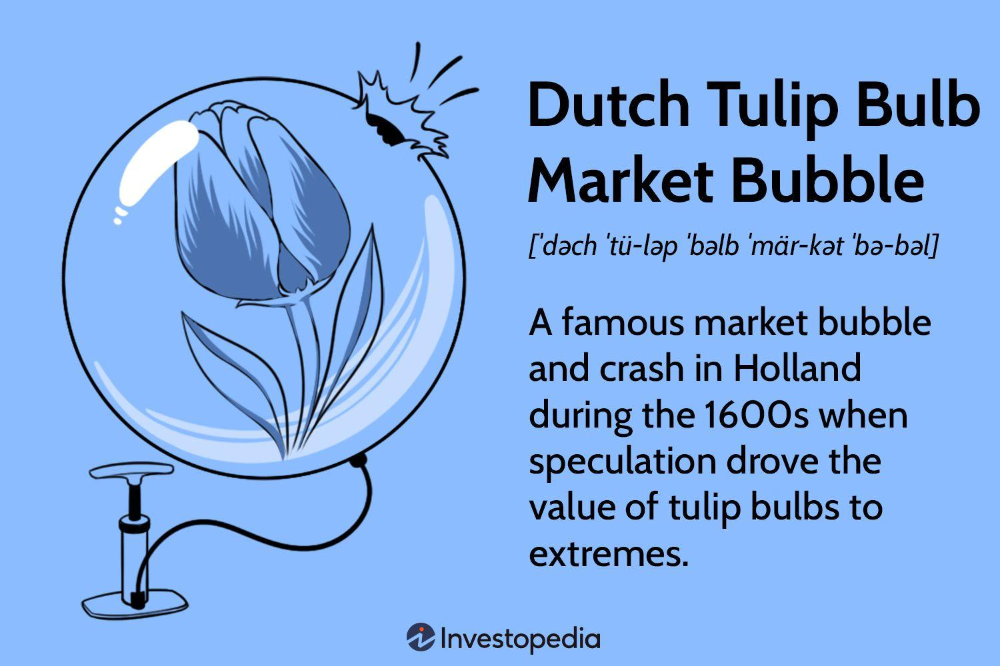

## Table of Contents

## What was the Dutch Tulip Mania?

The Dutch Tulip Mania was a period in the 1630s when tulip prices in the Netherlands went very high. People started buying and selling tulip bulbs like they were trading stocks. They hoped to sell the bulbs for more money later. This made the prices go even higher. At the peak, some rare tulip bulbs were worth as much as a big house!

But then, in 1637, the prices suddenly dropped. People who had bought tulips at high prices lost a lot of money. This event is often called the first big economic bubble. It showed how dangerous it can be when people get too excited about something and its price goes too high, too fast.

## When did the Tulip Mania occur?

The Dutch Tulip Mania happened in the early 1630s. During this time, people in the Netherlands got very excited about tulips. They started buying and selling tulip bulbs, hoping to make money. The prices of the bulbs went up a lot because everyone wanted them.

But in 1637, the prices suddenly fell. People who had bought tulips at high prices lost a lot of money. This event is known as the first big economic bubble. It showed how risky it can be when prices go up too fast because of too much excitement.

## What caused the Tulip Mania?

The Dutch Tulip Mania was caused by people getting very excited about tulips. In the early 1630s, tulips became very popular in the Netherlands. People started buying and selling tulip bulbs, hoping to make a lot of money. They thought the prices would keep going up, so they were willing to pay more and more for the bulbs. This excitement made the prices go even higher, and some rare tulip bulbs became very expensive.

But then, in 1637, the excitement suddenly stopped. People realized that the prices were too high and started selling their tulip bulbs. This caused the prices to fall quickly. People who had bought tulips at high prices lost a lot of money. This event showed how dangerous it can be when people get too excited about something and its price goes up too fast.

## How did tulips become so valuable during the mania?

Tulips became very valuable during the Tulip Mania because people in the Netherlands got really excited about them. In the early 1630s, tulips were new and special. People started buying and selling tulip bulbs, thinking they could sell them for more money later. This made everyone want to buy tulips, and the prices went up a lot. Some rare tulip bulbs became as expensive as a big house!

But then, in 1637, the excitement stopped. People realized that the prices were too high and started selling their tulip bulbs. This caused the prices to fall quickly. People who had bought tulips at high prices lost a lot of money. This event showed how risky it can be when people get too excited about something and its price goes up too fast.

## What were the peak prices of tulip bulbs during the mania?

During the Tulip Mania, some tulip bulbs reached very high prices. At the peak, in 1637, a single bulb of a rare tulip could cost as much as a big house. For example, a bulb of the Semper Augustus tulip was sold for around 10,000 guilders. This was a huge amount of money at the time, equal to what a skilled worker might earn in 30 years.

The high prices came from people's excitement about tulips. Everyone wanted to buy and sell tulip bulbs, thinking they could make a lot of money. This made the prices go up and up. But then, suddenly, people realized the prices were too high. They started selling their tulip bulbs, and the prices fell quickly. People who had bought tulips at the peak prices lost a lot of money.

## What is the significance of the term 'tulip bulb market bubble'?

The term 'tulip bulb market bubble' describes what happened during the Dutch Tulip Mania in the early 1630s. It was a time when people in the Netherlands got very excited about tulips. They started buying and selling tulip bulbs, hoping to make a lot of money. This excitement made the prices of tulip bulbs go up a lot. At the peak, some rare tulip bulbs were as expensive as a big house. But then, in 1637, the excitement stopped. People realized the prices were too high and started selling their bulbs. This made the prices fall quickly, and people who had bought tulips at high prices lost a lot of money.

The tulip bulb market bubble is important because it was one of the first big economic bubbles. It showed how risky it can be when people get too excited about something and its price goes up too fast. Economists study the Tulip Mania to understand how bubbles happen and how to prevent them. The term 'tulip bulb market bubble' is used to remind people of the dangers of getting too caught up in the excitement and paying too much for something, hoping its price will keep going up.

## How did the Tulip Mania affect the Dutch economy?

The Tulip Mania had a big impact on the Dutch economy. In the early 1630s, people got very excited about tulips. They started buying and selling tulip bulbs, thinking they could make a lot of money. This made the prices of tulip bulbs go up a lot. At the peak, some rare tulip bulbs were as expensive as a big house. People were spending a lot of money on tulips, and this excitement helped the economy grow for a while.

But then, in 1637, the excitement stopped. People realized the prices were too high and started selling their bulbs. This made the prices fall quickly, and people who had bought tulips at high prices lost a lot of money. Many people went bankrupt because they couldn't pay back the money they had borrowed to buy tulips. This caused problems in the economy. It took a while for the Dutch economy to recover from the Tulip Mania, and it showed how risky it can be when people get too excited about something and its price goes up too fast.

## What were the social impacts of the Tulip Mania?

The Tulip Mania had big social impacts on people in the Netherlands. In the early 1630s, everyone got excited about tulips. They started buying and selling tulip bulbs, hoping to make a lot of money. This excitement brought people together, and they talked a lot about tulips. It was like a big party, and everyone wanted to be part of it. People from all walks of life, including farmers, merchants, and even some nobles, joined in the fun.

But when the prices suddenly fell in 1637, the social mood changed. People who had bought tulips at high prices lost a lot of money. Many families went bankrupt and had to sell their homes and belongings. This caused a lot of sadness and anger. People blamed each other for the crash, and some even went to court to try to get their money back. The Tulip Mania showed how quickly excitement can turn into disappointment and how it can affect everyone in a society.

## How did the Tulip Mania eventually collapse?

The Tulip Mania collapsed because people got too excited about tulips and the prices went too high. In the early 1630s, everyone in the Netherlands wanted to buy and sell tulip bulbs. They thought the prices would keep going up, so they were willing to pay more and more for the bulbs. But in February 1637, something changed. People started to realize that the prices were too high and they couldn't keep going up forever. So, they decided to sell their tulip bulbs.

When everyone started selling their bulbs at the same time, the prices fell quickly. People who had bought tulips at high prices lost a lot of money. Some people even went bankrupt because they couldn't pay back the money they had borrowed to buy tulips. The collapse of the Tulip Mania showed how risky it can be when people get too excited about something and its price goes up too fast. It was a lesson for everyone about the dangers of economic bubbles.

## What lessons can modern economists learn from the Tulip Mania?

Modern economists can learn a lot from the Tulip Mania. It shows how dangerous it can be when people get too excited about something and its price goes up too fast. This is called an economic bubble. When everyone starts buying something because they think the price will keep going up, it can make the price go even higher. But if everyone suddenly decides to sell, the price can fall very quickly. This can cause a lot of people to lose money and can hurt the economy.

The Tulip Mania also teaches economists to be careful about speculation. Speculation is when people buy things hoping to sell them later for more money. It's risky because if the price goes down instead of up, people can lose a lot of money. Economists use the Tulip Mania to study how bubbles happen and how to stop them from causing too much damage. By understanding what happened with tulips, they can help prevent similar problems in the future.

## Are there any parallels between the Tulip Mania and modern economic bubbles?

The Tulip Mania and modern economic bubbles have a lot in common. Both happen when people get too excited about something and start buying it a lot. They think the price will keep going up, so they buy more and more. This makes the price go even higher. For example, the housing bubble in the 2000s was like the Tulip Mania. People bought houses hoping to sell them for more money later, and the prices went up a lot. But when everyone realized the prices were too high, they started selling, and the prices fell quickly. This caused a lot of people to lose money and hurt the economy.

Another similarity is how both the Tulip Mania and modern bubbles can affect a lot of people. During the Tulip Mania, many families lost their money and had to sell their homes. The same thing happened during the housing bubble. People who had bought houses at high prices lost a lot of money when the prices fell. Both events show how risky it can be when people get too excited about something and its price goes up too fast. Economists study these events to learn how to prevent bubbles from causing too much damage in the future.

## What role did government and regulatory bodies play during the Tulip Mania?

During the Tulip Mania, the government and regulatory bodies did not have a big role in stopping the bubble. In the early 1630s, people in the Netherlands got very excited about tulips. They started buying and selling tulip bulbs, hoping to make a lot of money. The government did not do much to control this excitement. They did not set rules about how much people could spend on tulips or how they could trade them. This let the prices go up and up until they got too high.

When the prices suddenly fell in 1637, the government tried to help. They set up courts to deal with the problems that came from the crash. People who had lost money went to these courts to try to get it back. But the government did not have a plan to stop the bubble from happening in the first place. The Tulip Mania showed how important it is for governments to watch the economy and make rules to keep it safe.

## References & Further Reading

[1]: Mackay, C. (1841). ["Extraordinary Popular Delusions and the Madness of Crowds."](https://en.wikipedia.org/wiki/Extraordinary_Popular_Delusions_and_the_Madness_of_Crowds) Bentley, London.

[2]: Goldgar, A. (2007). ["Tulipmania: Money, Honor, and Knowledge in the Dutch Golden Age."](https://www.jstor.org/stable/10.1353/ren.2008.0091) University of Chicago Press.

[3]: Dash, M. (2001). ["Tulipomania: The Story of the World's Most Coveted Flower & the Extraordinary Passions It Aroused."](https://archive.org/details/tulipomaniastory00dash) Crown Publishers.

[4]: Galbraith, J. K. (1994). ["A Short History of Financial Euphoria."](https://www.penguinrandomhouse.com/books/321392/a-short-history-of-financial-euphoria-by-john-kenneth-galbraith/) Penguin Books.

[5]: Shiller, R. J. (2015). ["Irrational Exuberance."](https://press.princeton.edu/books/paperback/9780691173122/irrational-exuberance) Princeton University Press.

[6]: Kindleberger, C. P., & Aliber, R. Z. (2011). ["Manias, Panics, and Crashes: A History of Financial Crises."](https://link.springer.com/book/10.1057/9780230628045) Palgrave Macmillan.

[7]: Jarrow, R. A. (2009). ["Risk management models for contagious arbitrage."](https://papers.ssrn.com/sol3/papers.cfm?abstract_id=1599381) Journal of Banking & Finance, 33(10), 1800-1808.