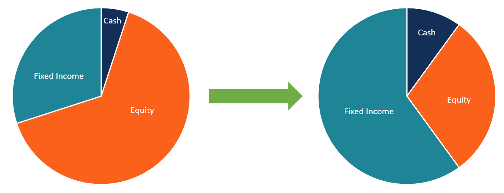

## Table of Contents

## What is dynamic asset allocation?

Dynamic asset allocation is a strategy used by investors to adjust their investment portfolios based on changing market conditions. Instead of sticking to a fixed mix of stocks, bonds, and other assets, investors using this approach will actively shift their investments to try to take advantage of market trends or to minimize risk. For example, if the stock market is doing well, they might increase their stock holdings, but if it looks like a downturn is coming, they might move more money into bonds or cash.

This strategy can be more complex than a simple "buy and hold" approach because it requires keeping a close eye on market indicators and making decisions about when to buy or sell different types of assets. It's often used by more experienced investors or managed by financial professionals who have the tools and knowledge to analyze market trends. While dynamic asset allocation can potentially lead to higher returns, it also comes with higher risks and costs, such as transaction fees and the possibility of making poor timing decisions.

## How does dynamic asset allocation differ from static asset allocation?

Dynamic asset allocation and static asset allocation are two different ways to manage an investment portfolio. Dynamic asset allocation means changing the mix of investments like stocks, bonds, and cash based on what's happening in the market. If someone thinks the stock market will go up, they might put more money into stocks. But if they think it might go down, they might move money into safer investments like bonds or cash. This approach needs a lot of watching and understanding of the market and can be riskier because it involves trying to guess what the market will do next.

On the other hand, static asset allocation is much simpler and less hands-on. With static asset allocation, you pick a certain mix of investments at the start and stick with it, no matter what the market does. For example, you might decide to keep 60% of your money in stocks and 40% in bonds and not change it. This method is easier to manage and can be less stressful because you're not trying to predict the market. It's often used by people who want a straightforward, long-term investment plan without the need to constantly adjust their portfolio.

Both methods have their own advantages and risks. Dynamic asset allocation might give you a chance to make more money if you guess the market right, but it can also lead to losses if your guesses are wrong. Static asset allocation might not take advantage of market ups and downs as well, but it's more predictable and can help you avoid the stress and costs of frequent trading.

## What are the main benefits of using dynamic asset allocation?

One of the main benefits of using dynamic asset allocation is the potential to increase returns. By actively changing the mix of investments based on what's happening in the market, you might be able to take advantage of good times in the stock market or move to safer investments when things look risky. This can help you make more money than if you just kept your investments the same all the time.

Another benefit is that dynamic asset allocation can help manage risk. If you see that the market might be heading for a downturn, you can shift your money into safer investments like bonds or cash. This way, you might lose less money than if you stayed fully invested in stocks. It's like having a flexible plan that lets you adjust to what's happening around you, which can make your investments more secure in the long run.

## What are the potential risks associated with dynamic asset allocation?

One big risk with dynamic asset allocation is that it can be hard to predict the market. If you guess wrong about what the market will do, you might end up selling your investments at a low price and buying them back at a higher price. This can lead to losing money instead of making more. It's like trying to jump from one moving train to another – if you don't time it right, you could fall and get hurt.

Another risk is the cost of making a lot of changes to your investments. Every time you buy or sell something, you might have to pay fees, and these can add up over time. Also, spending a lot of time watching the market and making decisions can be stressful and take up a lot of your time. If you're not careful, these costs and the stress of managing your investments could outweigh any extra money you might make from adjusting your portfolio.

## Can you explain the process of implementing dynamic asset allocation?

Implementing dynamic asset allocation starts with setting up your initial investment portfolio. You decide how much money to put into different types of investments like stocks, bonds, and cash. You might start with a mix that feels right for you, but the key is to be ready to change it. You'll need to keep an eye on the market, looking at things like stock prices, interest rates, and economic news. This helps you figure out if it's a good time to buy more of something or sell some of what you have.

Once you've got a feel for the market, you start making changes to your portfolio. If you think the stock market is going to do well, you might decide to put more money into stocks. But if you think things might get risky, you could move some of your money into bonds or cash, which are usually safer. This means you'll be buying and selling investments based on what you think will happen next. It's important to do this carefully because making the wrong move could cost you money. Also, remember that every time you buy or sell, you might have to pay fees, so you need to think about those costs too.

Overall, dynamic asset allocation takes a lot of watching and thinking. You have to be ready to make quick decisions and be okay with the fact that you might not always get it right. It can be more work and more stressful than just leaving your investments alone, but if you're good at reading the market, it could help you make more money over time.

## What types of assets are typically included in a dynamic asset allocation strategy?

A dynamic asset allocation strategy usually includes a mix of different types of investments. The most common ones are stocks, which are shares in companies, and bonds, which are loans you make to companies or governments. Stocks can go up or down a lot, so they're riskier but can also make you more money. Bonds are usually safer and give you steady income, but they don't grow as fast as stocks. Besides these, you might also have cash or cash equivalents, like money market funds, which are very safe but don't grow much.

Sometimes, a dynamic asset allocation strategy can also include other types of investments. These might be real estate, commodities like gold or oil, and even things like mutual funds or exchange-traded funds (ETFs) that let you invest in a bunch of different things at once. The idea is to have a variety of investments so you can move your money around based on what's happening in the market. By doing this, you can try to take advantage of good times and protect yourself during bad times.

## How often should one rebalance their portfolio when using dynamic asset allocation?

When using dynamic asset allocation, how often you should rebalance your portfolio depends on a few things. You need to keep an eye on the market and see if things are changing a lot. If the market is moving quickly, you might need to rebalance more often, maybe every few weeks or even every week. But if things are pretty stable, you might only need to check and adjust your investments every few months.

It's also important to think about your own time and how much you want to be involved. Rebalancing a lot can take up a lot of your time and can be stressful. If you don't want to spend too much time on it, you might decide to rebalance less often, maybe once every three to six months. The key is to find a balance that works for you and helps you reach your investment goals without making you too stressed or busy.

## What are some common strategies or models used in dynamic asset allocation?

One common strategy in dynamic asset allocation is called tactical asset allocation. This means you look at what's happening in the market right now and make quick changes to your investments. If you think stocks are going to do well, you might buy more stocks. But if you think the market might go down, you could sell some of your stocks and buy more bonds or cash. It's like trying to guess where the market is going and moving your money to take advantage of that.

Another model is the constant-proportion portfolio insurance (CPPI) strategy. This one is a bit more complicated, but the basic idea is to keep a certain amount of your money safe in bonds or cash, and then use the rest to invest in riskier things like stocks. As the value of your investments goes up or down, you change how much you have in safe and risky investments. The goal is to protect your money while still trying to make more if the market does well.

There's also the risk parity approach, which tries to balance the risk in your portfolio. Instead of just putting more money into stocks when they're doing well, you look at how risky each type of investment is and try to keep the risk even across your whole portfolio. This might mean having more bonds or other safer investments if they're less risky than stocks. It's all about trying to keep your overall risk level steady, even as you move your money around.

## How can dynamic asset allocation help in different market conditions?

Dynamic asset allocation can help you make more money and stay safer in different market conditions. When the market is doing well, like when stock prices are going up, you can put more of your money into stocks. This way, you might make more money because stocks are growing. But if you think the market might go down, you can move some of your money into safer things like bonds or cash. This helps you lose less money if the market does fall. By changing what you invest in based on what's happening, you can try to take advantage of good times and protect yourself during bad times.

It's also good for dealing with different types of markets, like when things are growing slowly or when there's a lot of ups and downs. If the market is steady but not growing much, you might keep more money in bonds to get a steady income. But if the market is all over the place, you can move your money around more often to try and catch the upswings and avoid the downturns. This way, you're always trying to be in the right place at the right time, which can help you do better than if you just left your money in one place.

## What tools or software can assist with dynamic asset allocation?

There are many tools and software that can help with dynamic asset allocation. One popular type is investment management software like Morningstar Direct or Bloomberg Terminal. These tools give you a lot of information about the market, like stock prices, economic reports, and news. They also have features that let you see how your portfolio is doing and make changes easily. This can save you time and help you make better decisions about when to buy or sell different investments.

Another useful tool is portfolio rebalancing software, like BlackRock's Aladdin or Envestnet's Tamarac. These programs can automatically adjust your investments to keep them in line with your goals. They can look at the market and suggest when you should move your money around. This can be really helpful if you don't want to spend all your time watching the market yourself. They can also help you keep track of the fees you're paying and make sure you're not spending too much on trading.

Lastly, there are also robo-advisors like Betterment or Wealthfront. These are online services that use algorithms to manage your money for you. They can automatically adjust your portfolio based on what's happening in the market. This is a good option if you want a hands-off approach but still want to use dynamic asset allocation. Robo-advisors can be cheaper than hiring a human financial advisor and can still help you make smart investment choices.

## How does dynamic asset allocation fit into long-term investment planning?

Dynamic asset allocation can be a part of long-term investment planning by helping you make the most of your money over time. Instead of just picking a mix of investments and sticking with it, you can change your investments based on what's happening in the market. This means you might move more money into stocks when the market is doing well, which could help your investments grow faster. Over many years, making these smart moves can add up and help you reach your long-term goals, like saving for retirement or buying a house.

But it's important to remember that dynamic asset allocation is just one part of a bigger plan. You still need to think about your overall goals and how much risk you're comfortable with. Even though you're changing your investments, you should keep an eye on the big picture and make sure you're staying on track. By using dynamic asset allocation carefully and combining it with other long-term strategies, you can build a strong plan that helps your money grow over time while also keeping it safe.

## What advanced techniques can be used to optimize dynamic asset allocation strategies?

One advanced technique to optimize dynamic asset allocation is using machine learning and artificial intelligence. These technologies can look at a lot of data from the past and find patterns that might be hard for a person to see. They can then use these patterns to guess what the market might do next. By using these guesses, you can move your money around to take advantage of good times and stay safe during bad times. This can help make your investments grow more over time, but it's important to remember that even the smartest computer can't predict the future perfectly.

Another technique is called multi-factor models. These models look at different things that can affect how well your investments do, like how big a company is, how fast it's growing, or how much it pays in dividends. By thinking about all these factors together, you can make better choices about where to put your money. This can help you build a portfolio that's more likely to do well in different market conditions. It's like having a map that shows you many different paths to reach your goal, so you can pick the best one depending on where you are right now.

## What are the innovations in dynamic asset allocation?

Recent advancements in technology have significantly impacted the field of asset allocation, particularly through the integration of artificial intelligence (AI) and machine learning methodologies. One of the most noteworthy developments is the use of deep [reinforcement learning](/wiki/reinforcement-learning) (DRL) for optimizing portfolio allocations. DRL combines reinforcement learning algorithms with deep neural networks, allowing systems to learn and adaptively respond to market scenarios through studying vast datasets. Unlike traditional methods, DRL is capable of handling the complexities and stochastic nature of financial markets by dynamically adjusting strategies for asset allocation. 

Innovative models leveraging deep neural networks contribute immensely to enhancing decision-making processes within portfolio management. Neural networks, with their ability to identify intricate patterns through multiple hidden layers, are particularly suitable for capturing non-linear relationships in financial data. They can process inputs such as historical price movements, technical indicators, and macroeconomic variables to generate optimal asset allocations.

One of the critical performance metrics that these advanced AI models aim to maximize is the Sharpe ratio, a measure of risk-adjusted return. By maximizing the Sharpe ratio, these models ensure that the portfolios have superior risk-return profiles, thereby optimizing the investor's utility. Mathematically, the Sharpe ratio $S$ is defined as:

$$
S = \frac{R_p - R_f}{\sigma_p}
$$

where $R_p$ is the expected portfolio return, $R_f$ is the risk-free return, and $\sigma_p$ is the standard deviation of the portfolio's excess return. Advanced AI techniques continually refine these metrics to provide the most efficient allocation scheme.

The implementation of these technologies has begun to revolutionize investment strategies, offering more adaptive and real-time responses to market movements. Investors equipped with models based on DRL and neural networks can respond to financial markets with greater agility and precision than ever before, thus transforming asset allocation from a traditionally static approach to a vibrant, dynamic process.

Despite the promising advancements, challenges remain in implementing these sophisticated technologies, primarily due to their complexity and associated costs. The computational demands for training advanced AI models are high, often necessitating specialized hardware and expertise, which can be both expensive and scarce. Additionally, the intricate nature of these models poses a steep learning curve for investors not versed in machine learning and AI, limiting widespread adoption beyond institutional settings.

Nonetheless, as AI technology continues to advance and become more accessible, it is likely that the barriers to adoption will decrease, paving the way for a more democratized application of these cutting-edge strategies in portfolio management.

## References & Further Reading

[1]: Bergstra, J., Bardenet, R., Bengio, Y., & Kégl, B. (2011). ["Algorithms for Hyper-Parameter Optimization."](https://dl.acm.org/doi/10.5555/2986459.2986743) Advances in Neural Information Processing Systems 24.

[2]: ["Advances in Financial Machine Learning"](https://www.amazon.com/Advances-Financial-Machine-Learning-Marcos/dp/1119482089) by Marcos Lopez de Prado

[3]: ["Evidence-Based Technical Analysis: Applying the Scientific Method and Statistical Inference to Trading Signals"](https://www.amazon.com/Evidence-Based-Technical-Analysis-Scientific-Statistical/dp/0470008741) by David Aronson

[4]: ["Machine Learning for Algorithmic Trading"](https://github.com/stefan-jansen/machine-learning-for-trading) by Stefan Jansen

[5]: ["Quantitative Trading: How to Build Your Own Algorithmic Trading Business"](https://www.amazon.com/Quantitative-Trading-Build-Algorithmic-Business/dp/1119800064) by Ernest P. Chan