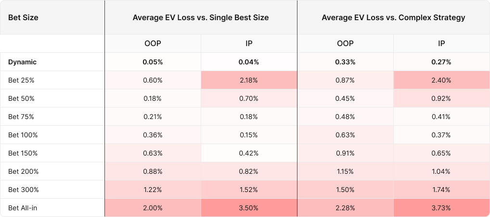

## Table of Contents

## What is dynamic bet sizing in gambling?

Dynamic bet sizing in gambling means changing the amount of money you bet based on different things that happen while you're playing. Instead of always betting the same amount, you might bet more or less depending on how well you're doing, how much money you have, or even what you think will happen next. This way of betting can make your gambling more exciting and might help you win more, but it also makes it trickier because you need to keep thinking about how much to bet.

A lot of people use dynamic bet sizing in games like poker or blackjack. In poker, for example, you might bet more if you think you have a good hand and want to scare other players away. Or, you might bet less if you're not sure about your hand but still want to stay in the game. It's all about trying to make smart choices with your bets to get the best results. But remember, even with smart betting, gambling always has risks, so it's important to be careful and not bet more than you can afford to lose.

## Why is it important to adjust bet sizes dynamically?

Adjusting bet sizes dynamically is important because it can help you manage your money better while gambling. When you change how much you bet based on what's happening in the game, you can try to win more when things are going well and lose less when they're not. For example, if you're doing great in a game, you might want to bet more to take advantage of your good luck. But if you're not doing so well, betting less can help you stay in the game longer without losing all your money too quickly.

It also makes gambling more fun and challenging. When you're always thinking about how much to bet next, it keeps your mind active and makes each decision feel important. This can make the game more exciting and might even help you get better at it over time. But remember, even with dynamic bet sizing, gambling still has risks, so it's always good to bet responsibly and not spend more than you can afford to lose.

## How does dynamic bet sizing differ from static bet sizing?

Dynamic bet sizing means you change how much you bet as you play. You might bet more if you're winning or if you think you have a good chance to win. Or you might bet less if you're losing or want to play longer without spending all your money. It's like always trying to make the best choice for each bet based on what's happening in the game.

Static bet sizing is different because you always bet the same amount, no matter what. You pick a number at the start and stick with it, win or lose. This can be simpler and easier to keep track of, but it might not be as good at helping you win more or lose less over time.

## What are the basic principles of dynamic bet sizing for beginners?

Dynamic bet sizing means changing how much you bet while you're playing a game. The first thing to remember is to bet more when you're winning or when you think you have a good chance to win. For example, if you're playing cards and you have a great hand, you might want to bet more to try to win more money. On the other hand, if you're not doing so well or you're not sure about your chances, it's usually better to bet less. This way, you can stay in the game longer without losing all your money too quickly.

Another important thing is to always keep an eye on how much money you have. Don't bet so much that you could lose everything in one go. It's a good idea to set a limit for yourself and stick to it. Also, try to think about what might happen next in the game. If you think the odds are in your favor, you might want to bet a bit more. But if you're not sure, it's better to bet less and wait for a better chance. Remember, the goal is to have fun and maybe win some money, but always be careful not to spend more than you can afford to lose.

## Can you explain the Kelly Criterion and its relevance to dynamic bet sizing?

The Kelly Criterion is a formula that helps you decide how much to bet when you're gambling. It tells you to bet a certain part of your money based on how likely you are to win and how much you can win if you do. The idea is to make your money grow as fast as possible without taking too many risks. If you use the Kelly Criterion, you might bet more when you have a good chance of winning and bet less when the chances are not so good. This way, you can try to win more money over time.

The Kelly Criterion is really important for dynamic bet sizing because it gives you a way to change your bets smartly. Instead of just guessing how much to bet, you can use the Kelly Criterion to make a plan. It helps you balance the risk of losing money with the chance of winning more. By following the Kelly Criterion, you can make your betting more scientific and maybe win more money in the long run. But remember, even with a good plan like the Kelly Criterion, gambling always has risks, so it's important to bet responsibly.

## How can a beginner start implementing dynamic bet sizing strategies?

To start using dynamic bet sizing, beginners should first understand that it means changing how much you bet while playing. Begin by setting a budget for your gambling session. This is the total amount of money you're okay with spending. Then, as you play, you can change your bets based on how you're doing. If you're winning, you might want to bet a bit more to try to win even more. But if you're losing, it's usually smarter to bet less so you don't lose all your money too quickly.

A good way to start is by using a simple rule like betting a higher amount when you feel confident about winning and a lower amount when you're not so sure. For example, if you're playing a game where you think you have a good chance to win, you could bet a bit more than usual. But if you're not feeling as confident, you should bet less. Always keep an eye on your budget and don't bet more than you can afford to lose. Over time, as you get more comfortable, you can try more complex strategies like the Kelly Criterion, but for now, just focus on adjusting your bets based on how the game is going and how you feel about your chances.

## What common mistakes should be avoided when using dynamic bet sizing?

One common mistake when using dynamic bet sizing is betting too much when you're winning. It can be tempting to keep betting more and more when you're on a winning streak, but this can lead to big losses if your luck changes. It's important to stay calm and not let your emotions make you bet more than you should. Another mistake is not paying attention to your budget. If you don't keep track of how much money you have left, you might end up betting more than you can afford to lose, which can be a big problem.

Another mistake is not adjusting your bets based on the game's situation. If you're not changing your bets when the odds change, you're not really using dynamic bet sizing. For example, if you have a good hand in a card game, you should bet more, but if you're not sure, you should bet less. It's also a mistake to think that dynamic bet sizing is a sure way to win. Even with smart betting, gambling always has risks, so it's important to bet responsibly and not expect to win every time.

## How do professional gamblers use dynamic bet sizing to maximize profits?

Professional gamblers use dynamic bet sizing to make the most money by carefully changing how much they bet based on what's happening in the game. They look at things like how likely they are to win, how much they can win, and how much money they have. If they think they have a good chance to win, they might bet more to try to win more money. But if the odds are not in their favor, they'll bet less to lose less money. This way, they can try to make their money grow over time without taking too many risks.

They also use strategies like the Kelly Criterion to help them decide how much to bet. The Kelly Criterion is a formula that tells them to bet a certain part of their money based on the odds of winning and how much they can win. By following this formula, professional gamblers can make their betting more scientific and try to win more money in the long run. But even with these smart strategies, they know that gambling always has risks, so they bet responsibly and never spend more than they can afford to lose.

## What advanced techniques can be used to optimize dynamic bet sizing?

Professional gamblers use advanced techniques like the Kelly Criterion to optimize their dynamic bet sizing. The Kelly Criterion is a math formula that helps them figure out how much of their money to bet. It looks at how likely they are to win and how much they can win. By using this formula, they can make their bets more scientific and try to grow their money faster. They also pay close attention to the game's situation, like how other players are betting and what cards are left in a deck. This helps them adjust their bets to take advantage of the best opportunities.

Another technique is to use computer simulations and data analysis. Professional gamblers might use software to run thousands of game scenarios and see how different bet sizes affect their winnings. This helps them find the best bet sizes for different situations. They also keep track of their past bets and results to learn from their wins and losses. By analyzing this data, they can fine-tune their betting strategy over time. These advanced techniques help them make smarter bets and try to win more money in the long run.

## How does one's bankroll size influence dynamic bet sizing strategies?

Your bankroll, which is the total amount of money you have to bet, really affects how you use dynamic bet sizing. If you have a big bankroll, you can bet more money when you think you have a good chance to win. This means you can take bigger risks and try to win more money. But if your bankroll is small, you need to be more careful. You should bet less so you don't lose all your money too quickly. This way, you can stay in the game longer and wait for better chances to win.

It's important to always think about your bankroll when you're changing your bets. If you're winning and your bankroll is growing, you might want to bet a bit more to try to keep winning. But if you're losing and your bankroll is getting smaller, you should bet less to protect what you have left. By keeping an eye on your bankroll and adjusting your bets smartly, you can try to make the most money over time while still being safe.

## What role does risk management play in dynamic bet sizing?

Risk management is super important when you're using dynamic bet sizing. It's all about making sure you don't lose too much money while you're trying to win. When you change how much you bet, you need to think about how much risk you're taking. If you bet too much when you're not sure about winning, you could lose a lot of money fast. So, you need to be careful and only bet what you can afford to lose. By keeping an eye on your bets and how much money you have, you can try to win more without taking too many risks.

A good way to manage risk is to use strategies like the Kelly Criterion. This formula helps you figure out how much to bet based on how likely you are to win and how much you can win. It tells you to bet a certain part of your money, so you don't bet too much and lose everything. By following these kinds of strategies, you can make smart choices about your bets and try to grow your money over time. Remember, even with good risk management, gambling always has risks, so it's important to bet responsibly.

## How can dynamic bet sizing be adapted to different types of games or sports betting?

Dynamic bet sizing can be used in many different games and sports betting. In games like poker or blackjack, you might bet more when you have a good hand or when you think the odds are in your favor. For example, if you're playing poker and you have a strong hand, you could bet more to try to win more money from other players. In blackjack, if you're counting cards and you think the next card will help you win, you might also bet more. On the other hand, if you're not sure about your chances, you should bet less to lose less money and stay in the game longer.

In sports betting, dynamic bet sizing works a bit differently. You might change how much you bet based on how likely you think a team is to win. If you think a team has a really good chance of winning, you might bet more money on them. But if it's a close game and you're not sure who will win, you should bet less. You can also use things like the Kelly Criterion to help you figure out how much to bet. This way, you can try to win more money over time while still being careful not to lose too much.

## What is Understanding Dynamic Bet Sizing?

Dynamic bet sizing is a trading technique that adjusts the size of each trade based on real-time market data and specific trading strategies. This approach is designed to provide flexibility and responsiveness, key differences from static bet sizing where the trade size is kept constant regardless of market conditions. 

The primary objective of dynamic bet sizing is to enhance returns while mitigating risk by adjusting exposure levels according to the prevailing market environment. This method takes into account various market factors such as [volatility](/wiki/volatility-trading-strategies), trend indicators, and other pertinent data to determine optimal trade sizes. By doing so, it aims to optimize capital allocation across different trades, maximizing profits in favorable conditions and minimizing losses during adverse market movements.

Mathematically, dynamic bet sizing can be represented as a function of the variables that influence market conditions. For instance:

$$
\text{Trade Size} = f(\text{Volatility}, \text{Market Trend}, \text{Strategy Performance}, \ldots)
$$

This formula indicates that the trade size is a function of several factors, which could include recent volatility levels, the strength and direction of the market trend, and the past performance of the trading strategy. 

One fundamental principle involved is the Kelly Criterion, which provides a formula to determine the optimal size of a series of bets by maximizing the logarithm of wealth. The Kelly Criterion, simplified, is:

$$
f^* = \frac{bp - q}{b}
$$

where $f^*$ is the fraction of capital to bet, $b$ is the odds received on the wager, $p$ is the probability of winning, and $q$ is the probability of losing (which is $1 - p$).

Dynamic bet sizing leverages technology and data analytics, often involving complex algorithms that can analyze vast amounts of data in real-time. These algorithms ensure that trading decisions are data-driven, allowing for adjustments to trade sizes based on a calculated assessment of present and forecasted market conditions. By doing this, traders can ensure that their capital deployment is both strategic and in alignment with the evolving trading landscape.

## What are the strategies for implementing dynamic bet sizing?

Several strategies are employed to implement dynamic bet sizing, each with its own advantages and technical considerations. Among these, volatility-based sizing, performance-based adjustments, and risk parity techniques are prominent.

Volatility-based sizing is a method that modulates trade positions according to prevailing market fluctuations. The core idea is to scale trade size inversely to market volatility. In stable market conditions, when volatility is low, the strategy increases position sizes. Conversely, during volatile periods, it reduces trade sizes to mitigate risk. The central formula for volatility-based sizing often involves calculating the inverse of volatility, typically using a standard deviation or an average true range (ATR) indicator as a proxy:

$$
\text{Position Size} = \frac{K}{\text{Volatility}}
$$

where $K$ is a capital scaling factor chosen to ensure the position remains within acceptable risk limits. 

Performance-based adjustments use algorithmic feedback to modulate trade sizes based on the success or setbacks of a strategy. This method involves dynamically assessing a strategy’s historical and real-time performance metrics such as Sharpe ratio, win rate, or drawdown levels. When a strategy is performing well according to these metrics, the algorithm may increase the bet size to capitalize on favorable conditions. Conversely, it might reduce the stake if the strategy underperforms. A simple approach to performance-based sizing might involve setting thresholds for these metrics, where position sizes are adjusted according to observed deviations from predefined performance benchmarks.

Risk parity involves equalizing the risk contribution of each portfolio or position according to its risk impact rather than its dollar amount. The primary objective is to maintain a balanced risk profile where no single asset or position disproportionately affects the overall portfolio volatility. In dynamic bet sizing, risk parity can be realized by systematically computing each position's risk contribution and adjusting its size to match an acceptable risk level. This often requires the use of optimization algorithms to solve for the weights that equalize the risk contributions of all positions in the portfolio, taking into account the covariance of returns between the different assets.

These strategies, when implemented with precision, offer traders the flexibility to respond to changing market conditions. They also enhance the robustness of trading systems by ensuring that risk and performance criteria are dynamically aligned with the strategic objectives of the trading strategy.

## References & Further Reading

[1]: Kelly, J. L. (1956). ["A New Interpretation of Information Rate."](https://www.princeton.edu/~wbialek/rome/refs/kelly_56.pdf) Bell System Technical Journal.

[2]: Lopez de Prado, M. (2018). ["Advances in Financial Machine Learning."](https://books.google.com/books/about/Advances_in_Financial_Machine_Learning.html?id=oU9KDwAAQBAJ) Wiley.

[3]: Chan, E. P. (2009). ["Quantitative Trading: How to Build Your Own Algorithmic Trading Business."](https://github.com/ftvision/quant_trading_echan_book) Wiley.

[4]: Jansen, S. (2020). ["Machine Learning for Algorithmic Trading."](https://github.com/stefan-jansen/machine-learning-for-trading) Packt.

[5]: Aronson, D. R. (2006). ["Evidence-Based Technical Analysis: Applying the Scientific Method and Statistical Inference to Trading Signals."](https://www.amazon.com/Evidence-Based-Technical-Analysis-Scientific-Statistical/dp/0470008741) Wiley.

[6]: Tharp, V. K. (1999). ["Trade Your Way to Financial Freedom."](https://www.amazon.com/Trade-Your-Way-Financial-Freedom/dp/007147871X) McGraw-Hill Education.