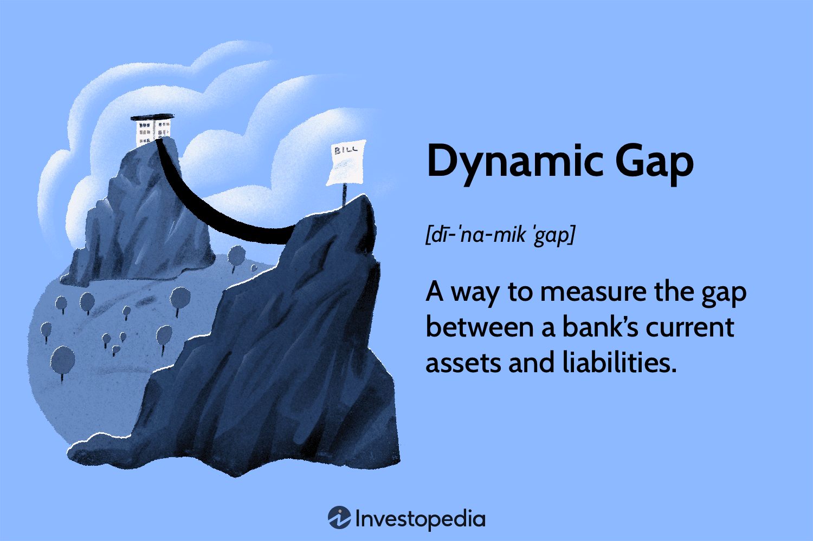

In the world of trading, utilizing the right analytical tools can significantly influence the outcomes, delineating success from failure. Among these tools, gap analysis and dynamic gap analysis stand out for their crucial roles in identifying discrepancies and spotting opportunities. Gap analysis is a strategic method used to evaluate the difference between current and desired performance levels, enabling traders to fine-tune their strategies for optimal results. In contrast, dynamic gap analysis involves a more nuanced approach by assessing performance variations over time, particularly in the context of fluctuating market conditions and interest rate changes.

In algorithmic trading, these methodologies offer substantial benefits by helping to highlight inefficiencies in trading algorithms, thereby facilitating continuous improvement. Traders can leverage these analyses not only to enhance performance but also to manage risks effectively. For instance, dynamic analysis helps in adjusting strategies in real-time, ensuring that the trading approach remains aligned with market dynamics.



This article aims to provide a detailed understanding of gap analysis and dynamic gap analysis within the context of algorithmic trading. It also touches upon how traders can implement practical strategies derived from these analytical methods to refine trading outcomes. Engaging with real-world financial examples, we illustrate the application of these concepts, demonstrating their substantial impact on trading strategies.

## Table of Contents

## Understanding Gap Analysis

Gap Analysis is a strategic tool used extensively for evaluating the discrepancy between a current state and a desired future state. In the context of algorithmic trading, this involves assessing gaps within trading strategies to enhance performance and align with financial goals. The process begins by identifying disparities between the outputs of existing trading algorithms and criteria such as overall return, risk exposure, and compliance with regulations.

### Purpose and Process

The primary purpose of gap analysis within algorithmic trading is to optimize performance, manage risk, and support strategic planning. By identifying where a trading algorithm falls short of its potential or intended benchmarks, traders can refine their systems to narrow these gaps. Here is a basic structure illustrating this process:

1. **Set Objectives**: Clearly define what 'success' looks like from a performance standpoint. This includes establishing key performance indicators (KPIs) for trading activities.

2. **Identify Current Performance**: Measure the current state of your trading algorithms. This requires detailed data collection on aspects like trading volumes, win/loss ratios, volatility management, and execution speeds.

3. **Benchmarking**: Compare actual performance to desired objectives or industry standards. This helps to pinpoint specific areas where gaps exist.

4. **Identify Causes**: Determine underlying reasons for discrepancies. These may include latency in execution, inefficiencies in code, or unforeseen market conditions.

5. **Planning and Implementation**: Develop actionable plans to address these gaps, which may involve code optimization, strategy adjustments, or resource reallocation.

### Practical Application

A practical example of gap analysis in [algorithmic trading](/wiki/algorithmic-trading) could involve assessing trading strategy execution times. Suppose a trading algorithm is intended to execute trades within 50 milliseconds. If analysis shows the average execution time is 75 milliseconds, this 25-millisecond gap represents a discrepancy that might be due to network latency or server performance issues. Traders then need to investigate further into these specific areas and implement solutions such as faster server locations or algorithmic tweaks to close the gap.

Use of statistical methods and data visualization tools can significantly enhance the understanding of these discrepancies. Python, with libraries like Pandas for data manipulation and Matplotlib for plotting, is often employed for these tasks:

```python
import pandas as pd
import matplotlib.pyplot as plt

# Example: Analyze execution times
data = pd.DataFrame({
    'ExecutionTime_ms': [60, 55, 45, 70, 80, 75]  # Example data points
})

# Calculate average execution time
average_time = data['ExecutionTime_ms'].mean()

# Visualize the execution time data
plt.hist(data['ExecutionTime_ms'], bins=6, color='blue', alpha=0.7)
plt.axvline(x=50, color='red', linestyle='--', label='Target Time')
plt.axvline(x=average_time, color='green', linestyle='-', label='Average Time')
plt.xlabel('Execution Time (ms)')
plt.ylabel('Frequency')
plt.title('Execution Time Analysis')
plt.legend()
plt.show()
```

### Importance

By facilitating a structured approach to problem identification and resolution, gap analysis ensures that algorithmic trading strategies remain agile and responsive to changing market conditions. Furthermore, it helps in mitigating risks associated with unforeseen market movements and ensures regulatory compliance by keeping the trading processes within predefined limits.

Ultimately, gap analysis serves as an invaluable tool for traders, providing a roadmap for performance enhancement and strategic development. Through consistent evaluation and adjustment of trading algorithms, traders can achieve higher returns and better manage the inherent risks associated with trading activities.

## The Concept of Dynamic Gap Analysis

Dynamic Gap Analysis is a method that scrutinizes the ongoing variations between a bank's assets and liabilities, offering a comprehensive perspective beyond the static observations typically used. Static gap assessment provides only a momentary view—akin to taking a snapshot—showing the discrepancy between assets and liabilities at a specific point in time. In contrast, dynamic gap analysis incorporates the progression and regression of these financial elements over time, offering a more rounded evaluation. 

Within the context of trading, dynamic gap analysis is pivotal in assessing performance gaps as they evolve over time. This approach factors in essential variables such as [interest rate](/wiki/interest-rate-trading-strategies) exposure and market [volatility](/wiki/volatility-trading-strategies). By continuously observing these elements, traders can manage fluctuations in critical performance metrics effectively. For instance, if interest rates shift, dynamic gap analysis can help traders anticipate how these changes might impact their strategies, allowing for timely adjustments.

Furthermore, this analysis system is advantageous for predicting potential challenges and seizing opportunities within trading portfolios. By evaluating how asset and liability gaps react to varying financial conditions, traders can identify emerging issues, such as [liquidity](/wiki/liquidity-risk-premium) challenges or the risk of asset devaluation, before they manifest fully. Concurrently, recognizing opportunities for advantageous trades or strategic reallocations becomes feasible, enhancing the portfolio's overall health.

This comprehensive approach facilitates a proactive strategy in financial decision-making, enabling an adaptive and informed trading strategy. As financial markets continue to grow in complexity, employing dynamic gap analysis becomes increasingly essential for maintaining a competitive edge.

## Importance of Dynamic Gap Analysis in Algorithmic Trading

Dynamic gap analysis is an essential tool for optimizing trading algorithms, particularly in the fast-paced environment of algorithmic trading. This analytical method provides traders with the ability to continuously refine their strategies by comparing the current performance of their trading algorithms against established benchmarks in real-time. By doing so, traders are able to identify discrepancies and adjust their strategies to align with performance objectives more effectively.

The dynamic nature of this analysis is particularly beneficial in mitigating risks. Through the identification of areas where performance deviates from the desired outcomes, traders can take preemptive actions to reduce potential risks. This includes ensuring adherence to regulatory standards, which is crucial in the highly regulated financial markets. By integrating dynamic gap analysis, traders can develop strategic action plans that optimize resource allocation, leading to improved trading outcomes.

In high-frequency trading environments, the ability to conduct real-time assessments of asset-liability mismatches is crucial. Dynamic gap analysis facilitates better decision-making by providing insights into these discrepancies, enabling traders to make informed decisions that can enhance trading performance. For instance, dynamic assessment techniques can be codified using Python to automate the monitoring process. Here's a basic example of a script that could be used to track real-time performance metrics against benchmarks:

```python
import pandas as pd
import numpy as np

# Example: Calculate the dynamic gap between current performance metrics and benchmark targets
def calculate_dynamic_gap(current_data, benchmark_data):
    # Assume current_data and benchmark_data are Pandas DataFrames with matching indices
    gap = current_data - benchmark_data
    return gap

# Sample data (replace with real trading data)
current_performance = pd.Series([1.2, 3.4, 2.1, 4.5], index=['Metric1', 'Metric2', 'Metric3', 'Metric4'])
benchmark_targets = pd.Series([1.0, 3.5, 2.0, 4.0], index=['Metric1', 'Metric2', 'Metric3', 'Metric4'])

gap_series = calculate_dynamic_gap(current_performance, benchmark_targets)
print("Dynamic Gaps:")
print(gap_series)
```

The example illustrates a simple approach to calculating dynamic gaps between current performance metrics and predefined benchmarks. By applying similar techniques, traders can detect underperforming areas and adjust their strategies accordingly, thus ensuring more competitive and resilient trading strategies in an evolving market landscape. 

Dynamic gap analysis not only enhances the operational efficiency of trading algorithms but also contributes significantly to the strategic planning and execution process, rendering it an indispensable component in the arsenal of tools used by traders today.

## Steps in Conducting Gap Analysis for Algo Trading

Gap analysis in algorithmic trading is a structured approach that assists traders in optimizing strategies by aligning actual performance with desired objectives. The process entails several critical steps:

### Define Objectives and KPIs

The first step involves establishing clear performance indicators (KPIs) and specific objectives that align with trading goals. These goals could include maximizing returns, minimizing risk, or achieving a targeted win rate. Defining these metrics is crucial as they serve as benchmarks for evaluating the effectiveness of trading strategies.

### Collect Data

The collection of comprehensive data is essential for an accurate gap analysis. This includes historical price data, trading metrics, execution times, and any other relevant information. Data should be gathered in a systematic manner to ensure completeness and accuracy, thereby enabling a more precise analysis. Utilizing databases and financial data APIs can facilitate this process:

```python
import pandas as pd
import yfinance as yf  # For more datasets, visit: https://paperswithbacktest.com/datasets

# Example of collecting historical price data
ticker = "AAPL"
data = yf.download(ticker, start="2022-01-01", end="2023-01-01")
```

### Establish a Baseline

Setting benchmarks based on past performance or industry standards provides a reference point against which current performance can be measured. This baseline may pertain to various trading metrics such as average return per trade, maximum drawdown, or Sharpe ratio.

### Measure Current Performance

Analyze the current performance of trading algorithms using statistical and analytical methods. This involves evaluating the performance indicators and comparing them to the established benchmarks. Tools such as Python's pandas and NumPy libraries can be used for this analysis:

```python
# Example of calculating performance metrics
average_return = data['Close'].pct_change().mean()
volatility = data['Close'].pct_change().std()
```

### Identify Gaps

Identify where performance deviates from the established benchmarks. Visualization tools, such as Plotly or Matplotlib, can be instrumental in highlighting these gaps. Visualizations help traders to understand discrepancies better and pinpoint areas requiring attention.

```python
import matplotlib.pyplot as plt

# Visualizing the closing price to identify potential gaps
plt.plot(data.index, data['Close'])
plt.title('Closing Prices Over Time')
plt.xlabel('Date')
plt.ylabel('Price')
plt.show()
```

### Analyze Causes

Investigate the root causes of identified discrepancies in trading performance. This might involve examining trading algorithms, market conditions, or data quality issues. Understanding these causes is essential for developing effective solutions.

### Develop an Action Plan

Based on the insights from the gap analysis, craft a strategic plan to address and close the performance gaps. This could involve adjusting trading algorithms, incorporating new data, or reassessing risk management practices.

### Monitor and Implement Changes

Implement the changes and continuously monitor the outcomes. This ensures that adjustments are effective and that any new gaps are promptly identified and addressed. Adopting a feedback loop mechanism is beneficial for sustainable improvements in performance.

Overall, conducting a gap analysis aids traders in refining their strategies, thereby enhancing trading outcomes in dynamic financial markets. The process encourages a proactive approach to performance management, ultimately leading to more informed decision-making.

## Practical Applications and Tools

Gap analysis can be utilized to uncover market opportunities that are not currently leveraged by trading algorithms, allowing traders to adjust strategies for improved outcomes. By employing statistical methods such as regression analysis or time-series forecasting, traders can better comprehend discrepancies in algorithmic performance and their potential impact on trading results. These methods facilitate a deeper understanding of the variance between expected and actual trading outcomes, providing insight into areas that require adjustment.

Machine learning (ML) tools have become essential in enhancing predictive modeling and identifying emerging gaps in trading data. Algorithms such as Random Forests, Gradient Boosting Machines, and neural networks can be employed to analyze large datasets efficiently, uncovering patterns and relationships that may not be immediately apparent through traditional analysis methods. This predictive capability allows traders to anticipate and react to shifts in market conditions more effectively.

Visualization tools such as Plotly and Tableau play a crucial role in interpreting dynamic investment gaps. They provide interactive and intuitive platforms for visualizing complex data, enabling traders to identify patterns, trends, and outliers with greater ease. For example, a trader can use Python in conjunction with Plotly to create interactive charts that highlight discrepancies in trading performance over time:

```python
import plotly.express as px
import pandas as pd

# Sample data
data = {
  'Date': pd.date_range(start='2023-01-01', periods=10, freq='D'),
  'Actual Performance': [1.1, 1.2, 1.15, 1.3, 1.25, 1.4, 1.35, 1.5, 1.45, 1.6],
  'Expected Performance': [1.0, 1.1, 1.25, 1.2, 1.35, 1.3, 1.45, 1.4, 1.55, 1.5]
}

df = pd.DataFrame(data)
df['Gap'] = df['Actual Performance'] - df['Expected Performance']

fig = px.line(df, x='Date', y=['Actual Performance', 'Expected Performance'], title='Performance Gap Analysis')
fig.add_scatter(x=df['Date'], y=df['Gap'], mode='lines', name='Gap')
fig.show()
```

Backtesting platforms are also indispensable for traders, as they allow the simulation of algorithm performance using historical data. This capability is critical for projecting potential changes and improvements in trading strategies before deploying them in live markets. By [backtesting](/wiki/backtesting), traders can fine-tune algorithms to enhance their robustness and effectiveness, ensuring that they perform optimally under varying market conditions.

In summary, the integration of statistical methods, [machine learning](/wiki/machine-learning), visualization tools, and backtesting platforms provides traders with comprehensive capabilities to conduct effective gap analysis. These tools enable the identification of market inefficiencies and discrepancies, which can then be leveraged to optimize algorithmic trading strategies and performance.

## Case Studies and Examples

### Case Studies and Examples

In the competitive arena of algorithmic trading, the application of gap analysis has proven to be a critical [factor](/wiki/factor-investing) for operational success and profit maximization. Here, we examine two illustrative case studies that demonstrate the efficacy of gap analysis in real-world trading environments. 

**Case Study 1: High-Frequency Trading Firm**

A high-frequency trading ([HFT](/wiki/high-frequency-trading-strategies)) firm recently experienced a substantial 15% increase in profits by implementing gap analysis techniques to address latency issues. Initially, the firm faced discrepancies between expected and actual trade execution times—an issue that can critically affect profitability in high-frequency trading. Latency, defined as the delay before a transfer of data begins following an instruction, was identified through gap analysis as the primary bottleneck in their trading operations. By systematically analyzing the gap in data transmission times using real-time network monitoring tools, the firm identified the sources of delay, which included network congestion and inefficient data processing algorithms. The insights gathered allowed for strategic adjustments, such as optimizing server placement and upgrading data processors, thereby reducing latency and enhancing trade execution speeds.

**Case Study 2: Retail Forex Trader**

In a different scenario, a retail Forex trader leveraged gap analysis to significantly improve live trading performance by accounting for previously overlooked spread changes. Forex trading involves currency pairs whose values fluctuate due to economic developments, requiring traders to act on razor-thin margins. The trader utilized gap analysis to monitor the discrepancies between the expected and realized spreads—essentially the difference between the bid and ask price. 

By employing statistical analysis and historical spread data, the trader was able to pinpoint time frames where significant deviations occurred. The trader then adjusted trading strategies to either avoid or capitalize on these periods, optimizing order execution and resulting in a notable enhancement of net trading outcomes. Through careful monitoring and adaptation to spread changes via gap analysis, the retail trader managed to not only mitigate potential losses but also seize opportunities for profit that were previously unnoticed.

These cases highlight the tangible benefits that can arise from adopting dynamic gap analysis strategies in trading. By identifying and resolving critical issues within trading processes, both high-frequency firms and individual traders can achieve significant operational improvements and financial gains through effective application of gap analysis methodologies.

## Future Trends in Gap Analysis for Trading

The future of gap analysis in trading is expected to witness transformative changes, propelled by the integration of [artificial intelligence](/wiki/ai-artificial-intelligence) (AI) and machine learning (ML). These technologies are set to enhance the precision and scope of gap analysis, facilitating more efficient trading strategies.

One significant trend is the move towards real-time gap analysis. Traditionally, gap analysis was a retrospective process, evaluating past performance to identify discrepancies. However, advancements in technology now allow traders to perform these analyses in real-time, providing immediate insights and enabling swift adjustments to trading strategies. This capability is particularly beneficial in high-frequency trading environments where market conditions can change rapidly.

Predictive modeling, powered by machine learning algorithms, is another advancement shaping the future of gap analysis. By analyzing extensive datasets and identifying patterns, these models can predict future market movements and potential gaps before they occur. This proactive approach allows traders to pre-emptively adjust their strategies, thereby optimizing returns and minimizing risks. For example, a trader could use machine learning models to predict significant price movements based on historical volatility and trading [volume](/wiki/volume-trading-strategy) patterns.

Moreover, the trend towards automated correction mechanisms signifies a shift towards self-adjusting algorithms. These algorithms can identify gaps and autonomously make the necessary adjustments without human intervention. The ability to self-correct is particularly advantageous in maintaining optimal performance in highly volatile markets. For instance, using [reinforcement learning](/wiki/reinforcement-learning) techniques, an algorithm can continuously learn from its trading environment and optimize its decision-making process.

Here's a simple Python example using a reinforcement learning library to adjust a trading strategy based on gap analysis:

```python
import numpy as np
from stable_baselines3 import PPO
from my_trading_env import TradingEnv

# Define trading environment based on existing gap analysis data
env = TradingEnv()

# Train the reinforcement learning model
model = PPO('MlpPolicy', env, verbose=1)
model.learn(total_timesteps=10000)

# Test the model with real-time data
obs = env.reset()
for _ in range(1000):
    action, _states = model.predict(obs, deterministic=True)
    obs, rewards, done, info = env.step(action)
    if done:
        obs = env.reset()
```

This script demonstrates using a reinforcement learning algorithm to continuously adapt a trading strategy, analyzing performance in real-time, and closing potential gaps as data streams in.

In conclusion, as AI and ML technologies advance, their integration into gap analysis processes will make the trading landscape more adaptive and resilient. Real-time assessments and automated self-correction mechanisms will be key drivers, ensuring that trading strategies are both dynamic and competitive.

## Conclusion

Gap analysis and dynamic gap analysis are essential to optimizing performance in algorithmic trading. By systematically identifying and addressing discrepancies between expected and actual performance metrics, traders can significantly enhance their returns and manage inherent risks more effectively. This strategic approach ensures that trading algorithms function precisely as intended, thereby minimizing potential losses due to unforeseen variables or inefficiencies.

A key advantage of these analyses is their capacity to inform and refine trading strategies continuously. In a rapidly evolving market environment, maintaining a competitive edge necessitates the ability to adapt swiftly to new data and market conditions. By leveraging gap analysis, traders can generate insights that lead to more robust algorithms capable of adjusting to market dynamics, such as volatility and liquidity fluctuations.

By focusing on gap analysis and dynamic gap analysis, traders can future-proof their strategies against the unpredictability of financial markets. Automated processes driven by real-time analytics and adaptive models are emerging as crucial components for traders seeking to optimize their algorithms with minimal manual intervention. This proactive approach not only aids in maximizing profit margins but also ensures risk management is integral to trading operations.

Ultimately, by embedding these analyses into their trading frameworks, traders bolster their ability to respond to market opportunities and threats effectively. Continuous assessment and refinement ensure trading strategies are not only sustainable but also competitive, fortifying them against the cyclical and unexpected nature of global financial markets.

## References & Further Reading

[1]: Bergstra, J., Bardenet, R., Bengio, Y., & Kégl, B. (2011). ["Algorithms for Hyper-Parameter Optimization."](https://dl.acm.org/doi/10.5555/2986459.2986743) Advances in Neural Information Processing Systems 24.

[2]: ["Advances in Financial Machine Learning"](https://www.amazon.com/Advances-Financial-Machine-Learning-Marcos/dp/1119482089) by Marcos Lopez de Prado

[3]: ["Evidence-Based Technical Analysis: Applying the Scientific Method and Statistical Inference to Trading Signals"](https://www.amazon.com/Evidence-Based-Technical-Analysis-Scientific-Statistical/dp/0470008741) by David Aronson

[4]: ["Machine Learning for Algorithmic Trading"](https://github.com/stefan-jansen/machine-learning-for-trading) by Stefan Jansen

[5]: ["Quantitative Trading: How to Build Your Own Algorithmic Trading Business"](https://www.amazon.com/Quantitative-Trading-Build-Algorithmic-Business/dp/1119800064) by Ernest P. Chan