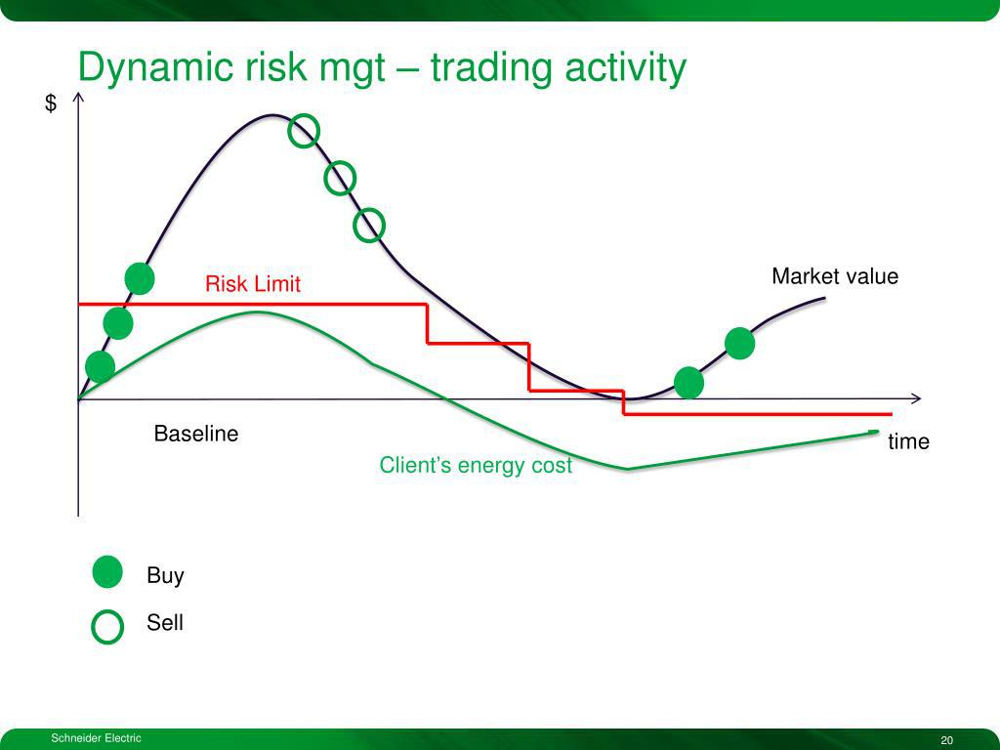

Dynamic hedging in algorithmic trading represents an advanced strategy aimed at managing financial risks with precision and immediacy. This strategy involves the continuous adjustment of portfolio positions, enabling market participants to mitigate potential losses while capitalizing on emerging market opportunities. Such an approach is indispensable for traders and investors intent on protecting their investment portfolios against the frequent volatility found in contemporary financial markets.

The core of dynamic hedging lies in its employment of sophisticated methodologies that rely on advanced mathematical models and algorithmic execution. These models examine real-time market data to continuously update and optimize the portfolio's positions in response to asset price fluctuations. This responsiveness allows for a market-neutral or balanced portfolio that aims to minimize unexpected losses and stabilize returns—a crucial advantage in today's unpredictable economic environment.



Dynamic hedging leverages derivative instruments like options and futures. These financial instruments provide leveraged exposure to underlying assets, which can be used strategically to hedge against market movements without the need to deploy significant capital. For example, traders might use options to set up protective puts or calls, which act as insurance against adverse price movements.

Furthermore, the implementation of dynamic hedging is intrinsically linked to algorithmic trading systems. These systems allow for the automation of decision-making processes, ensuring that adjustments to portfolio positions can be executed with precision and speed that manual intervention cannot match. Algorithms, guided by predictive models such as the Black-Scholes formula for option pricing, enhance the effectiveness of dynamic hedging by processing complex calculations rapidly and accurately.

In sum, dynamic hedging offers a powerful tool for managing financial risks in the fast-paced environment of algorithmic trading. As we explore this concept, we will underscore its strategic significance for traders and investors who seek not only to safeguard but also to optimize their financial portfolios in the face of market volatility.

## Table of Contents

## What is Dynamic Hedging?

Dynamic hedging is a proactive risk management strategy that involves continuous adjustments to a portfolio's positions based on current market data and forecasts. This approach contrasts with static hedging, which maintains fixed positions regardless of market fluctuations. Dynamic hedging uses derivative instruments such as options and futures to achieve a market-neutral or balanced portfolio, aiming to minimize potential losses and stabilize returns through adaptive responses to asset price movements.

At its core, dynamic hedging revolves around minimizing unexpected financial losses and delivering more stable returns by effectively responding to fluctuations in asset prices. Unlike traditional static hedging strategies, which might only re-evaluate and adjust positions periodically, dynamic hedging requires constant monitoring and real-time recalibration of positions. 

One of the fundamental theoretical frameworks underpinning dynamic hedging is the Black-Scholes model, which provides a formula for pricing European-style options and is instrumental in the dynamic adjustment process. The Black-Scholes model, defined as:

$$
C(S, t) = S_t N(d_1) - X e^{-r(T-t)} N(d_2)\]

where:

\[d_1 = \frac{\ln(S_t/X) + (r + \sigma^2 / 2)(T-t)}{\sigma \sqrt{T-t}}
$$

\[d_2 = d_1 - \sigma \sqrt{T-t}
$$

In this formula, $C$ is the call option price, $S_t$ is the current stock price, $X$ is the strike price, $r$ is the risk-free [interest rate](/wiki/interest-rate-trading-strategies), $\sigma$ is the [volatility](/wiki/volatility-trading-strategies) of the underlying asset, $T$ is the expiration time, and $N()$ is the cumulative distribution function of the standard normal distribution.

The Black-Scholes model and related financial models are pivotal because they facilitate the estimation of theoretical prices for derivatives, allowing traders to make informed decisions about how to adjust their hedging positions dynamically. This process requires a sophisticated understanding of mathematical models and often entails automated systems that rely on algorithmic adjustments to ensure continuous alignment with projected market conditions.

## Importance of Dynamic Hedging in Algo Trading

In [algorithmic trading](/wiki/algorithmic-trading), dynamic hedging is an essential tool for managing market exposure and boosting trading efficiency. This proactive risk management strategy allows traders to navigate the short-term fluctuations inherent in financial markets effectively. By continuously adjusting portfolio positions in response to market conditions, dynamic hedging enables market participants to align their trading activities with predefined risk management objectives.

Dynamic hedging strategies are intricately linked with regulatory requirements, particularly those that necessitate active risk management within financial institutions. Regulatory bodies often mandate robust risk management protocols to ensure the stability and integrity of financial systems. Dynamic hedging meets these requirements by providing a systematic method to monitor and manage risk exposures.

Through dynamic hedging, traders can optimize their strategies to balance both return and risk, thereby enhancing the robustness of their investment approach. Employing dynamic hedging mechanisms allows for adaptive management of portfolios, which is crucial in the ever-changing financial landscape. The capability to adjust positions quickly in response to market developments ensures that traders can both protect their investments from adverse movements and take advantage of favorable opportunities.

The flexibility and precision inherent in dynamic hedging make it indispensable in modern finance. By utilizing sophisticated algorithms and real-time data analysis, dynamic hedging provides a level of responsiveness and accuracy that is essential for maintaining competitive advantage in algorithmic trading. This strategy not only mitigates potential losses but also stabilizes returns, leading to a more resilient investment portfolio. As financial markets continue to evolve, the role of dynamic hedging in algorithmic trading is likely to remain significant, continually adapting to new challenges and opportunities.

## Key Components of Dynamic Hedging

Dynamic hedging is centered around several key components that collectively enable active risk management through continuous adjustments in a trading portfolio. The primary tools in dynamic hedging are derivatives, mathematical models, advanced algorithmic execution, and the use of the Greeks to inform decisions.

Derivatives, including options and futures, are integral to dynamic hedging strategies. Options, which give the holder the right but not the obligation to buy or sell an asset at a predetermined price before a specified date, offer traders leveraged positions with relatively minimal capital commitment. Futures, which are standardized contracts obligating the purchase or sale of an asset at a predetermined future date and price, provide a similar function in enabling leveraged trading positions. Together, these instruments facilitate effective risk management by allowing positions to be adjusted in response to market shifts and to protect against adverse price movements.

Mathematical models are at the heart of predicting and assessing the impact of these market shifts on a portfolio. The Black-Scholes model, for example, is a mathematical model for pricing an options contract and can help determine the fair value of options, accounting for factors like volatility and the time to expiration. The formula for the Black-Scholes model is:

$$
C = S_0 N(d_1) - X e^{-rT} N(d_2)
$$

where:
- $C$ = Call option price
- $S_0$ = Current price of the underlying asset
- $X$ = Strike price of the option
- $T$ = Time to expiration
- $r$ = Risk-free interest rate
- $N$ = Cumulative standard normal distribution
- $d_1 = \frac{\ln(S_0 / X) + (r + \sigma^2 / 2) T}{\sigma \sqrt{T}}$
- $d_2 = d_1 - \sigma \sqrt{T}$

Monte Carlo simulations are another essential model used in forecasting the future behavior of portfolios under varying market scenarios, providing insights into possible asset price paths and distribution under uncertain conditions.

Algorithms automate the execution of these derivatives and mathematical insights, ensuring that the process of adjusting portfolio positions is timely and accurate. The algorithms rely on real-time market data to execute dynamic hedging strategies automatically, without the need for constant manual intervention. This automation is crucial for high-frequency trading environments, where market conditions can change in fractions of a second.

The Greeks—Delta, Gamma, Vega, Theta, and Rho—are vital metrics that guide hedging strategies by quantifying different aspects of risk. Delta measures the sensitivity of an option's price to changes in the price of the underlying asset. Gamma assesses the rate of change of Delta over time or as the asset price changes. Vega measures an option's sensitivity to volatility changes in the market. Theta indicates how much an option's price will decrease as it approaches its expiration date, reflecting the impact of time decay. Lastly, Rho measures sensitivity to changes in interest rates. Together, these metrics enable precise adjustments to hedging strategies, ensuring that traders maintain optimal balance in their portfolios despite market volatility.

## Implementing Dynamic Hedging: A Step-by-Step Guide

Implementing a dynamic hedging strategy necessitates meticulous planning and execution, structured across several key stages. The first step in this process is conducting a comprehensive risk assessment. This involves identifying and quantifying the portfolio’s exposure to various risk factors, such as interest rate changes, currency fluctuations, and volatility shifts. Tools like Value at Risk (VaR) or Conditional Value at Risk (CVaR) can be employed to measure potential losses under normal and stressed market conditions, providing a baseline for the extent of hedging required.

Once risks are assessed, the next step is to develop a robust hedging strategy. This involves selecting appropriate financial models and hedging instruments. Models such as the Black-Scholes for options pricing or the Monte Carlo simulations for forecasting potential future states of the market are integral to this stage. The choice of derivatives, including options, futures, or swaps, should align with the portfolio's risk profile and the trader’s objectives. Parameter calibration is crucial here to ensure that adjustments in hedge positions are precise; techniques like historical analysis or genetic algorithms can optimize these parameters.

With a strategy in place, deploying trading algorithms becomes essential. These algorithms are designed to execute the hedging strategy automatically, leveraging real-time market data to make rapid decisions. For instance, algorithms can be coded to adjust positions based on delta-hedging principles, ensuring that the portfolio remains market-neutral irrespective of price fluctuations. Here's a simple Python snippet to illustrate a basic algorithmic adjustment using delta hedging:

```python
def calculate_delta(option_price, underlying_price):
    # Example function to calculate delta; in practice, use a library or detailed model
    return (option_price / underlying_price) * 0.01

def adjust_positions(portfolio, market_data):
    for asset in portfolio:
        delta = calculate_delta(asset.option_price, market_data[asset.underlying])
        # Adjust position to neutralize delta
        asset.position += -delta * asset.quantity
        execute_trade(asset)

def execute_trade(asset):
    # Placeholder for executing trade based on position adjustments
    print(f"Executing trade for {asset}")

```

The final stage involves the continuous monitoring and evaluation of the hedging strategy's performance. This step ensures that the strategy remains effective amid changing market conditions. Regular back-testing and stress testing can be employed to validate the strategy's efficacy and resilience. Performance metrics should be analyzed to determine if the strategy meets predefined risk and return targets, necessitating updates or recalibrations to the models and parameters as market dynamics evolve.

Each of these steps requires the integration of technical expertise, sophisticated tools, and real-time analytics to effectively implement dynamic hedging strategies in the fast-paced environment of algorithmic trading.

## Challenges in Dynamic Hedging

Dynamic hedging, while an indispensable tool in algorithmic trading, presents several challenges that must be addressed to achieve effective implementation. One of the foremost challenges is the high computational requirement associated with dynamic hedging strategies. These strategies often necessitate sophisticated technology infrastructures capable of processing large volumes of data in real time, particularly in high-frequency trading operations. The rapid influx of market data and the need to execute trades almost instantaneously demand robust systems equipped with advanced processors and high-bandwidth networks. Failure to secure such infrastructure can lead to latency issues, reducing the efficacy of the hedging strategy.

Another critical challenge is the market impact, especially pronounced in less liquid markets. Executing large trades can significantly alter the market price, thereby affecting the hedging strategy's effectiveness. This situation can result in slippage, where the expected price of the trade differs from the actual execution price, consequently impacting the anticipated risk management outcomes. To mitigate such effects, algorithmic strategies must carefully manage order execution sizes and timing.

Model risk poses another substantial challenge. This risk arises when financial models used in hedging strategies contain inaccuracies or are inadequately applied, leading to suboptimal hedging decisions. Financial models, such as the Black-Scholes model or Monte Carlo simulations, underpin many dynamic hedging strategies, and any errors in these models can propagate through the hedging process. Ensuring the accuracy and appropriateness of models through rigorous validation processes is crucial for minimizing model risk.

Finally, the frequency of trading inherent in dynamic hedging can lead to increased transaction costs. Frequent adjustments to hedge positions accrue higher trading fees and commissions, which can erode the financial benefits of hedging. Strategies must be designed to optimize the trade-off between maintaining optimal hedge positions and minimizing transaction costs. Employing techniques such as batch processing of trades or using limit orders can help control these costs.

Overall, addressing these challenges involves a combination of technological investment, careful strategy design, and rigorous model validation to ensure dynamic hedging remains a viable risk management strategy.

## Future Trends in Dynamic Hedging

The landscape of dynamic hedging is rapidly evolving, with emerging technologies poised to significantly impact its application and effectiveness. A key area of advancement is the integration of [artificial intelligence](/wiki/ai-artificial-intelligence) (AI) and [machine learning](/wiki/machine-learning). These technologies promise to enhance the predictive capabilities of dynamic hedging strategies, allowing for more nuanced and anticipatory adjustments. Machine learning models can analyze vast datasets to detect patterns and anomalies that might signal imminent market shifts, thus enabling traders to make informed hedging decisions with greater confidence and precision.

Real-time data analytics have become indispensable in improving the responsiveness and accuracy of hedging strategies. By processing and analyzing data on the fly, traders can fine-tune their strategies to capitalize on fleeting market opportunities while mitigating risks. This dynamic process ensures that hedging strategies remain relevant and effective in the face of rapid market fluctuations.

Blockchain technology and smart contracts offer another promising frontier for dynamic hedging. These innovations have the potential to streamline hedging processes by enhancing security and transparency. Smart contracts, which execute transactions automatically when predefined conditions are met, can reduce the need for intermediaries and decrease transaction costs. Furthermore, the immutability and traceability afforded by blockchain can assure market participants of the integrity of hedging transactions.

The regulatory environment is another critical consideration for the future of dynamic hedging. As regulatory bodies continue to develop and implement rules governing risk management and trading practices, firms involved in dynamic hedging must be prepared to adapt and innovate. This involves not only compliance with existing regulations but also anticipation of future regulatory changes that could impact hedging strategies.

In summary, the future of dynamic hedging will be shaped by technological advancements and evolving regulatory frameworks. The integration of AI, machine learning, and blockchain technologies stands to make hedging strategies more efficient, secure, and cost-effective, while regulatory evolution will necessitate continuous adaptation and innovation from trading firms.

## Conclusion

Dynamic hedging is a pivotal element within modern risk management strategies, particularly in the domain of algorithmic trading. This approach provides traders and investors with a robust shield against market volatility, ensuring optimized risk-adjusted returns. By dynamically adjusting portfolios in response to market conditions, dynamic hedging mitigates the adverse effects of unpredictable market movements and facilitates more stable investment outcomes.

The implementation of dynamic hedging is inherently complex, demanding significant computational resources and technological infrastructure to operate effectively. The necessity for sophisticated algorithms and real-time data analysis underscores the intricate nature of this strategy. However, the advantages it offers, such as enhanced risk mitigation and the ability to swiftly capitalize on transient market opportunities, make it an indispensable tool for a diverse array of financial contexts.

As financial markets and technologies continue to evolve, so too will the strategies underpinning dynamic hedging. The integration of cutting-edge technologies, including artificial intelligence and machine learning, promises to further refine the efficiency and accuracy of dynamic hedging practices. These advancements will enhance the capability of traders and investors to safeguard their assets while optimizing returns in increasingly complex and fast-paced market environments. Consequently, dynamic hedging will remain a cornerstone of financial strategies that aim to balance risk and reward effectively.

## References & Further Reading

[1]: Black, F., & Scholes, M. (1973). ["The Pricing of Options and Corporate Liabilities."](https://www.cs.princeton.edu/courses/archive/fall09/cos323/papers/black_scholes73.pdf) Journal of Political Economy, 81(3), 637-654.

[2]: Hull, J. C. (2017). ["Options, Futures, and Other Derivatives"](https://elibrary.pearson.de/book/99.150005/9781292410623) (9th ed.). Pearson.

[3]: Jorion, P. (2007). ["Value at Risk: The New Benchmark for Managing Financial Risk"](https://link.springer.com/article/10.1007/s11408-007-0057-3) (3rd ed.). McGraw-Hill Education.

[4]: Lopez de Prado, M. (2018). ["Advances in Financial Machine Learning"](https://www.amazon.com/Advances-Financial-Machine-Learning-Marcos/dp/1119482089). Wiley.

[5]: Hull, J. C., & White, A. (1990). ["Pricing Interest Rate Derivative Securities."](https://www.jstor.org/stable/2962116) The Review of Financial Studies, 3(4), 573-592.

[6]: Glasserman, P. (2004). ["Monte Carlo Methods in Financial Engineering"](https://link.springer.com/book/10.1007/978-0-387-21617-1). Springer.