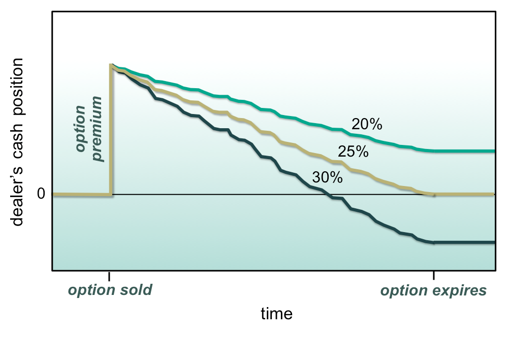

## Table of Contents

## What is dynamic hedging?

Dynamic hedging is a strategy that traders and investors use to manage risk in their portfolios. It involves continuously adjusting the positions in a portfolio to maintain a desired level of risk exposure. This is often done by buying or selling financial instruments, such as options or futures, to offset potential losses from other investments. The goal is to protect the value of the portfolio from adverse market movements.

The process of dynamic hedging requires constant monitoring of market conditions and the portfolio's performance. Traders use various financial models and tools to determine when and how to adjust their positions. This can be complex and time-consuming, but it allows for more precise control over risk. Dynamic hedging is commonly used in options trading, where the value of options can change rapidly due to shifts in the underlying asset's price, volatility, and other factors. By dynamically hedging, traders can better manage these risks and potentially improve their overall returns.

## How does dynamic hedging differ from static hedging?

Dynamic hedging and static hedging are two different ways to manage risk in investments. Dynamic hedging means you keep changing your investments to keep the risk level you want. You do this by buying or selling things like options or futures whenever the market changes. This means you need to watch the market all the time and make quick decisions. It's like adjusting your sails while sailing to keep going in the right direction, even when the wind changes.

On the other hand, static hedging is simpler. Once you set it up, you don't change it much. You pick your investments at the start and then leave them alone, hoping they will protect you from big losses. It's like setting your sails at the start of a trip and then not touching them again, even if the wind changes. Static hedging is easier but might not work as well if the market changes a lot.

Both methods have their place. Dynamic hedging can be better if you want to keep your risk under control all the time, but it needs more work. Static hedging is easier to manage but might not protect you as well if the market moves a lot.

## What are the basic principles behind dynamic hedging?

Dynamic hedging is all about managing risk by making changes to your investments as the market moves. The main idea is to keep your risk at a level you're comfortable with. You do this by buying or selling things like options or futures to balance out any losses you might have from other investments. It's like driving a car and constantly adjusting the steering wheel to stay on the road, even when the road gets curvy.

To make dynamic hedging work, you need to keep a close eye on the market and be ready to act quickly. You use special tools and models to figure out when and how to make these changes. It can be a lot of work, but it helps you stay in control of your risk. Imagine playing a game where you have to move pieces around to keep your score steady, even when other players are trying to knock you off balance. That's what dynamic hedging feels like.

## Can you explain the concept of delta hedging in dynamic hedging?

Delta hedging is a special part of dynamic hedging where you focus on balancing out changes in the price of an option. Think of it like this: an option's price can go up or down based on the price of the thing it's tied to, like a stock. The "delta" is a number that shows how much the option's price will move when the stock's price moves. If you want to keep your overall value stable, you can use delta hedging to buy or sell the stock in a way that cancels out those price changes in the option.

Let's say you own an option and its delta is 0.5. This means if the stock price goes up by $1, the option's price will go up by about $0.50. To hedge this, you would sell half a share of the stock for every option you own. If the stock price then goes up, the loss from the stock you sold will balance out the gain from the option. You have to keep checking and adjusting this balance because the delta can change as the stock price moves. It's like constantly tweaking a seesaw to keep it level as people move around on it.

## What role do options play in dynamic hedging strategies?

Options are key tools in dynamic hedging because they let you manage risk in a flexible way. When you use options, you can protect your investments from big losses without having to buy or sell the actual stocks or other assets. For example, if you're worried about a stock going down, you can buy a put option. This gives you the right to sell the stock at a set price, even if the market price drops lower. This way, you limit how much you could lose. On the other hand, if you think a stock might go up, you can sell a call option to earn some money while still keeping your stock. If the stock price stays the same or goes down, you keep the money from selling the option.

Using options in dynamic hedging means you need to keep an eye on the market and adjust your options as things change. This is because the value of options can shift quickly due to changes in the stock price, how much the stock price moves around (volatility), and other factors. By buying or selling options at the right times, you can keep your risk at a level you're comfortable with. It's like having a set of tools that you can use to fine-tune your investments to make sure they're protected no matter what the market does.

## How is gamma relevant to dynamic hedging?

Gamma is important in dynamic hedging because it tells you how much the delta of an option will change when the price of the stock moves. Delta is like a speedometer for your option, showing how fast its price will change with the stock. Gamma is like the acceleration, showing how quickly that speed (delta) will change. If you're using delta hedging to keep your portfolio balanced, you need to know about gamma because it affects how often you need to adjust your hedge.

When the gamma of your options is high, it means the delta can change a lot with small moves in the stock price. This makes your hedging job harder because you need to keep adjusting your position more often to stay balanced. If the gamma is low, the delta changes more slowly, so you won't need to tweak your hedge as much. Understanding gamma helps you manage your risk better by knowing when and how much to adjust your investments.

## What are the common tools and models used in dynamic hedging?

In dynamic hedging, people use different tools and models to help them make smart choices about when to buy or sell things to keep their risk under control. One popular tool is the Black-Scholes model, which helps figure out the price of options. This model uses things like the current price of the stock, how much the stock price moves around (volatility), how long until the option expires, and the risk-free interest rate to come up with a price. Traders use this model to decide if an option is a good deal or not. Another tool is the Greeks, which are numbers like delta, gamma, theta, and vega that tell you how sensitive an option's price is to different factors. Delta shows how much the option's price will change with the stock's price, and gamma tells you how fast that delta will change.

Besides these, there are other models like the Binomial model, which breaks down the possible future paths of a stock's price into smaller steps. This helps traders see how different choices might play out over time. Some traders also use software and algorithms that can do all these calculations quickly and automatically adjust their positions. These tools help them keep up with the fast-moving markets and make sure their hedging strategy stays on track. By using these models and tools, traders can better manage their risks and make more informed decisions about when and how to hedge their investments.

## How can dynamic hedging be applied in different market conditions?

Dynamic hedging can be used in different market conditions to help manage risk. In a calm market where prices don't change much, you might not need to adjust your hedge a lot. You can use tools like the Black-Scholes model to figure out the price of options and then use delta hedging to balance your investments. Since the market is calm, your delta won't change much, so you won't have to make many changes. It's like driving on a straight road where you don't need to turn the wheel often.

In a volatile market where prices move a lot, dynamic hedging becomes more important. You'll need to keep a closer eye on your investments and adjust your hedge more often. The gamma of your options will be higher, meaning the delta can change quickly. This means you'll need to buy or sell more options or stocks to keep your risk at the right level. It's like driving on a winding road where you have to keep turning the wheel to stay on [course](/wiki/best-algorithmic-trading-courses). By using tools like the Greeks and software to help you make quick decisions, you can manage your risk better, even when the market is jumping around.

## What are the risks and costs associated with implementing dynamic hedging?

Implementing dynamic hedging comes with several risks and costs. One big risk is that it can be hard to keep up with fast-changing markets. If you don't adjust your hedge quickly enough, you might end up losing money instead of protecting your investments. Another risk is that the models and tools you use might not always be right. They depend on guesses about how the market will move, and if those guesses are wrong, your hedging strategy might not work well. This can lead to big losses if the market moves in a way you didn't expect.

There are also costs to think about. Dynamic hedging means you have to keep buying and selling options or stocks, and every time you do that, you have to pay fees or commissions. These costs can add up, especially if you're making a lot of trades. Plus, if you're using options, they can lose value over time, which is another cost to consider. All these costs can eat into your profits, so you have to make sure the benefits of dynamic hedging are worth it.

## Can you discuss a real-world example where dynamic hedging was effectively used?

One real-world example of dynamic hedging being used effectively is by the investment firm Long-Term Capital Management (LTCM) in the 1990s. LTCM used dynamic hedging to manage the risks in their portfolio, which included a lot of complex financial instruments like bonds and derivatives. They used models like the Black-Scholes model to figure out the prices of these instruments and then used delta hedging to balance out their investments. By constantly adjusting their positions, LTCM was able to make big profits for a while, as they could protect their investments from market swings.

However, things didn't go well in the end. In 1998, the market moved in ways that LTCM's models didn't predict, and their dynamic hedging strategy failed. They had to make a lot of trades to keep their hedge working, but the costs of these trades and the unexpected market moves led to huge losses. This shows that while dynamic hedging can be a powerful tool, it also comes with big risks if the market doesn't behave as expected.

## How does one monitor and adjust a dynamic hedging strategy over time?

Monitoring and adjusting a dynamic hedging strategy over time means keeping a close eye on your investments and the market. You need to watch the prices of your stocks, options, and other things you own. You also need to pay attention to things like how much the stock price is moving around (volatility) and how long until your options expire. By using tools like the Greeks, you can see how sensitive your options are to these changes. If the delta or gamma of your options changes, you'll need to buy or sell more stocks or options to keep your risk at the right level. It's like checking the weather and adjusting your clothes to stay comfortable, even if the weather changes.

Adjusting your strategy involves making trades to keep your hedge working. If the market moves a lot, you might need to make these trades more often. You can use software and algorithms to help you make these changes quickly and automatically. This can save you time and help you react faster to market changes. But remember, every trade costs money, so you need to balance the cost of these trades with the benefits of keeping your risk under control. It's a bit like steering a boat on a windy day; you need to keep turning the wheel to stay on course, but you also need to be careful not to overdo it.

## What advanced techniques can be used to optimize dynamic hedging strategies for expert traders?

Expert traders can use advanced techniques like stochastic volatility models to optimize their dynamic hedging strategies. These models are better at predicting how much the stock price might move around (volatility) compared to simpler models like Black-Scholes. By using these more accurate predictions, traders can adjust their hedges more precisely. Another technique is to use [machine learning](/wiki/machine-learning) algorithms. These can look at a lot of data and find patterns that might be hard for people to see. By using these patterns, traders can make better guesses about where the market might go and adjust their hedges before big changes happen. It's like using a high-tech weather forecast to know when to bring an umbrella.

Another advanced technique is to use multi-asset hedging. This means using different types of investments, like stocks, options, and futures, to balance out the risk in your portfolio. By spreading out your risk across different assets, you can protect your investments better. Expert traders might also use real-time data feeds and high-frequency trading systems. These let them make trades very quickly, which is important in fast-moving markets. It's like having a fast car that can take sharp turns smoothly. By using these advanced techniques, expert traders can keep their risk under control and maybe even make more money.

## What is Dynamic Hedging?

Dynamic hedging is a proactive risk management strategy that involves continuous adjustments to a portfolio's positions based on current market data and forecasts. This approach contrasts with static hedging, which maintains fixed positions regardless of market fluctuations. Dynamic hedging uses derivative instruments such as options and futures to achieve a market-neutral or balanced portfolio, aiming to minimize potential losses and stabilize returns through adaptive responses to asset price movements.

At its core, dynamic hedging revolves around minimizing unexpected financial losses and delivering more stable returns by effectively responding to fluctuations in asset prices. Unlike traditional static hedging strategies, which might only re-evaluate and adjust positions periodically, dynamic hedging requires constant monitoring and real-time recalibration of positions. 

One of the fundamental theoretical frameworks underpinning dynamic hedging is the Black-Scholes model, which provides a formula for pricing European-style options and is instrumental in the dynamic adjustment process. The Black-Scholes model, defined as:

$$
C(S, t) = S_t N(d_1) - X e^{-r(T-t)} N(d_2)\]

where:

\[d_1 = \frac{\ln(S_t/X) + (r + \sigma^2 / 2)(T-t)}{\sigma \sqrt{T-t}}
$$

\[d_2 = d_1 - \sigma \sqrt{T-t}
$$

In this formula, $C$ is the call option price, $S_t$ is the current stock price, $X$ is the strike price, $r$ is the risk-free [interest rate](/wiki/interest-rate-trading-strategies), $\sigma$ is the [volatility](/wiki/volatility-trading-strategies) of the underlying asset, $T$ is the expiration time, and $N()$ is the cumulative distribution function of the standard normal distribution.

The Black-Scholes model and related financial models are pivotal because they facilitate the estimation of theoretical prices for derivatives, allowing traders to make informed decisions about how to adjust their hedging positions dynamically. This process requires a sophisticated understanding of mathematical models and often entails automated systems that rely on algorithmic adjustments to ensure continuous alignment with projected market conditions.

## What are the key components of dynamic hedging?

Dynamic hedging is centered around several key components that collectively enable active risk management through continuous adjustments in a trading portfolio. The primary tools in dynamic hedging are derivatives, mathematical models, advanced algorithmic execution, and the use of the Greeks to inform decisions.

Derivatives, including options and futures, are integral to dynamic hedging strategies. Options, which give the holder the right but not the obligation to buy or sell an asset at a predetermined price before a specified date, offer traders leveraged positions with relatively minimal capital commitment. Futures, which are standardized contracts obligating the purchase or sale of an asset at a predetermined future date and price, provide a similar function in enabling leveraged trading positions. Together, these instruments facilitate effective risk management by allowing positions to be adjusted in response to market shifts and to protect against adverse price movements.

Mathematical models are at the heart of predicting and assessing the impact of these market shifts on a portfolio. The Black-Scholes model, for example, is a mathematical model for pricing an options contract and can help determine the fair value of options, accounting for factors like volatility and the time to expiration. The formula for the Black-Scholes model is:

$$
C = S_0 N(d_1) - X e^{-rT} N(d_2)
$$

where:
- $C$ = Call option price
- $S_0$ = Current price of the underlying asset
- $X$ = Strike price of the option
- $T$ = Time to expiration
- $r$ = Risk-free interest rate
- $N$ = Cumulative standard normal distribution
- $d_1 = \frac{\ln(S_0 / X) + (r + \sigma^2 / 2) T}{\sigma \sqrt{T}}$
- $d_2 = d_1 - \sigma \sqrt{T}$

Monte Carlo simulations are another essential model used in forecasting the future behavior of portfolios under varying market scenarios, providing insights into possible asset price paths and distribution under uncertain conditions.

Algorithms automate the execution of these derivatives and mathematical insights, ensuring that the process of adjusting portfolio positions is timely and accurate. The algorithms rely on real-time market data to execute dynamic hedging strategies automatically, without the need for constant manual intervention. This automation is crucial for high-frequency trading environments, where market conditions can change in fractions of a second.

The Greeks—Delta, Gamma, Vega, Theta, and Rho—are vital metrics that guide hedging strategies by quantifying different aspects of risk. Delta measures the sensitivity of an option's price to changes in the price of the underlying asset. Gamma assesses the rate of change of Delta over time or as the asset price changes. Vega measures an option's sensitivity to volatility changes in the market. Theta indicates how much an option's price will decrease as it approaches its expiration date, reflecting the impact of time decay. Lastly, Rho measures sensitivity to changes in interest rates. Together, these metrics enable precise adjustments to hedging strategies, ensuring that traders maintain optimal balance in their portfolios despite market volatility.

## References & Further Reading

[1]: Black, F., & Scholes, M. (1973). ["The Pricing of Options and Corporate Liabilities."](https://www.cs.princeton.edu/courses/archive/fall09/cos323/papers/black_scholes73.pdf) Journal of Political Economy, 81(3), 637-654.

[2]: Hull, J. C. (2017). ["Options, Futures, and Other Derivatives"](https://elibrary.pearson.de/book/99.150005/9781292410623) (9th ed.). Pearson.

[3]: Jorion, P. (2007). ["Value at Risk: The New Benchmark for Managing Financial Risk"](https://link.springer.com/article/10.1007/s11408-007-0057-3) (3rd ed.). McGraw-Hill Education.

[4]: Lopez de Prado, M. (2018). ["Advances in Financial Machine Learning"](https://www.amazon.com/Advances-Financial-Machine-Learning-Marcos/dp/1119482089). Wiley.

[5]: Hull, J. C., & White, A. (1990). ["Pricing Interest Rate Derivative Securities."](https://www.jstor.org/stable/2962116) The Review of Financial Studies, 3(4), 573-592.

[6]: Glasserman, P. (2004). ["Monte Carlo Methods in Financial Engineering"](https://link.springer.com/book/10.1007/978-0-387-21617-1). Springer.