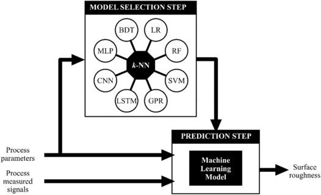

## Table of Contents

## What is a dynamic model in machine learning?

A dynamic model in machine learning is a type of model that changes over time as it learns from new data. Unlike static models, which do not change once they are trained, dynamic models can adapt to new patterns and trends. This makes them very useful in situations where the data is constantly changing, like predicting stock prices or weather forecasts. Dynamic models can use techniques like online learning, where the model updates itself every time it sees new data.

For example, imagine you are trying to predict the temperature for tomorrow. A static model might use historical data to make a prediction, but it won't change its prediction if new data comes in. A dynamic model, on the other hand, can take into account the latest weather reports and adjust its prediction accordingly. This makes dynamic models more accurate and reliable in real-world scenarios where conditions are always changing.

## How does a dynamic model differ from a static model?

A dynamic model and a static model are different in how they handle data and change over time. A static model is like a fixed recipe; once it's trained on a set of data, it doesn't change. It makes predictions based on what it learned from that initial data and doesn't update itself even if new information comes in. This can be useful when the data patterns don't change much over time, like predicting the height of a person based on their parents' heights.

On the other hand, a dynamic model is more like a chef who keeps tasting and adjusting the dish as it cooks. It continuously learns and adapts as new data comes in. This makes it very useful in situations where the data is always changing, like predicting stock prices or weather forecasts. A dynamic model can use techniques like online learning, where it updates itself with every new piece of information, making its predictions more accurate and relevant to the current situation.

## What are the key components of a dynamic model?

A dynamic model in [machine learning](/wiki/machine-learning) has a few key parts that make it work. First, it has a way to learn from new data as it comes in. This is often done through online learning, where the model updates itself every time it sees new information. This is different from a static model, which only learns from the data it was first trained on and doesn't change after that. The ability to keep learning helps the dynamic model stay up to date with new patterns and trends.

Another important part of a dynamic model is its ability to predict future events based on the latest data. For example, if a dynamic model is used to predict the weather, it can take into account the most recent weather reports and adjust its predictions accordingly. This makes the model more accurate because it can adapt to changes in the environment. The model might use a formula like $$ y_t = f(y_{t-1}, x_t, \theta) $$ where $$ y_t $$ is the prediction at time $$ t $$, $$ y_{t-1} $$ is the previous prediction, $$ x_t $$ is the new data, and $$ \theta $$ are the model's parameters.

Lastly, dynamic models often have a mechanism to forget or reduce the importance of old data. This is important because old data might not be relevant anymore, especially in fast-changing environments like stock markets or social media trends. By giving more weight to recent data, the model can make better predictions. This can be done through techniques like exponential smoothing or by using algorithms that naturally prioritize recent information.

## Can you explain the concept of state in dynamic models?

In dynamic models, the concept of state is important. Think of the state as the current situation or condition of the model at any given time. It's like a snapshot of what the model knows and has learned up to that moment. The state can include things like the model's parameters, the data it has seen so far, and any other information it uses to make predictions. As new data comes in, the state changes, and the model updates itself to reflect this new information.

For example, if you're using a dynamic model to predict the weather, the state might include the current temperature, humidity, and other weather data the model has seen. When new weather data comes in, the model updates its state and uses this new information to make a more accurate prediction. You can think of the state as being updated with a formula like $$ y_t = f(y_{t-1}, x_t, \theta) $$, where $$ y_t $$ is the new state, $$ y_{t-1} $$ is the old state, $$ x_t $$ is the new data, and $$ \theta $$ are the model's parameters. This way, the model can keep learning and adapting to new situations.

## What are some common applications of dynamic models in machine learning?

Dynamic models are used in many areas where things change a lot over time. One common use is in predicting stock prices. The stock market is always moving, and a dynamic model can keep learning from the latest prices and news to make better guesses about what will happen next. For example, if a company announces good news, the model can quickly update its predictions to reflect this new information. This makes it more accurate than a static model, which wouldn't change its predictions even if new data came in.

Another place where dynamic models are helpful is in weather forecasting. The weather changes all the time, and a dynamic model can use the most recent data to predict what the weather will be like tomorrow. If a new weather report comes in showing a sudden change, the model can adjust its predictions right away. This is different from a static model, which would stick to its original prediction no matter what new data it saw. The dynamic model might use a formula like $$ y_t = f(y_{t-1}, x_t, \theta) $$ to update its state and make more accurate forecasts.

Dynamic models are also used in areas like traffic prediction and social media trend analysis. For traffic, a dynamic model can learn from real-time data to predict how long it will take to get from one place to another. If there's an accident or a road closure, the model can quickly update its predictions. In social media, trends can change very fast, and a dynamic model can keep up with these changes to predict what will be popular next. This ability to adapt to new data makes dynamic models very useful in many real-world situations.

## How do dynamic models handle time-series data?

Dynamic models are really good at handling time-series data, which is data that changes over time. Imagine you're trying to predict the temperature for tomorrow. A dynamic model can use the latest weather data to make a better guess. It does this by updating its state every time new data comes in. The state is like a snapshot of what the model knows right now. When new data arrives, the model uses a formula like $$ y_t = f(y_{t-1}, x_t, \theta) $$ to update its state. Here, $$ y_t $$ is the new state, $$ y_{t-1} $$ is the old state, $$ x_t $$ is the new data, and $$ \theta $$ are the model's parameters. This way, the model can keep learning and making better predictions as time goes on.

In practice, dynamic models can use techniques like online learning to handle time-series data. Online learning means the model updates itself every time it sees new data, instead of waiting for a big batch of data. This is really helpful for things like stock prices or traffic patterns, where things can change quickly. For example, if a stock price suddenly drops, a dynamic model can quickly adjust its predictions to reflect this new information. This makes the model more accurate and useful in real-world situations where data is always changing.

## What are the challenges in training dynamic models?

Training dynamic models can be tricky because they need to keep learning from new data as it comes in. One big challenge is making sure the model can adapt quickly without forgetting what it already knows. This is called the stability-plasticity dilemma. If the model changes too much with new data, it might forget important patterns it learned before. But if it doesn't change enough, it won't be able to keep up with new trends. Finding the right balance is hard and requires careful tuning of the model's learning rate and other parameters.

Another challenge is dealing with noisy or inconsistent data. In real-world situations, the data that comes in might not always be clean or reliable. A dynamic model needs to be able to filter out the noise and focus on the important patterns. This can be done using techniques like smoothing or by giving more weight to recent data. For example, a model might use a formula like $$ y_t = \alpha \cdot x_t + (1 - \alpha) \cdot y_{t-1} $$ where $$ \alpha $$ is a parameter that controls how much the model relies on new data versus old data. Getting this right can be tough and often requires a lot of experimentation and fine-tuning.

## How can dynamic models be used for prediction and forecasting?

Dynamic models are really good at making predictions and forecasts because they can learn from new data as it comes in. Imagine you're trying to guess the weather for tomorrow. A dynamic model can use the latest weather reports to make a better guess. It does this by updating its state every time new data arrives. The state is like a snapshot of what the model knows right now. When new data comes in, the model uses a formula like $$ y_t = f(y_{t-1}, x_t, \theta) $$ to update its state. Here, $$ y_t $$ is the new state, $$ y_{t-1} $$ is the old state, $$ x_t $$ is the new data, and $$ \theta $$ are the model's parameters. This way, the model can keep learning and making better predictions as time goes on.

These models are especially useful in situations where things change a lot, like predicting stock prices or traffic patterns. For example, if a stock price suddenly drops, a dynamic model can quickly adjust its predictions to reflect this new information. This makes the model more accurate and helpful in real-world situations where data is always changing. The model can use techniques like online learning, where it updates itself every time it sees new data, instead of waiting for a big batch of data. This helps the model stay up to date and make better forecasts.

## What algorithms are typically used in dynamic modeling?

Dynamic modeling often uses algorithms like online learning, which lets the model update itself every time it sees new data. One common method is stochastic gradient descent (SGD), where the model adjusts its parameters bit by bit as new data comes in. This helps the model adapt quickly to changes. Another popular algorithm is the Kalman filter, which is great for predicting things that change over time, like the position of a moving object. It uses a formula like $$ x_t = F x_{t-1} + B u_t + w_t $$ to predict the next state based on the current state and any new inputs.

Other algorithms used in dynamic modeling include recurrent neural networks (RNNs), which are good at handling sequences of data. For example, [long short](/wiki/equity-long-short)-term memory (LSTM) networks, a type of RNN, can remember long-term patterns and are often used for things like predicting stock prices or weather forecasts. They use a special kind of memory cell to keep track of important information over time. Finally, adaptive boosting (AdaBoost) can be used to improve the model's accuracy over time by focusing on the data points that are hardest to predict. All these algorithms help dynamic models stay up to date and make better predictions as new data comes in.

## How do you evaluate the performance of a dynamic model?

Evaluating the performance of a dynamic model involves looking at how well it predicts new data as it comes in. One way to do this is by using metrics like mean squared error (MSE) or mean absolute error (MAE). These metrics measure the difference between the model's predictions and the actual values. For example, if you're using a dynamic model to predict the weather, you would compare the model's temperature predictions to the real temperatures and calculate the average difference. If the MSE or MAE is low, it means the model is doing a good job. You can also use other metrics like R-squared to see how much of the variation in the data the model can explain.

Another important aspect of evaluating a dynamic model is checking how it adapts to new data over time. You can do this by using techniques like cross-validation, where you split the data into different parts and test the model on each part. This helps you see if the model is getting better at predicting as it sees more data. For example, you might use a formula like $$ y_t = f(y_{t-1}, x_t, \theta) $$ to update the model's state and then check how the predictions change. If the model's performance improves over time, it's a sign that it's learning well from the new data. This is crucial for dynamic models because they need to keep adapting to stay accurate.

## What are the advanced techniques for optimizing dynamic models?

One advanced technique for optimizing dynamic models is using ensemble methods. This means combining several models to make better predictions. Imagine you have a few friends who are good at guessing the weather. If you take all their guesses and combine them, you might get a better prediction than if you just listened to one friend. In machine learning, this can be done with methods like bagging or boosting. For example, adaptive boosting (AdaBoost) focuses on the data points that are hardest to predict and improves the model's accuracy over time. This helps dynamic models stay accurate even when the data keeps changing.

Another technique is using [reinforcement learning](/wiki/reinforcement-learning) to fine-tune the model's parameters. Think of it like playing a game where you learn from your mistakes. The model tries different settings and sees which ones work best for making predictions. This can be done with algorithms like Q-learning or deep Q-networks (DQNs). For example, if you're using a dynamic model to predict stock prices, the model can learn from the market's ups and downs and adjust its predictions accordingly. This makes the model more adaptable and better at handling new data as it comes in.

## Can you discuss any recent advancements in dynamic modeling within machine learning?

Recent advancements in dynamic modeling within machine learning have focused on improving the adaptability and accuracy of these models. One significant development is the use of [deep learning](/wiki/deep-learning) techniques, like recurrent neural networks (RNNs) and long short-term memory (LSTM) networks, which are particularly good at handling sequences of data. These models can remember long-term patterns and are widely used for tasks like predicting stock prices or weather forecasts. For example, an LSTM network might use a formula like $$ y_t = f(y_{t-1}, x_t, \theta) $$ to update its state and make better predictions as new data comes in. This helps the model learn from the past and adapt to new situations more effectively.

Another advancement is the integration of reinforcement learning into dynamic models. This technique allows the model to learn from its mistakes and improve over time, much like how a person learns from experience. For instance, a model predicting traffic patterns might use reinforcement learning to adjust its predictions based on real-time data. This approach can make dynamic models more robust and better at handling unexpected changes in the data. These advancements are making dynamic models more powerful and useful in real-world applications where data is constantly changing.