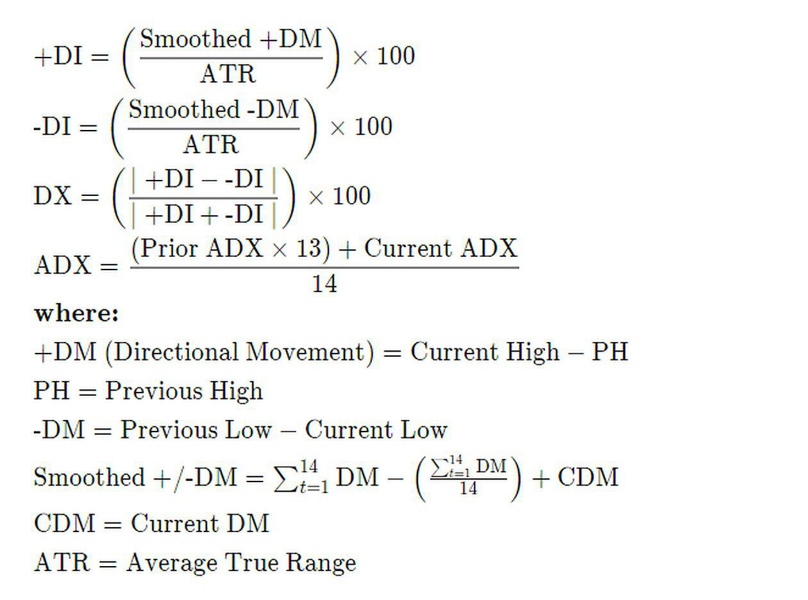

Trading and technical analysis offer a vast array of indicators that assist traders in uncovering potential market opportunities. The Dynamic Momentum Index (DMI) distinguishes itself through its unique approach and adaptability in different market conditions. This article aims to explore the intricacies of the Dynamic Momentum Index, including how it is calculated and applied in algorithmic trading. Additionally, we will expand our discussion to compare it with other financial indicators, highlighting its advantages and limitations. Finally, we will offer practical insights into how algo traders can effectively integrate the DMI into their trading strategies, enhancing their ability to respond to shifting market dynamics and potentially improving trading outcomes.

## Table of Contents



## What is the Dynamic Momentum Index?

The Dynamic Momentum Index (DMI) is a sophisticated technical indicator conceived by Tushar Chande and Stanley Kroll in the early 1990s. It is designed to identify overbought and oversold conditions in financial markets, offering traders valuable insights into potential reversals or continuations of price trends.

Unlike traditional indicators such as the Relative Strength Index (RSI), which employs a fixed time frame, the DMI adapts its time frame dynamically based on the market's volatility. This adaptability is a critical factor that distinguishes DMI from other momentum indicators. In essence, when market volatility is high, the DMI uses fewer periods to calculate its value, allowing traders to capture the rapid price movements more effectively. Conversely, during periods of low volatility, it extends the calculation period, providing a more stable view of the market's condition.

Mathematically, this variable time frame is achieved by adjusting the look-back period according to the standard deviation of price changes. Specifically, the formula involves calculating the N-period RSI and modifying its period length based on a volatility [factor](/wiki/factor-investing) derived from the standard deviation. This makes the DMI particularly useful in a wide range of market environments, from fast-moving, volatile markets to quieter, more stable ones.

For practical application, a common practice is to utilize threshold levels, typically set at 30 and 70, akin to RSI. When the DMI surpasses 70, it suggests that the asset might be overbought, while a value below 30 could indicate an oversold condition. Traders often adjust these thresholds to better fit the specific characteristics of the asset or the market they are analyzing.

The DMI's ability to adjust to market conditions provides traders with a more nuanced perspective, potentially enhancing the accuracy of identifying entry and exit points in their trading strategies. However, like any technical tool, the DMI is most effective when used in conjunction with other indicators and analysis techniques, providing a broader context to its signals.

## Understanding Dynamic Momentum Index Calculations

Calculating the Dynamic Momentum Index (DMI) is a process that emphasizes its adaptability to varying market conditions by incorporating [volatility](/wiki/volatility-trading-strategies) into its analysis. The DMI adjusts its calculation periods relative to the volatility observed in the market, using standard deviation as a primary tool for this adjustment.

The Dynamic Momentum Index is primarily concerned with determining overbought and oversold conditions, much like the Relative Strength Index (RSI). However, while the RSI uses a fixed number of periods for its calculations, the DMI flexibly adjusts the number of periods based on market volatility. This dynamic nature is what grants the DMI its responsiveness to different market conditions.

### Calculation Steps

1. **Calculate the Wilder's Smoothing Constant**: This will determine the moving average used in the DMI calculation. However, unlike RSI, the DMI adjusts according to market volatility.

2. **Determine Volatility**: Calculate the standard deviation of the asset's price over a determined period. This will serve as a measure of volatility. 

3. **Adjust Time Period**: Modify the calculation period of the momentum index based on the observed volatility:
   - When volatility is high, the period is shortened to increase sensitivity.
   - When volatility is low, the period is lengthened to reduce sensitivity to market noise.

4. **Compute the Momentum Value**: Calculate the momentum value based on the adjusted time period. Use this value to determine the index reading:

$$
DMI = 100 - \frac{100}{1 + \left(\frac{\text{Average Gain}}{\text{Average Loss}}\right)}
$$

The average gain and loss are computed over the adjusted periods based on volatility.

5. **Establish Thresholds**: The DMI typically applies thresholds of 30 and 70, similar to RSI, to identify overbought and oversold conditions. A reading above 70 suggests that the asset may be overbought, while a reading below 30 indicates a potential oversold condition. These thresholds can be customized based on trader preference or specific market insights.

### Differences and Similarities to RSI

The DMI shares conceptual similarities with the RSI, as both seek to highlight overbought and oversold market conditions. However, the DMI’s main distinction lies in its dynamic period adjustment, offering a more responsive approach than the RSI's fixed-period calculation.

### Customizing DMI Levels

Traders sometimes adjust the default threshold levels of 30 and 70 to better suit different asset classes or market conditions. This customization allows for a more tailored application of the DMI, potentially increasing its utility and accuracy in specific trading scenarios.

In practice, integrating these calculations into a trading strategy might involve coding the DMI in a script for automated analysis. Here is a simple Python snippet illustrating how one might compute and apply the DMI:

```python
import numpy as np

def calculate_dmi(prices, period=14):
    gains = np.maximum(np.diff(prices), 0)
    losses = np.abs(np.minimum(np.diff(prices), 0))

    std_dev = np.std(prices[-period:])
    adjusted_period = max(int(period / (1 + std_dev)), 1)

    avg_gain = np.mean(gains[-adjusted_period:])
    avg_loss = np.mean(losses[-adjusted_period:])

    dmi = 100 - (100 / (1 + (avg_gain / avg_loss)))

    return dmi

prices = [110, 112, 111, 115, 118, 117, 120]  # Example price data
dmi_value = calculate_dmi(prices)
print("Current DMI:", dmi_value)
```

This code calculates the DMI based on historical price data, factoring in volatility adjustments to periods based on recent price changes. Traders can fine-tune `adjusted_period` logic to fit their specific market analysis needs, thereby optimizing DMI application within their trading strategy.

## Dynamic Momentum Index in Algo Trading

Algorithmic trading, commonly known as algo trading, relies heavily on technical indicators that are both precise and adaptable to swiftly changing market conditions. The Dynamic Momentum Index (DMI) is uniquely positioned as a favored tool in this context due to its ability to adjust its timeframe based on the prevailing market volatility, thus providing traders with an edge in capturing rapid price movements.

### Sensitivity in High Volatility Markets

The DMI's adjustable timeframe enhances its sensitivity when market volatility spikes. In high volatility scenarios, the DMI reduces its lookback period, allowing for faster reaction to price changes. This rapid adjustment is crucial for algorithms designed to capitalize on brief but significant movements. By swiftly indicating potential overbought or oversold conditions, the DMI aids algorithms in executing timely trades, potentially improving profitability.

### Incorporating DMI Readings in Algo Trading

To effectively integrate DMI into [algorithmic trading](/wiki/algorithmic-trading) strategies, it's often used in conjunction with other technical indicators for cross-verification of signals. For instance, pairing DMI with a trend-following tool, like moving averages, can provide a balanced approach where DMI identifies [momentum](/wiki/momentum) changes and moving averages confirm trend directions.

Here's an example of how such a trading strategy might be implemented using Python:

```python
import pandas as pd
import numpy as np

def calculate_dmi(prices, lookback):
    # Calculate the DMI values
    # Simplified for illustration; actual calculation might be more complex
    # Typically involves dynamic lookback period adjustments using standard deviation
    delta = prices['Close'].diff()
    gain = delta.where(delta > 0, 0)
    loss = -delta.where(delta < 0, 0)

    avg_gain = gain.rolling(window=lookback, min_periods=1).mean()
    avg_loss = loss.rolling(window=lookback, min_periods=1).mean()

    rs = avg_gain / avg_loss
    dmi = 100 - (100 / (1 + rs))
    return dmi

def trading_strategy(prices, dmi_thresholds=(30, 70)):
    dmi = calculate_dmi(prices, lookback=14)
    signals = []

    for index, row in prices.iterrows():
        if dmi[index] > dmi_thresholds[1]:  # Overbought condition
            signals.append('Sell')
        elif dmi[index] < dmi_thresholds[0]:  # Oversold condition
            signals.append('Buy')
        else:
            signals.append('Hold')

    prices['Signal'] = signals
    return prices

# Example usage:
prices = pd.DataFrame({'Close': [100, 102, 101, 105, 107, 110, 108]})
result = trading_strategy(prices)
print(result)
```

### Practical Application and Benefits

In practice, using the DMI involves setting appropriate thresholds that define overbought and oversold conditions, commonly set at 70 and 30, respectively. However, these thresholds can be tailored based on market conditions or specific asset characteristics.

The adaptability of the DMI is beneficial if incorporated with algorithms that dynamically adjust trading strategies as market conditions evolve. By automatically recalibrating in response to volatility changes, these algorithms can offer more refined entry and [exit](/wiki/exit-strategy) points, increasing the efficacy of the trading system.

In conclusion, the DMI's adjustable nature renders it particularly effective for algo trading strategies targeting volatile markets. Algo traders who accurately integrate DMI into their systems are better equipped to anticipate market movements and execute trades with precision.

## Comparing DMI with Other Indicators

The Dynamic Momentum Index (DMI) shares objectives with well-known indicators such as the Relative Strength Index (RSI) and the Stochastic Oscillator, which are traditionally used to identify overbought and oversold conditions within markets. However, one key distinction is the DMI’s ability to adjust its timeframe based on market volatility, offering a more flexible and responsive approach compared to the fixed timeframes of the RSI and Stochastic Oscillator.

### Performance and Reliability Comparison

In volatile market conditions, the DMI's adaptive nature allows it to adjust the number of periods. This adaptability enables the DMI to provide signals that are more aligned with the rapidly changing market dynamics, potentially allowing traders to react faster than they would using the RSI or Stochastic Oscillator. For instance, in a market with high volatility, the DMI reduces its period length to capture sharp price movements quickly, while in more stable markets, it extends the period to smooth out noise, ensuring signals are not prematurely triggered.

On the other hand, the RSI, typically calculated over a 14-period timespan, and the Stochastic Oscillator, often computed with 14 periods for the %K line, maintain consistency regardless of changing market conditions. This uniformity can be advantageous in stable markets, as it provides reliability and reduces the risk of overreacting to transient price shifts. However, this consistency can undermine their effectiveness in markets undergoing significant volatility shifts, potentially leading to delayed or missed signals.

### Pros and Cons of Dynamic vs. Fixed Timeframes

A dynamic timeframe, as showcased by the DMI, offers several advantages:

1. **Adaptability:** The DMI’s ability to adjust based on market volatility provides a tailored analysis for different market conditions. This capability can enhance the accuracy of entry and exit signals in trading strategies.

2. **Sensitivity to Market Changes:** By shortening the periods in volatile conditions, the DMI can generate more timely signals, allowing traders to capitalize on price movements effectively.

Nevertheless, the dynamic nature of the DMI also brings potential drawbacks:

1. **Complexity:** Implementing and interpreting a dynamically adjusting indicator requires a deeper understanding, making it less accessible for novice traders.

2. **Potential for Noise in High Volatility:** In extremely volatile conditions, the DMI might generate more frequent signals, increasing the probability of false positives.

Conversely, fixed timeframe indicators like the RSI and Stochastic Oscillator are simpler to implement and interpret, offering the following benefits:

1. **Stability:** Consistent period lengths provide stable and predictable signals, which can be easier to analyze and integrate into trading strategies.

2. **Lower Risk of Overfitting:** The use of fixed periods reduces the risk of optimizing parameters for specific past conditions, promoting more reliable performance across various market contexts.

However, the major limitation of fixed timeframes is their lack of responsiveness to changing market conditions, which can result in less timely or inaccurate signals during periods of heightened volatility.

In conclusion, while the DMI offers adaptability that can better align with varying market conditions, traders should balance this benefit with the complexity and potential for noise that comes with a dynamic timeframe. Understanding the strengths and limitations of each indicator will guide traders in selecting the appropriate tool for their specific market scenario and trading strategy.

## Limitations and Considerations of the DMI

The Dynamic Momentum Index (DMI), while innovative in its adaptive approach, carries inherent limitations that traders must consider. One primary concern is the potential for false signals, which can occur in highly erratic market conditions. The dynamic adjustments of the DMI, designed to cater to varying volatility, can sometimes overinterpret market noise as significant movements, misleading traders into making premature or incorrect decisions.

Moreover, the DMI's reliance on volatility as a core component makes it susceptible to producing unreliable signals in exceptionally tranquil or excessively volatile periods. During calm markets, the DMI may adjust its timeframe to lengths that render it too sluggish, potentially causing traders to miss emerging opportunities. Conversely, in times of extreme volatility, the DMI's rapid adjustments could lead to frequent oscillations, increasing the risk of false positives and trading whipsaws.

To mitigate these issues, it is advisable for traders to integrate the DMI with other analytical tools and methodologies. This multimodal approach allows traders to cross-verify signals, thus enhancing their decision-making process. Complementary indicators such as trend confirmation tools, [volume](/wiki/volume-trading-strategy) analysis, or other momentum-based indices can provide a more comprehensive market perspective, thereby helping to filter out noise and refine trade entries and exits.

Careful consideration of market conditions is crucial when utilizing the DMI. Traders should remain vigilant for the context in which DMI operates, adapting their strategies to harness its strengths while acknowledging its limitations. Through disciplined application and continuous monitoring, the DMI can be a useful component within a broader, well-diversified trading strategy.

## Conclusion

The Dynamic Momentum Index (DMI) holds significant value for both technical analysts and algorithmic traders, offering a distinctive approach through its ability to adapt to market volatility. By adjusting the time frame based on volatility conditions, the DMI provides a more responsive and nuanced reflection of market dynamics, allowing traders to identify potential trading opportunities with greater precision. This adaptability can be particularly beneficial in rapidly changing markets, where traditional fixed-period indicators might lag.

Nevertheless, it is crucial to recognize that the DMI, like all indicators, has its limitations. It should not be relied upon in isolation. Instead, traders should integrate the DMI into a broader strategy that encompasses multiple analytical techniques and risk management principles. Utilizing the DMI alongside other indicators and market analyses helps in cross-verifying signals and reducing the occurrence of false positives, ultimately leading to more informed trading decisions.

As financial markets continue to evolve, the ability to understand and effectively apply adaptive tools like the DMI can significantly enhance a trader's effectiveness and potential for success. Traders who master the nuances of the DMI, including its strengths and weaknesses, are better positioned to navigate the complexities of modern trading environments, potentially gaining a competitive edge.

## References & Further Reading

[1]: Chande, T., & Kroll, S. (1994). ["The New Technical Trader: Boost Your Profit by Plugging into the Latest Indicators"](https://www.amazon.com/New-Technical-Trader-Plugging-Indicators/dp/0471597805) by Tushar Chande and Stanley Kroll.

[2]: Murphy, J.J. (1999). ["Technical Analysis of the Financial Markets: A Comprehensive Guide to Trading Methods and Applications"](https://archive.org/details/technicalanalysi0000murp) by John J. Murphy.

[3]: Wilder, J. W. (1978). ["New Concepts in Technical Trading Systems"](https://archive.org/details/newconceptsintec00wild), a foundational book that introduced the Relative Strength Index (RSI), among other tools.

[4]: Pring, M.J. (2002). ["Technical Analysis Explained: The Successful Investor's Guide to Spotting Investment Trends and Turning Points"](https://www.amazon.com/Technical-Analysis-Explained-Fifth-Successful/dp/0071825177) by Martin J. Pring.

[5]: Kaufman, P.J. (2013). ["Trading Systems and Methods"](https://www.amazon.com/Trading-Systems-Methods-Website-Wiley/dp/1118043561) by Perry J. Kaufman, offering comprehensive insights on various trading methods including adaptive indicators.

[6]: Appel, G., & Hitschler, F. (2005). ["Technical Analysis: Power Tools for Active Investors"](https://books.google.com/books/about/Technical_Analysis.html?id=RFYIAAAACAAJ), discussing the use and understanding of technical indicators in active trading.

[7]: Brown, B. (2007). ["Technical Analysis for the Trading Professional"](https://www.amazon.com/Technical-Analysis-Trading-Professional-Second/dp/007175914X) by Constance Brown, featuring advanced concepts in technical analysis.