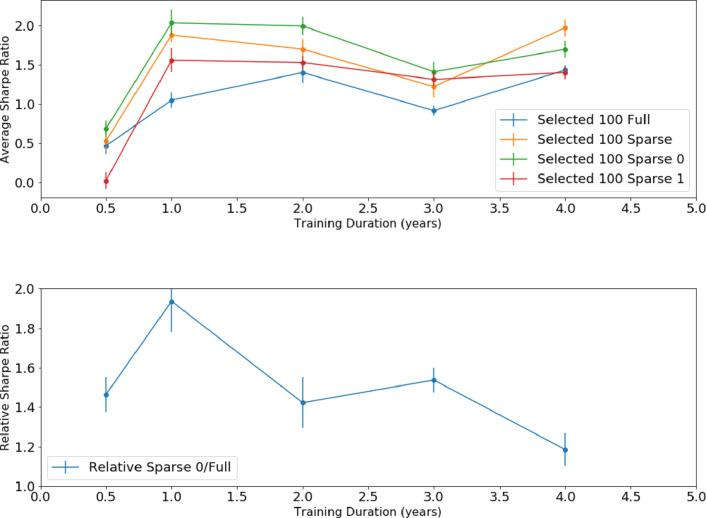

## Table of Contents

## What is dynamic portfolio optimization?

Dynamic portfolio optimization is a way to manage investments that changes over time. Instead of picking stocks and holding them forever, you keep adjusting your investments based on new information and market conditions. The goal is to get the best possible return while managing risk. Imagine you're driving a car and you keep changing the route to avoid traffic and reach your destination faster. That's what dynamic portfolio optimization does with your investments.

This approach uses math and computer models to make decisions. These models look at things like how different investments move together, how risky they are, and what's happening in the economy. By constantly updating these models with the latest data, the portfolio can be adjusted to take advantage of new opportunities or to protect against potential losses. It's like having a smart helper that keeps your investments in the best shape possible, always trying to do better than just leaving everything alone.

## Why is dynamic portfolio optimization important for investors?

Dynamic portfolio optimization is important for investors because it helps them make the most out of their money. Instead of sticking with the same investments no matter what, this method lets investors change their portfolio as things in the market change. This can lead to better returns because the portfolio can take advantage of new opportunities that come up. For example, if a certain industry starts doing really well, dynamic optimization might suggest moving more money into that area.

It also helps manage risk better. Markets can be unpredictable, and what worked yesterday might not work tomorrow. By constantly adjusting the portfolio, investors can reduce the chance of losing a lot of money if something goes wrong. It's like having a safety net that moves with you, always trying to keep you balanced. This way, investors can feel more secure and confident in their investment choices, knowing that their portfolio is being looked after and tweaked to perform its best.

## How does dynamic portfolio optimization differ from static portfolio optimization?

Dynamic portfolio optimization and static portfolio optimization are two different ways to manage investments. Static portfolio optimization is like setting your investments and then leaving them alone. You pick your stocks or funds at the start and then you don't change them much. It's simple and doesn't need a lot of work, but it might not do as well if the market changes a lot.

On the other hand, dynamic portfolio optimization is more active. It's like constantly checking and adjusting your investments to make them better. This method uses new information and market changes to decide when to buy or sell. It can lead to better returns because it can take advantage of new opportunities and reduce risks by changing the portfolio as needed. It's more work, but it can be worth it for investors who want to keep up with the market.

## What are the key components of a dynamic portfolio optimization model?

A dynamic portfolio optimization model has several important parts that help it work well. One key part is the data it uses. This includes information about how different investments have performed in the past, how they move together, and what's happening in the economy right now. The model uses this data to make smart guesses about what might happen next. Another important part is the math and computer models that the system uses. These models help figure out the best way to spread your money across different investments to get the best return while keeping risk under control.

Another key component is the ability to update and change the portfolio over time. This means the model can look at new data as it comes in and decide if it should buy or sell certain investments. This keeps the portfolio in line with the latest market conditions and helps take advantage of new opportunities. The last part is the risk management tools. These tools help the model understand and control the risks involved in different investments. By constantly checking and adjusting for risk, the model can help protect your money from big losses while still trying to grow it.

## What role do financial markets play in dynamic portfolio optimization?

Financial markets are super important for dynamic portfolio optimization. They give all the information that the model needs to make smart choices. The prices of stocks, bonds, and other investments change all the time in the markets. By watching these changes, the model can figure out which investments are doing well and which ones might be risky. This helps the model decide when to buy or sell different investments to keep the portfolio in the best shape possible.

The markets also help the model understand how different investments move together. If two investments always go up and down at the same time, that's important to know because it can affect how risky the portfolio is. By looking at how investments relate to each other, the model can spread the money in a way that reduces risk while still trying to make good returns. So, the financial markets are like the eyes and ears of dynamic portfolio optimization, always providing the latest information to help make the best decisions.

## How can one implement dynamic portfolio optimization using modern software tools?

To implement dynamic portfolio optimization using modern software tools, you can start by choosing the right platform. Many software tools like MATLAB, Python with libraries like PyPortfolioOpt, and commercial platforms like Bloomberg Terminal offer powerful features for dynamic optimization. These tools can handle the complex math needed to analyze market data and adjust your portfolio. You'll need to input your investment data, set your goals for returns and risk, and let the software do the heavy lifting. It will use algorithms to look at how different investments move together and suggest changes to your portfolio based on the latest market conditions.

Once you have your software set up, you'll need to keep it updated with fresh data. This means regularly feeding it new information about stock prices, economic indicators, and other market changes. The software will then use this data to recalculate the best way to spread your money across different investments. It's like having a smart assistant that constantly checks the market and tells you when to buy or sell. By using these modern tools, you can make sure your portfolio is always in the best shape possible, taking advantage of new opportunities and reducing risks as the market changes.

## What are some common algorithms used in dynamic portfolio optimization?

Some common algorithms used in dynamic portfolio optimization are mean-variance optimization and reinforcement learning. Mean-variance optimization looks at the average return and risk of different investments. It tries to find the best mix of investments that gives you the highest return for the least amount of risk. This method uses math to figure out how to spread your money in a way that makes sense based on how risky each investment is and how they move together.

Another popular algorithm is reinforcement learning, which is a bit like training a computer to make smart choices. It learns from past decisions and tries to do better each time. The computer looks at how well the portfolio did and then decides what to change to make it better next time. This method is good because it can adapt to new information and market changes, helping to keep your investments in top shape.

There's also the Black-Litterman model, which mixes what you think will happen with what the market thinks. It takes your guesses about the future and blends them with the market's overall view to come up with a balanced plan. This helps you make choices that are smart but also take into account what everyone else is thinking. These algorithms help keep your portfolio dynamic and ready to change as the market does.

## How do risk management strategies integrate with dynamic portfolio optimization?

Risk management strategies are a big part of dynamic portfolio optimization. They help make sure that the portfolio doesn't take on too much risk while still trying to grow. In dynamic portfolio optimization, the model keeps checking how risky each investment is and how they move together. If the model sees that an investment is getting too risky, it might suggest selling some of it to protect your money. This way, the portfolio can still try to make good returns but without taking big chances.

These strategies also help the model adjust the portfolio as things change in the market. For example, if the market gets more unpredictable, the model might decide to move money into safer investments to lower the risk. By constantly looking at the risk and making changes, dynamic portfolio optimization can help keep your investments safe while still trying to do well. It's like having a safety net that moves with you, always trying to keep you balanced and protected.

## What are the challenges faced when applying dynamic portfolio optimization in real-world scenarios?

Applying dynamic portfolio optimization in real-world scenarios can be tricky because it needs a lot of data and fast computers. The model has to look at tons of information about how different investments are doing and what's happening in the economy. If the data isn't good or up-to-date, the model might make bad choices. Also, the computers need to be fast enough to handle all this data and make quick decisions. If they're too slow, the model might miss out on good opportunities or not react fast enough to changes in the market.

Another challenge is that markets can be unpredictable. Even with the best data and computers, it's hard to guess what will happen next. Sometimes, the model might suggest changes that don't work out as planned because the market does something unexpected. This means investors need to be ready to adjust their plans and not rely too much on the model. It's also important to keep an eye on how much it costs to keep the portfolio changing all the time. If you're buying and selling a lot, the fees can add up and eat into your returns.

## How does dynamic portfolio optimization adapt to changing market conditions?

Dynamic portfolio optimization is like having a smart helper that keeps an eye on the market and changes your investments to match what's happening. If the market starts to go up or down, the model looks at new information and decides if it should buy or sell certain investments. For example, if a certain type of stock starts doing really well, the model might suggest moving more money into that stock to take advantage of the good times. It's always trying to keep your portfolio in the best shape possible by reacting to what's happening around it.

This method also helps protect your money when things get risky. If the market starts to get unpredictable, the model can move your money into safer investments to lower the chance of losing a lot. It's like having a safety net that moves with you, always trying to keep you balanced. By constantly checking and adjusting based on the latest market conditions, dynamic portfolio optimization helps make sure your investments are always ready for whatever the market throws at them.

## What advanced techniques can enhance the performance of dynamic portfolio optimization?

One advanced technique to make dynamic portfolio optimization work better is using machine learning. Machine learning is like teaching a computer to learn from past data and make smart guesses about the future. It can look at tons of information about how different investments have done before and find patterns that might be hard for people to see. By using machine learning, the model can make better choices about when to buy or sell investments, helping to get the best returns while keeping risks low.

Another technique is using more detailed risk models. These models look at different kinds of risks, not just how much an investment might go up or down. They can think about things like how the economy is doing, what's happening in different countries, or even how certain events might affect the market. By understanding these risks better, the model can adjust the portfolio to protect your money from big losses while still trying to grow it. This way, dynamic portfolio optimization can be even smarter and more helpful in keeping your investments in top shape.

## How can one evaluate the effectiveness of a dynamic portfolio optimization strategy?

To evaluate the effectiveness of a dynamic portfolio optimization strategy, you need to look at how well it's doing compared to what you hoped for. Start by checking if the portfolio is making the returns you expected. You can do this by comparing its performance to a benchmark, like a stock market index. If your portfolio is doing better than the benchmark, that's a good sign that the strategy is working. Also, see if the portfolio is keeping risks under control. If it's making good returns without taking too many risks, then the strategy is probably effective.

Another way to evaluate the strategy is to look at how it's doing over time. Markets change a lot, so a good strategy should be able to adjust and still do well. Check if the portfolio is making smart changes based on new information. If it's buying and selling at the right times and keeping up with the market, that's a positive sign. Also, think about the costs. If the strategy is working well but the fees for buying and selling are too high, it might not be worth it. By looking at these things, you can tell if your dynamic portfolio optimization strategy is really helping your investments grow while keeping them safe.

## Can Deep Reinforcement Learning be effectively used in Portfolio Optimization?

Recent advancements in machine learning have positioned Deep Reinforcement Learning (DRL) as a pivotal approach in addressing the intricacies of portfolio optimization. DRL applies a model-free, autonomous learning paradigm where [agents](/wiki/agents) gain insights and formulate decisions through continuous interaction with their environment. This adaptive and iterative process enables agents to refine their trading strategies dynamically, accommodating the constantly shifting landscape of financial markets.

DRL agents operate under the framework of [reinforcement learning](/wiki/reinforcement-learning), where an agent seeks to maximize cumulative reward by taking a series of actions, $a_t$, in an environment, $s_t$, defined by a state at time $t$. The agent receives feedback in the form of rewards $r_t$, which guide the optimization of a policy, $\pi(a|s)$, dictating the next action given the current state. This is mathematically formalized by the Bellman equation:

$$
Q(s_t, a_t) = r_t + \gamma \max_{a_{t+1}} Q(s_{t+1}, a_{t+1}) 
$$

where $Q(s, a)$ represents the expected cumulative reward and $\gamma$ is the discount factor. 

Despite its transformative potential, applying DRL to financial contexts presents significant challenges. Learning speed and sample complexity are critical issues, as the requirement for extensive training data and computation can hinder timely decision-making. This is especially true in financial markets, where minute fluctuations can have substantial implications. The limited availability of labeled trading data further complicates the ability to generalize learned strategies effectively.

The DRL approach has been augmented with [neural network](/wiki/neural-network) architectures, specifically deep neural networks (DNNs), to approximate the optimal policy and value functions. This combination, although powerful, faces hurdles such as overfitting and the need for large datasets to achieve robust models. Additionally, the exploration-exploitation trade-off in reinforcement learning becomes pronounced in financial markets due to their high volatility and dynamic nature.

Strategies to mitigate these challenges are an active area of research, focusing on enhancing learning efficiency and robustness. Employing techniques such as experience replay, target networks, and policy gradient methods, researchers aim to improve the stability and performance of DRL models for portfolio optimization. These innovations are vital to harnessing the full potential of DRL in creating adaptive, resilient investment strategies.

## What are Quantum Price Levels in Trading Strategies?

Quantum Finance Theory introduces Quantum Price Levels (QPLs) as an innovative risk-control strategy within portfolio optimization frameworks. QPLs leverage quantum computing principles to manage portfolio volatility and enhance profitability by identifying discrete price levels that can stabilize trading models. The integration of quantum concepts allows for more precise modeling of market dynamics, offering potential improvements over classical techniques in handling uncertainties inherent in financial markets.

QPLs address two significant challenges in Deep Reinforcement Learning (DRL) models: slow learning speeds and high sample complexity. By incorporating quantum superposition and entanglement, QPLs can process vast amounts of information simultaneously, leading to faster convergence of learning algorithms. This capability helps DRL agents to overcome the sample inefficiency challenge by more effectively exploring the policy space and optimizing strategy selection.

The application of QPLs involves mapping price movements to quantum states, offering a probabilistic framework that can better capture market fluctuations. For instance, an asset's price can be represented as a quantum state, $|\psi\rangle$, which provides a probability distribution over possible price levels:

$$
|\psi\rangle = \sum_{i} c_i |p_i\rangle
$$

where $|p_i\rangle$ represents a discrete quantum price level and $c_i$ are complex coefficients that capture the probability amplitudes of the asset attaining each price level. Via optimization routines intrinsic to quantum computation, traders can rapidly identify price levels that maximize returns or minimize risks. Consequently, this reduces reliance on traditional DRL approaches that struggle with efficiently training on massive datasets.

Implementing QPLs in algorithmic trading strategies requires a synthesis of quantum algorithms with existing computational finance models. Quantum algorithms, such as the Variational Quantum Eigensolver (VQE) or Quantum Approximate Optimization Algorithm (QAOA), can be employed to solve optimization problems much faster than their classical counterparts. This enhanced capability is particularly beneficial in achieving real-time analysis and decision-making in highly volatile markets.

In summary, Quantum Price Levels provide a novel pathway for incorporating quantum computing advantages into dynamic portfolio management. They enhance the adaptability and efficiency of DRL-based approaches, ultimately leading to more stable and profitable trading strategies. The exploration and integration of quantum computing into finance are poised to revolutionize risk management and portfolio optimization, ensuring robust performance in both established and emerging financial markets.

## References & Further Reading

[1]: López de Prado, Marcos. ["Advances in Financial Machine Learning."](https://www.amazon.com/Advances-Financial-Machine-Learning-Marcos/dp/1119482089) Wiley, 2018.

[2]: Chan, Ernest P. ["Quantitative Trading: How to Build Your Own Algorithmic Trading Business."](https://github.com/ftvision/quant_trading_echan_book) Wiley, 2009.

[3]: Sutton, Richard S., and Andrew G. Barto. ["Reinforcement Learning: An Introduction."](https://web.stanford.edu/class/psych209/Readings/SuttonBartoIPRLBook2ndEd.pdf) MIT Press, 2018.

[4]: Gu, Shihao, et al. ["Empirical Studies on the Asset Allocation Methods of Reinforcement Learning in Finance."](https://dachxiu.chicagobooth.edu/download/ML.pdf) arXiv, 2019.

[5]: Schmidhuber, Jürgen. ["Deep Learning in Neural Networks: An Overview."](https://arxiv.org/abs/1404.7828) Neural Networks, 61 (2015): 85-117.

[6]: Kingma, Diederik P., and Jimmy Ba. ["Adam: A Method for Stochastic Optimization."](https://arxiv.org/abs/1412.6980) arXiv, 2014.

[7]: Hull, John C. ["Options, Futures, and Other Derivatives."](https://archive.org/details/john-hull-options-futures-and-other-derivatives-pearson-2021) Pearson, 10th Edition, 2017.

[8]: Nielsen, Michael A., and Isaac L. Chuang. ["Quantum Computation and Quantum Information."](http://almuhammadi.com/sultan/books_2020/Nielsen_Chuang.pdf) Cambridge University Press, 2010.