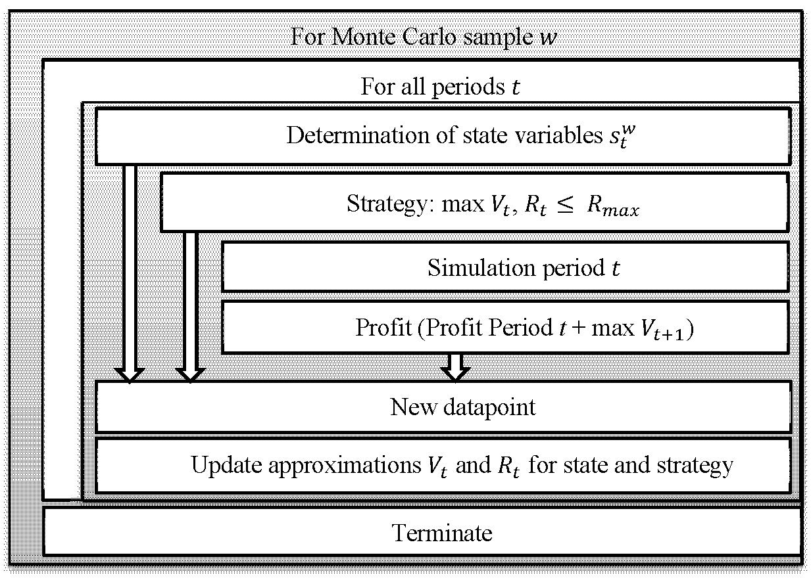

Dynamic programming is a mathematical optimization approach that has proven indispensable in algorithmic trading, aiding in the development of strategies designed to maximize returns and manage risks effectively. This technique involves decomposing complex problems into more manageable subproblems, solving each subproblem once, and storing their solutions to avoid unnecessary recomputation. By leveraging this approach, traders can enhance computational efficiency and focus on deriving optimal strategies.

At the heart of dynamic programming lies the principle of optimality, which asserts that an optimal solution to any instance of an optimization problem is composed of optimal solutions to its subproblems. This principle ensures that traders can achieve optimal solutions by systematically combining the outcomes of these subproblems. In algorithmic trading, this capability is critical because it enables the development of cohesive strategies that address multiple market dynamics simultaneously, such as pricing options, optimizing portfolios, and managing risks.



The relevance of dynamic programming in algorithmic trading cannot be overstated, as it equips traders with tools to tackle multifaceted market challenges. By structuring problems into simpler segments, traders can efficiently solve complex tasks such as asset allocation or option pricing, where the goal is to maximize profit while minimizing risk exposure.

This article will examine the applications, advantages, and challenges associated with dynamic programming within algorithmic trading. We will explore the foundational principles of dynamic programming and its implementation across various trading strategies, underscoring how traders harness its power to navigate complex market environments and make informed decisions.

## Table of Contents

## Understanding Dynamic Programming

Dynamic programming is an approach that fundamentally restructures complex problems by integrating two key principles: optimal substructure and overlapping subproblems. The optimal substructure principle posits that an optimal solution to any given problem can be achieved by synthesizing the optimal solutions of its constituent subproblems. This method involves decomposing a problem into more manageable subproblems, solving each to identify its optimal outcome, and leveraging these outcomes to construct a comprehensive solution to the original problem.

The principle of overlapping subproblems addresses the issue of redundant computations. Many complex problems, especially in algorithmic trading, involve repetitive evaluations of the same subproblems. Dynamic programming resolves this by implementing a method called memoization, where solutions to subproblems are stored after their initial computation. Consequently, when a subproblem recurs, its solution can be retrieved from memory rather than recalculated, thereby enhancing computational efficiency and reducing processing time.

In [algorithmic trading](/wiki/algorithmic-trading), these principles are instrumental in developing strategies that balance both risk and profit optimization across various trading scenarios. For example, a dynamic programming algorithm can be employed to optimize a portfolio by examining a multitude of asset combinations. It does so by breaking down complex asset allocations into simpler decisions that can be reassembled to form an optimal strategy. The algorithm leverages the optimal substructure principle to assess the value of investment combinations, relying on overlapping subproblems to efficiently navigate extensive sets of potential choices.

In practice, traders can implement dynamic programming using concise code that embodies these principles. Below is a simple illustrative example in Python that demonstrates the usage of memoization in a stock investment scenario:

```python
def maximize_profit(n, prices, memo):
    if n == 0 or n == 1:
        return 0

    if n in memo:
        return memo[n]

    max_profit = 0
    for i in range(1, n):
        for j in range(i + 1, n + 1):
            if prices[j - 1] > prices[i - 1]:
                profit = (prices[j - 1] - prices[i - 1]) + maximize_profit(i - 1, prices[:i], memo)
                max_profit = max(max_profit, profit)

    memo[n] = max_profit
    return max_profit

# Example usage
prices = [3, 8, 5, 1, 7, 8]
memo = {}
print(maximize_profit(len(prices), prices, memo))  # Output: Maximum profit for given price list
```

This code snippet illustrates how memoization can be implemented in a function to maximize profit based on given price data. By storing previously computed solutions, the algorithm avoids recalculating profits, thereby demonstrating the efficiency of dynamic programming in trading strategy formulation.

In essence, dynamic programming optimizes the analysis of complex trading problems by structuring them into optimal subproblem solutions and utilizing memoization to eliminate unnecessary computations. This methodology is crucial in creating dynamic and responsive trading strategies that aim to maximize returns while managing risks in volatile markets.

## Applications in Algorithmic Trading

Dynamic programming plays a pivotal role in various critical aspects of algorithmic trading, facilitating enhanced decision-making and optimization processes. Among its most prominent uses are portfolio optimization, option pricing, strategy development, and risk management.

### Portfolio Optimization

In portfolio optimization, dynamic programming is employed to determine the optimal asset allocation that either maximizes returns or minimizes risks. By computing the efficient frontier, traders can decide on the best risk-return trade-offs. The objective is to solve a multistage decision problem where past choices influence future available options. Here, dynamic programming helps decompose this complex problem into manageable subproblems, ensuring solutions from previous decisions are efficiently utilized. Solutions are typically stored in a memory (memoization) to avoid redundant calculations, enabling quick adjustments when market conditions change.

### Option Pricing

Dynamic programming significantly contributes to the assessment of American options through models such as the binomial tree. This approach involves creating a discretized model of price movements over time. At each decision node, dynamic programming evaluates whether exercising the option yields more than holding or letting it expire. The model recursively calculates option prices starting from expiration and working backwards to the present using the principle of optimality. Given its flexibility, this method is ideal for handling various market conditions and contractual stipulations inherent to American options, thus providing more accurate pricing.

### Strategy Development

Algorithmic trading strategies incorporate dynamic programming for effective signal processing and adaptative trading decisions across differing time intervals. The ability to account for overlapping subproblems and optimal substructure proves invaluable in adapting strategies to real-time information. Additionally, dynamic programming frameworks enable the development of algorithms that react optimally to new data, maintaining performance in dynamic financial environments. 

### Risk Management

In risk management, dynamic programming enhances strategies such as hedging by optimizing risk-return profiles over multiple time periods. This approach considers various states of the market and their transitions, allowing traders to make informed decisions on when and how to adjust positions to mitigate potential losses. Dynamic programming helps create a comprehensive understanding of potential future scenarios, thus providing a systematic framework for mitigating risks while capitalizing on opportunities presented by market fluctuations. The algorithms developed using these principles are crucial in constructing robust trading systems capable of withstanding volatile market conditions.

Overall, dynamic programming's versatility in tackling financial models and computational algorithms is a key asset, providing traders with sophisticated tools for maximizing profitability and managing risks effectively.

## Case Studies and Practical Implementations

Various trading platforms and financial firms employ dynamic programming to enhance their trading systems and strategies, capitalizing on its ability to optimize complex decision-making processes. Dynamic programming, through its efficient problem-solving approach, allows these organizations to make data-driven decisions, ultimately improving performance and risk management. 

LYNX Trading, for example, utilizes dynamic programming within their algorithmic systems to achieve optimal portfolio selection and robust risk control. By breaking down the portfolio optimization problem into smaller, manageable subproblems, LYNX can more effectively allocate assets to maximize returns while adhering to risk constraints. This is achieved by applying the principle of optimal substructure, which ensures that the overall portfolio solution is constructed from optimal solutions of its subcomponents, as seen in the equation:

$$

V(i, w) = \max \Big( V(i-1, w), V(i-1, w-w_i) + v_i \Big)
$$

where $V(i, w)$ is the maximum value attainable with the first $i$ items and weight capacity $w$, $w_i$ is the weight and $v_i$ is the value of the $i$-th item. This equation showcases how dynamic programming helps solve the knapsack problem in financial terms, where items correspond to different assets available for portfolio allocation.

QuantConnect provides a comprehensive platform for [backtesting](/wiki/backtesting) and strategy development, leveraging the power of dynamic programming to address complex optimization tasks. Their infrastructure supports the design and simulation of algorithmic strategies, integrating dynamic programming techniques to optimize trading rules and signals. Users of QuantConnect can create custom algorithms that incorporate recursive problem-solving methods to ensure efficient execution and adaptation in diverse market conditions. This adaptability is crucial for maintaining the effectiveness of strategies as they evolve with changing market dynamics.

The D. E. Shaw Group exemplifies the application of advanced quantitative models, including dynamic programming, for systematic investment strategies they employ in managing large-scale portfolios. By deploying these models, the firm can systematically evaluate a vast array of potential investments, weighing factors such as expected returns, [volatility](/wiki/volatility-trading-strategies), and correlations. Dynamic programming aids in continuously recalibrating portfolios, seeking to maximize risk-adjusted returns using historical and real-time data analytics. 

These examples demonstrate the diverse and effective implementation of dynamic programming across different trading platforms and financial institutions. It highlights not only the versatility of dynamic programming in addressing various facets of algorithmic trading but also its critical role in improving decision-making processes for enhanced financial performance.

## Challenges and Considerations

Implementing dynamic programming in trading systems presents several challenges and considerations that need to be meticulously addressed to ensure the effectiveness and efficiency of trading algorithms.

First, dynamic programming can be computationally intensive, often requiring significant memory and processing power to manage numerous calculations involved in optimizing trading strategies. The demand for resources stems from the need to store intermediate results, facilitating the memoization of overlapping subproblems, a core aspect of dynamic programming. Consequently, high-performance computing resources are indispensable for handling large data sets and complex financial models.

The quality and availability of data are crucial factors underlying the success of dynamic programming applications in trading. Accurate and comprehensive data sources are essential for producing reliable results, as they form the basis upon which trading strategies are developed and tested. Traders need to ensure that data are clean, current, and sourced from reputable providers to mitigate the risks of incorrect conclusions influencing trading decisions.

Additionally, market adaptability is paramount; trading algorithms must have the capability to adjust to evolving market conditions. This requires constant monitoring and recalibrating strategies to remain effective in varied market environments. Algorithms should be dynamic, incorporating real-time data feeds and adaptive mechanisms to respond confidently to changes in market dynamics, such as volatility shifts and regulatory impacts.

Overfitting is a persistent concern in algorithmic trading, where strategies perform exceptionally well on historical data but fail to generalize to unseen market scenarios. To combat overfitting, extensive backtesting and cross-validation are necessary. These procedures should involve using diverse data segments and market conditions to ensure that the developed strategies maintain robust performance and are not overly tailored to specific historical patterns. Implementing regularization techniques and maintaining model simplicity are additional strategies to reduce the risk of overfitting.

In summary, while dynamic programming offers significant advantages for developing trading strategies, overcoming these challenges demands a careful balance of computational resources, high-quality data, market adaptability, and rigorous validation methods. By addressing these considerations, traders can enhance the reliability and robustness of their algorithmic trading systems.

## Conclusion

Dynamic programming serves as a critical tool in the creation of robust and efficient trading algorithms, adeptly navigating the complexities inherent in market environments. By leveraging its structured approach to solving optimization problems, dynamic programming enables traders to develop, refine, and implement strategies that effectively balance risk and reward. This balance is achieved through the decomposition of complex problems into simpler, manageable subproblems, allowing for optimal decision-making at each step.

Despite the significant computational demands and stringent data requirements associated with dynamic programming, the benefits it confers in the trading domain are substantial. It enhances decision-making capabilities and risk management by providing systematic methods to evaluate and respond to market dynamics. This ensures the development of algorithms capable of adapting to various market conditions and responding intelligently to new information.

To harness the full potential of dynamic programming in trading, practitioners are encouraged to engage with a wealth of academic and industry literature. These resources offer insights into advanced techniques and innovative implementations. Furthermore, several platforms are available that provide dynamic programming resources tailored to practical trading applications. This foundation of knowledge and tools enables traders to build sophisticated, adaptive trading strategies that maintain a competitive edge in complex financial markets.

## References & Further Reading

[1]: Bertsekas, D. P. (2005). ["Dynamic Programming and Optimal Control, Volumes 1 and 2"](https://www.mit.edu/~dimitrib/dpbook.html). Athena Scientific.

[2]: Bellman, R. (1957). ["Dynamic Programming."](https://archive.org/details/dynamicprogrammi0000bell) Princeton University Press.

[3]: Lopez de Prado, M. (2018). ["Advances in Financial Machine Learning"](https://www.amazon.com/Advances-Financial-Machine-Learning-Marcos/dp/1119482089). Wiley.

[4]: Derman, E. (2006). ["My Life as a Quant: Reflections on Physics and Finance."](https://download.e-bookshelf.de/download/0000/5845/30/L-G-0000584530-0002384412.pdf) Wiley.

[5]: Black, F., & Scholes, M. (1973). ["The Pricing of Options and Corporate Liabilities."](https://www.cs.princeton.edu/courses/archive/fall09/cos323/papers/black_scholes73.pdf) Journal of Political Economy, 81(3), 637-654.

[6]: Chan, E. P. (2009). ["Quantitative Trading: How to Build Your Own Algorithmic Trading Business"](https://github.com/egorpe/EPChan-QuantitativeTrading/blob/master/example7_6.m). Wiley. 

[7]: Hull, J. C. (2017). ["Options, Futures, and Other Derivatives."](https://www.semanticscholar.org/paper/Options%2C-Futures%2C-and-Other-Derivatives-Hull/89bdee500c8623864fc9eb7a471546aa713acc44) Pearson. 

[8]: Wilmott, P. (2006). ["Paul Wilmott Introduces Quantitative Finance."](https://www.amazon.com/Paul-Wilmott-Introduces-Quantitative-Finance/dp/0470319585) Wiley. 

[9]: LYNX Trading. (n.d.). ["Algorithmic Trading with LYNX."](https://brokerchooser.com/broker-reviews/lynx-review) 

[10]: QuantConnect. (n.d.). ["Algorithmic Trading and Backtesting Platform."](https://www.quantconnect.com/splash) 