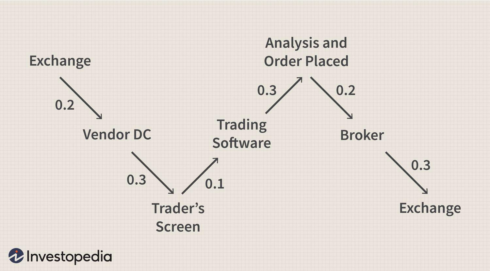

## Table of Contents

## What is dynamic programming and how does it apply to trading?

Dynamic programming is a way to solve problems by breaking them down into smaller, simpler pieces. It's like solving a big puzzle by first figuring out the smaller parts and then putting them together. You save the answers to these smaller parts so you don't have to solve them again, which makes the whole process faster and more efficient. This method is especially useful for problems where the solution to a bigger problem depends on the solutions to smaller, similar problems.

In trading, dynamic programming can be used to make better decisions about buying and selling stocks or other financial assets. For example, if you want to find the best time to buy and sell a stock to make the most profit, you can use dynamic programming to look at all the possible buying and selling points over time. By breaking down the problem into smaller parts—like figuring out the best profit for each day—and saving those results, you can quickly work out the overall best strategy. This approach helps traders handle complex data and make smarter choices without having to redo calculations.

## Can you explain the basic principles of dynamic programming in simple terms?

Dynamic programming is a smart way to solve big problems by breaking them into smaller, easier pieces. Imagine you have a giant jigsaw puzzle. Instead of trying to fit all the pieces together at once, you start by figuring out where the smaller sections go first. Once you know how these smaller sections fit, you can use that information to help put the whole puzzle together faster. In the same way, dynamic programming saves the solutions to these smaller problems so you don't have to solve them again, which makes solving the bigger problem much quicker.

The key to dynamic programming is understanding that big problems can often be broken down into smaller, similar problems. For example, if you're trying to find the shortest path from your house to a friend's house, you might break it down into finding the shortest paths to different landmarks along the way. By saving the shortest path to each landmark, you can then easily figure out the overall shortest route. This approach is really helpful because it avoids repeating work and makes complex problems more manageable.

## How can dynamic programming be used to optimize trading strategies?

Dynamic programming can help traders make better decisions by breaking down complex trading problems into smaller, easier parts. Imagine you want to find the best time to buy and sell a stock to make the most profit. Instead of looking at all possible buying and selling times at once, you can use dynamic programming to figure out the best profit for each day. By saving these daily results, you can then quickly work out the overall best strategy without having to redo calculations. This makes the process faster and more efficient, helping traders handle large amounts of data and make smarter choices.

For example, if you're trying to decide when to buy and sell a stock over a month, you can use dynamic programming to look at each day's price. You start by figuring out the best profit you could make if you bought and sold on the first day, then the first two days, and so on. By saving the best profit for each day, you can then easily find the best overall strategy for the whole month. This approach helps traders manage the complexity of financial markets and make decisions that maximize their profits.

## What are some common problems in trading that can be solved using dynamic programming?

One common problem in trading that can be solved using dynamic programming is finding the best time to buy and sell a stock to maximize profit. Imagine you have a list of stock prices over time. Instead of checking every possible buy and sell combination, which could take a long time, dynamic programming helps you break the problem into smaller parts. You can figure out the best profit you could make for each day and save those results. Then, you can quickly find the overall best strategy by using the saved daily profits. This makes it easier to handle large amounts of data and make smarter trading decisions.

Another problem that dynamic programming can help with is portfolio optimization. This involves deciding how much of each asset to buy to get the best return while managing risk. By breaking down the problem into smaller pieces, you can use dynamic programming to calculate the best combination of assets for each possible level of risk. You save the results for each smaller problem and then use them to find the overall best portfolio. This method helps traders handle complex calculations and make decisions that balance returns and risk effectively.

## How do you formulate a trading problem as a dynamic programming problem?

To turn a trading problem into a dynamic programming problem, you need to break it down into smaller, easier parts. Imagine you want to find the best time to buy and sell a stock to make the most profit. Instead of looking at all the possible buy and sell times at once, you can start by figuring out the best profit you could make if you bought and sold on the first day, then the first two days, and so on. By saving these daily results, you can then use them to quickly find the overall best strategy without having to redo the calculations. This approach helps you handle the complexity of the stock market and make smarter trading decisions.

Another example is portfolio optimization, where you decide how much of each asset to buy to get the best return while managing risk. You can break this problem down by looking at different levels of risk and figuring out the best combination of assets for each level. By saving the results for each smaller problem, you can then use them to find the overall best portfolio. This method makes it easier to handle complex calculations and helps traders balance returns and risk effectively.

## What are the key steps involved in applying dynamic programming to a trading scenario?

When you want to use dynamic programming to solve a trading problem, you start by breaking the problem into smaller pieces. Imagine you're trying to find the best time to buy and sell a stock to make the most profit. Instead of looking at all possible buy and sell times at once, you can figure out the best profit for each day. You save these daily results so you don't have to calculate them again. This way, you can quickly find the overall best strategy by using the saved daily profits. It's like solving a big puzzle by first figuring out the smaller parts and then putting them together.

Another important step is to define what you want to optimize. For example, if you're trying to optimize a portfolio, you need to decide how much of each asset to buy to get the best return while managing risk. You can break this down by looking at different levels of risk and figuring out the best combination of assets for each level. By saving the results for each smaller problem, you can then use them to find the overall best portfolio. This approach helps traders handle complex calculations and make decisions that balance returns and risk effectively.

## Can you provide an example of a simple trading strategy that uses dynamic programming?

Imagine you want to find the best time to buy and sell a stock to make the most profit. You have a list of stock prices for each day over a month. Instead of looking at all the possible buy and sell combinations, which could take a long time, you can use dynamic programming to make it easier. You start by figuring out the best profit you could make if you bought and sold on the first day. Then, you look at the first two days, and so on. You save the best profit for each day, so you don't have to calculate it again. By the end of the month, you can use these saved daily profits to quickly find the overall best strategy.

For example, let's say the stock prices over five days are $10, $12, $9, $15, and $11. On the first day, you can't make any profit because you need to buy before you can sell. On the second day, you could buy at $10 and sell at $12, making a $2 profit. On the third day, the best you can do is buy at $9 and sell at $12, which gives you a $3 profit. On the fourth day, you could buy at $9 and sell at $15, making a $6 profit. Finally, on the fifth day, the best you can do is buy at $9 and sell at $15, still giving you a $6 profit. By saving the best profit for each day, you can see that the overall best strategy is to buy on the third day at $9 and sell on the fourth day at $15, making a $6 profit.

## How does dynamic programming help in managing risk in trading?

Dynamic programming helps manage risk in trading by breaking down complex problems into smaller, more manageable parts. Imagine you want to build a portfolio that gives you the best return while keeping risk low. Instead of trying to figure out the perfect mix of stocks all at once, you can use dynamic programming to look at different levels of risk and find the best combination of stocks for each level. By saving the results for each smaller problem, you can then use them to quickly find the overall best portfolio. This way, you can see how much risk you're taking and adjust your strategy to keep it within your comfort zone.

This approach also helps you make better decisions by considering all possible scenarios without having to redo calculations. For example, if you're trying to decide when to buy and sell a stock, dynamic programming lets you figure out the best profit for each day and save those results. By doing this, you can quickly see the best overall strategy and understand how different buying and selling decisions affect your risk. This makes it easier to balance potential profits with the risk of losses, helping you make smarter and more informed trading choices.

## What are the computational challenges of using dynamic programming in real-time trading?

Using dynamic programming in real-time trading can be tricky because it needs a lot of calculations. Dynamic programming works by breaking down big problems into smaller pieces and saving the answers to those pieces. But in trading, prices change very fast, and you need to make decisions quickly. If your computer isn't fast enough, it might take too long to solve all the smaller problems and put them together, which means you could miss out on good trading opportunities.

Another challenge is that the amount of data in trading can be huge. You have to keep track of lots of stock prices, and the more data you have, the longer it takes to process everything. Dynamic programming helps by saving results so you don't have to calculate them again, but if you're dealing with a lot of stocks and a lot of time periods, it can still be slow. This means you need really good computers and smart ways to manage all that data to make dynamic programming work well in real-time trading.

## How can dynamic programming be integrated with other algorithmic trading techniques?

Dynamic programming can be combined with other trading techniques to make better decisions. For example, you can use dynamic programming to find the best times to buy and sell stocks, and then use [machine learning](/wiki/machine-learning) to predict future price movements. Machine learning can look at lots of data and find patterns that might help you guess where prices are going. By using dynamic programming to quickly figure out the best strategy based on past data, and then using machine learning to adjust for future predictions, you can make smarter trading choices.

Another way to mix dynamic programming with other techniques is to use it alongside technical analysis. Technical analysis looks at charts and patterns to predict what might happen next in the market. Dynamic programming can help you break down the problem of finding the best trading strategy into smaller parts, and then technical analysis can give you more information about when to make your moves. By combining these methods, you can use the strengths of both to create a more complete trading strategy that takes into account both past data and current market trends.

## What advanced techniques can be used to enhance the performance of dynamic programming in trading?

To make dynamic programming work better in trading, you can use something called memoization. This is a fancy word for saving the answers to smaller problems so you don't have to solve them again. Imagine you're figuring out the best time to buy and sell a stock. Instead of calculating the best profit for each day over and over, you save the results. This makes the whole process faster because your computer doesn't have to do the same calculations multiple times. Another trick is to use parallel processing, where you use more than one computer or part of a computer at the same time. This can help you handle all the data and calculations much quicker, which is really important in trading where prices change fast.

Another advanced technique is to combine dynamic programming with machine learning. Machine learning can look at lots of data and find patterns that might help predict where stock prices are going. By using dynamic programming to quickly figure out the best trading strategy based on past data, and then using machine learning to adjust for future predictions, you can make smarter trading choices. This combination helps you use the strengths of both methods to create a more complete trading strategy that takes into account both past data and current market trends.

## Can you discuss a case study where dynamic programming significantly improved trading outcomes?

Imagine a trading firm that wanted to find the best time to buy and sell stocks to make the most profit. They had a lot of data on stock prices over time, but looking at all the possible buy and sell combinations was taking too long. So, they decided to use dynamic programming. They broke down the problem into smaller parts, figuring out the best profit for each day and saving those results. By the end of the month, they could quickly find the overall best strategy without having to redo calculations. This made their trading decisions faster and more accurate, leading to better profits.

In another case, a [hedge fund](/wiki/hedge-fund-trading-strategies) used dynamic programming to optimize their portfolio. They wanted to balance the best return with the least risk. Instead of trying to figure out the perfect mix of stocks all at once, they used dynamic programming to look at different levels of risk and find the best combination of stocks for each level. By saving the results for each smaller problem, they could then use them to quickly find the overall best portfolio. This approach helped them manage risk better and make more informed trading choices, which improved their overall performance in the market.

## What are some case studies and practical implementations?

Various trading platforms and financial firms employ dynamic programming to enhance their trading systems and strategies, capitalizing on its ability to optimize complex decision-making processes. Dynamic programming, through its efficient problem-solving approach, allows these organizations to make data-driven decisions, ultimately improving performance and risk management. 

LYNX Trading, for example, utilizes dynamic programming within their algorithmic systems to achieve optimal portfolio selection and robust risk control. By breaking down the portfolio optimization problem into smaller, manageable subproblems, LYNX can more effectively allocate assets to maximize returns while adhering to risk constraints. This is achieved by applying the principle of optimal substructure, which ensures that the overall portfolio solution is constructed from optimal solutions of its subcomponents, as seen in the equation:

$$

V(i, w) = \max \Big( V(i-1, w), V(i-1, w-w_i) + v_i \Big)
$$

where $V(i, w)$ is the maximum value attainable with the first $i$ items and weight capacity $w$, $w_i$ is the weight and $v_i$ is the value of the $i$-th item. This equation showcases how dynamic programming helps solve the knapsack problem in financial terms, where items correspond to different assets available for portfolio allocation.

QuantConnect provides a comprehensive platform for [backtesting](/wiki/backtesting) and strategy development, leveraging the power of dynamic programming to address complex optimization tasks. Their infrastructure supports the design and simulation of algorithmic strategies, integrating dynamic programming techniques to optimize trading rules and signals. Users of QuantConnect can create custom algorithms that incorporate recursive problem-solving methods to ensure efficient execution and adaptation in diverse market conditions. This adaptability is crucial for maintaining the effectiveness of strategies as they evolve with changing market dynamics.

The D. E. Shaw Group exemplifies the application of advanced quantitative models, including dynamic programming, for systematic investment strategies they employ in managing large-scale portfolios. By deploying these models, the firm can systematically evaluate a vast array of potential investments, weighing factors such as expected returns, [volatility](/wiki/volatility-trading-strategies), and correlations. Dynamic programming aids in continuously recalibrating portfolios, seeking to maximize risk-adjusted returns using historical and real-time data analytics. 

These examples demonstrate the diverse and effective implementation of dynamic programming across different trading platforms and financial institutions. It highlights not only the versatility of dynamic programming in addressing various facets of [algorithmic trading](/wiki/algorithmic-trading) but also its critical role in improving decision-making processes for enhanced financial performance.

## References & Further Reading

[1]: Bertsekas, D. P. (2005). ["Dynamic Programming and Optimal Control, Volumes 1 and 2"](https://www.mit.edu/~dimitrib/dpbook.html). Athena Scientific.

[2]: Bellman, R. (1957). ["Dynamic Programming."](https://archive.org/details/dynamicprogrammi0000bell) Princeton University Press.

[3]: Lopez de Prado, M. (2018). ["Advances in Financial Machine Learning"](https://www.amazon.com/Advances-Financial-Machine-Learning-Marcos/dp/1119482089). Wiley.

[4]: Derman, E. (2006). ["My Life as a Quant: Reflections on Physics and Finance."](https://download.e-bookshelf.de/download/0000/5845/30/L-G-0000584530-0002384412.pdf) Wiley.

[5]: Black, F., & Scholes, M. (1973). ["The Pricing of Options and Corporate Liabilities."](https://www.cs.princeton.edu/courses/archive/fall09/cos323/papers/black_scholes73.pdf) Journal of Political Economy, 81(3), 637-654.

[6]: Chan, E. P. (2009). ["Quantitative Trading: How to Build Your Own Algorithmic Trading Business"](https://github.com/egorpe/EPChan-QuantitativeTrading/blob/master/example7_6.m). Wiley. 

[7]: Hull, J. C. (2017). ["Options, Futures, and Other Derivatives."](https://www.semanticscholar.org/paper/Options%2C-Futures%2C-and-Other-Derivatives-Hull/89bdee500c8623864fc9eb7a471546aa713acc44) Pearson. 

[8]: Wilmott, P. (2006). ["Paul Wilmott Introduces Quantitative Finance."](https://www.amazon.com/Paul-Wilmott-Introduces-Quantitative-Finance/dp/0470319585) Wiley. 

[9]: LYNX Trading. (n.d.). ["Algorithmic Trading with LYNX."](https://brokerchooser.com/broker-reviews/lynx-review) 

[10]: QuantConnect. (n.d.). ["Algorithmic Trading and Backtesting Platform."](https://www.quantconnect.com/splash) 