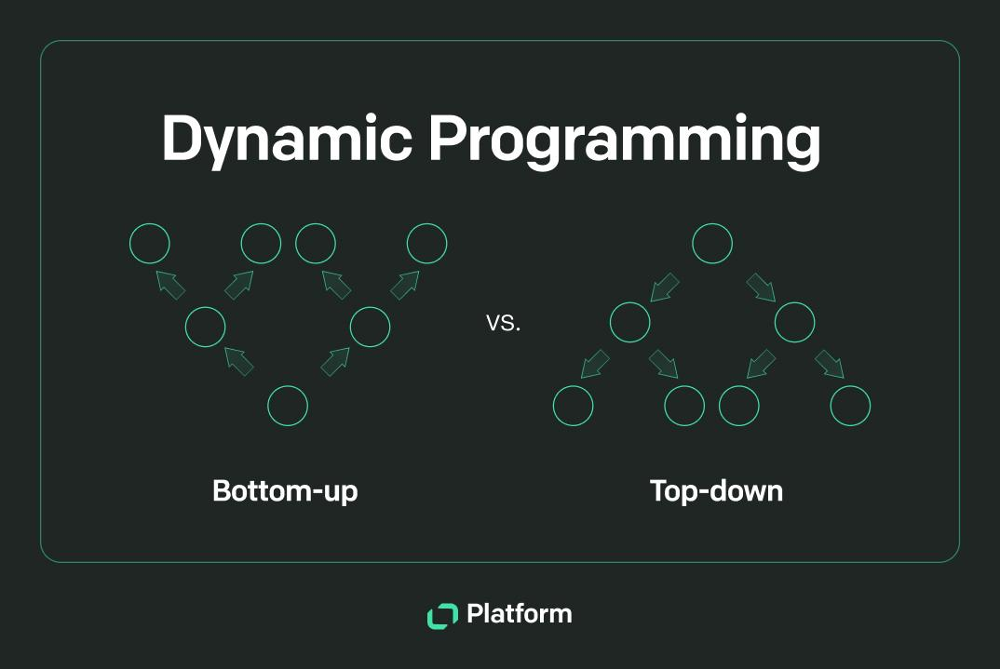

## Table of Contents

## What is dynamic programming?

Dynamic programming is a way to solve problems by breaking them down into smaller, simpler pieces. Imagine you have a big puzzle. Instead of trying to solve the whole puzzle at once, you focus on smaller parts of it. You solve these smaller parts one by one and then put them together to solve the whole puzzle. This method is useful for problems where the same small parts come up again and again.

The key to dynamic programming is to remember the solutions to the smaller parts so you don't have to solve them again. This is called memoization. For example, if you are calculating the Fibonacci sequence, you can save the results of smaller calculations to use them later. This saves time because you don't repeat the same work. By breaking down the problem and remembering what you've already done, dynamic programming can make solving complex problems much easier and faster.

## How does dynamic programming differ from other algorithmic techniques?

Dynamic programming is different from other algorithmic techniques because it focuses on breaking down a problem into smaller, overlapping subproblems. Unlike divide-and-conquer methods, where subproblems are usually independent, dynamic programming solves subproblems once and stores their solutions for future use. This approach is particularly useful for problems with optimal substructure, where the optimal solution to a problem can be constructed from optimal solutions to its subproblems. For example, in calculating the shortest path in a graph, dynamic programming would store the shortest paths to intermediate nodes to avoid recalculating them.

In contrast, greedy algorithms make locally optimal choices at each step, hoping to find a global optimum. They do not consider the overall problem structure and do not store solutions to subproblems. While greedy algorithms can be faster, they may not always find the best solution. For instance, in the coin change problem, a greedy approach might not give the minimum number of coins if the coin denominations are not well-suited for it. Dynamic programming, on the other hand, would systematically explore all possibilities to ensure the optimal solution is found, albeit at the cost of more computation and memory.

Another key difference is with backtracking, which explores all possible solutions by building them incrementally and abandoning those that fail to satisfy the problem's constraints. Backtracking does not store solutions to subproblems and can be less efficient than dynamic programming for problems where the same subproblems are solved multiple times. Dynamic programming, by storing and reusing solutions, avoids redundant computation, making it more efficient for problems with overlapping subproblems. For example, in solving the 0/1 knapsack problem, dynamic programming would store the maximum value achievable for different capacities, while backtracking would repeatedly explore the same combinations.

## What are the key characteristics of a problem that make it suitable for dynamic programming?

A problem is suitable for dynamic programming if it has two main characteristics: optimal substructure and overlapping subproblems. Optimal substructure means that the best solution to the big problem can be built from the best solutions to smaller parts of the problem. For example, if you want to find the shortest path from point A to point B, you can break it down into finding the shortest paths from A to some point C, and then from C to B. If you know the best way to get to C, you can use that to find the best way to B.

Overlapping subproblems mean that when solving the big problem, you keep solving the same smaller problems over and over again. Instead of solving these smaller problems each time, you can save their solutions and reuse them. This saves time because you don't have to do the same work multiple times. For instance, when calculating the Fibonacci sequence, you need to calculate the value of smaller Fibonacci numbers many times. By saving these values, you can quickly build up to the bigger numbers without recalculating the smaller ones.

## Can you explain the difference between top-down and bottom-up approaches in dynamic programming?

In dynamic programming, the top-down approach is like solving a big puzzle by starting with the whole picture and then breaking it down into smaller pieces. You start with the main problem and break it into smaller subproblems. If you've already solved a subproblem, you use the saved solution instead of solving it again. This method is often called memoization because you're using a memo, or a memory, to keep track of the solutions to subproblems. For example, if you're calculating the Fibonacci sequence, you'd start with the big number you want to find and work your way down to smaller numbers, using saved values when you can.

The bottom-up approach, on the other hand, is like building the puzzle from the ground up. You start with the smallest pieces and solve them first, then use those solutions to build up to the bigger problem. This method is often called tabulation because you're filling in a table with solutions as you go. For the same Fibonacci sequence, you'd start by calculating the smallest Fibonacci numbers and work your way up to the bigger ones, saving each solution as you go. Both approaches help you solve the problem more efficiently by avoiding redundant calculations, but they start from different ends of the problem.

## What is memoization and how is it used in dynamic programming?

Memoization is a way to make solving problems faster by saving the answers to smaller parts of the problem. Imagine you're doing a big math problem, and you keep having to solve the same smaller math problems over and over again. Instead of doing all that work each time, you write down the answers to the smaller problems the first time you solve them. Then, when you need those answers again, you just look them up instead of solving them again. This is like using a cheat sheet to help you solve the big problem more quickly.

In dynamic programming, memoization is used to break down a big problem into smaller pieces and remember the solutions to those pieces. For example, if you're calculating the Fibonacci sequence, you might need to figure out the 5th Fibonacci number many times. Instead of calculating it each time, you save the answer the first time you find it. Then, whenever you need the 5th Fibonacci number again, you just use the saved answer. This saves a lot of time because you're not doing the same work over and over. By using memoization, dynamic programming can solve complex problems much faster.

## Can you provide a simple example of a problem solved using dynamic programming?

Let's talk about the Fibonacci sequence, which is a simple example of a problem that can be solved using dynamic programming. The Fibonacci sequence is a series of numbers where each number is the sum of the two numbers before it. For example, the sequence starts with 0, 1, 1, 2, 3, 5, and so on. If you want to find the 10th number in the sequence, you need to calculate all the numbers before it. Without dynamic programming, you might end up calculating the same smaller numbers many times, which takes a lot of time.

With dynamic programming, you can use a technique called memoization to make this process faster. You start by calculating the smallest Fibonacci numbers, like the 1st and 2nd numbers, which are 0 and 1. You save these numbers in a list or a table. Then, when you need to find the next number, you just add the two numbers you already saved. For example, to find the 3rd number, you add the 1st and 2nd numbers (0 + 1 = 1). You keep doing this, saving each new number as you go, until you reach the 10th number. This way, you only calculate each number once, making the whole process much quicker.

## How do you identify overlapping subproblems in dynamic programming?

To identify overlapping subproblems in dynamic programming, you need to see if the same smaller problems keep coming up when you're trying to solve a bigger problem. Imagine you're trying to find the shortest path in a maze. If you keep having to figure out the shortest path to the same spots over and over again, those are overlapping subproblems. You can spot them by breaking down the big problem into smaller pieces and noticing if you're solving the same small pieces multiple times.

Once you've identified these overlapping subproblems, you can use dynamic programming to solve them more efficiently. Instead of solving the same small problem each time it comes up, you solve it once and save the answer. Then, whenever you need that answer again, you just use the saved solution. This saves a lot of time and makes solving the big problem much easier.

## What is the concept of optimal substructure and how does it apply to dynamic programming?

Optimal substructure is a key idea in dynamic programming that means the best solution to a big problem can be built from the best solutions to smaller parts of the problem. Imagine you're trying to find the shortest path from your home to school. The shortest path can be broken down into smaller paths, like from home to the bus stop and then from the bus stop to school. If you know the shortest way to get to the bus stop, you can use that to find the shortest way to school. This means the big problem (shortest path to school) has an optimal substructure because it's made up of smaller, optimal paths.

In dynamic programming, we use this idea to solve problems more efficiently. We solve the smaller parts of the problem first and save their solutions. Then, we use these saved solutions to build up to the bigger problem. For example, when calculating the Fibonacci sequence, we start with the smallest numbers (0 and 1) and save them. Then, we use these saved numbers to find the next numbers in the sequence, always building on what we've already solved. This way, we avoid solving the same small problems over and over again, making the whole process faster and easier.

## How can dynamic programming be used to solve the Fibonacci sequence problem efficiently?

Dynamic programming can make finding the Fibonacci sequence much easier and faster. The Fibonacci sequence is a series of numbers where each number is the sum of the two numbers before it. For example, it starts with 0, 1, 1, 2, 3, 5, and so on. If you want to find the 10th number in the sequence, you need to calculate all the numbers before it. Without dynamic programming, you might end up calculating the same smaller numbers many times, which can take a long time.

With dynamic programming, you can use a technique called memoization to speed things up. You start by calculating the smallest Fibonacci numbers, like the 1st and 2nd numbers, which are 0 and 1. You save these numbers in a list or a table. Then, when you need to find the next number, you just add the two numbers you already saved. For example, to find the 3rd number, you add the 1st and 2nd numbers (0 + 1 = 1). You keep doing this, saving each new number as you go, until you reach the 10th number. This way, you only calculate each number once, making the whole process much quicker.

## What are some advanced techniques in dynamic programming, such as state compression?

State compression is a cool trick in dynamic programming that helps save memory when you're solving problems. Imagine you're trying to solve a puzzle, but you need to remember a lot of different pieces. State compression lets you remember only the most important pieces, kind of like using a shorthand. This way, you don't need as much space to store everything, and your computer can work faster. It's like packing your suitcase smarter so you can fit more in without making it too heavy.

For example, if you're solving a problem where you need to keep track of many different states, you might find that some of these states can be represented more simply. Instead of storing a whole lot of information, you can use a smaller number or a different way of keeping track that still gives you all the info you need. This technique is really helpful in problems like the traveling salesman problem, where you need to find the shortest route visiting a bunch of cities. By compressing the states, you can solve these big puzzles without using up all your computer's memory.

## How do you handle multi-dimensional problems in dynamic programming?

Multi-dimensional problems in dynamic programming are like solving puzzles that have more than one layer. Imagine you're trying to find the best way to pack a suitcase, but you need to consider not just the size of the items but also their weight and how much they cost. You need to keep track of different things at the same time, like the space used, the total weight, and the total cost. In dynamic programming, you can use a table with more than one dimension to keep track of all these different aspects. Each cell in the table represents a different combination of these factors, helping you find the best solution by considering all the dimensions together.

For example, let's say you're solving the knapsack problem, where you want to fit items into a bag to get the most value without going over a weight limit. If you also need to consider the [volume](/wiki/volume-trading-strategy) of the items, you can use a 3D table where one dimension is for the weight, another for the volume, and the third for the value. You fill this table by solving smaller subproblems, like what's the best value you can get for a certain weight and volume. By working through the table, you can find the best way to pack your bag considering all these different aspects at once. This approach helps you solve complex problems where you need to juggle multiple factors.

## Can you discuss a real-world application of dynamic programming and its impact?

One real-world application of dynamic programming is in optimizing routes for delivery trucks, like those used by companies such as Amazon and UPS. Imagine a delivery truck needs to visit many different addresses to drop off packages. The goal is to find the shortest route that visits all the addresses and returns to the starting point. This is a classic problem known as the Traveling Salesman Problem. Using dynamic programming, the company can break down the big problem into smaller pieces, like finding the best way to get from one address to another. By solving these smaller problems and saving the solutions, the company can figure out the most efficient route for the truck. This saves time and fuel, making deliveries faster and more cost-effective.

The impact of using dynamic programming in route optimization is huge. For companies that deliver millions of packages every day, even small improvements in route efficiency can lead to big savings in time and money. It also means fewer trucks on the road, which is better for the environment. Customers get their packages faster and more reliably, which makes them happier and more likely to keep using the service. Overall, dynamic programming helps make the whole delivery process smoother and more sustainable, benefiting both the company and its customers.

## How can Risk Management be approached using Dynamic Programming?

Dynamic programming (DP) methodologies are pivotal in constructing effective risk management and hedging strategies within [algorithmic trading](/wiki/algorithmic-trading). By leveraging the principles of DP, traders are able to deconstruct complex risk frameworks into manageable subproblems, thereby optimizing for the best risk-return profiles.

**Managing Derivative Portfolio Risks**

In managing risks associated with derivative portfolios, dynamic programming offers a structured approach to evaluate various scenarios. A primary application is in calculating the optimal hedge ratio, which minimizes exposure to unwanted risk factors. The concept of optimal substructure in DP facilitates the decomposition of a portfolio into smaller segments. This allows for the determination of hedge ratios that not only protect against adverse market movements but also align with the overall strategic objectives of the portfolio.

For instance, consider a scenario where a trader seeks to hedge a portfolio of options. DP can be used to explore various Greek sensitivities (like Delta, Gamma, and Vega) under multiple simulated market conditions. Suppose $V(t)$ represents the portfolio value at time $t$. The goal is to construct a strategy $\pi(t)$ to minimize the variance of $V(t)$. The trader can use Bellman's equation to calculate the value function recursively:

$$
V^*(t) = \min_{\pi(t)} \left\{ \text{Expected Loss} + V^*(t+1) \right\}
$$

where the Expected Loss is computed based on the change in the portfolio value due to different risk factors.

**Robust Risk Mitigation Techniques**

Dynamic programming is instrumental in developing robust risk mitigation techniques. By efficiently solving complex optimization problems, DP empowers traders to simulate various market conditions and stress-test their hedging strategies. For example, the overlapping subproblems principle enables the simultaneous evaluation of multiple risk paths, leading to a more comprehensive understanding of potential losses and gains.

Moreover, the memoization technique in DP stores previously computed results, thereby improving computational efficiency. This is particularly beneficial in real-time trading environments where rapid decision-making is crucial.

Consider a Python implementation framework for a basic risk management tool using DP:

```python
def dp_risk_management(portfolio, scenarios, time_horizon):
    dp_table = [[float('inf')] * len(scenarios) for _ in range(time_horizon + 1)]
    # Initialize base case
    dp_table[0] = [0] * len(scenarios)

    for t in range(1, time_horizon + 1):
        for s, scenario in enumerate(scenarios):
            for prev_s, prev_scenario in enumerate(scenarios):
                # Calculate possible loss or profit for transition from prev_s to s
                loss = scenario.evaluate_risk(portfolio) - prev_scenario.evaluate_risk(portfolio)
                # Update DP table with optimal value
                dp_table[t][s] = min(dp_table[t][s], loss + dp_table[t-1][prev_s])
    return min(dp_table[time_horizon])

# Example usage
portfolio = ... # Define the portfolio
scenarios = ... # Define market scenarios
optimal_risk = dp_risk_management(portfolio, scenarios, time_horizon=5)
```

This code outlines a basic approach to assess risks across different market scenarios, using dynamic programming to record and compute the minimal risk trajectory.

In summary, the use of dynamic programming in risk management and hedging offers substantial benefits in trading by navigating complex derivative portfolios efficiently and strategizing robust mitigation plans against potential risks. Through organized computation and strategic decomposition of risk factors, DP ensures traders can maintain their desired risk exposures while optimizing returns.

## References & Further Reading

[1]: Cormen, T. H., Leiserson, C. E., Rivest, R. L., & Stein, C. (2009). ["Introduction to Algorithms"](https://archive.org/details/introduction-to-algorithms-third-edition-2009). MIT Press.

[2]: Hull, J. C. (2014). ["Options, Futures, and Other Derivatives"](https://elibrary.pearson.de/book/99.150005/9781292410623). Pearson Education Limited.

[3]: Bellman, R. (1957). ["Dynamic Programming."](https://archive.org/details/dynamicprogrammi0000bell) Princeton University Press.

[4]: Lopez de Prado, M. (2018). ["Advances in Financial Machine Learning"](https://books.google.com/books/about/Advances_in_Financial_Machine_Learning.html?id=oU9KDwAAQBAJ). Wiley.

[5]: Chan, E. (2009). ["Quantitative Trading: How to Build Your Own Algorithmic Trading Business"](https://github.com/ftvision/quant_trading_echan_book). Wiley.

[6]: Sutton, R. S., & Barto, A. G. (2018). ["Reinforcement Learning: An Introduction"](https://www.scirp.org/reference/referencespapers?referenceid=3072504). MIT Press.