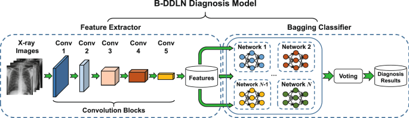

## Table of Contents

## What is dynamic machine learning and how does it differ from static machine learning?

Dynamic machine learning is a type of machine learning where the model keeps learning and changing even after it starts being used. Imagine you teach a computer to recognize pictures of cats. With dynamic machine learning, every time the computer sees a new cat picture, it learns a bit more and gets better at recognizing cats. This means the computer can improve over time, adapting to new information and changes in the world.

Static machine learning, on the other hand, is when you train a model once and then it stays the same. Once you teach the computer to recognize cats, it won't learn anything new even if it sees more cat pictures. This type of learning is good when the information doesn't change much, but it can't adapt to new situations or learn from new data. The main difference is that dynamic machine learning can keep improving, while static machine learning stays the same after it's trained.

## Can you explain the basic principles behind dynamic machine learning models?

Dynamic machine learning models work on the principle of continuous learning and adaptation. Imagine you're teaching a kid to recognize animals. You show them pictures of cats and dogs, and they get pretty good at it. But then, they see a new kind of dog they've never seen before. With dynamic learning, the kid can learn from this new dog and get even better at recognizing dogs. Similarly, a dynamic machine learning model keeps learning from new data it encounters, updating its knowledge and improving its performance over time. This is often done using techniques like online learning, where the model updates itself incrementally as new data comes in.

The key to making this work is the ability of the model to adjust its parameters based on new information. For example, if a model is predicting whether it will rain, and it gets new weather data every day, it can adjust its predictions to be more accurate. This might involve using algorithms that allow for gradual updates, such as stochastic gradient descent, where the model's parameters are tweaked bit by bit as new data arrives. The formula for updating parameters in stochastic gradient descent might look like this: $$\theta = \theta - \alpha \nabla J(\theta)$$, where $$\theta$$ are the parameters, $$\alpha$$ is the learning rate, and $$\nabla J(\theta)$$ is the gradient of the loss function. This continuous updating helps the model stay relevant and perform better in changing environments.

## What are some common applications of dynamic machine learning in industries today?

Dynamic [machine learning](/wiki/machine-learning) is used a lot in the finance industry. Banks and investment firms use it to predict stock prices and detect fraud. They feed the model new data every day, like stock market trends and transaction details. This helps the model learn from the latest information and make better predictions or catch fraud more quickly. For example, if a model is predicting stock prices, it can use a formula like $$y = \beta_0 + \beta_1 x_1 + \beta_2 x_2 + \epsilon$$ to make predictions, where $$y$$ is the stock price, $$x_1$$ and $$x_2$$ are factors like market trends and company news, and $$\epsilon$$ is the error term. The model updates the coefficients $$\beta_0, \beta_1, \beta_2$$ as new data comes in, making its predictions more accurate over time.

Another common use of dynamic machine learning is in healthcare. Doctors and hospitals use it to predict patient outcomes and personalize treatments. They give the model new patient data, like test results and symptoms, and the model learns from this to make better predictions about a patient's health. For instance, if a model is predicting whether a patient will have a heart attack, it can use data like blood pressure and cholesterol levels to make its prediction. As more patients come in, the model learns from their data and gets better at predicting outcomes, which can help doctors make better decisions about treatments.

## How does dynamic machine learning adapt to new data over time?

Dynamic machine learning adapts to new data over time by continuously updating its parameters. Imagine you're teaching a computer to recognize cats. Every time it sees a new cat picture, it tweaks its understanding a bit to better recognize cats in the future. This is done using algorithms like stochastic gradient descent, where the model adjusts its parameters based on the new data. The formula for this might look like $$ \theta = \theta - \alpha \nabla J(\theta) $$, where $$ \theta $$ are the parameters, $$ \alpha $$ is the learning rate, and $$ \nabla J(\theta) $$ is the gradient of the loss function. This formula helps the model learn from each new piece of data, making it smarter over time.

In practice, this means the model can stay relevant and accurate even as the world changes. For example, if you're using a model to predict stock prices, it can adjust its predictions based on the latest market trends and news. As new data comes in, the model updates its understanding of how different factors affect stock prices, using formulas like $$ y = \beta_0 + \beta_1 x_1 + \beta_2 x_2 + \epsilon $$, where $$ y $$ is the stock price, $$ x_1 $$ and $$ x_2 $$ are factors like market trends and company news, and $$ \epsilon $$ is the error term. The model updates the coefficients $$ \beta_0, \beta_1, \beta_2 $$ to make better predictions over time. This ability to adapt and learn from new data is what makes dynamic machine learning so powerful and useful in many different fields.

## What are the key components of a dynamic machine learning system?

A dynamic machine learning system has several key parts that help it keep learning over time. The first part is the model itself, which is like a brain that learns from data. This model uses algorithms like stochastic gradient descent to update its understanding as new information comes in. The formula for this might look like $$ \theta = \theta - \alpha \nabla J(\theta) $$, where $$ \theta $$ are the model's parameters, $$ \alpha $$ is the learning rate, and $$ \nabla J(\theta) $$ is the gradient of the loss function. This formula helps the model learn a little bit from each new piece of data it sees.

The second important part is the data stream. A dynamic machine learning system needs a steady flow of new data to keep learning. This could be stock market data for predicting prices or patient data for predicting health outcomes. As this new data comes in, the model uses it to update its predictions. For example, if the model is predicting stock prices, it might use a formula like $$ y = \beta_0 + \beta_1 x_1 + \beta_2 x_2 + \epsilon $$, where $$ y $$ is the stock price, $$ x_1 $$ and $$ x_2 $$ are factors like market trends and company news, and $$ \epsilon $$ is the error term. The model adjusts the coefficients $$ \beta_0, \beta_1, \beta_2 $$ to make better predictions as it sees more data.

The third key component is the infrastructure that supports continuous learning. This includes the hardware and software that can handle the constant flow of data and the updates to the model. It's like having a good computer and the right programs to keep everything running smoothly. Without this infrastructure, the model wouldn't be able to keep learning and adapting to new information as effectively.

## What challenges are associated with implementing dynamic machine learning?

Implementing dynamic machine learning can be tricky because it needs a lot of new data all the time. If the data stops coming in, the model can't keep learning and might start making worse predictions. For example, if a model is predicting stock prices using the formula $$ y = \beta_0 + \beta_1 x_1 + \beta_2 x_2 + \epsilon $$, it needs to keep updating the coefficients $$ \beta_0, \beta_1, \beta_2 $$ as new market data comes in. If the data flow stops, the model can't adjust to new trends and its predictions become outdated.

Another challenge is keeping the model stable as it learns. When the model updates its parameters using formulas like $$ \theta = \theta - \alpha \nabla J(\theta) $$, small changes can sometimes make the model behave unpredictably. This is called model drift, and it can make the model's predictions less reliable. To handle this, you need good monitoring systems to watch how the model is doing and make sure it's still working well as it learns from new data.

## How can dynamic machine learning be used to improve predictive modeling?

Dynamic machine learning can make predictive modeling better by always learning from new data. Imagine you're using a model to predict how much it will rain tomorrow. With dynamic machine learning, the model can use new weather data every day to update its predictions. It does this by adjusting its parameters using a formula like $$ \theta = \theta - \alpha \nabla J(\theta) $$, where $$ \theta $$ are the parameters, $$ \alpha $$ is the learning rate, and $$ \nabla J(\theta) $$ is the gradient of the loss function. This means the model can get better at predicting rain over time, making its forecasts more accurate and helpful.

Another way dynamic machine learning helps is by adapting to changes. Let's say you're predicting stock prices with a model that uses the formula $$ y = \beta_0 + \beta_1 x_1 + \beta_2 x_2 + \epsilon $$, where $$ y $$ is the stock price, $$ x_1 $$ and $$ x_2 $$ are factors like market trends and company news, and $$ \epsilon $$ is the error term. As new data comes in, the model can update the coefficients $$ \beta_0, \beta_1, \beta_2 $$ to reflect the latest market conditions. This makes the model more flexible and able to give better predictions even when the market changes a lot.

## What are the differences between online learning and dynamic machine learning?

Online learning and dynamic machine learning both involve updating models as new data comes in, but they are a bit different. Online learning is a specific way of doing dynamic machine learning. It's like teaching a computer one new thing at a time. Every time the computer sees a new piece of data, it learns from it right away. For example, if you're teaching a model to predict the weather, it might use a formula like $$ \theta = \theta - \alpha \nabla J(\theta) $$ to update its understanding after seeing each new weather report. This means the model can keep getting better without needing to see all the data at once.

Dynamic machine learning is a broader idea that includes online learning but can also work in other ways. It's about making sure a model can keep learning and getting better over time, no matter how it's doing it. So, while online learning is always updating the model one piece of data at a time, dynamic machine learning might also include other methods like batch updates, where the model learns from a group of data points together. This flexibility makes dynamic machine learning useful in many different situations, like predicting stock prices with a formula like $$ y = \beta_0 + \beta_1 x_1 + \beta_2 x_2 + \epsilon $$, where the model can adjust its predictions as new market data comes in.

## Can you discuss some advanced techniques used in dynamic machine learning?

One advanced technique in dynamic machine learning is called [reinforcement learning](/wiki/reinforcement-learning). Imagine you're teaching a robot to walk. Every time it takes a step, it gets feedback on whether that step was good or bad. The robot uses this feedback to learn how to walk better over time. This is similar to how reinforcement learning works. The model learns by trying different actions and getting rewards or penalties based on how well it does. It uses these rewards to update its parameters, often using a formula like $$ Q(s, a) = Q(s, a) + \alpha [r + \gamma \max_{a'} Q(s', a') - Q(s, a)] $$, where $$ Q(s, a) $$ is the value of taking action $$ a $$ in state $$ s $$, $$ \alpha $$ is the learning rate, $$ r $$ is the reward, $$ \gamma $$ is the discount [factor](/wiki/factor-investing), and $$ \max_{a'} Q(s', a') $$ is the maximum future reward. This helps the model get better at making decisions over time.

Another advanced technique is transfer learning. Think of it like learning to ride a bike and then using that knowledge to learn how to ride a motorcycle. Transfer learning lets a model use what it learned from one task to help it learn a new, related task faster. For example, if a model was trained to recognize cats and dogs, it can use that knowledge to help it learn to recognize other animals more quickly. This is done by starting with the parameters from the first task and then fine-tuning them for the new task. The model might use a formula like $$ \theta_{\text{new}} = \theta_{\text{old}} - \alpha \nabla J(\theta_{\text{new}}) $$ to update its parameters, where $$ \theta_{\text{old}} $$ are the parameters from the first task, $$ \theta_{\text{new}} $$ are the parameters for the new task, $$ \alpha $$ is the learning rate, and $$ \nabla J(\theta_{\text{new}}) $$ is the gradient of the loss function for the new task. This makes the model more efficient and adaptable.

## How do you evaluate the performance of a dynamic machine learning model?

Evaluating the performance of a dynamic machine learning model is important to make sure it's learning well and making good predictions. One way to do this is by using metrics like accuracy, which tells you how often the model gets things right. For example, if the model is predicting whether it will rain, you can check how often it's correct by comparing its predictions to the actual weather. Another useful metric is the mean squared error (MSE), which measures how far off the model's predictions are from the real values. The formula for MSE is $$ \text{MSE} = \frac{1}{n} \sum_{i=1}^{n} (y_i - \hat{y}_i)^2 $$, where $$ y_i $$ is the actual value, $$ \hat{y}_i $$ is the predicted value, and $$ n $$ is the number of predictions. By calculating the MSE, you can see how much the model's predictions are improving as it learns from new data.

Another important aspect of evaluating a dynamic machine learning model is monitoring its performance over time. Since the model is constantly learning, it's crucial to check if it's getting better or if it's starting to make worse predictions. You can do this by setting up a system that tracks the model's performance on a regular basis, like every day or every week. For example, if you're using the model to predict stock prices with a formula like $$ y = \beta_0 + \beta_1 x_1 + \beta_2 x_2 + \epsilon $$, you can keep an eye on how well the model is doing by comparing its predictions to the actual stock prices over time. If the model's performance starts to drop, you might need to adjust how it's learning or give it more data to keep it on track.

## What ethical considerations should be taken into account when deploying dynamic machine learning systems?

When deploying dynamic machine learning systems, it's important to think about fairness. These systems keep learning from new data, which means they can change over time. If the data they learn from is biased, the model might make unfair decisions. For example, if a model is predicting loan approvals and it keeps seeing data where certain groups are less likely to get loans, it might learn to make similar biased decisions. To avoid this, you need to check the data the model is learning from and make sure it's fair. You can also use techniques to make the model more fair, like adjusting its predictions to be less biased.

Another ethical consideration is privacy. Dynamic machine learning models need a lot of new data to keep learning, and this data often includes personal information about people. It's important to make sure this data is used safely and that people's privacy is protected. For example, if a model is predicting health outcomes, it needs to use patient data carefully. You can use methods like data anonymization, where you remove personal details from the data before using it, to help protect privacy. Also, being open about how the data is used and getting people's permission can help make sure the model is used ethically.

## What future developments can we expect in the field of dynamic machine learning?

In the future, we can expect dynamic machine learning to become even better at adapting to new information. One big change might be in how these models handle data. Right now, they need a lot of new data to keep learning, but future models might be able to learn from less data. This could make them more useful in places where data is hard to get, like in remote areas or for rare events. Also, these models might get better at understanding the context of the data they're learning from, so they can make smarter decisions. For example, a model predicting the weather might start to understand how local events like festivals can affect weather patterns, and adjust its predictions accordingly.

Another exciting development could be in making dynamic machine learning models more ethical and fair. As these models keep learning, there's a risk they might learn biases from the data they see. In the future, we might see new ways to make sure these models stay fair, like using special algorithms that check for bias and fix it. Also, as privacy becomes more important, we might see more advanced methods to protect people's data while still letting the models learn. For instance, a model predicting health outcomes might use techniques like $$ \text{data anonymization} $$ to keep patient information safe while still learning from it. These changes could make dynamic machine learning more trustworthy and useful in all sorts of fields.